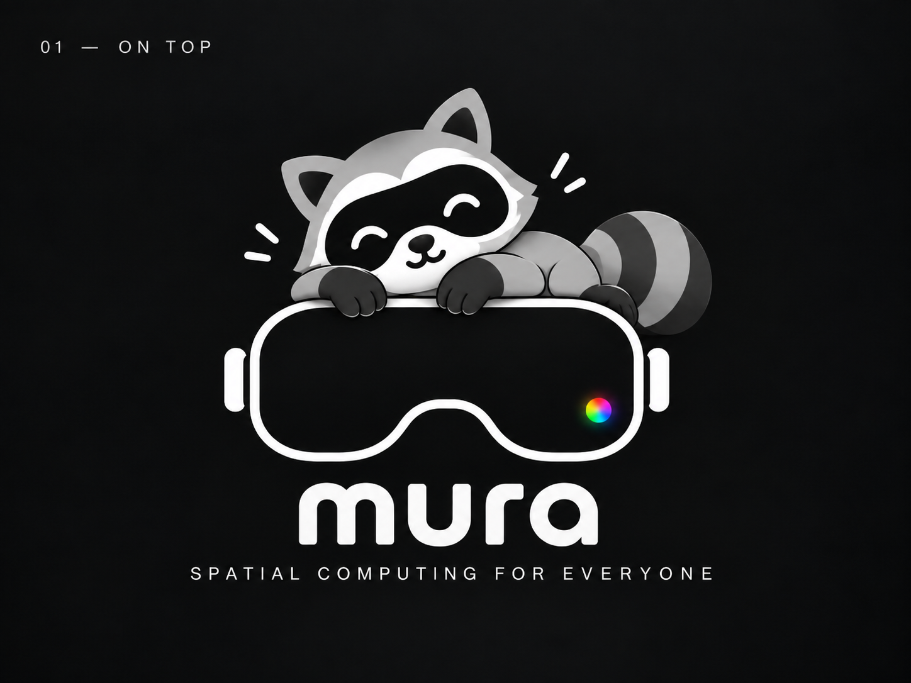

<p align="center">
  
</p>

# Mura

A Nix-built, NixOS-based, Wayland-based Linux XR distribution targeting many standalone VR headsets
(Oculus Quest 1, Lynx R1, Samsung Galaxy XR, Play For Dream MR, Valve Steam Frame, …). It turns
pinned vendor firmware ("donor") inputs, device definitions, and pinned sources into reproducible
flashable artifacts — building the distribution independently of the device, then qualifying and
deploying it together with an explicit, versioned hardware-adaptation bundle.

**Status:** research + architecture + initial scaffold. The `virtual-headset` VM smoke target builds
and `nix flake check` passes. Real device ports begin with a Lynx R1 hardware spike (see
[docs/architecture/design-backlog.md](docs/architecture/design-backlog.md)).

## Where things are

- [docs/](docs/README.md) — research (7 deep-dives + synthesis), architecture (5 docs + 5 ADRs),
  the red-team review, and its disposition.
- `lib/contract/` — the typed `mura.*` device contract (NixOS-module options + assertions).
- `lib/donor/`, `lib/images/` — donor-pipeline and image-variant builders (typed stubs until the
  Lynx spike, per the design backlog).
- `modules/{os,xr,adaptation}` — the common distribution, XR runtime wiring, and per-subsystem
  adaptation backends.
- `soc/`, `families/`, `devices/` — the device → SoC-family → common decomposition.
- `references/` — git-ignored study clones, reproducible from `references/clone.sh` +
  `references/MANIFEST.json`.

## Quick start

```bash
nix flake check                                  # formatting + contract + VM smoke build
nix build .#packages.x86_64-linux.virtual-headset-vm
nix develop                                      # dev shell with donor-pipeline tooling
```

## Development

Three loops, cheapest first — pick by what you're changing:

**Rung 1 — `nix run .#dev-session`** (compositor/shell/XR work; iteration = process relaunch).
The spatial session as a plain window on your desktop: a nested Wayland compositor (sway until
zxr M1; Alt+Return = terminal, Alt+Shift+E = quit) plus Monado running the **simulated HMD**
(`XR_RUNTIME_JSON` exported inside the session; windowless null compositor by default). Flags:
`--client` (xrgears OpenXR smoke — adds Monado's mirror window showing the composited XR view),
`--godot` (the Godot spatial-container conformance client, `pkgs/spatial-container-sample` —
needs a Godot master built once with `nix develop .#godot`, see its README),
`--mirror`/`--no-mirror`, `--rotate` (canned head motion), `--controllers`, `--no-monado`,
`--verbose`; `--zxr` runs zxr in the compositor slot (R0 frame path + the M1 input floor:
`zxr ctl <sock> source hand-right value pinch 0.9` and friends inject synthetic input, `ctl journal`
prints the counters — specs/zxr-core.md §8, §11). No VM, no image.

**Rung 2 — `nix run .#virtual-headset-vm`** (module/system integration; iteration = incremental
rebuild, no image assembly — the VM shares the host `/nix/store`). Two fixtures, one per login
profile ([docs/architecture/implementation-path.md §3c](docs/architecture/implementation-path.md)):
`virtual-headset-vm` is the **default image** — autologin as the passwordless `mura` straight
into the stand-in session (sway until zxr M1); `virtual-headset-multiuser-vm` is the **greeter
shape** — the stand-in greeter (cage + gtkgreet until G2), log in as `mura` / `mura` (a fixture
account, [tests/vm/fixture-user.nix](tests/vm/fixture-user.nix)). virgl-accelerated GL, 8 GiB/4
cores; `ssh -p 2221 mura@localhost`. State persists in the VM's `.qcow2` beside the working
tree — delete it for a fresh boot.

**Rung 2 automated — `nix build .#vm-test-default-image` / `.#vm-test-multi-user` /
`.#vm-test-oob` / `.#vm-test-health`**: the D-track's exit criteria as NixOS VM tests
([tests/vm/](tests/vm/)); `oob` drives the USB gadget (`dummy_hcd`, both ends in the VM), the
provisioning hotspot (`mac80211_hwsim`, a second radio as the phone) and the `mura-setup` stub;
`health` forces a hard preflight failure and walks the crash-loop ladder to the recovery target
and back; `.#vm-test-scene` is the one with a picture — Monado's main compositor drawing zxr's
greeter scene into a test-only cage on the VM's KMS output, screenshotted and asserted. On demand only — they
boot a VM and take minutes, so they are not part of `nix flake check`.

**Rung 3 — `nix run .#frame-vm-run -- <image.raw[.zst]>`** (image/update machinery only): the
Steam Frame aarch64 image under full-system emulation, including the RAUC A/B update round-trip
([docs/research/33 §9](docs/research/33-steam-frame-donor.md)). The default build command is:

```bash
nix run .#frame-build
```

`frame-build` submits `packages.aarch64-linux.frame-image` to nixbuild.net as a native
`aarch64-linux` remote build, with the proven 16-job limit and builder-side substitution
([ADR 0004](docs/architecture/adr/0004-cross-vs-native-builds.md),
[research/33 §10](docs/research/33-steam-frame-donor.md)). It uses the invoking user's ordinary
SSH key and `known_hosts`; it neither reads a root-owned key nor changes `/etc/nix`. Pass another
flake target and normal `nix build` flags after `--`, for example:

```bash
nix run .#frame-build -- .#packages.aarch64-linux.frame-bundle -o result-frame-bundle
```

The recovery-entry proof has a reproducible test-only image. It forces preflight P2 hard, cycles
the first failed boot, then exercises the production threshold → one-shot `recovery.conf` →
`mura-recovery.target` path:

```bash
nix run .#frame-build -- \
  .#packages.aarch64-linux.frame-recovery-proof-image \
  -o result-frame-recovery-proof
FRAME_VM_DIR=/path/on/fast-storage \
  nix run .#frame-vm-run -- \
  result-frame-recovery-proof/mura-deckard.raw.zst
```

Stop QEMU after the serial log reaches `RECOVERY_PROOF_OK`; the evidence expected before it is
the first failure/cycle, the second failure reaching the threshold, and systemd-boot selecting
`recovery.conf` → the dedicated recovery UKI. Keep `FRAME_VM_DIR` on fast local storage: QEMU
TCG writes are storage-bound.

## Design rule

> Build the distribution independently of the device, but qualify and deploy it together with an
> explicit, versioned hardware dependency set.

See [docs/architecture/overview.md](docs/architecture/overview.md) for the layers, boundaries, and
non-negotiable invariants.
