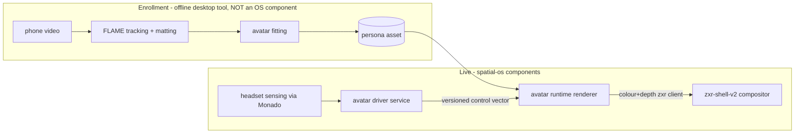

# Persona avatars: enrollment, asset, driver, runtime

**Status:** design from synthesis of research
[24](../research/24-avatar-representation-enrollment.md) /
[25](../research/25-avatar-driving-sensing.md) /
[26](../research/26-codec-avatar-route.md) /
[27](../research/27-avatar-claims-audit.md). Placement + control-space decision ratified in
[adr/0010](adr/0010-avatar-control-space-and-driver.md). **Date:** 2026-09-22.

The goal is an open Persona: **enroll a user once (phone video), produce a saved, portable,
animatable representation, drive it live from whatever the headset actually senses, and render it
photoreal at VR rate for telepresence** — on spatial-os, from public research, with every claim
about "what the headset gives us" verified against code.

## The four-stage decomposition (and what the OS owns)



1. **Enrollment** (offline, minutes, desktop GPU) — quality lives here; arbitrarily heavy models
   are fine because nothing here ships in the runtime.
2. **The saved asset + its control space** — the keystone interface. Everything upstream writes
   it, everything downstream reads it.
3. **The driver** (live) — headset sensing → control vector. Entirely device-dependent; a
   device-contract problem ([25 §3](../research/25-avatar-driving-sensing.md)).
4. **The runtime** (live) — control vector → deformed Gaussians → stereo colour+depth, submitted
   as an ordinary zxr client ([composition §7.2](zxr-shell-v2-composition.md)).

**spatial-os owns only the asset format, the driver service, and the runtime renderer.** The
enrollment pipeline is a separate desktop tool whose only OS-visible obligation is emitting a
valid asset. This is the enrollment-heavy / runtime-light pattern every production system uses
(GASP, SqueezeMe distillation — [27 §8](../research/27-avatar-claims-audit.md)).

## The control-interface specification (the keystone)

Three layers, each with verified precedent:

### 1. OpenXR-facing wire schema: FB face-tracking2 + EXT eye gaze

What Monado serves today, end-to-end verified ([25 §1](../research/25-avatar-driving-sensing.md)):
70 FB2 weights + 2 region confidences + validity + `dataSource` + rebased timestamps through
WiVRn's `wivrn_fb_face2_tracker` and upstream `oxr_face_tracking2_fb.c`; combined gaze pose via
`XR_EXT_eye_gaze_interaction` (`eyes`-role device). HTC and ANDROID-68 variants have the same
plumbing. **The driver consumes these; it never opens sensors itself** (ADR 0008 extended:
Monado owns the sensor clock domain — weights arrive already rebased into the server monotonic
clock).

### 2. Driver-internal namespace: the Unified Expressions factoring

Normalize to **UE-88 shapes + a separate typed gaze/eyelid/pupil block + jaw + head pose**
([25 §2](../research/25-avatar-driving-sensing.md)): the only schema that supersets FB2, HTC,
ANDROID and ARKit-52, with in-corpus conversion code for every verified source, and whose
factoring already matches this design's control interface. ARKit-52 is explicitly the
*degraded-mode* schema (audio models emit it), never the internal one.

### 3. Driver → runtime: the versioned control vector

```text
ControlFrame {
  control_space:  { id, kind: semantic-v1 | latent, dim, decoder_binding? }   # versioned pair
  timestamp:      Monado-monotonic ns (sample time, not publish time)
  head_pose:      from OpenXR views (never raw IMU)
  channels[]:     { value: f32, validity: bool, confidence: f32,
                    source: sensor | derived | audio-inferred | procedural | default }
  # semantic-v1 channel set: UE-88 shapes; gaze (combined dir + per-eye when available);
  #   eyelid openness L/R; jaw pose; optional pupil (reserved, no Linux source today)
  # latent (reserved, v2): opaque f32[dim] bound to a named decoder artifact hash
}
```

Non-negotiable rules, each with a verified precedent or failure mode behind it:

- **No silent zeros.** A missing signal stays missing (`validity=false`); a synthesized one is
  flagged (`source=procedural/audio-inferred`). A silent zero is indistinguishable from "mouth
  deliberately still" and corrupts both rendering and downstream calibration
  ([25 §4](../research/25-avatar-driving-sensing.md); precedents: FB2's
  `isEyeFollowingBlendshapesValid` + `dataSource`, XR_ML's per-shape valid/tracked bits).
- **The control space names a *pair*.** A learned latent is only meaningful relative to a specific
  decoder checkpoint (Ava-256's codes are literally named after the decoder iteration —
  [26 §implications](../research/26-codec-avatar-route.md)); `decoder_binding` is a content hash.
  Semantic-v1 needs no binding. Renderers ignore control spaces they don't declare — this one
  field is the entire hook that lets a learned driver slot in later without renderer changes.
- **Adapters, not unification.** Control spaces are related by learned per-person adapters (the
  MATCH bridge shape, [26 §4](../research/26-codec-avatar-route.md)); the asset carries adapter
  weights and per-user calibration blobs keyed `(control_space id, driver id)` rather than the
  system assuming one canonical space. Personal PCA/basis coefficients are **never** a wire
  format between arbitrary drivers and avatars (independently fitted bases have arbitrary
  meaning/order/sign across people).

## The asset format specification

**Reference representation: RGBAvatar-class** — FLAME-rigged Gaussians + ~20 learned reduced
blendshape bases + a small input-projection network
([24 §2.1, §7.2](../research/24-avatar-representation-enrollment.md); MIT). Chosen because,
verified in code: its native control input is already semantic (the 129-dim FLAME vector:
100 expression + 6 neck + 6 jaw + 12 eyes rot6d + 2 eyelids + 3 translation), it has explicit
eyelids and LBS-rigged teeth, monocular-video enrollment (metrical-tracker preprocessing), a
self-contained asset (~53 MiB at 256² UV), graceful out-of-distribution behaviour (mesh rig +
small correctives), and a per-frame cost (~13M MADs at 65K Gaussians: one 129→20 projection, a
20-basis weighted sum, barycentric mesh binding) that is tractable in Vulkan compute.
MATCH-GEM is rejected for the runtime (eye pose explicitly zeroed in code, multi-view enrollment,
PCA clamp OOD behaviour); FlexAvatar's prior+inversion enrollment concept is the single-image
upgrade path to study, not code to adopt ([24 §7](../research/24-avatar-representation-enrollment.md)).

The **persona asset** is a versioned container (not the research `.ply`) holding everything a
no-Python runtime needs:

```text
persona-asset/
  manifest                    # format version; control_space descriptor(s); provenance,
                              # enrollment source + licensing metadata; content hashes
  rig/                        # template mesh ref (incl. teeth), joint hierarchy, LBS weights,
                              # eyelid vertex-offset data, optional explicit eyeball meshes
  gaussians/                  # canonical per-Gaussian attrs + binding (face id, barycentric)
  bases/                      # learned corrective bases (xyz/rotation/colour × N_bases)
  adapters/                   # control-space → asset-native input weights (e.g. UE→FLAME-129);
                              # per-user calibration blobs keyed (control_space, driver)
  neutral/                    # the recorded neutral state (fallback target — NOT the basis mean)
```

Runtime contract: loadable and renderable by a C++/Vulkan runtime with **no Python, no research
checkout, no network**. Export fp32 first; reduced precision is a validated later step. The asset
is **biometric data** — a copy of a face; it is stored and transported under the same privacy
boundary as camera frames (never exposed to untrusted clients; remote peers receive it only via
explicit sharing).

## The driver service

A Monado-adjacent service per ADR 0008 logic (ratified in
[adr/0010](adr/0010-avatar-control-space-and-driver.md)): consumes `get_face_tracking` weights and
gaze poses in Monado's clock domain, normalizes to the UE factoring, applies per-person
calibration, emits `ControlFrame`s. Two obligations beyond pass-through:

- **The degraded-mode ladder**, per channel-group and per device, each rung flagged in `source`:
  visual face weights → add-on mouth camera (Baballonia/V4L2, the verified expansion-port path)
  → audio-inferred mouth/jaw (ARKit-52 emitters; only mouth/jaw channels are meaningfully
  audio-inferable — eye/brow from audio is noise and must not be emitted as signal) → procedural
  (blinks timed to saccades/speech pauses; restrained, flagged). Gaze has no synthesis rung: no
  measured gaze → avatar eyes hold a calibrated rest pose, never fake saccades.
- **Re-publication:** whatever the driver synthesizes is also re-published as a Monado face
  device (an `xrt_device` exposing the FB2 visual and/or audio input), so ordinary OpenXR apps
  get degraded-mode expressions for free through the standard extension
  ([25 §5](../research/25-avatar-driving-sensing.md)). The audio rung is a small, well-defined
  gap today: Monado's state tracker already routes `XRT_INPUT_FB_FACE_TRACKING2_AUDIO`, but no
  device registers it.

## The runtime renderer: a zxr client

The avatar runtime is an ordinary **zxr-shell-v2 3D client** — it renders the peer's (or in
mirror mode, the user's own) head into pooled colour+depth images for the compositor's atomic
frame submission ([composition §7.2](zxr-shell-v2-composition.md)). Nothing new is required from
the compositor; the avatar is the first natively-3D zxr application. Telepresence transport is
`ControlFrame`s (~hundreds of bytes/frame), not geometry or video: the receiver holds the asset
(versioned by manifest hash) and renders locally — the sharing stack
([spatial-sharing.md](spatial-sharing.md)) carries the control stream and the one-time asset
transfer under consent.

Budget discipline ([27 §16](../research/27-avatar-claims-audit.md)): decoder, animation
transforms, projection/sort, splat raster, and full-XR-frame costs are measured **separately** —
quoting any one as "avatar latency" is meaningless. Initial target, per the audit's verdict:
**40–60k animated Gaussians, stereo, 72 Hz** (demonstrated class-feasible by SqueezeMe on
XR2 Gen 2, but only in an unreleased stack). 90 Hz and native eye resolution are **not claimed**
until measured on the target BSP. Renderer starting points to study, not adopt wholesale:
`3dgs-cpp` (LGPL, Vulkan compute, no Android/OpenXR yet), `vkgs` (MIT, unmaintained, no stereo),
HRM²Avatar's released Metal runtime (architecture reference for culling/stereo sharing).

## Kill-gates (before any model or renderer investment per device)

Modeled on perception's P-1: cheap, binary, per-device.

- **S-1 sensing gate** ([25 §5](../research/25-avatar-driving-sensing.md)): the expected OpenXR
  extension enumerates; tracker create + first valid sample within N seconds; then a 60 s
  sampling run with monotonic sample timestamps, bounded jitter, and bounded skew against
  Monado's clock. Initial matrix ([25 §3](../research/25-avatar-driving-sensing.md)): Quest Pro
  and Galaxy XR pass on paper (verified plumbing); Steam Frame gaze exposure on Linux is
  UNKNOWN (this gate decides); Play for Dream is WiVRn-unsupported; Lynx R1's floor is head pose
  + mics (audio/procedural rungs only).
- **R-1 render gate** ([27 §17](../research/27-avatar-claims-audit.md)): on-headset stereo splat
  benchmark — 40k/60k animated splats, representative head close-up, both eyes at target render
  scale, animation updated every frame, compositor + reprojection active, sustained
  thermal/power logging. No open stack has demonstrated this on XR2-class hardware; until R-1
  passes on a named device, the avatar runtime is desktop-class work only.

## Non-goals for v1 (hooks reserved, work deferred)

- **Learned-latent driver** (the codec-avatar route): a research project with a bounded core
  ([26 §verdict](../research/26-codec-avatar-route.md)) — driving *Ava-256 subjects* is
  recoverable engineering (decoder checkpoint + codes verified live on S3; PR-1 encoder code
  portable), but new-person enrollment runs through closed registration tooling, and headsets
  without face cameras can never use the encoder family. v1 reserves exactly: the control-space
  descriptor, the opaque latent channel with decoder binding, calibration-blob slots, and
  synchronized timestamps in enrollment recordings. The v2 experiment sequence is written down
  in [26 §recommended sequence](../research/26-codec-avatar-route.md).
- **Universal priors / single-image enrollment** (URAvatar, FiCA, FlexAvatar-class): no public
  code for the first two; NC license on the third. Study targets for the enrollment *tool*, no
  OS surface.
- **Diffusion view completion** (GAF): code never released; enrollment-tool concern anyway.
- **Relighting:** requires prior training data the enrollment capture doesn't have; separate
  feature, not implied by a Gaussian renderer.
- **Per-eye gaze / pupil as required channels:** no verified Linux path delivers them
  ([25 §2](../research/25-avatar-driving-sensing.md)); the channels exist in the schema as
  optional.
- **Body/hands:** head + neck bust only; shoulder/body pose is a separate problem (head pose
  does not determine shoulders).

## Open questions (carried to the backlog)

1. Vulkan-compute port cost of the reduced-blendshape decode (13M MADs/frame estimate needs an
   R-1-adjacent measurement, not extrapolation from CUDA).
2. Whether the asset format should *mandate* explicit eyeball meshes (FuHead-style) vs FLAME
   joint rotation — the #1 uncanny-valley risk; decide from enrollment-tool output quality.
3. Per-person teeth appearance (all current models build procedural flat teeth).
4. Enrollment-tool tracker choice (metrical-tracker vs Pixel3DMM vs SHeaP) — deliberately outside
   the OS contract; the asset's adapter absorbs tracker differences.
5. Quest 3/3S audio-source FB2 weights through WiVRn's visual-only tracker create (spec says
   create fails on unsupported sources — does WiVRn silently lose face there?).
6. Whether Monado should grow XR_ML-style per-blendshape valid/tracked bits (upstream
   conversation).
