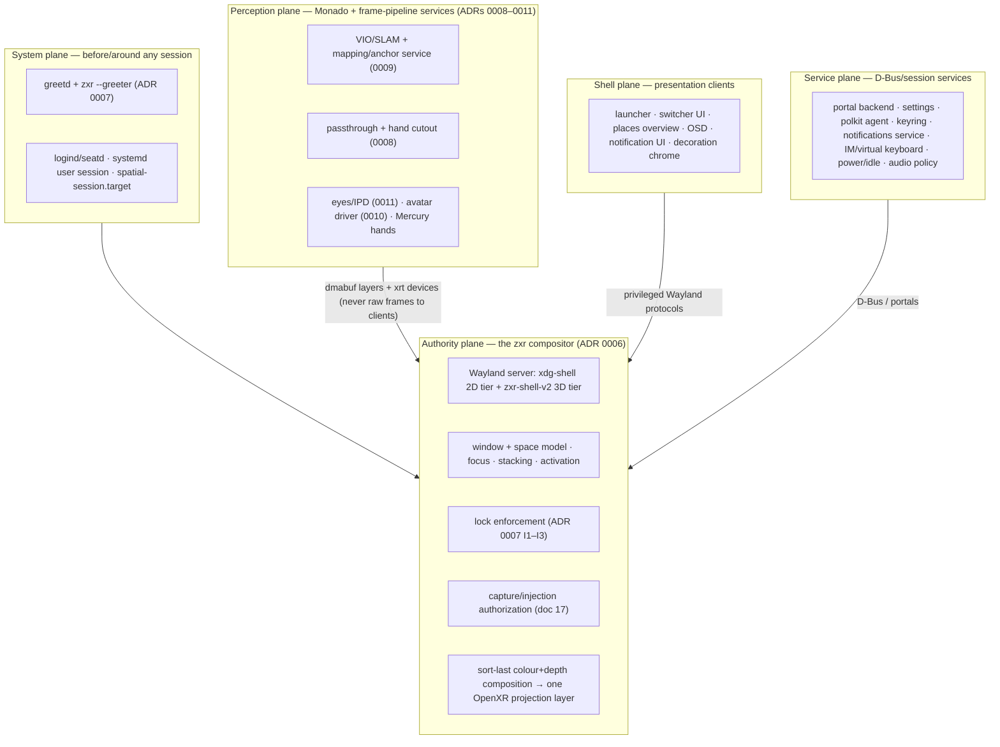

# The spatial-os desktop environment: the plane model

**Status:** draft (Phase B of the desktop-architecture workstream).
This document gives spatial-os its *horizontal* structure: what a complete spatial-os desktop
environment consists of, organized into planes by authority, with each feature split into
mechanism / policy / presentation. The per-component inventory (what exists, what's partial, what's
missing, with evidence) lives in [component-registry.md](component-registry.md); the modularity
*decisions* (what is a separate client on a standard protocol, what is pluggable in-process, what
must stay in the compositor) live in
[adr/0012-de-modularity-spinout-seams.md](adr/0012-de-modularity-spinout-seams.md), grounded in the
protocol-seam survey [research/30](../research/30-wayland-de-anatomy-protocol-seams.md).

Everything below composes with, and never overrides, the vertical decisions already ratified:
compositor strategy ([ADR 0006](adr/0006-compositor-strategy.md)), session/greeter/lock
([ADR 0007](adr/0007-session-greeter-lock.md)), perception placement
([ADR 0008](adr/0008-perception-services-placement.md)), mapping
([ADR 0009](adr/0009-spatial-mapping-architecture.md)), avatars
([ADR 0010](adr/0010-avatar-control-space-and-driver.md)), eyes/IPD
([ADR 0011](adr/0011-eye-tracking-ipd.md)).

## 1. Why a plane model

A Wayland desktop environment is not one program; it is a set of processes with sharply different
*authority levels* held together by a small number of privileged interfaces. Every mature DE —
whatever its packaging — decomposes the same way once you sort components by one question:

> **Authority question:** does this component need knowledge of, or control over, *arbitrary
> clients* (their surfaces, focus, stacking, input, or output)?

Components that answer *yes* must live in (or be trusted extensions of) the compositor, because in
Wayland the compositor is the only process that sees every client. Components that answer *no* are
ordinary clients or D-Bus services and can be replaced independently. This is the boundary the
ecosystem has spent a decade formalizing into privileged protocols (`ext-workspace`,
foreign-toplevel, layer-shell, session-lock…), surveyed in
[research/30](../research/30-wayland-de-anatomy-protocol-seams.md).

An XR system adds a second sorting question that desktop DEs never needed:

> **Perception question:** does this component need *camera frames*, or *pose at a specific
> exposure/sample timestamp*?

Components that answer *yes* must live in one clock/calibration domain — Monado's frame pipeline —
per the placement argument ADR 0008 makes structural (one set of camera timestamps, one
calibration, pose-at-exposure as an in-process query, never on the compositor's display path).
This is a *different* trust axis than the authority question: perception components are maximally
privacy-sensitive (they see the room, the user's eyes and face) yet need **no** knowledge of
Wayland clients at all; the compositor is maximally client-privileged yet must **never** see a
camera frame. Keeping the two questions separate is what makes the privacy boundaries in
ADRs 0008–0011 enforceable by process design rather than policy.

Two questions, plus the boot-time trust root, yields five planes.

## 2. Terminology: the five traps

The desktop vocabulary spatial-os inherits is overloaded in ways that have historically confused
architecture discussions. This document (and the registry and ADRs) uses the following
disambiguations everywhere; when other documents' wording collides with these, these win.

**1. "Compositor" means two things.** Narrow sense: the *composition engine* — the subsystem that
combines surfaces into an output image. Broad sense (normal Wayland usage): the whole *display
server* — the process owning input, outputs, window-management authority, and (usually) that
engine. "KWin is the compositor" obscures exactly this: KWin-the-process is a Wayland display
server; inside it lives a narrower compositing/rendering subsystem. The X11 mental model —
display server plus a *replaceable* window manager — does not map onto Wayland: window-management
policy is part of the compositor process, and anything exercising that authority from outside
needs a compositor-granted privileged protocol. In this repository: **the zxr compositor** always
means the authority-plane process (broad sense); **the composition engine** means the sort-last
colour+depth subsystem inside it ([composition doc](zxr-shell-v2-composition.md) §2–§5, narrow
sense). The named internal subsystems of the broad-sense compositor are listed in §3 under
"Authority plane".

**2. "Shell" means three things.** (a) The **desktop shell** — the launcher/panels/overview/OSD
presentation layer: our shell plane. (b) **`xdg-shell`** — the Wayland protocol that gives
surfaces desktop-window *roles* (`xdg_toplevel`, `xdg_popup`); despite the name it has nothing to
do with (a) — every ordinary app uses it, no desktop-shell component need exist. (c)
**Shell-integration privileged protocols** — layer-shell, `ext-workspace`, foreign-toplevel, the
zxr shell-integration family (ADR 0012 §4) — the seams that (a) binds to talk to the compositor.
`zxr-shell-v2` is named in tradition (b): it is a surface-role protocol for 3D clients, not a
desktop shell.

**3. "XDG" means three things.** (a) The **freedesktop Cross-Desktop Group specification
family** — desktop entries (`.desktop`), base directories (`$XDG_*`), icon themes, MIME
associations, autostart, trash, the desktop-notifications spec, StatusNotifierItem: file-format
and D-Bus conventions with no Wayland involvement (sources pinned at
`references/xdg-specs`). (b) The **`xdg_*` namespace inside `wayland-protocols`** (`xdg-shell`,
`xdg-activation`, `xdg-decoration`, `xdg-session-management`) — a protocol-governance label,
unrelated to (a)'s base-directory spec beyond shared ancestry. (c) **`xdg-desktop-portal`** — the
sandboxed-app D-Bus mediation service (one frontend, per-DE backends). spatial-os needs all
three, they evolve independently, and a claim about "XDG support" is meaningless until it says
which one. Doc 30's addendum compares (a) against what KDE and GNOME actually implement.

**4. Decorations are three concerns, not one.** *Decoration policy* — does this window get
decorations at all; server-side vs client-side (the `xdg-decoration` negotiation, and our forced-
SSD stance for proxied clients); border/chrome behaviour per window state. *Decoration
rendering* — the theme/chrome drawn (pluggable, ADR 0012 §2). *Decoration input handling* — hit
regions and move/resize/close grabs (inseparable from input dispatch). The worked example in §4
places all three.

**5. "Session management" is three concepts.** *Session supervision* — starting/stopping the
session's services (`spatial-session.target`, ADR 0007). *Login-session tracking* — users, seats,
device ownership (logind). *Application session restoration* — "these apps were open, these
windows belonged here; restore them after login" (the `xdg-session-management-v1` seam plus a
restore manager, §6.3 — XR-amplified, because anchored places persist *placement* but something
must own *relaunching* apps into it). Only the first two were covered before this document;
conflating the three hides the third.

(A related historical naming note: a "display manager" manages graphical logins, not displays —
greetd in our stack; output configuration is an unrelated responsibility.)

## 3. The five planes



### System plane

Everything that runs before, or stands outside, a user session: seat and device brokering
(logind/seatd), the display manager (greetd), the greeter (the zxr compositor in restricted
`--greeter` mode), autologin policy, the boot splash, and the systemd user session that owns the
session body (`spatial-session.target`: Monado, compositor, shell services). Decided in
[ADR 0007](adr/0007-session-greeter-lock.md); researched in
[11](../research/11-display-managers-greeters.md)/[12](../research/12-lock-screens-and-appliance-login.md).
Its distinguishing property: it must bring up the XR display path (panel, distortion, per-unit
calibration from *system* state, IMU-only tracking) before any user exists.

### Authority plane

The zxr compositor and nothing else. It answers the authority question *yes* for: the Wayland
protocol server (both tiers), the window and spatial-workspace ("places") model, focus/stacking/
activation, input routing (6DoF ray/hand/controller events dispatched as `wl_seat` + zxr input),
lock **enforcement** (invariants I1–I3 of ADR 0007 — no client buffer sampled, no input delivered,
locked-hint only after a clean composition pass), capture/injection **authorization** (which
clients may bind the capture globals; the EIS server for injection, doc
[17 §8](../research/17-sharing-capture-stack.md)), and the sort-last colour+depth composition of
every visible surface into **one** OpenXR projection layer per
[zxr-shell-v2-composition.md](zxr-shell-v2-composition.md).

The authority plane is *mechanism-first*: per §4 below, policy and presentation are pushed out of
it wherever a seam exists that doesn't compromise latency or the lock/capture invariants.

Because "the compositor" in the broad sense (§2 trap 1) hides real structure, the zxr process
decomposes into **named subsystems**, each with a registry row:

| Subsystem | What it owns | Registry evidence |
|---|---|---|
| Protocol server | core globals, `xdg-shell`, `zxr-shell-v2`, privileged globals + per-connection filtering | specified (ADR 0006) |
| Window + space model, WM policy | lifecycle, placement, stacking, states, rules; places | window model partial; space model missing |
| Input subsystem | seats, ray/6DoF/keyboard routing, focus, activation, shortcut interception, grabs | focus/activation missing |
| Output paths | the OpenXR loop (Monado owns the HMD display — no desktop-style modesetting), the desktop dev window, and the docked flat-composition output (ADR 0015); `wlr-output-management` for non-HMD heads | dev + XR specified (composition §7); docked missing |
| Scene graph | surface→world transforms, decoration nodes, damage tracking | implicit in composition doc — no explicit design |
| Composition engine (narrow-sense "compositor") | sort-last colour+depth → one OpenXR projection layer; frame scheduling | specified (composition §2–§5, §7.4) |
| Effects / animation module | open/close/move transitions under authority-owned comfort caps | missing |
| Colour pipeline | `color-management`/`color-representation` protocols, panel calibration application, passthrough-vs-rendered matching | missing |
| Privileged desktop interfaces | capture, EIS injection, dev-profile session-lock, the zxr shell-integration family | specified (ADR 0012) |

### Perception plane

Monado plus the frame-pipeline services of ADRs 0008–0011: the frameserver (camera ownership),
Basalt VIO behind the VIT seam, the mapping/anchor/relocalization service and its encrypted store,
passthrough view-correction with its pluggable depth backend, the hand-cutout service, Mercury hand
tracking, the eye-frame service (gaze, rotation-center IPD, motor policy), and the avatar driver
(re-published as a derived face device). No desktop DE has this plane; it exists because XR
presentation is *sensor-derived*. Its outputs cross into the authority plane only as finished
dmabuf layers with explicit sync, or as OpenXR-visible devices — never raw frames, never
per-client. The privacy rules (clients never see camera frames, mattes, eye images; gaze is
opt-in per app) are properties of this plane's boundary, stated in the owning ADRs.

### Shell plane

Presentation: the launcher, the spatial task switcher's UI, the places/workspace overview (pager),
panels/docks, OSDs (volume/brightness/IPD), notification popups, the lock *scene* (on the
appliance profile this one is rendered by the compositor itself — see the lock example in §4 and
the exception list in ADR 0012), and decoration chrome. Shell components hold *no* general
authority: each binds exactly the privileged protocol(s) its job needs (foreign-toplevel list for
a switcher, `ext-workspace` for a pager, layer-shell for panels/OSDs), and the compositor gates
which clients may bind those globals (see `security-context` and the binding policy in
[research/30](../research/30-wayland-de-anatomy-protocol-seams.md)).

### Service plane

Session services that talk D-Bus, not privileged Wayland: the xdg-desktop-portal backend
(`xdg-desktop-portal-spatial`, doc [17 §8–9](../research/17-sharing-capture-stack.md)), the
settings daemon and configuration model, the polkit authentication agent, secrets/keyring, the
notification (spec) service, input-method/virtual-keyboard backends, power/idle policy, audio
routing policy, clipboard persistence. Most of these are where a desktop DE's bodies are buried —
and where the [component-registry.md](component-registry.md) gap list is longest.

### The sixth, orthogonal plane: build

The donor pipeline, image assembly, update bundles, and the device contract
([overview.md](overview.md)'s build boundary) sit outside runtime entirely. The registry keeps
them in a separate build-plane section; nothing in this document changes them.

## 4. The mechanism / policy / presentation rule

Within every feature, separate:

- **mechanism** — what only the authority (or perception) plane can do;
- **policy** — the decision logic (which window next, where does a new window go, when to lock);
- **presentation** — what the user sees.

Mechanism stays in-plane. Policy and presentation are spin-out *candidates*, each needing a seam
(a protocol or plugin boundary). Worked XR examples, which ADR 0012 turns into decisions:

**Spatial alt-tab (the switcher).** Interception of the global gesture/chord (controller
double-tap, hand gesture, keyboard alt-tab) is mechanism — only the compositor may eat input
before clients. The *order and grouping* of candidates is policy. The switcher carousel floating
in front of the user is presentation — an ordinary shell client consuming the foreign-toplevel
list and issuing activation requests; the compositor remains the authority that actually
transfers focus (and honors `xdg-activation` semantics so focus stealing stays impossible).

**Spaces (workspaces).** The *space model* — which spatial places exist, which windows belong to
each, which is active — is authority-plane state, exactly as a desktop workspace model is
compositor state; in spatial-os a place is additionally **anchored**: bound to a mapping-service
anchor so "the kitchen workspace" relocalizes with the room (ADR 0009's map/local frame contract —
corrections move anchors, never the rendered world mid-frame). The pager/overview that shows the
user their places and lets them switch is presentation, consumable over the `ext-workspace`
seam. Where the *previews* come from is an XR twist: thumbnails of a 3D place must be rendered by
the compositor (a client cannot re-render a space it can't see into) — the seam carries the model;
preview images are compositor-provided (via the capture stack, doc 17).

**3D decorations.** Three concerns (§2 trap 4), placed separately. *Input handling* — hit-testing
the grab handles / close affordances of a window's 3D chrome, deciding that a ray hit
*decoration*, not *content* — is mechanism: input routing. *Decoration policy* — whether a given
window gets chrome at all, the SSD/CSD negotiation (`xdg-decoration` on the 2D tier; forced
server-side for proxied clients per doc 19), and per-state behaviour (maximized/immersive windows
shed borders; a grabbed window may grow handles) — is compositor policy, configurable but not
delegable. *Rendering* — the look of the chrome (handle geometry, hover glow, theme) — is
presentation and belongs behind a decoration boundary (in-process plugin, ADR 0012 §2). What
never leaves the compositor: the decision of *where* decoration regions are, because that is
input-dispatch correctness.

**Lock — the exemplar (already decided).** ADR 0007 splits it exactly on this rule: enforcement
(I1–I3) is compositor mechanism; the *policy* ladder (doff/don grace, idle steps, boot-locked) is
configuration; the PAM conversation is a separate process (`spatial-authd`); and the lock *scene*
is presentation — compositor-internal on the appliance profile (because the lock surface must
exist even when every client is dead), while the dev/desktop profile exposes
`ext-session-lock-v1` so third-party lockers work. One feature, four placements, each argued from
mechanism/policy/presentation. The rest of the DE should be factored with the same knife.

## 5. XR redefinitions of desktop concepts

What the standard vocabulary *means* on a headset — the compatibility surface stays (the protocols
still speak of outputs and surfaces), but the semantics shift:

| Desktop concept | spatial-os meaning |
|---|---|
| Output / monitor | No physical output a client should reason about. The compositor composes into stereo eye views; for layer-shell/pager purposes it may expose *virtual* outputs (the desktop-mirror window, a spectate view — doc 17's output sources). Output-anchored semantics ("top edge of the screen") are reinterpreted against *reference frames* (head-locked, world-anchored, hand/wrist-locked). |
| Workspace | A **place**: a named set of windows bound to a spatial anchor (room-scale) or a portable layout (head-relative), persisted and relocalized by the mapping service (ADR 0009). Workspace *switch* may be a physical walk, a teleport, or a summon. |
| Window decoration | 3D chrome: grab handles, move/rotate/resize affordances, close, and a title/badge — hit-tested by the compositor, themed by a decoration module. 2D-tier windows keep `xdg-decoration` negotiation. |
| Panel / dock / bar | A world- or body-anchored quad (wrist panel, desk dock) built on layer-shell semantics with anchor reinterpretation (see above). Exclusive zones make no sense on a sphere; reserved space becomes reserved *solid angle* per reference frame. |
| OSD | A head-locked, gaze-comfortable transient (volume, brightness, IPD readout during motor moves — ADR 0011's motor events are the canonical OSD trigger). |
| Notification | Spec-compliant D-Bus service (service plane) + spatial presentation policy (shell): head-locked toast vs. world-anchored near its app vs. wrist summary; do-not-disturb tied to presence and app immersion state. While spectating/sharing, notification suppression is a *capture-policy* duty (doc 17's consent language). |
| Alt-tab | The spatial switcher (§4). |
| Wallpaper | The environment: passthrough (ADR 0008) or a skybox/scene client — selected by the same policy switch as the passthrough toggle. |
| Screenshot / screencast | Points in the capture taxonomy (scope × projection × temporality, [spatial-sharing.md §2.2](spatial-sharing.md)) under the five sharing modes; authorization always via the portal + compositor, with XR-specific consent language (observer-controlled viewpoint, gaze warnings) and passthrough excluded from captures by default. |
| Session lock | ADR 0007's compositor state machine; "screen off" = panels blanked + doff grace timer. |
| Login screen | The zxr `--greeter` scene (multi-user profile) or nothing (appliance autologin). |
| Desktop icons | None. The environment is not an icon surface; app icons live in the launcher — a phone-style grid / "start menu" scene (ADR 0012's desktop-icons non-goal). |
| System tray | A StatusNotifierItem (SNI) host in the panel — apps shipping SNI render as typed badges on panel surfaces (ADR 0012 decision; COSMIC precedent). There is no free-floating XR tray. |
| Session restore | Places persist *where* windows belong (ADR 0009 anchors); the restore manager owns *relaunching* apps into them after login, over the `xdg-session-management-v1` seam (§2 trap 5, §6.3). |
| Docked mode | **The same session, flat presentation — not a different desktop** ([ADR 0015](adr/0015-docked-desktop-mode.md)): with `spatial.hardware.externalDisplay`, zxr scans a flat-composition output onto the monitor; doff-while-docked quiesces the XR stack (perception off, cadence off, damage-driven 2D) instead of locking; don returns the same windows to space. |

Desktop concepts with **no XR analog** (do not build them): physical multi-monitor arrangement
UIs, cursor themes as a user-facing concern (the "cursor" is a ray/fingertip; shape feedback is
decoration/interaction state), fullscreen-as-mode-set (everything is composited; "fullscreen" is
an immersion *level*), desktop icons (see table — the launcher owns the app grid).

XR concepts with **no desktop analog** (someone must own them; registry rows exist for each):
the guardian/boundary system (perception-plane data, authority-plane enforcement — it must dim/cut
client content, shell-plane presentation of the fence); recentering (a global gesture the
compositor owns, re-seating the reference frame); the passthrough/immersion toggle (one policy
switch affecting environment layer + boundary + notification policy); doff/don presence (ADR 0007's
grace ladder); per-user IPD/comfort application at session start (ADR 0011); motor/actuator OSDs;
spectate/consent badging rendered *in-space* (doc 17).

## 6. The component dependency graph

This section records **hard dependencies only**. An edge means *cannot function without* — never
"should be built before". Components not connected by a path are mutually unordered by
construction, and the graph deliberately does not choose a build order: flattening a partial order
into a sequence is a prioritization decision (what ships first, what a milestone means) that is
**not made here or anywhere in this document**. The per-component status (specified / partial /
missing) stays in [component-registry.md](component-registry.md); this graph adds structure, not
status.

Conventions:

- In tree diagrams, a **child requires its parent** (and, transitively, everything above it).
- `──►` — the tail requires the head.
- `┄┄►` — degraded-mode dependency: the component functions without it in a stated reduced form.
- `◇` — a spike/kill-gate from an owning ADR that blocks the subtree beneath it (and only that
  subtree).
- Plane tags: `[A]`uthority, `[S]`ystem, `[P]`erception, `[H]` shell, `[V]` service,
  `[build]` build plane, `[OS]` plain OS infrastructure (systemd, D-Bus, PipeWire, logind).

### 6.1 Roots

Components with no dependency on any other DE component — only on OS infrastructure or the build
plane. Everything else in the graph descends from one or more of these:

- `[A]` **compositor core** — Wayland protocol server + Vulkan renderer + frame scheduler, one
  process (ADR 0006). The root of §6.2 and §6.3.
- `[P]` **Monado + the device adaptation bundle** — the root of §6.5 and of every HMD-only
  feature. ◇ gated by the display-path feasibility test and the D1/D2 spikes (ADR 0006).
- `[S]` **seatd/logind, the systemd user session, D-Bus** — the root of greetd, the session
  target, and every service daemon.
- `[S]` **per-unit calibration state** — device provisioning; required by anything that renders
  through lenses before or after auth (splash, greeter, HMD output).
- `[OS]` **PipeWire** — required by capture publication, portal streams, and audio policy.
- Near-roots needing only D-Bus: `[V]` notification service, keyring, non-capture portal
  interfaces, audio session policy, power/thermal policy, default-apps/MIME database. These are
  mutually independent; each becomes load-bearing only when a consumer edge below is built.

### 6.2 Authority plane: the in-compositor DAG and the session cluster

```text
[A] compositor core (protocol server · Vulkan renderer · frame scheduling)
 ├─ output paths — three alternatives; none requires another
 │   ├─ desktop-window dev output            (any desktop; no HMD, no Monado)
 │   ├─ docked flat-composition output ──► external DRM connector
 │   │      (gated on [build] spatial.hardware.externalDisplay — ADR 0015;
 │   │       damage-driven; carries the quiescence ladder when doffed)
 │   └─ OpenXR loop ──► [P] Monado ──► [build] device adaptation
 │        └──► [S] per-unit calibration state
 │        (every node marked "HMD-only" below requires this path)
 ├─ colour pipeline (colour-management/-representation protocols · panel
 │      calibration from [build] adaptation · passthrough/rendered matching)
 ├─ effects / animation module (in-process; authority-owned comfort caps)
 ├─ 2D quad tier (xdg-shell trees · subsurfaces · popups · plane depth)
 │   ├─ window model (lifecycle · stacking · world transforms)
 │   │   ├─ input routing & focus (ray/6DoF/keyboard → window-local events)
 │   │   │   ├─ xdg-activation authority
 │   │   │   ├─ global-shortcut / gesture interception
 │   │   │   ├─ decoration policy ── decoration enforcement ── chrome renderer
 │   │   │   │      plugin (in-process seam)
 │   │   │   └─ EIS injection server ──► [V] portal RemoteDesktop session
 │   │   ├─ session-restore mechanism (xdg-session-management-v1 server side)
 │   │   ├─ space model ("places") ┄┄► [P] mapping/anchor service
 │   │   │      (local, non-anchored places work without mapping;
 │   │   │       anchored/persistent places do not)
 │   │   └─ Xwayland integration (WM glue for rootless X clients)
 │   └─ window-local composition textures (feeds the capture seam, §6.3)
 ├─ 3D tier (zxr-shell-v2 colour+depth clients in the shared depth-tested space)
 │   └─ 3D decorations / manipulation affordances ──► input routing (hit volumes)
 ├─ lock state machine (I1–I3) ──► [S] spatial-authd ──► PAM stack ──► PIN credential
 │   ├─ lock scene (in-process presentation, appliance profile)
 │   └─ doff/don + idle ladder ──► presence (HMD-only: XR_EXT_user_presence)
 └─ boundary breach response ──► [P] boundary probes (§6.5)
```

The session cluster around it:

```text
[S] seatd/logind ◄── [S] greetd ◄── [S] zxr --greeter mode
                                        ├──► compositor core (same binary, restricted)
                                        ├──► [P] Monado (IMU tier only)
                                        └──► [S] per-unit calibration state
[S] spatial-session.target ──► systemd user session
     └─ owns: Monado · compositor · shell/service daemons (supervision, not dependency)
[S] boot splash ──► [S] per-unit calibration state   (cosmetic; nothing depends on it)
```

Notes on edges that are easy to get wrong:

- The **desktop-window dev output** means the entire 2D subtree, the lock machine (minus
  presence), and every §6.3 consumer are HMD-independent: they run and are testable on a
  desktop. Only the OpenXR loop, presence, the greeter's tracking tier, and §6.5 need hardware.
- The **space model's edge to mapping is degraded, not hard** — that is what makes local places
  buildable while ADR 0009's M0 gate is unresolved.
- **`spatial-session.target` supervises but is not depended on**: the compositor functions when
  launched by hand; the target is how the appliance profile arranges crash/restart.

### 6.3 The privileged seam layer: authority models → protocols → consumers

Each privileged protocol depends on the authority-plane model it exports; each shell/service
component depends on the protocols it binds. `security-context-v1` + per-connection global
filtering (ADR 0012 §5) sits on **every** edge in the consumer column.

```text
AUTHORITY MODEL              EXPORTED SEAM                          CONSUMERS
──────────────────           ─────────────────────────────          ───────────────────────────────
window model ──────────────► ext-foreign-toplevel-list-v1     ────► [H] switcher UI · [H] taskbar panel
                             (+ wlr-…-management action shim
                              + xdg-toplevel-icon for icons)
window model +
session-restore mechanism ─► xdg-session-management-v1        ────► [V] session restore manager
space model ───────────────► ext-workspace-v1                 ────► [H] pager / places overview
                             (+ zxr spatial extension)
composition textures ──────► ext-image-capture-source-v1      ────► [V] portal backend ──► OBS/WebRTC/…
                             + ext-image-copy-capture-v1        └─► previews for switcher + pager
focus authority ───────────► xdg-activation-v1                ────► [H] launcher · [H] notification UI
core surfaces ─────────────► wlr-layer-shell                  ────► [H] launcher · panels · OSDs ·
                             (+ zxr anchoring/exclusion ext)         notification UI · consent picker ·
                                                                     [V] polkit agent's prompt surface
seat ──────────────────────► text-input-v3 · input-method-v2  ────► [V] IM framework · [H] virtual keyboard
                             · virtual-keyboard-v1
selection/data-device ─────► ext-data-control-v1              ────► [V] clipboard manager
non-HMD outputs ───────────► wlr-output-management            ────► [V] display-config UI (monitors only;
                                                                     HMD config is a zxr settings API)
```

Consumer-side edges that cross *out* of this table:

```text
[H] launcher ─────────► [V] default-apps/MIME + .desktop database
[V] session restore
    manager ──────────► [V] .desktop database (relaunch) · [A] space model (place binding)
[H] panels ───────────► [V] SNI watcher (D-Bus near-root; host renders in a panel applet — ADR 0012)
[H] panels ┄┄──────────► status sources: [V] audio policy · power · network · [P] tracking state
[H] OSDs ─────────────► event channels: [V] settings daemon · [P] IPD-motor events (ADR 0011)
[H] notification UI ──► [V] notification service (org.freedesktop.Notifications)
[H] consent picker ───► [V] portal backend (chooser hook — placement fork open, registry §10.4)
[H] virtual keyboard ─► generalizes the in-compositor lock PIN pad (ADR 0007), not vice versa
[V] portal backend ───► [OS] PipeWire  (xdpw variant additionally: xdg-output)
[V] global shortcuts ─► [A] interception + portal GlobalShortcuts D-Bus
[V] settings daemon ──► (near-root; consumers take defaults when absent — weak edges by design)
```

### 6.4 Sharing modes onto the seams

```text
[A] capture seam (§6.3) ──► [V] portal backend ──► modes 1–2 (spectate · 2D window share)
                                  ├──► [H] consent picker
                                  └──► [A] EIS injection (remote input for mode 2)
[A] observer-view objects ──► [V] sharing service ──► mode 3 ──► [A] RGBD bridge + per-app
                                                                  capture groups (WiVRn-shaped)
[A] proxied-client globals baseline + security-context ─────────► mode 4 (waypipe/VM apps)
[A] space model + [V] sharing service ──────────────────────────► mode 5 (workspace join)

foreign 2D compositor (producer) ──► zext-toplevel-export ──► [A] window model
    (delegated sessions: per-toplevel floating windows — NOT capture;
     foreign-session-integration.md, ADR 0014; consumer gated on the 2D tier)
```

Mode 5 is the deepest node in the whole graph: it transitively requires the space model, the
sharing service, consent/portal machinery, and (for anchored spaces) the mapping chain.

### 6.5 Perception chain into the authority plane

```text
[build] camera adaptation (spatial.adaptation.camera / .eyes)
   │
[P] Monado frameserver — one clock, one calibration (ADR 0008)
   ├─ [P] Basalt VIO (VIT seam) — head pose, pose-at-exposure
   │    └─ [P] keyframe egress   ◇ mapping M0 gate (ADR 0009)
   │         └─ [P] mapping + anchor service
   │              ├─ relocalization + encrypted store
   │              ├─ anchored places ──► [A] space model (upgrades its ┄┄► edge)
   │              └─ [P] geometry service (planes · mesh · semantics)
   │                   └─ boundary probes ──► [A] breach response · [H] boundary setup UX
   ├─ [P] passthrough service   ◇ P-1 BSP gate (perception backlog)
   │    ├─ depth backend (pluggable per device)
   │    └─ environment layer ──► [A] composition intake
   │         (dmabuf + explicit sync; the intake IPC itself is a to-be-specified
   │          component — perception backlog #5/#8)
   ├─ [P] hand-cutout service ──► Mercury (prior) · passthrough (coupled)
   │    └─ hand-top layer ──► [A] composition intake
   ├─ [P] eyes/IPD service (ADR 0011)
   │    ├─ gaze device · IPD → eye_relation · IPD motor actuation
   │    ├─ [H] IPD wizard
   │    └─ iris verifier ┄┄► PAM (parallel unlock path, never replacing it)
   └─ [P] avatar driver   ◇ S-1/R-1 gates (ADR 0010)
        └─ derived face device ──► [H] avatar runtime (ordinary zxr 3D client
                                    ──► [A] 3D tier + asset format)
```

Every perception output crosses into the authority plane as a finished layer or an
OpenXR-visible device (§3); no shell or service component may take a dependency on anything
above that line.

### 6.6 Gates and known absences

The four ◇ gates block exactly their subtrees and nothing else: display-path/D1/D2 (the HMD
output path and everything HMD-only), mapping M0 (anchored places and below), P-1 BSP
(passthrough/cutout), S-1/R-1 (avatar). The 2D subtree, the seam layer, the session cluster, and
every near-root service are gate-free.

The components a terminology-trap review surfaced (session restoration, colour pipeline,
effects module, SNI host, decoration policy, an explicit scene graph) are now nodes above and
rows in the registry; the protocol evidence behind them is doc 30's addenda.

The registry ([component-registry.md](component-registry.md)) inventories every node here with
evidence-based status; its gap list (§8 there) shows the missing mass sits in the §6.3 consumer
column and the near-root services (its §11 totals).

## 7. Reading map

- What exists / what's missing, per component: [component-registry.md](component-registry.md)
- Which seams are standard and what precedent says: [research/30](../research/30-wayland-de-anatomy-protocol-seams.md)
- The modularity decisions: [ADR 0012](adr/0012-de-modularity-spinout-seams.md)
- The vertical decisions this document arranges: ADRs [0006](adr/0006-compositor-strategy.md)–[0011](adr/0011-eye-tracking-ipd.md)
