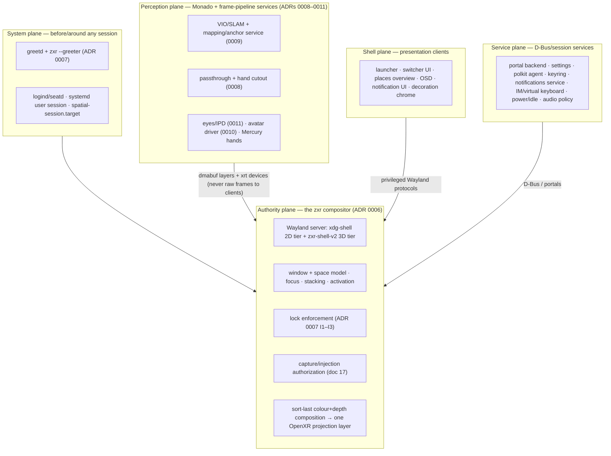

# The spatial-os desktop environment: the plane model

**Status:** draft (Phase B of the desktop-architecture workstream).
This document gives spatial-os its *horizontal* structure: what a complete spatial-os desktop
environment consists of, organized into planes by authority, with each feature split into
mechanism / policy / presentation. The per-component inventory (what exists, what's partial, what's
missing, with evidence) lives in [component-registry.md](component-registry.md); the modularity
*decisions* (what is a separate client on a standard protocol, what is pluggable in-process, what
must stay in the compositor) live in
[adr/0012-de-modularity-spinout-seams.md](adr/0012-de-modularity-spinout-seams.md), grounded in the
protocol-seam survey [research/30](../research/30-wayland-de-anatomy-protocol-seams.md).

Everything below composes with, and never overrides, the vertical decisions already ratified:
compositor strategy ([ADR 0006](adr/0006-compositor-strategy.md)), session/greeter/lock
([ADR 0007](adr/0007-session-greeter-lock.md)), perception placement
([ADR 0008](adr/0008-perception-services-placement.md)), mapping
([ADR 0009](adr/0009-spatial-mapping-architecture.md)), avatars
([ADR 0010](adr/0010-avatar-control-space-and-driver.md)), eyes/IPD
([ADR 0011](adr/0011-eye-tracking-ipd.md)).

## 1. Why a plane model

A Wayland desktop environment is not one program; it is a set of processes with sharply different
*authority levels* held together by a small number of privileged interfaces. Every mature DE —
whatever its packaging — decomposes the same way once you sort components by one question:

> **Authority question:** does this component need knowledge of, or control over, *arbitrary
> clients* (their surfaces, focus, stacking, input, or output)?

Components that answer *yes* must live in (or be trusted extensions of) the compositor, because in
Wayland the compositor is the only process that sees every client. Components that answer *no* are
ordinary clients or D-Bus services and can be replaced independently. This is the boundary the
ecosystem has spent a decade formalizing into privileged protocols (`ext-workspace`,
foreign-toplevel, layer-shell, session-lock…), surveyed in
[research/30](../research/30-wayland-de-anatomy-protocol-seams.md).

An XR system adds a second sorting question that desktop DEs never needed:

> **Perception question:** does this component need *camera frames*, or *pose at a specific
> exposure/sample timestamp*?

Components that answer *yes* must live in one clock/calibration domain — Monado's frame pipeline —
per the placement argument ADR 0008 makes structural (one set of camera timestamps, one
calibration, pose-at-exposure as an in-process query, never on the compositor's display path).
This is a *different* trust axis than the authority question: perception components are maximally
privacy-sensitive (they see the room, the user's eyes and face) yet need **no** knowledge of
Wayland clients at all; the compositor is maximally client-privileged yet must **never** see a
camera frame. Keeping the two questions separate is what makes the privacy boundaries in
ADRs 0008–0011 enforceable by process design rather than policy.

Two questions, plus the boot-time trust root, yields five planes.

## 2. The five planes

### System plane

Everything that runs before, or stands outside, a user session: seat and device brokering
(logind/seatd), the display manager (greetd), the greeter (the zxr compositor in restricted
`--greeter` mode), autologin policy, the boot splash, and the systemd user session that owns the
session body (`spatial-session.target`: Monado, compositor, shell services). Decided in
[ADR 0007](adr/0007-session-greeter-lock.md); researched in
[11](../research/11-display-managers-greeters.md)/[12](../research/12-lock-screens-and-appliance-login.md).
Its distinguishing property: it must bring up the XR display path (panel, distortion, per-unit
calibration from *system* state, IMU-only tracking) before any user exists.

### Authority plane

The zxr compositor and nothing else. It answers the authority question *yes* for: the Wayland
protocol server (both tiers), the window and spatial-workspace ("places") model, focus/stacking/
activation, input routing (6DoF ray/hand/controller events dispatched as `wl_seat` + zxr input),
lock **enforcement** (invariants I1–I3 of ADR 0007 — no client buffer sampled, no input delivered,
locked-hint only after a clean composition pass), capture/injection **authorization** (which
clients may bind the capture globals; the EIS server for injection, doc
[17 §8](../research/17-sharing-capture-stack.md)), and the sort-last colour+depth composition of
every visible surface into **one** OpenXR projection layer per
[zxr-shell-v2-composition.md](zxr-shell-v2-composition.md).

The authority plane is *mechanism-first*: per §3 below, policy and presentation are pushed out of
it wherever a seam exists that doesn't compromise latency or the lock/capture invariants.

### Perception plane

Monado plus the frame-pipeline services of ADRs 0008–0011: the frameserver (camera ownership),
Basalt VIO behind the VIT seam, the mapping/anchor/relocalization service and its encrypted store,
passthrough view-correction with its pluggable depth backend, the hand-cutout service, Mercury hand
tracking, the eye-frame service (gaze, rotation-center IPD, motor policy), and the avatar driver
(re-published as a derived face device). No desktop DE has this plane; it exists because XR
presentation is *sensor-derived*. Its outputs cross into the authority plane only as finished
dmabuf layers with explicit sync, or as OpenXR-visible devices — never raw frames, never
per-client. The privacy rules (clients never see camera frames, mattes, eye images; gaze is
opt-in per app) are properties of this plane's boundary, stated in the owning ADRs.

### Shell plane

Presentation: the launcher, the spatial task switcher's UI, the places/workspace overview (pager),
panels/docks, OSDs (volume/brightness/IPD), notification popups, the lock *scene* (on the
appliance profile this one is rendered by the compositor itself — see the lock example in §3 and
the exception list in ADR 0012), and decoration chrome. Shell components hold *no* general
authority: each binds exactly the privileged protocol(s) its job needs (foreign-toplevel list for
a switcher, `ext-workspace` for a pager, layer-shell for panels/OSDs), and the compositor gates
which clients may bind those globals (see `security-context` and the binding policy in
[research/30](../research/30-wayland-de-anatomy-protocol-seams.md)).

### Service plane

Session services that talk D-Bus, not privileged Wayland: the xdg-desktop-portal backend
(`xdg-desktop-portal-spatial`, doc [17 §8–9](../research/17-sharing-capture-stack.md)), the
settings daemon and configuration model, the polkit authentication agent, secrets/keyring, the
notification (spec) service, input-method/virtual-keyboard backends, power/idle policy, audio
routing policy, clipboard persistence. Most of these are where a desktop DE's bodies are buried —
and where the [component-registry.md](component-registry.md) gap list is longest.

### The sixth, orthogonal plane: build

The donor pipeline, image assembly, update bundles, and the device contract
([overview.md](overview.md)'s build boundary) sit outside runtime entirely. The registry keeps
them in a separate build-plane section; nothing in this document changes them.

## 3. The mechanism / policy / presentation rule

Within every feature, separate:

- **mechanism** — what only the authority (or perception) plane can do;
- **policy** — the decision logic (which window next, where does a new window go, when to lock);
- **presentation** — what the user sees.

Mechanism stays in-plane. Policy and presentation are spin-out *candidates*, each needing a seam
(a protocol or plugin boundary). Worked XR examples, which ADR 0012 turns into decisions:

**Spatial alt-tab (the switcher).** Interception of the global gesture/chord (controller
double-tap, hand gesture, keyboard alt-tab) is mechanism — only the compositor may eat input
before clients. The *order and grouping* of candidates is policy. The switcher carousel floating
in front of the user is presentation — an ordinary shell client consuming the foreign-toplevel
list and issuing activation requests; the compositor remains the authority that actually
transfers focus (and honors `xdg-activation` semantics so focus stealing stays impossible).

**Spaces (workspaces).** The *space model* — which spatial places exist, which windows belong to
each, which is active — is authority-plane state, exactly as a desktop workspace model is
compositor state; in spatial-os a place is additionally **anchored**: bound to a mapping-service
anchor so "the kitchen workspace" relocalizes with the room (ADR 0009's map/local frame contract —
corrections move anchors, never the rendered world mid-frame). The pager/overview that shows the
user their places and lets them switch is presentation, consumable over the `ext-workspace`
seam. Where the *previews* come from is an XR twist: thumbnails of a 3D place must be rendered by
the compositor (a client cannot re-render a space it can't see into) — the seam carries the model;
preview images are compositor-provided (via the capture stack, doc 17).

**3D decorations.** Hit-testing the grab handles / close affordances of a window's 3D chrome —
deciding that a ray hit *decoration*, not *content* — is mechanism: input routing. The look of
the chrome (handle geometry, hover glow, theme) is presentation and belongs behind a decoration
boundary (in-process plugin or server-side default), with clients able to negotiate CSD/SSD via
`xdg-decoration` for the 2D tier. What never leaves the compositor: the decision of *where*
decoration regions are, because that is input-dispatch correctness.

**Lock — the exemplar (already decided).** ADR 0007 splits it exactly on this rule: enforcement
(I1–I3) is compositor mechanism; the *policy* ladder (doff/don grace, idle steps, boot-locked) is
configuration; the PAM conversation is a separate process (`spatial-authd`); and the lock *scene*
is presentation — compositor-internal on the appliance profile (because the lock surface must
exist even when every client is dead), while the dev/desktop profile exposes
`ext-session-lock-v1` so third-party lockers work. One feature, four placements, each argued from
mechanism/policy/presentation. The rest of the DE should be factored with the same knife.

## 4. XR redefinitions of desktop concepts

What the standard vocabulary *means* on a headset — the compatibility surface stays (the protocols
still speak of outputs and surfaces), but the semantics shift:

| Desktop concept | spatial-os meaning |
|---|---|
| Output / monitor | No physical output a client should reason about. The compositor composes into stereo eye views; for layer-shell/pager purposes it may expose *virtual* outputs (the desktop-mirror window, a spectate view — doc 17's output sources). Output-anchored semantics ("top edge of the screen") are reinterpreted against *reference frames* (head-locked, world-anchored, hand/wrist-locked). |
| Workspace | A **place**: a named set of windows bound to a spatial anchor (room-scale) or a portable layout (head-relative), persisted and relocalized by the mapping service (ADR 0009). Workspace *switch* may be a physical walk, a teleport, or a summon. |
| Window decoration | 3D chrome: grab handles, move/rotate/resize affordances, close, and a title/badge — hit-tested by the compositor, themed by a decoration module. 2D-tier windows keep `xdg-decoration` negotiation. |
| Panel / dock / bar | A world- or body-anchored quad (wrist panel, desk dock) built on layer-shell semantics with anchor reinterpretation (see above). Exclusive zones make no sense on a sphere; reserved space becomes reserved *solid angle* per reference frame. |
| OSD | A head-locked, gaze-comfortable transient (volume, brightness, IPD readout during motor moves — ADR 0011's motor events are the canonical OSD trigger). |
| Notification | Spec-compliant D-Bus service (service plane) + spatial presentation policy (shell): head-locked toast vs. world-anchored near its app vs. wrist summary; do-not-disturb tied to presence and app immersion state. While spectating/sharing, notification suppression is a *capture-policy* duty (doc 17's consent language). |
| Alt-tab | The spatial switcher (§3). |
| Wallpaper | The environment: passthrough (ADR 0008) or a skybox/scene client — selected by the same policy switch as the passthrough toggle. |
| Screenshot / screencast | The five sharing modes ([spatial-sharing.md](spatial-sharing.md)); authorization always via the portal + compositor, with XR-specific consent language (observer-controlled viewpoint, gaze warnings). |
| Session lock | ADR 0007's compositor state machine; "screen off" = panels blanked + doff grace timer. |
| Login screen | The zxr `--greeter` scene (multi-user profile) or nothing (appliance autologin). |

Desktop concepts with **no XR analog** (do not build them): physical multi-monitor arrangement
UIs, cursor themes as a user-facing concern (the "cursor" is a ray/fingertip; shape feedback is
decoration/interaction state), fullscreen-as-mode-set (everything is composited; "fullscreen" is
an immersion *level*), tray icons as pixel wells (status becomes typed badges on panels).

XR concepts with **no desktop analog** (someone must own them; registry rows exist for each):
the guardian/boundary system (perception-plane data, authority-plane enforcement — it must dim/cut
client content, shell-plane presentation of the fence); recentering (a global gesture the
compositor owns, re-seating the reference frame); the passthrough/immersion toggle (one policy
switch affecting environment layer + boundary + notification policy); doff/don presence (ADR 0007's
grace ladder); per-user IPD/comfort application at session start (ADR 0011); motor/actuator OSDs;
spectate/consent badging rendered *in-space* (doc 17).

## 5. Build order

The dependency-ordered sequence for creating the DE, aligned with
[zxr-shell-v2-composition.md §7.5](zxr-shell-v2-composition.md)'s milestones (M1–M4) and
ADR 0006's ship-2D-first sequencing. Each stage is usable without the ones after it; nothing
depends on a later stage.

1. **Compositor 2D tier** (authority mechanism): xdg-shell quads, input routing, the window model,
   desktop-window output for development — composition M1, then Monado output (M4 display path).
   This is the root dependency of everything below.
2. **Session skeleton** (system plane): `spatial-session.target`, appliance autologin, boot-locked
   state machine + `spatial-authd`, doff/don presence ladder — ADR 0007's appliance profile.
   *Gate: a device boots into a locked, usable 2D spatial desktop.*
3. **Shell essentials** (shell plane, first spin-out consumers): launcher, spatial switcher UI,
   OSD framework, panels — these force the privileged-protocol surface (foreign-toplevel list,
   layer-shell reinterpretation, activation) to exist and prove the seams early, per ADR 0012.
4. **Service floor** (service plane): portal backend path (xdpw first, then
   `xdg-desktop-portal-spatial` — doc 17 §8), notification service + presentation policy,
   settings daemon + configuration model, polkit agent, keyring, virtual keyboard (the lock PIN
   pad generalized). Capture/consent lands here (sharing modes 1–2).
5. **Multi-user profile** (system plane): greetd + `--greeter` mode, session selection surfaced
   from the module system.
6. **Places** (authority model + shell presentation): the spatial workspace model, `ext-workspace`
   exposure, the overview — initially with *local* (non-anchored) places so it does not wait on
   mapping.
7. **3D tier**: zxr-shell-v2 clients in the same depth-tested space (composition M2–M3), 3D
   decorations/chrome, the zxr input model.
8. **Perception integration** (perception plane, parallel track — gated on its own ADR spikes,
   not on stages 3–7): passthrough environment layer + hand cutout (ADR 0008), then
   anchored places (ADR 0009 M0→M1), eyes/IPD (ADR 0011), avatar driver (ADR 0010), boundary
   system. Each lands as a layer/device the compositor already knows how to consume.
9. **Sharing tiers beyond capture**: per-observer RGBD (mode 3), share-the-app proxying (mode 4),
   workspace join (mode 5) — [spatial-sharing.md](spatial-sharing.md)'s sequencing.

The registry ([component-registry.md](component-registry.md)) inventories every component above
with evidence-based status and deliberately does not sequence; its gap list (§8 there) is, in
effect, stages 3–4 enumerated — shell presentation and the service plane are where nearly
everything is missing (its §11 totals).

## 6. Reading map

- What exists / what's missing, per component: [component-registry.md](component-registry.md)
- Which seams are standard and what precedent says: [research/30](../research/30-wayland-de-anatomy-protocol-seams.md)
- The modularity decisions: [ADR 0012](adr/0012-de-modularity-spinout-seams.md)
- The vertical decisions this document arranges: ADRs [0006](adr/0006-compositor-strategy.md)–[0011](adr/0011-eye-tracking-ipd.md)
