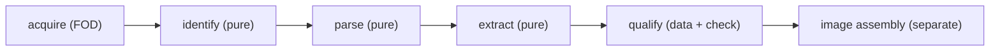

# spatial-os architecture: the donor pipeline

**Status:** draft. This is the architecture-level distillation of
[06-donor-pipeline](../research/06-donor-pipeline.md), which contains the full prior-art walkthrough,
the format zoo, and the metadata-preservation analysis. Read that document for the evidence; this one
states the design spatial-os implements.

## Principle

> Construct the OS from declared components, importing selected hardware dependencies from the donor.
> Do not treat a mutable unpacked stock ROM as the canonical build tree.

A **donor** is a complete official vendor firmware artifact, pinned by hash. An **artifact** is a
named output extracted from a donor (partition blob, kernel `Image`, DTB, firmware file, vendor
library). A **contract** is reviewed, human-authored data recording verified facts about a donor
that authorize its use in flashable outputs. The pipeline never modifies a stock ROM in place and
never writes to a block device.

## Five stages, each a separate derivation



Stage boundaries are chosen so everything after `acquire` is pure and offline, and everything before
`qualify` is mechanical (no human judgment embedded in code). Each stage is its own derivation for
granular caching and independent review — the opposite of robotnix's extraction-inside-the-build
monolith ([06](../research/06-donor-pipeline.md) §2.3).

### acquire
Fetches the verbatim vendor artifact as a single content-addressed store path.
- `fetchurl` for stable public URLs (Lynx portal, Steam Frame `holo-images.steamos.cloud`,
  Google-style factory zips).
- `requireFile` with an instructive `message` for authenticated / click-through / device-dumped /
  community-mirror sources (Samsung FUS output, Meta historical archives, PFDM captures) — the brick
  appliance pattern.
- On-device extraction (an explicit path option + pure escape hatch, nixos-apple-silicon style) for
  per-unit firmware that cannot be redistributed.
- For casync-backed donors (Steam Frame), acquire the `.raucb` bundle and, separately, a
  `desync cache` snapshot of the required chunks hashed as a NAR-FOD; the remote store is not
  trusted after the snapshot exists.
- Record the publisher's stated hash separately from our computed hash so provenance survives
  recompression.

### identify
Produces `identity.json`: container type by **magic bytes, never extension**; device codename;
build ID; a `{path,size,sha256}` table of top-level members; and the vendor's own metadata verbatim
(Steam Frame `manifest.json`, Android `ro.build.fingerprint`, `avbtool info_image`). **Asserts** the
detected identity against the manifest's declared `device` and `buildId` and **fails closed** on
mismatch or unknown format. This is the guard against "right hash, wrong expectations."

### parse
Produces a normalized partition set (verbatim blobs named canonically: `boot_a.img`, `vendor.img`,
`vbmeta.img`, `rootfs.img`, …) plus `parse-report.json` (source member, tool + version, size, sha256,
detected format, AVB summary). Per-container recipes, each a small derivation:
- factory zip → `unzip` + `simg2img`
- OTA zip → `payload-dumper-go` (full payloads only; **incremental payloads rejected** at identify)
- `super.img` → `simg2img` → `lpdump --json` → `lpunpack`
- `boot`/`vendor_boot`/`init_boot` → `unpack_bootimg` (records mkbootimg args for byte-exact repack)
- `dtbo.img` → `mkdtboimg dump`; `vbmeta.img` → `avbtool info_image`
- `.raucb` → `unsquashfs` (+ `rauc info --keyring` when pinned) → `desync extract` → `verify-index`
- Samsung `.tar.md5` → `tar` + `lz4 -d`
- whole-disk GPT → a spatial-os port of the brick appliance's CRC-verified GPT inspector, adopted
  nearly verbatim ([06](../research/06-donor-pipeline.md) §5.3)

All tooling is in nixpkgs (`android-tools`, `payload-dumper-go`, `erofs-utils`, `squashfs-tools`,
`rauc`, `desync`); the only gaps are `magiskboot` (optional), `deapexer` (replaceable), and
`bkerler/edl` (rescue-only). `erofs-utils` needs `selinuxSupport = true` to read SELinux xattrs.

### extract
Produces named artifact sets (`kernel/`, `firmware/`, `blobs/<domain>/`), each with a per-file
`metadata.json` recording original uid/gid/mode/caps/SELinux-label/sha256 and normalized store-safe
permissions. Filesystem reads are **unprivileged**: `debugfs -R "rdump"` for ext4,
`fsck.erofs --extract` for EROFS. No loop mounts, no root, no FUSE. Extraction rules are
**allowlists** (path prefixes + exact files), never "everything except"; setuid/setgid always
dropped; symlink targets validated; size/count ceilings; a rule matching nothing is a build error.

### qualify
Takes artifact sets + a human-authored, reviewed **donor contract** (hash-bound to the exact
donor). Produces the *qualified donor* attrset image assembly accepts, plus a check derivation that
re-validates the contract on every build. The contract records: schema version, device,
`donorSha256`, the reviewed boot-chain facts this donor is trusted for, which artifact sets are
approved for which uses, and mandatory `reviewNotes` (≥40 chars — converts review theater into
recorded evidence). **Gating is null-propagation** (brick pattern): flashable image outputs are
absent until the contract exists and validates; interim outputs (artifact sets, reports) build
without it so research is never blocked.

## The metadata-preservation problem

The Nix store (NAR serialization) preserves only contents, the executable bit, symlinks, and
directory structure — it drops ownership, non-exec mode bits, setuid, xattrs (hence POSIX
capabilities and SELinux labels), and timestamps. Android filesystems depend on exactly this
metadata to boot.

**spatial-os is not rebuilding Android**, so the resolution is a **blob-default hybrid**
([06](../research/06-donor-pipeline.md) §4.4):
1. **Default: verbatim partition blobs.** Everything metadata-sensitive stays a single image file;
   the store's normalization is harmless because metadata lives inside the blob's bytes. Pass-through
   partitions (modem, dsp, persist, vbmeta) *only* ever exist as blobs.
2. **File-level extraction emits a normalized tree + `metadata.json`.** The manifest is
   audit-supporting, not load-bearing for boot (destination assigns its own ownership/labels).
3. **Full Android-filesystem re-assembly is out of scope** unless a future flow must write a modified
   vendor partition back to a stock slot; then use `mke2fs.android`/`e2fsdroid` with the manifest as
   its own gated stage.

## Donor manifest schema

One Nix attrset per donor (the analogue of brick `profile.nix` + robotnix `vendor_imgs/<device>.json`
unified). The full worked example is in [06](../research/06-donor-pipeline.md) §5.6; the shape:

```nix
{
  device = "lynx-r1"; vendor = "lynx"; buildId = "1.4.1"; class = "android-factory";
  artifacts = {
    firmware-zip = {
      name = "…"; hash = "sha256-…"; publisherSha256 = "…";
      source = { kind = "fetchurl"; urls = [ "https://portal.lynx-r.com/…" ]; };
    };
  };
  expect = { fingerprintContains = "lynx/…"; abScheme = true; dynamicPartitions = true; };
  container = { outer = "zip"; partitions = [ "boot" "dtbo" "vbmeta" "super" "modem" "persist" ];
                keepVerbatim = [ "modem" "persist" "vbmeta" ]; };
  extract = { kernel = { from = "boot"; items = [ "kernel" "ramdisk" "mkbootimg-args" ]; };
              firmware = { from = "vendor"; allowPrefixes = [ "lib/firmware/" ]; maxTotalBytes = 1073741824; }; };
  licensing = { fetchIsPublic = true; redistributable = false; gplComponents = [ "kernel" ]; };
  contract = null;   # ./contracts/lynx-r1-1.4.1.json once reviewed
}
```

Evaluating this attrset produces the acquire→identify→parse→extract derivation graph mechanically;
only `contract` requires human action.

## Reproducibility and safety rules

- **Never re-compress in the pipeline** (decompression is deterministic, re-compression is not). Store
  artifacts uncompressed/verbatim. Where spatial-os builds its own compressed rootfs, use
  `-processors 1` and fixed timestamps/UUIDs/hash-seeds.
- **`licensing.redistributable = false` mechanically forces `preferLocalBuild = true;
  allowSubstitutes = false`** and exclusion from cache-push — donor bytes must not leak to a public
  cache.
- **Full images only; incremental OTAs rejected** (they reference source-partition state).
- **Golden-hash tests per donor** turn a silent tool-behavior change across a nixpkgs bump into a
  loud diff.
- **Per-unit calibration/identity** (`persist`, `calib`, NV, `unlock_token`, `devinfo`) is
  `keepVerbatim`, protected, and never copied between units.

## Open questions carried forward

From [06](../research/06-donor-pipeline.md) §8, each with its decider: Quest/Meta acquisition
posture — private archival store? (decider: a policy call at the first Quest-family target,
with legal review); chunk-store snapshot hashing strategy (decider: the first casync/desync
delta implementation, Frame workstream); AVB re-signing scope per device (decider: the Lynx
spike — the first AVB device through the pipeline); whether SELinux/capability metadata ever
becomes boot-critical (condition-shaped: only if a containerized-Android layer is adopted,
ADR 0003); GPL corresponding-source verification (decider: the pre-release legal review,
M-18-class); and what controls the Steam Frame boot/firmware partitions — the RAUC bundle
updates only `rootfs` (owner: the Frame workstream's hardware bring-up).
