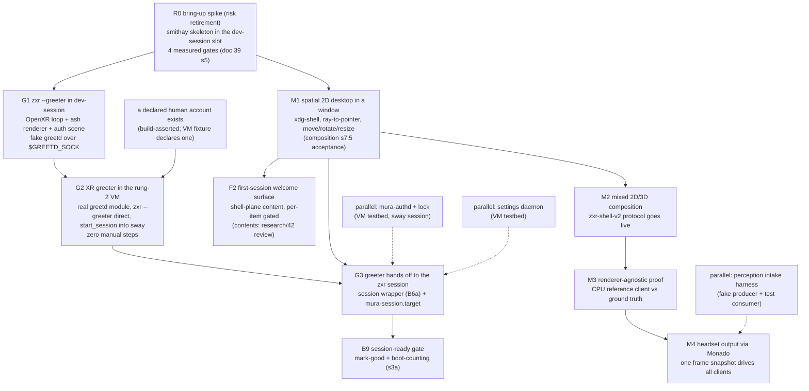

# The implementation path: from boot forward to the XR greeter, then the session

**Status:** accepted plan of record (2026-09-23; rev 2 same day — the boot-to-desktop coverage
review absorbed: stages B1a/B1b/B6a/B9, the F-track from
[first-run-onboarding.md](first-run-onboarding.md), and the lifecycle section; **rev 3,
2026-09-24** — ADR 0017 rev 2 absorbed: no `--oobe` mode, no dispatcher, F2 = welcome surface
after M1, F3 out-of-band access added, G2 keyed on a declared account; **rev 3.1 same day** —
the research/42 review absorbed: F2 contents ruled, F3 = Cockpit + portal, F4 input floor row,
G1/G2 exit criteria at the input floor, one credential in B5).
**What this is:** the ordered build path from power-on to a zxr session, derived from the
dependency graph ([desktop-environment.md §6](desktop-environment.md)) — not a replacement for
it. Rungs are ordered only where a hard dependency exists; everything else is a parallel track.
**Base:** Rust + smithay, ratified ([ADR 0006 as amended](adr/0006-compositor-strategy.md);
evidence [research/39](../research/39-compositor-base-landscape.md)).
**Budget impact** (overview invariant 9): none at design time; every rung below inherits the
[budgets.md](budgets.md) partitions when it lands code, and R0's exit evidence includes the
first real frame-path measurements (GPU time, missed `xrWaitFrame` deadlines) that seed the
class-V (VM) budget column with data instead of estimates.

## 1. Why the restricted modes are the first shippable target

The strategic observation this path is built around: **zxr's restricted modes are the cheapest
real compositor milestone**, because ADR 0007 *disables* the client Wayland listening socket in
them ([specs/session-auth.md §5](../../specs/session-auth.md)). A restricted mode needs the
OpenXR loop, the Vulkan renderer, an internal (non-client) scene, input, and a greetd IPC
client — and none of the 2D client tier, no protocol server, no window model, no Xwayland. Every
one of those pieces is also the irreducible core of the session compositor, so nothing built for
them is throwaway. The restricted modes are exactly two — `--greeter` and the lock scene it
shares machinery with — and the first build target is:

- **`zxr --greeter`** — the every-boot login scene (multi-user profile), an ordinary Linux
  greeter ([multi-user.md §2](multi-user.md)). The first *build* target (G1): it has the fewest
  dependencies (a fake greetd suffices; no provisiond, no network step). There is **no
  `--oobe` sibling**: first-run setup is shell-plane session content (F2, the welcome surface —
  [first-run-onboarding.md §4](first-run-onboarding.md)), which lands downstream of M1 like any
  other shell content and is gated on the research/42 findings review for its contents.

Meanwhile the harnesses already exist: rung 1 (`nix run .#dev-session`) runs a nested session
against simulated-HMD Monado on the desktop, and rung 2 (`nix run .#virtual-headset-vm`) boots a
full NixOS VM with virgl and an in-guest Monado socket ([README §Development](../../README.md)).
The dev-session package was built with exactly this swap in mind: "The nested compositor is sway
until zxr's M1 lands; swap COMPOSITOR_CMD then"
([pkgs/dev-session](../../pkgs/dev-session/default.nix)).

**The first-profile question, settled** (this paragraph reconciles G2 with
first-run-onboarding §1): the **default image is the first *shipped* image** — a declared
configuration with user `mura`, no password, `autoLogin = "mura"`, no greeter at all; the image
is the installation (ADR 0017 rev 2). **G2 remains the first *greeter* milestone**, not the
first image: it deliberately exercises the multi-user path (real greetd → `zxr --greeter` →
session) in the VM with a declared account in the fixture, because that is the path with the
hard ordering problems (device release, PAM authority, seat handoff) worth proving early. The two
claims are about different axes — what ships first (the default image) vs what the G-track
verifies first (the greeter chain) — and both stand.

The end state of the greeter track — **G2** — is still the first thing that *feels* like
Mura: the VM powers on and lands in an XR auth scene with zero manual steps, and login
hands off to a real session. Everything after that is widening the session, not proving the
system.

## 2. The boot chain, stage by stage

Each stage lists what exists today and what must be built. "VM" = the rung-2 virtual headset;
stages marked ▲ are forced decisions this path surfaces.

| # | Stage | Exists today | To build |
|---|---|---|---|
| B1 | Firmware → bootloader → initrd | per-family (uefi-rauc proven in the Frame workstream; android-bootimg gated on the Lynx spike) | nothing for this path — the VM boots systemd-boot already |
| B1a | Persistent state + hardware readiness | uefi-rauc mounts `syspersist` rw with `/var/lib/mura` bound via `mura-persist-setup.service` (pull-in dependency, not tmpfiles ordering) and the state-class skeleton (factory/identity/enrollment/state; machine-id its own class — [first-run-onboarding.md §2](first-run-onboarding.md)) | validation of the mounts + **factory** calibration presence/version *before* Monado starts (user calibration is F2's, not this stage's); firmware/module/udev discovery with a device-wait timeout policy; machine-id committed from `/persist` **before D-Bus/logind start**. Device access is **logind/libseat ACL acquisition, never permanent group membership** — the seat broker grants/revokes DRM+evdev per session; only nodes logind cannot broker (hidraw/IMU/camera) get narrowly scoped per-VID/PID udev rules (`TAG+="uaccess"` or a `mura-xr` group documented as seat-revocation-exempt, with rationale). An explicit stage, not "NixOS default" |
| B1b | XR preflight + recovery ladder | registry names the XR-init preflight probe (**partial**; pattern from KWin VR's `kwinvr-xrtest`, [ADR 0013 §2](adr/0013-kwin-vr-disposition.md); composition §7.3 makes it normative) | the probe as a gate before greeter/session start: runtime-created Vulkan device, GPU/device match, factory-calibration validity, required DRM/IMU nodes present, Monado reaches first frame. Plus the distro obligation: a **crash-loop threshold and recovery path** — N consecutive greeter/session failures → flat-output fallback on a docked/dev connector where present, SSH/serial always reachable on the dev profile, a diagnostic target otherwise. A runtime or driver failure must never leave a permanently dark headset |
| F1 | First-boot machine provisioning | uefi-rauc state skeleton (§B1a) | silent provisioning per [first-run-onboarding.md §3](first-run-onboarding.md): per-unit keys, settings-store seeding, partition growth. Each unit gated on its **own durable per-task marker on `/persist`, not `ConditionFirstBoot`** (a fresh A/B root slot looks like first boot to the latter); idempotent units + atomic markers = interrupted-first-boot recovery. No marker gates any UI |
| F3 | Out-of-band access | pmOS pattern studied (`references/pmaports`, `references/pmbootstrap`); Cockpit's NixOS module exists | per [first-run-onboarding.md §5](first-run-onboarding.md): USB Ethernet gadget from the initramfs + DHCP + sshd on every profile; **Cockpit** as the web UI over USB/hotspot/LAN (+ a "Mura setup" Cockpit plugin page, + the static captive-portal launcher) with the **provisioning hotspot condition-shaped on "unprovisioned"** (NM AP/shared mode, `dnsmasq-shared.d` wildcard + DHCP option 114, probe redirect); passwordless-`mura` wiring = subnet-scoped `PermitEmptyPasswords` + `nullok` on sshd/sudo (§5.3). The USB gadget + sshd half has no compositor dependency at all |
| F4 | Input floor | research/42 §4 (every relevant Monado driver keeps a 3DoF path; HMD buttons are evdev keys logind does not grab); contract `mura.hardware.input.*` | per [first-run-onboarding.md §4.4](first-run-onboarding.md): `HandlePowerKey=ignore` (or a session inhibitor) so the compositor owns the power key via libinput; the constraint-7 stabiliser (deadzone/smoothing/dwell/magnetism) with schema-declared defaults; hardware-keyboard focus into the auth scene; layer-shell + `virtual-keyboard-v1` + `input-method-v2` in zxr; **a Monado 3DoF HMD driver per target** (IIO or SSC — none exists upstream) as each device's bring-up prerequisite for any in-headset greeter |
| B2 | ▲ Seat broker | ADR 0007 names logind/seatd as the DRM-master/hidraw broker and leaves "logind vs seatd on the appliance image" open | **the decision is forced at G2**: greetd's session worker needs a seat. Default: logind (NixOS default, zero work, `SetLockedHint` needs it anyway per ADR 0007, and B1a's ACL model assumes it); seatd remains an appliance-minimization option to revisit with image-size work |
| B3 | greetd + session dispatch | contract options `mura.xr.session.{autoLogin,greeter}` + profile-exclusivity assertion ([lib/contract](../../lib/contract/default.nix)); research [11](../research/11-display-managers-greeters.md); the VM currently bypasses this (getty autologin → `exec sway` in [devices/virtual-headset](../../devices/virtual-headset/default.nix)) | the NixOS module consuming the contract: `services.greetd` for both profiles — multi-user `default_session` runs `zxr --greeter` **directly** as the `greeter` user; appliance `initial_session` autologins the declared user (`mura` on the default image) into the session. **No dispatcher, no runtime-state session selection**: nothing pre-login depends on provisioning state (ADR 0017 rev 2). The build asserts a greeter image declares a human account ([lib/contract](../../lib/contract/default.nix)). Replaces the VM's getty hack at G2 |
| F2 | First-session welcome surface | design in [first-run-onboarding.md §4](first-run-onboarding.md); ADR 0017 rev 2.1 | shell-plane session content (downstream of M1's window model, like all shell presentation): per-item gated, skippable, re-runnable; **contents ruled — see → walk → speak** (IPD language-free per `ipd.source` class → peripherals → locale → time zone → Wi-Fi/skip → one password/skip → "how to reach this device"); every item operable at the §4.4 input floor. Privileged writes via the Mura own-password polkit rule, NetworkManager, `localed`/`timedated`, the BlueZ agent; **`mura-provisiond`** is left with the guest token gate only |
| B4 | `zxr --greeter` | the mode's restrictions and exit contract are normative ([session-auth §5](../../specs/session-auth.md)); per-unit calibration paths in the contract; safe default IPD pre-auth | the binary itself: G1's deliverable (§3), running on R0's core |
| B5 | Login authority | greetd's session worker is the **sole** login PAM authority; the greeter is an unprivileged greetd IPC client (session-auth §1, review-hardened) | the greeter's greetd client half (`create_session` → `post_auth_message_response` → `start_session`), rendering `auth_message`s in the auth scene. PAM stacks declared via NixOS modules: **standard account-password login everywhere — one credential** (no PIN module; a digits-only password selects the digit-pad rendering via the non-secret `numeric-credential` hint, ADR 0018 rev 3.1, multi-user.md §3) plus the guest-scoped gated branch where guest is enabled (multi-user.md §4); `allowNullPassword` on greetd (NixOS default) and the §5.3 subnet-scoped empty-password wiring for sshd/sudo while `mura` has no password |
| B6 | Session start | `mura.xr.shell` contract enum (zxr/stardust/wayvr/kwin-vr/none) | `mura-session.target` (systemd user target owning Monado + compositor + shell services; crash/restart semantics per ADR 0007), enumerating sessions from the module system |
| B6a | User-session bootstrap contract | session-auth §5 fixes greetd's exit-then-start ordering | the **session wrapper** greetd execs (a target is not an executable): `pam_systemd` establishes the login session + `$XDG_RUNTIME_DIR`; environment in three classes — *static* (`XR_RUNTIME_JSON`, locale) via `environment.d`/unit config; *compositor-created* (`WAYLAND_DISPLAY`) published **after** sd-notify readiness via `systemctl --user set-environment` + `dbus-update-activation-environment`; *dependent* services ordered after readiness, layered on standard `graphical-session-pre.target`/`graphical-session.target` with `mura-session.target` on top (upstream portals/PipeWire integrate unmodified). Manager-correct lifetimes: a user unit cannot `BindsTo=` the system manager's session scope — the wrapper owns coupling (stops the user target on exit) and **the wrapper is what keeps the greetd session alive**, returning only after full teardown so the next greeter never races device release. Monado socket-activation ordering and greeter-Monado→session-Monado handoff explicit. Normative `specs/session-bootstrap.md` gated on G2 implementation experience |
| B7 | The session | rung-1/rung-2 loops run sway as the stand-in session | zxr session mode: M1 onward (§3) |
| B8 | Lock | lock state machine + invariants specified (ADR 0007, session-auth §2–§3); `ext-session-lock-v1` dev-profile-only | `mura-authd` + the in-compositor lock states — a parallel track (§4), testable against sway+VM before zxr exists |
| B9 | Session-ready gate + update mark-good | `mura.qualification.readinessCheck` contract option + tier assertion exist ([lib/contract](../../lib/contract/default.nix)); the mark-good service is the recorded "still ahead" item ([images-and-updates §RAUC](images-and-updates.md)) | see §3a below: readiness tiers, the mark-good service, and systemd-boot boot-counting wired explicitly in the uefi-rauc family |

## 3. The rung ladder

### R0 — the bring-up spike (risk retirement, not a decision gate)

The smithay skeleton dropped into the dev-session slot, measured against the four gates of
[doc 39 §5](../research/39-compositor-base-landscape.md): real projection-layer presentation on
a runtime-created Vulkan device; zero-CPU-copy dmabuf import with explicit sync end-to-end;
window behavior under churn (resize/popups/kill-mid-frame, no unresolved GPU waits — previewing
M4's stopping rule); Xwayland early (smithay `X11Wm` vs xwayland-satellite is an R0 *output*).
Entry: nothing — the harness exists. Exit: a written result per gate + the instrumentation
numbers. Registry rows it moves: none directly (it's evidence, not a component), but every
authority-plane "specified" row becomes buildable on its skeleton.

### G1 — the greeter scene in dev-session

`zxr --greeter` as a window: R0's OpenXR loop + renderer, the internal auth scene (generic
prompt rendering per session-auth §2.3's style set — the digit pad keys off `style=secret` plus
the user's `numeric-credential` hint, never prompt text), a fake greetd speaking the JSON IPC
over `$GREETD_SOCK`, session list from a static config, the standard furniture of
multi-user.md §2 (power menu, clock, session chooser, accessibility). **No Wayland listening
socket** — assert it in the harness (`ss`/`lsof`, the session-auth §6.6 conformance check,
minus PAM which greetd owns). Exit: prompt → response → `start_session` acknowledged → clean
teardown, on the simulated HMD, with `--rotate` proving the scene is really mura — **and the
whole exit path driven at the input floor**: simulated head-aim plus one key event standing in
for `hmdButtons.<selectRole>`, then once more with the key masked (dwell only); a hardware
keyboard typing into the auth scene (first-run-onboarding §4.4, §8 checks 10–11).

### G2 — the XR greeter in the VM (the first shippable artifact)

The greetd NixOS module (B3) replaces the getty hack in `devices/virtual-headset`; multi-user
profile with `mura.xr.session.greeter = "zxr-greeter"`; the real greetd runs **`zxr --greeter`
directly** as the `greeter` user; login lands in **sway** as the stand-in session (B6's target
can start any `mura.xr.shell`). Forced decision B2 (logind default) lands here, as does B1a's
ACL model. **Multi-user G2 requires a declared human account** — the VM fixture declares one
with a `hashedPasswordFile` (the build assertion would refuse the image otherwise); the default
image (autologin `mura`) needs no greeter at all. Exit: VM cold boot → XR auth scene with zero
manual steps → correct PAM conversation (real PAM, greetd worker) → sway session;
re-lock/logout returns to the greeter; the greeter with zero pickable accounts still renders
free-text entry + power menu; the power menu powers the VM off with no authentication (login1
`allow_active` on the greeter session, research/11 §11.A); a Wi-Fi profile added at the greeter
is a system connection (the Mura greeter polkit rule, multi-user.md §2); a passwordless declared
account logs in with no prompt and a digits-only one gets the digit pad; the greeter process
never loads PAM symbols (session-auth §6.6).

### M1 — the spatial 2D desktop (composition §7.5)

The 2D tier on R0's skeleton, in the windowed dev backend: xdg-shell + baseline globals
(registry protocol-server row), ray→window-local `wl_pointer`, move/rotate/resize planes,
copy/paste, popups/menus — with composition §7.3's constraints 1–9 baked in from the start (no
window↔output binding, pluggable hover/focus, placement volumes, arbitration state machine,
settings from the schema artifact). Acceptance is the composition table's: "terminal + editor:
type, select, copy/paste, open menus, move/rotate/resize planes". When M1 lands, dev-session's
`COMPOSITOR_CMD` swaps sway for zxr and rung 1 becomes zxr's own loop.

### G3 — the full handoff

greetd `start_session` execs the **B6a session wrapper**, which brings up
`mura-session.target` (B6: Monado + zxr-session + shell services) under the environment and
lifetime contract of B6a; ADR 0007's crash/restart and boot-locked-restart rules apply. Needs M1
(a session someone can use) + G2 (the greeter) + the authd track (§4) for lock. Exit: VM boots →
XR greeter → login → **zxr session** → doff-grace/lock/unlock cycle works end to end → logout
tears down through the wrapper and returns to the greeter without racing device release.

### §3a — B9: session-ready tiers, mark-good, and boot-counting

"Session ready" has **two tiers**, and only the first ever gates an update:

- **G3-minimum (the blessing tier):** Monado composited frames for a *stability interval*
  (N seconds / M consecutive frames with no compositor or Monado restart — a first frame alone
  can immediately precede a crash loop); systemd watchdog health (`WatchdogSec` on both
  processes); writable `/persist/mura` verified; per-unit settings-store migration completed;
  input path confirmed (a synthetic event round-trips); crash-loop counter (B1b) at zero.
  **Blessing is profile-specific**: appliance = a stable *locked owner session*; multi-user = a
  stable *greeter* — mark-good never waits for a human to log in, so `/home` and per-user
  migration state can never gate it.
- **Desktop-usable (post-login qualification, never blocks blessing):** PipeWire + audio policy,
  virtual keyboard/input method, settings daemon, polkit agent, portals, launcher +
  notifications — each a registry row, several honestly **missing** today (the registry's gap
  list is the work queue; without a polkit agent privileged operations silently fail, and
  without a general virtual keyboard the headset cannot satisfy M1's "type in terminal/editor"
  outside the desktop-window harness).

The **mark-good service** runs `mura.qualification.readinessCheck` against the blessing tier.
The attempt/fallback mechanics are systemd-native and must be **explicitly wired in the
uefi-rauc family** (it sets `boot.loader.systemd-boot.enable = false` — manual ESP install —
so NixOS wires none of this automatically): RAUC `set-primary` arms the target slot's boot entry
with a `+N`-tries BLS suffix; systemd-boot decrements tries across attempts and falls back to
the previous slot's entry when exhausted; the readiness unit is a prerequisite of
`boot-complete.target`; `systemd-bless-boot` performs the entry rename (the systemd-boot
blessing); RAUC slot-status marking via the custom bootconf backend is the third, separate step.
Three distinct transitions — readiness, boot blessing, RAUC state — each observable on its own.

**Implementation status (explicit):** none of this §3a machinery exists yet. The family's
bootconf backend today selects plain `a.conf`/`b.conf` and stores slot state in a flat file
([families/uefi-rauc](../../families/uefi-rauc/default.nix)); it does not arm `+N`-tries
entries, and nothing connects readiness, `systemd-bless-boot`, and RAUC state. Boot-attempt
counting and automatic fallback are **operational follow-up scope** for the session-bootstrap
and update implementation plan — specified here, unimplemented by design of the current
(docs + contract) phase.

### M2–M4 — widening the session (composition §7.5, unchanged)

M2: the `zxr-shell-v2` protocol server goes live (generated from the rev-2 XML via the
`checks.protocols`-validated scanner path) — a GL ray-march client and a Vulkan raster client
intersect and pass in front of/behind M1 windows, no CPU readback. M3: the CPU reference client
against a single-process ground truth (catches matrix/depth-origin/clip bugs). M4: headset
output via Monado — head motion drives all clients from one frame snapshot; stopping a client
never creates an unresolved GPU wait; a rootless Xwayland app participates. M4 runs entirely in
rung 1 (simulated HMD); real-HMD output stays behind the display-path feasibility gate
(desktop-environment §6.6).

## 3b. Lifecycle: resume, doff, logout, user switch

Resume is a boot sub-path, not an event: after suspend, the session re-enters through a reduced
B1a/B1b — GPU/DRM/USB re-initialization, Monado restart-or-restore, tracking and calibration
revalidation — and **the lock is asserted before any restored client frame is exposed**
(ADR 0007 I1–I3; the L2 trace ordering from session-auth §3.1 applies to the resume edge
exactly as to the suspend edge). Device loss mid-session (HMD unplug on dev hardware, tracking
loss) routes through the same revalidation. The doff ladder and the docked-mode branch are
ADR 0015's (doff-grace suppression while docked-in-use); logout tears down through the B6a
wrapper (user target stopped, wrapper returns, greetd restarts `zxr --greeter`);
user switching on the multi-user profile is logout + login (no concurrent graphical sessions —
one HMD, one seat), recorded as the deliberate v1 simplification.

## 4. Parallel tracks (no compositor dependency)

Per desktop-environment §6.4, the session cluster is HMD-independent; three specs have
conformance checklists that are ready-made test plans:

- **`mura-authd` + the lock path** ([specs/session-auth.md](../../specs/session-auth.md)):
  the per-conversation PAM helper with nonce revocation and batched conversations. Testbed: the
  VM with sway standing in for the session — every §6 conformance item except the
  composition-introspection half of L2 is compositor-free. Feeds G3.
- **The settings daemon** ([specs/settings-schema.md](../../specs/settings-schema.md)): the
  contract is fully specified; the remaining gap is the daemon's own process design (spec §10).
  VM-testable standalone; M1's constraint-9 compliance (no compiled-in defaults) consumes it.
- **The perception intake harness** ([specs/perception-intake.md §8](../../specs/perception-intake.md)):
  fake producer + test consumer exercising registration, generations, overrun, epoch teardown,
  and the structural never-block check — validates the protocol before either real end exists.
  Feeds the M4-adjacent perception work without gating it.

Each track also exercises its NixOS module wiring (greetd module, authd PAM service stanza,
settings schema artifact emission) in the VM — the module system grows with the daemons, not in
a big-bang at the end.

## 5. The deferral register (the only place scheduling language lives)

**Standing rule** (docs README): design docs and ADRs *specify* — they state designs,
condition-shaped rules ("X exists only when Y does"), non-goals with reserved hooks, or open
questions that name their decider. Statements about *when* or *in what order* live here and
nowhere else. Anything phrased as "deferred" elsewhere is a defect to sweep into this section.

### 5.1 Deferred by this path

- **Shell-plane presentation** — launcher, panels, pager/overview, OSD, notifications UI: all
  downstream of M1's window model and the places implementation; registry status honest
  (missing), by design.
- **Places implementation** beyond what M1's window model needs; the model is specified
  (ADR 0016) and its protocol drafted (`zxr-workspace-v1`), but residency/currency machinery
  waits for a session that has windows worth organizing.
- **Delegation consumer** (`zspatial-toplevel-export-v1`): staged behind M1 per ADR 0014 M-A.
- **kwin-vr packaging** (ADR 0013's reserved optional session): unscheduled; the
  `mura.xr.shell = kwin-vr` contract enum change lands with the packaging work.
- **Multi-account + guest activation on the ladder**: designed in
  [multi-user.md](multi-user.md) / ADR 0018; implementation joins after G2 (the picker extends
  the greeter scene; per-account enrollment extends provisiond).
- **F2 (welcome surface)** lands after M1 as shell content; its contents are decided
  (first-run-onboarding §4.2), so nothing else gates it. **F3**: the USB gadget + sshd half has
  no compositor dependency and can land with B1a; the Cockpit half and the "Mura setup" plugin
  page follow once the NixOS module is wired, independent of the G-track. **F4 (input floor)**:
  the constraint-7 stabiliser and button handling land with G1 (they are G1's exit criteria);
  the **per-target Monado 3DoF HMD driver** precedes any *in-headset* greeter on that target
  and belongs to each device's bring-up ladder — the rung-1/rung-2 harnesses (simulated HMD)
  need none of it.
- **All hardware-gated work**: the Lynx spike rule stands (design-backlog standing rule);
  the Steam Frame donor workstream continues in parallel on its own ladder; nothing in this
  path requires hardware before M4's exit.
- **Docked mode, sharing bridges, avatar, mapping**: each behind its own recorded gate
  (ADR 0015; spatial-sharing; S-1/R-1; M0), joined to this path only after G3.

### 5.2 Satellite registers (gate detail lives there; order authority lives here)

The four review-disposition backlogs record *what* each gate must prove; this section owns the
claim that the gated work waits:

- [design-backlog.md](design-backlog.md) — the **Lynx R1 spike** gate (Android-family donor/
  update/backend machinery) + pre-release design items.
- [perception-design-backlog.md](perception-design-backlog.md) — the **P-1 BSP kill-test** gate
  (camera/timestamp/GPU-path reality) + pre-prototype specification items (its #5/#8 are now
  specs) + pre-release qualification.
- [mapping-design-backlog.md](mapping-design-backlog.md) — the **M0 foundations spike** gate
  (keyframe packet, online mapper, reset epochs) + design-before-milestone items.
- [avatar-design-backlog.md](avatar-design-backlog.md) — the **S-1 sensing / R-1 render**
  kill-gates + pre-implementation items.

## 6. Standing references

The dependency graph that orders this: [desktop-environment.md §6](desktop-environment.md).
Milestone acceptance: [zxr-shell-v2-composition.md §7.5](zxr-shell-v2-composition.md).
R0 gates and base evidence: [research/39 §5](../research/39-compositor-base-landscape.md).
Session/greeter/lock contracts: [ADR 0007](adr/0007-session-greeter-lock.md) +
[specs/session-auth.md](../../specs/session-auth.md).
First-run/onboarding (the F-track): [first-run-onboarding.md](first-run-onboarding.md) +
[ADR 0017](adr/0017-first-run-provisioning.md).
Update health gating: [images-and-updates.md §Health-gated success](images-and-updates.md).
The dev loops this path runs on: [README §Development](../../README.md).
