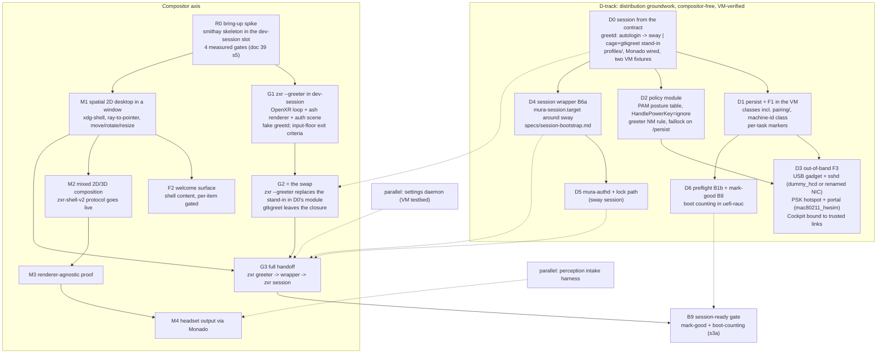

# The implementation path: distribution groundwork and the compositor, in dependency order

**Status:** accepted plan of record (2026-09-23; rev 2 same day — the boot-to-desktop coverage
review absorbed: stages B1a/B1b/B6a/B9, the F-track from
[first-run-onboarding.md](first-run-onboarding.md), and the lifecycle section; rev 3 / 3.1,
2026-09-24 — ADR 0017 rev 2 and the research/42 review absorbed; **rev 4, 2026-09-24 — two
axes**: the compositor rungs (R0/G/M) are joined by a **D-track** of NixOS distribution
groundwork with no compositor dependency, verified in the rung-2 VM with stand-ins; §2 regrouped
by dependency class; G2 reduced to a recorded swap; the pre-groundwork specifications named in
§5.1).
**What this is:** the ordered build path from power-on to a zxr session, derived from the
dependency graph ([desktop-environment.md §6](desktop-environment.md)) — not a replacement for
it. Rungs are ordered only where a hard dependency exists; everything else is a parallel track.
**Base:** Rust + smithay, ratified ([ADR 0006 as amended](adr/0006-compositor-strategy.md);
evidence [research/39](../research/39-compositor-base-landscape.md)).
**Budget impact** (overview invariant 9): none at design time; every rung below inherits the
[budgets.md](budgets.md) partitions when it lands code, and R0's exit evidence includes the
first real frame-path measurements (GPU time, missed `xrWaitFrame` deadlines) that seed the
class-V (VM) budget column with data instead of estimates.

## 1. Two axes, and why the restricted modes are still the first compositor target

**What exists in code today** (rev 4, honest): the device contract and its tests
([lib/contract](../../lib/contract/default.nix), [tests/contract.nix](../../tests/contract.nix)),
a 37-line [modules/os](../../modules/os/default.nix), a 34-line [modules/xr](../../modules/xr/default.nix)
(the pinned nixpkgs provides `services.monado`, `services.greetd`, `services.cage`), the
uefi-rauc family with the persist skeleton, two device files, the protocol XMLs and specs, and
[pkgs/dev-session](../../pkgs/dev-session/default.nix) running sway. The design corpus
specifies far more than that. Almost all of the near-term difference is **NixOS module work
with no compositor dependency** — greetd and autologin from the contract, PAM/polkit posture,
persist classes and F1 units, out-of-band access, the session wrapper, mark-good — every piece
testable in the rung-2 VM with **sway as the stand-in session and gtkgreet+cage as the stand-in
greeter**. That is the **D-track** (§3c). It runs in parallel with the compositor axis and is
what makes the greeter milestone small when the compositor arrives.

**The compositor axis is unchanged in its rationale**: zxr's restricted modes are the cheapest
real compositor milestone, because ADR 0007 *disables* the client Wayland listening socket in
them ([specs/session-auth.md §5](../../specs/session-auth.md)). A restricted mode needs the
OpenXR loop, the Vulkan renderer, an internal (non-client) scene, input, and a greetd IPC
client — none of the 2D client tier, no protocol server, no window model, no Xwayland — and
every one of those pieces is the irreducible core of the session compositor. The restricted
modes are exactly two — `--greeter` and the lock scene it shares machinery with. The first
compositor build target is:

- **`zxr --greeter`** — the every-boot login scene (multi-user profile), an ordinary Linux
  greeter ([multi-user.md §2](multi-user.md)), operable at the input floor
  ([first-run-onboarding.md §4.4](first-run-onboarding.md)). G1 in §3. There is **no `--oobe`
  sibling**: first-run setup is shell-plane session content (F2, the welcome surface —
  [first-run-onboarding.md §4](first-run-onboarding.md), contents decided), which lands
  downstream of M1 like any other shell content.

**The stand-in rule (stated once, applies everywhere):** sway is the stand-in *session*;
`cage` + `gtkgreet` is the stand-in *greeter*. Both are development fixtures carrying the same
footnote `pkgs/dev-session` already carries ("the nested compositor is sway until zxr's M1
lands; swap `COMPOSITOR_CMD` then"). They are never decisions and **never in a shipped image**;
the swap-out points are G2 (greeter) and M1 (session), each recorded as an exit criterion.

**The first-profile question, settled:** the **default image is the first *shipped* image** —
a declared configuration (`profiles/default.nix`: user `mura`, no password, `wheel`,
`autoLogin = "mura"`), no greeter at all; the image is the installation (ADR 0017 rev 2). **G2
remains the first *greeter* milestone**, not the first image: the multi-user chain (greetd →
greeter → PAM → session wrapper → session) holds the hard ordering problems — seat handoff,
PAM authority, device release — and rev 4 proves them **on the D-track with the stand-in
greeter (D0/D4)** so that G2 becomes the swap of one line. The end state that first *feels* like
Mura is unchanged: the VM powers on, lands in an XR auth scene with zero manual steps, and login
hands off to a real session.

## 2. The boot chain, grouped by dependency class

Each stage lists what exists today and what must be built. "VM" = the rung-2 virtual headset;
stages marked ▲ are forced decisions this path surfaces. Classes: **(i) boot and persistent
state**, **(ii) the login chain**, **(iii) out-of-band access and policy**, **(iv) compositor
deliverables**, **(v) health**. Classes (i)–(iii) and (v) are D-track (compositor-free);
class (iv) is the compositor axis.

### (i) Boot and persistent state

| # | Stage | Exists today | To build |
|---|---|---|---|
| B1 | Firmware → bootloader → initrd | per-family (uefi-rauc proven in the Frame workstream; android-bootimg gated on the Lynx spike) | nothing for this path — the VM boots systemd-boot already |
| B1a | Persistent state + hardware readiness | uefi-rauc mounts `syspersist` rw with `/var/lib/mura` bound via `mura-persist-setup.service` (pull-in dependency, not tmpfiles ordering) and the state-class skeleton (`factory/ identity/ enrollment/ pairing/ state/`; machine-id its own class — [first-run-onboarding.md §2](first-run-onboarding.md)) | the VM device gains the same persist layout; validation of the mounts + **factory** calibration presence/version *before* Monado starts; firmware/module/udev discovery with a device-wait timeout policy; machine-id committed from `/persist` **before D-Bus/logind start**; `/var/lib/bluetooth` bound onto `pairing/` when `mura.hardware.input.bluetooth`. Device access is **logind/libseat ACL acquisition, never permanent group membership** — the seat broker grants/revokes DRM+evdev per session; only nodes logind cannot broker (hidraw/IMU/camera) get narrowly scoped per-VID/PID udev rules (`TAG+="uaccess"` or a `mura-xr` group documented as seat-revocation-exempt, with rationale). An explicit stage, not "NixOS default" |
| F1 | First-boot machine provisioning | uefi-rauc state skeleton (§B1a) | silent provisioning per [first-run-onboarding.md §3](first-run-onboarding.md): per-unit keys, settings-store seeding, partition growth. Each unit gated on its **own durable per-task marker on `/persist`, not `ConditionFirstBoot`** (a fresh A/B root slot looks like first boot to the latter); idempotent units + atomic markers = interrupted-first-boot recovery. No marker gates any UI |

### (ii) The login chain

| # | Stage | Exists today | To build |
|---|---|---|---|
| B2 | ▲ Seat broker | ADR 0007 names logind/seatd as the DRM-master/hidraw broker and leaves "logind vs seatd on the appliance image" open | **forced at D0**: greetd's session worker needs a seat. Default: logind (NixOS default, zero work, `SetLockedHint` needs it anyway per ADR 0007, and B1a's ACL model assumes it); seatd remains an appliance-minimization option to revisit with image-size work |
| B3 | greetd from the contract | contract options `mura.xr.session.{autoLogin,greeter,allowNoDeclaredAccount}` + profile-exclusivity and declared-account assertions ([lib/contract](../../lib/contract/default.nix)); research [11](../research/11-display-managers-greeters.md); the VM currently bypasses this (getty autologin → `exec sway` in [devices/virtual-headset](../../devices/virtual-headset/default.nix) lines 67-71, with permanent `video`/`input` membership and `password = "mura"` — **the block D0 replaces**) | `modules/os/session.nix`: `services.greetd` for both profiles — appliance `initial_session` autologins the declared user into the session; multi-user `default_session` runs the greeter **directly** as the `greeter` user (`cage -s -- gtkgreet` until G2, `zxr --greeter` after — the line carries `# STAND-IN — replaced at G2 by zxr --greeter`). **No dispatcher, no runtime-state session selection** (ADR 0017 rev 2) |
| B5 | Login authority | greetd's session worker is the **sole** login PAM authority; the greeter is an unprivileged greetd IPC client (session-auth §1, review-hardened) | PAM stacks declared via NixOS modules per the [first-run-onboarding.md §5.3](first-run-onboarding.md) posture table: **one credential**, `allowNullPassword` on greetd and the lock (a digits-only password selects the digit-pad rendering via the mirrored `numeric-credential` hint, ADR 0018 rev 3.1, multi-user.md §3), **standard sudo/polkit** (admin requires a password), faillock on `/persist`, the guest-scoped gated branch where guest is enabled (multi-user.md §4). The greeter's greetd client half (`create_session` → `post_auth_message_response` → `start_session`) is the compositor's (class iv) |
| B6 | Session start | `mura.xr.shell` contract enum (zxr/stardust/wayvr/kwin-vr/none) | `mura-session.target` (systemd user target owning Monado + compositor + shell services; crash/restart semantics per ADR 0007), enumerating sessions from the module system; sway as the stand-in member until M1 |
| B6a | User-session bootstrap contract | session-auth §5 fixes greetd's exit-then-start ordering | the **session wrapper** greetd execs (a target is not an executable): `pam_systemd` establishes the login session + `$XDG_RUNTIME_DIR`; environment in three classes — *static* (`XR_RUNTIME_JSON`, locale) via `environment.d`/unit config; *compositor-created* (`WAYLAND_DISPLAY`) published **after** sd-notify readiness via `systemctl --user set-environment` + `dbus-update-activation-environment`; *dependent* services ordered after readiness, layered on standard `graphical-session-pre.target`/`graphical-session.target` with `mura-session.target` on top (upstream portals/PipeWire integrate unmodified). Manager-correct lifetimes: a user unit cannot `BindsTo=` the system manager's session scope — the wrapper owns coupling (stops the user target on exit) and **the wrapper is what keeps the greetd session alive**, returning only after full teardown so the next greeter never races device release. Monado socket-activation ordering and greeter-Monado→session-Monado handoff explicit. Normative [specs/session-bootstrap.md](../../specs/session-bootstrap.md), drafted against sway (D4) and revised at G3 |

### (iii) Out-of-band access and policy

| # | Stage | Exists today | To build |
|---|---|---|---|
| F3 | Out-of-band access | pmOS pattern studied (`references/pmaports`, `references/pmbootstrap`); Cockpit's NixOS module exists; the posture table [first-run-onboarding.md §5.3](first-run-onboarding.md) | per [first-run-onboarding.md §5](first-run-onboarding.md): USB Ethernet gadget from the initramfs + DHCP + sshd on every profile (sshd key-only except the gadget-subnet `Match Address` block); **Cockpit** as the web UI bound to the gadget and hotspot addresses (+ a "Mura setup" plugin page — a stub until its own rung — + the static captive-portal launcher); the **provisioning hotspot** condition-shaped on "unprovisioned", WPA2 with the in-headset PSK, idle timeout with no client associated (NM AP/shared mode, `dnsmasq-shared.d` wildcard + DHCP option 114, probe redirect). The USB gadget + sshd half has no compositor dependency at all; the PSK display does (it is a compositor scene) — until G1 the PSK is also printed to the serial console/journal on the dev profile |
| F4 | Input floor (policy half) | research/42 §4 (every relevant Monado driver keeps a 3DoF path; HMD buttons are evdev keys logind does not grab); contract `mura.hardware.input.*` with the `selectRole`/`backRole` assertions | `HandlePowerKey=ignore` (or a session inhibitor) so the compositor owns the power key via libinput — the SteamOS-on-Frame arrangement (`10-logind-no-powerbutton.conf`); the constraint-7 stabiliser and the auth scene's floor operability are the compositor's (class iv); **a Monado 3DoF HMD driver per target** (IIO or SSC — none exists upstream) is each device's bring-up prerequisite for any in-headset greeter |

### (iv) Compositor deliverables

| # | Stage | Exists today | To build |
|---|---|---|---|
| B4 | `zxr --greeter` | the mode's restrictions and exit contract are normative ([session-auth §5](../../specs/session-auth.md)); per-unit calibration paths in the contract; safe default IPD pre-auth; the standard furniture set (multi-user.md §2, research/11 §11) | the binary itself: G1's deliverable (§3), running on R0's core; swapped in for the stand-in greeter at G2 |
| B7 | The session | rung-1/rung-2 loops run sway as the stand-in session | zxr session mode: M1 onward (§3) |
| F2 | First-session welcome surface | design in [first-run-onboarding.md §4](first-run-onboarding.md); ADR 0017 rev 2.1/2.2 | shell-plane session content (downstream of M1's window model): per-item gated, skippable, re-runnable; **see → walk → speak** (IPD language-free per `ipd.source` class → peripherals → locale → time zone → Wi-Fi/skip → one password/skip via `passwd` → "how to reach this device"); every item operable at the §4.4 input floor. Privileged writes via NetworkManager, `localed`/`timedated`, the BlueZ agent, `passwd` in a pty; **`mura-provisiond`** is left with the guest token gate only |
| B8 | Lock | lock state machine + invariants specified (ADR 0007, session-auth §2–§3); `ext-session-lock-v1` dev-profile-only | `mura-authd` + the in-compositor lock states — authd is D-track (D5, testable against sway); the lock *scene* is the compositor's |

### (v) Health

| # | Stage | Exists today | To build |
|---|---|---|---|
| B1b | XR preflight + recovery ladder | registry names the XR-init preflight probe (**partial**; pattern from KWin VR's `kwinvr-xrtest`, [ADR 0013 §2](adr/0013-kwin-vr-disposition.md); composition §7.3 makes it normative) | the probe as a gate before greeter/session start, per the §3a-bis contract: runtime-created Vulkan device, GPU/device match, factory-calibration validity, required DRM/IMU nodes present, Monado reaches first frame. Plus the distro obligation: a **crash-loop threshold and recovery path** — N consecutive greeter/session failures → flat-output fallback on a docked/dev connector where present, SSH/serial always reachable on the dev profile, a diagnostic target otherwise. A runtime or driver failure must never leave a permanently dark headset |
| B9 | Session-ready gate + update mark-good | `mura.qualification.readinessCheck` contract option + tier assertion exist ([lib/contract](../../lib/contract/default.nix)); the mark-good service is the recorded "still ahead" item ([images-and-updates §RAUC](images-and-updates.md)) | see §3a: readiness tiers, the mark-good service, and systemd-boot boot-counting wired explicitly in the uefi-rauc family |

## 3. The rung ladder

### 3c. The D-track — distribution groundwork (compositor-free)

Every rung is NixOS module work verified in the rung-2 VM. Two **VM fixtures** exist from D0 on
and every later rung must pass on both: the *default-image shape* (`profiles/default.nix`:
`mura`, no password, autologin into the stand-in session) and the *multi-user shape*
(`profiles/multi-user.nix` + a declared `hashedPasswordFile` user, the stand-in greeter). The
security acceptance checks are [first-run-onboarding.md §8](first-run-onboarding.md) items 12–15.

| Rung | Deliverable | Depends on | VM verification |
|---|---|---|---|
| **D0** | `profiles/{default,multi-user,dev}.nix` ([repo-structure.md](repo-structure.md)); `modules/os/session.nix` consuming `mura.xr.session.*` → `services.greetd` (autologin → sway; greeter → `cage -s -- gtkgreet`, stand-in); `modules/xr` Monado stub removed; the VM device drops the getty hack and permanent groups; both fixtures in `checks`. **B2 forced: logind** | — | both VMs boot with zero manual steps — one straight into sway as `mura`; one to gtkgreet where the declared user logs in and logout returns to gtkgreet; a greeter fixture with no declared user fails to *evaluate*; `sudo` as passwordless `mura` fails, `passwd` succeeds without an old password |
| **D1** | `modules/os/persist.nix`: `/persist` (family: `syspersist` stage 1, no `nofail`; VM: a second virtual disk as the stand-in) + class skeleton incl. `pairing/`; **`/etc` as a mutable overlay whose upper layer is `/persist/etc-rw/`** (userborn hybrid mode on every profile — the account database, machine-id, network profiles all persist through it; multi-user.md §1.1 rev 3.3); `/var/lib/bluetooth` → `pairing/` when the device has an adapter; F1 reference: SSH host key in `identity/ssh/` + the marker-gated `mura-f1-seed-state` pattern; `tests/persist.nix` pins the image layout in `nix flake check` | D0 | VM tests: `/etc` is an overlay with its upper on `/persist`; `passwd` persists across a reboot into the upper; F1 unit ran once and is condition-skipped on the second boot; machine-id stable; `useradd` survives a reboot (multi-user); no failed units, no ordering cycles |
| **D2** | `modules/os/policy.nix`: the §5.3 posture table as declared PAM services; sshd global key-only + gadget-subnet `Match Address`; standard sudo/polkit; faillock counters on `/persist`; the greeter NetworkManager polkit rule; `HandlePowerKey=ignore`; the sticky `state/credential-hint/` directory (the mirror unit is withdrawn — first-run rev 2.4) | D0 | password SSH succeeds from the gadget subnet and is refused from every other interface, `PermitEmptyPasswords` is `no` everywhere (D2 finding, first-run §5.3); faillock locks after `faillock.deny` failures with its tally on `/persist` and refuses the right password while locked; `sudo` fails until `passwd`; the greeter profile ships the NetworkManager rule and the default image does not (its effect is exercised at D3, which brings NetworkManager); a user writes their own hint file and another user cannot remove it; a session process cannot set the password except through `passwd`'s PAM conversation |
| **D3** | F3: USB gadget (configfs, from the initramfs) + `systemd-networkd` DHCP server + sshd; hotspot (NM AP/shared, WPA2, per-boot PSK, `dnsmasq-shared.d` wildcard + option 114, probe redirect, idle timeout) + the static launcher page; `services.cockpit` bound to gadget + hotspot addresses; "Mura setup" plugin **stub page** | D1, D2 | **`dummy_hcd`** provides a virtual UDC so the gadget path runs in the VM — *verify it is built in the NixOS kernel*; fallback: udev-rename a second virtio NIC to the gadget interface name so the networkd + sshd `Match Address` half is still tested. **`mac80211_hwsim`** provides virtual radios so AP+STA and the captive-portal handoff are tested (verify module presence). Cockpit answers only on gadget/hotspot addresses; the hotspot refuses association without the PSK and drops after the idle timeout |
| **D4** | B6a: the session wrapper + `mura-session.target` around sway; [specs/session-bootstrap.md](../../specs/session-bootstrap.md) written from this rung | D0 | logout returns to the stand-in greeter without racing device release; the three environment classes verified (`WAYLAND_DISPLAY` visible to user services only after readiness); the wrapper is the greetd session's lifetime |
| **D5** | `mura-authd` + the lock path against sway ([specs/session-auth.md](../../specs/session-auth.md) §6 conformance, every item except the composition-introspection half of L2) | D4 | session-auth §6 checklist |
| **D6** | B1b preflight probe (§3a-bis contract) + B9 mark-good + systemd-boot `+N`-tries boot counting in the uefi-rauc family | D1 | forced crash loop → fallback slot; readiness → `systemd-bless-boot` → RAUC state as three observable transitions |
| **D7** | The settings daemon process ([specs/settings-schema.md §10](../../specs/settings-schema.md)) | — | VM-standalone; feeds M1's constraint-9 compliance |

Order is dependency, not calendar: D0 first (everything imports the profiles and the session
module), then D1/D2/D4 in any order, D3 after D1+D2, D5 after D4, D6 after D1; D7 whenever.

**Status (explicit):** D0 landed 2026-09-24 (`profiles/`, `modules/os/session.nix`, the two
fixtures in `checks`) and was verified by hand the same day: the default-image VM autologins
straight into the sway stand-in as the passwordless `mura`; the multi-user VM boots to the
gtkgreet stand-in, refuses an undeclared username uniformly, and logs the declared fixture
account in to sway. **T0** landed the same day: both criteria are now VM tests
(`nix build .#vm-test-default-image` / `.#vm-test-multi-user`, on demand). **D1** landed the
same day and passes both VM tests; it produced one design correction — the
`passwordFilesLocation`/symlink userdb of multi-user rev 2/3 does not survive shadow-utils'
`rename(2)`; the account database now persists through a mutable `/etc` overlay on `/persist`
(multi-user.md rev 3.3, first-run rev 2.3). **D2** landed the same day
(`modules/os/policy.nix`, `mura.xr.session.faillock.*`) and passes both VM tests; it produced a
second design correction — `PermitEmptyPasswords` over the gadget subnet is withdrawn because
OpenSSH's `none` probe poisons the parent's PAM handle for every later password login
(first-run rev 2.4, multi-user rev 3.4, ADR 0017 rev 2.3, research/42 §6.5) — and three
nixpkgs facts now encoded in the module: NixOS drops `pam_unix` from sshd when the global
`PasswordAuthentication` is off (`unixAuth` forced), Linux-PAM's sysconfdir is in the store
(`pam_faillock conf=`), and OpenSSH's `PerSourcePenalties` throttles independently of PAM
(disabled in the test harness only). Not yet exercised: logout returning to the greeter (D4);
§8 check 13 (needs NetworkManager, D3); check 15 (needs the D-Bus surfaces, D5/D7). D3–D7 not
started.

### R0 — the bring-up spike (risk retirement, not a decision gate)

The smithay skeleton dropped into the dev-session slot, measured against the four gates of
[doc 39 §5](../research/39-compositor-base-landscape.md): real projection-layer presentation on
a runtime-created Vulkan device; zero-CPU-copy dmabuf import with explicit sync end-to-end;
window behavior under churn (resize/popups/kill-mid-frame, no unresolved GPU waits — previewing
M4's stopping rule); Xwayland early (smithay `X11Wm` vs xwayland-satellite is an R0 *output*).
Entry: nothing — the harness exists. Exit: a written result per gate + the instrumentation
numbers. Registry rows it moves: none directly (it's evidence, not a component), but every
authority-plane "specified" row becomes buildable on its skeleton.

### G1 — the greeter scene in dev-session

`zxr --greeter` as a window: R0's OpenXR loop + renderer, the internal auth scene (generic
prompt rendering per session-auth §2.3's style set — the digit pad keys off `style=secret` plus
the user's mirrored `numeric-credential` hint, never prompt text), a fake greetd speaking the
JSON IPC over `$GREETD_SOCK`, session list from a static config, the standard furniture of
multi-user.md §2 (power menu, clock, session chooser, accessibility). **No Wayland listening
socket** — assert it in the harness (`ss`/`lsof`, the session-auth §6.6 conformance check,
minus PAM which greetd owns). Exit: prompt → response → `start_session` acknowledged → clean
teardown, on the simulated HMD, with `--rotate` proving the scene is really mura — **and the
whole exit path driven at the input floor**: simulated head-aim plus one key event standing in
for `hmdButtons.<selectRole>`, then once more with the key masked (dwell only); a hardware
keyboard typing into the auth scene (first-run-onboarding §4.4, §8 checks 10–11).

### G2 — the swap (the first shippable greeter)

D0's `modules/os/session.nix` runs the stand-in greeter; G2 replaces that one line with
`zxr --greeter` and nothing else changes — greetd, PAM, the wrapper, the seat handoff and the
declared-account assertion were proven on the D-track. **The swap is an obligation, recorded in
three places**: this exit criterion, the `# STAND-IN — replaced at G2 by zxr --greeter` comment
on the `default_session` line, and the registry's greeter row. Exit: the multi-user VM fixture
cold-boots → XR auth scene with zero manual steps → real PAM conversation (greetd worker) →
the stand-in session; **gtkgreet and cage are no longer in the closure**; re-lock/logout returns
to the XR greeter; zero pickable accounts still renders free-text entry + power menu; the power
menu powers the VM off with no authentication (login1 `allow_active`, research/11 §11.A); a
Wi-Fi profile added at the greeter is a system connection; a passwordless declared account logs
in with no prompt and a digits-only one gets the digit pad; the greeter process never loads PAM
symbols (session-auth §6.6).

### M1 — the spatial 2D desktop (composition §7.5)

The 2D tier on R0's skeleton, in the windowed dev backend: xdg-shell + baseline globals
(registry protocol-server row), ray→window-local `wl_pointer`, move/rotate/resize planes,
copy/paste, popups/menus — with composition §7.3's constraints 1–9 baked in from the start (no
window↔output binding, pluggable hover/focus, placement volumes, arbitration state machine,
settings from the schema artifact). Acceptance is the composition table's: "terminal + editor:
type, select, copy/paste, open menus, move/rotate/resize planes". When M1 lands, dev-session's
`COMPOSITOR_CMD` swaps sway for zxr, rung 1 becomes zxr's own loop, and **sway leaves the
`mura-session.target` member list** (the second stand-in swap).

### G3 — the full handoff

greetd `start_session` execs the **B6a session wrapper** (D4), which brings up
`mura-session.target` (B6: Monado + zxr-session + shell services) under the environment and
lifetime contract of [specs/session-bootstrap.md](../../specs/session-bootstrap.md); ADR 0007's
crash/restart and boot-locked-restart rules apply. Needs M1 (a session someone can use) + G2
(the greeter) + D5 (authd) for lock. Exit: VM boots → XR greeter → login → **zxr session** →
doff-grace/lock/unlock cycle works end to end → logout tears down through the wrapper and
returns to the greeter without racing device release; the spec is revised from what G3 taught.

### §3a — B9: session-ready tiers, mark-good, and boot-counting

"Session ready" has **two tiers**, and only the first ever gates an update:

- **G3-minimum (the blessing tier):** Monado composited frames for a *stability interval*
  (N seconds / M consecutive frames with no compositor or Monado restart — a first frame alone
  can immediately precede a crash loop); systemd watchdog health (`WatchdogSec` on both
  processes); writable `/persist/mura` verified; per-unit settings-store migration completed;
  input path confirmed (a synthetic event round-trips); crash-loop counter (B1b) at zero.
  **Blessing is profile-specific**: default image = a stable `mura` session (locked only if a
  credential exists); multi-user = a stable *greeter* — mark-good never waits for a human to log
  in, so `/home` and per-user migration state can never gate it.
- **Desktop-usable (post-login qualification, never blocks blessing):** PipeWire + audio policy
  including the intended default capture source, declared channel width, and ordinary-client
  recording ([research/43 §10](../research/43-microphone-native-linux-capture-audit.md) R4);
  virtual keyboard/input method, settings daemon, polkit agent, portals, launcher +
  notifications — each a registry row, several honestly **missing** today (the registry's gap
  list is the work queue; without a polkit agent privileged operations silently fail, and
  without a general virtual keyboard the headset cannot satisfy M1's "type in terminal/editor"
  outside the desktop-window harness).

The **mark-good service** runs `mura.qualification.readinessCheck` against the blessing tier.
The attempt/fallback mechanics are systemd-native and must be **explicitly wired in the
uefi-rauc family** (it sets `boot.loader.systemd-boot.enable = false` — manual ESP install —
so NixOS wires none of this automatically): RAUC `set-primary` arms the target slot's boot entry
with a `+N`-tries BLS suffix; systemd-boot decrements tries across attempts and falls back to
the previous slot's entry when exhausted; the readiness unit is a prerequisite of
`boot-complete.target`; `systemd-bless-boot` performs the entry rename (the systemd-boot
blessing); RAUC slot-status marking via the custom bootconf backend is the third, separate step.
Three distinct transitions — readiness, boot blessing, RAUC state — each observable on its own.

**Implementation status (explicit):** none of this §3a machinery exists yet. The family's
bootconf backend today selects plain `a.conf`/`b.conf` and stores slot state in a flat file
([families/uefi-rauc](../../families/uefi-rauc/default.nix)); it does not arm `+N`-tries
entries, and nothing connects readiness, `systemd-bless-boot`, and RAUC state. It is **D6** on
the D-track.

### §3a-bis — B1b: the preflight probe contract

The probe is one executable (`mura-preflight`) run as a system unit `Before=` greetd (or the
autologin session) and `After=` the persist mount and udev settle; it is also what the
`readinessCheck` blessing tier re-runs post-session. Checks, in order, each a named result:

| # | Check | Pass condition | Fail class |
|---|---|---|---|
| P1 | persist | `/persist/mura` writable; class dirs present with the §2 modes | hard |
| P2 | factory calibration | files at `mura.xr.calibration.paths` exist, parse, and carry a version the runtime accepts | hard (no Monado start; diagnostic target) |
| P3 | display path | the DRM connector the contract names is present; `vk-display`/window backend as configured | hard |
| P4 | Vulkan | a runtime-created Vulkan device on the expected GPU (vendor/device ID match) | hard |
| P5 | tracking nodes | IMU (and camera, where the profile needs it) device nodes present within the device-wait timeout | hard for IMU; soft for camera pre-login |
| P6 | Monado first frame | Monado starts and reports a first composited frame within T seconds | hard |
| P7 | input floor | at least one evdev device exposes `hmdButtons.<selectRole>` (or a keyboard is present) | soft (warn; the greeter still starts — dwell remains) |

Exit codes: `0` all pass; `1` a soft check failed (start, log, expose in the a11y menu); `2` a
hard check failed (do not start the greeter/session; increment the crash-loop counter; on the
N-th consecutive failure enter the recovery ladder — flat-output fallback where a docked/dev
connector exists, else the diagnostic target with SSH/serial). Results are written as
`/run/mura/preflight.json` for the readiness check and for `mura-device.json`-style tooling. The
probe never modifies persistent state.

### M2–M4 — widening the session (composition §7.5, unchanged)

M2: the `zxr-shell-v2` protocol server goes live (generated from the rev-2 XML via the
`checks.protocols`-validated scanner path) — a GL ray-march client and a Vulkan raster client
intersect and pass in front of/behind M1 windows, no CPU readback. M3: the CPU reference client
against a single-process ground truth (catches matrix/depth-origin/clip bugs). M4: headset
output via Monado — head motion drives all clients from one frame snapshot; stopping a client
never creates an unresolved GPU wait; a rootless Xwayland app participates. M4 runs entirely in
rung 1 (simulated HMD); real-HMD output stays behind the display-path feasibility gate
(desktop-environment §6.6).

## 3b. Lifecycle: resume, doff, logout, user switch

Resume is a boot sub-path, not an event: after suspend, the session re-enters through a reduced
B1a/B1b — GPU/DRM/USB re-initialization, Monado restart-or-restore, tracking and calibration
revalidation — and **the lock is asserted before any restored client frame is exposed**
(ADR 0007 I1–I3; the L2 trace ordering from session-auth §3.1 applies to the resume edge
exactly as to the suspend edge). Device loss mid-session (HMD unplug on dev hardware, tracking
loss) routes through the same revalidation. The doff ladder and the docked-mode branch are
ADR 0015's (doff-grace suppression while docked-in-use); logout tears down through the B6a
wrapper (user target stopped, wrapper returns, greetd restarts the greeter);
user switching on the multi-user profile is logout + login (no concurrent graphical sessions —
one HMD, one seat), recorded as the deliberate v1 simplification.

## 4. Parallel tracks (no compositor dependency, not on the D-track ladder)

Per desktop-environment §6.4, the session cluster is HMD-independent. Two remaining tracks have
conformance checklists that are ready-made test plans (authd moved onto the D-track as D5):

- **The settings daemon** ([specs/settings-schema.md](../../specs/settings-schema.md)): the
  contract is fully specified; the remaining gap is the daemon's own process design (spec §10).
  VM-testable standalone; M1's constraint-9 compliance (no compiled-in defaults) consumes it. D7.
- **The perception intake harness** ([specs/perception-intake.md §8](../../specs/perception-intake.md)):
  fake producer + test consumer exercising registration, generations, overrun, epoch teardown,
  and the structural never-block check — validates the protocol before either real end exists.
  Feeds the M4-adjacent perception work without gating it.

Each track also exercises its NixOS module wiring in the VM — the module system grows with the
daemons, not in a big-bang at the end.

## 5. The deferral register (the only place scheduling language lives)

**Standing rule** (docs README): design docs and ADRs *specify* — they state designs,
condition-shaped rules ("X exists only when Y does"), non-goals with reserved hooks, or open
questions that name their decider. Statements about *when* or *in what order* live here and
nowhere else. Anything phrased as "deferred" elsewhere is a defect to sweep into this section.

### 5.1 Deferred by this path

- **Pre-groundwork specifications, and the rule that binds them**: a D-track rung does not
  start before its specification exists — D0 needs `profiles/` and the module-ownership table
  ([repo-structure.md](repo-structure.md)); D2 needs the posture table
  ([first-run-onboarding.md §5.3](first-run-onboarding.md)) and the PAM/polkit table
  ([multi-user.md §3](multi-user.md)); D3 needs the gadget/hotspot specifics
  ([first-run-onboarding.md §5.4](first-run-onboarding.md)); D4 writes
  [specs/session-bootstrap.md](../../specs/session-bootstrap.md) as it goes; D6 needs the
  §3a-bis probe contract. All six exist as of rev 4.
- **Shell-plane presentation** — launcher, panels, pager/overview, OSD, notifications UI: all
  downstream of M1's window model and the places implementation; registry status honest
  (missing), by design.
- **Places implementation** beyond what M1's window model needs; the model is specified
  (ADR 0016) and its protocol drafted (`zxr-workspace-v1`), but residency/currency machinery
  waits for a session that has windows worth organizing.
- **Delegation consumer** (`zspatial-toplevel-export-v1`): staged behind M1 per ADR 0014 M-A.
- **kwin-vr packaging** (ADR 0013's reserved optional session): unscheduled; the
  `mura.xr.shell = kwin-vr` contract enum change lands with the packaging work.
- **Multi-account + guest activation on the ladder**: designed in
  [multi-user.md](multi-user.md) / ADR 0018; the picker extends the greeter scene after G2;
  guest's provisiond token gate and sweep units are D-track work after D2.
- **F2 (welcome surface)** lands after M1 as shell content; its contents are decided
  (first-run-onboarding §4.2). **F3**: the gadget + sshd half lands at D3 with no compositor
  dependency; the in-headset PSK display is a compositor scene (G1+), so the dev profile prints
  the PSK to serial/journal until then; the "Mura setup" Cockpit plugin's guided flow is its own
  rung after D3 (JS build tooling). **F4**: the logind half is D2; the constraint-7 stabiliser
  and button handling are G1's exit criteria; the **per-target Monado 3DoF HMD driver** precedes
  any *in-headset* greeter on that target and belongs to each device's bring-up ladder — the
  rung-1/rung-2 harnesses (simulated HMD) need none of it.
- **The stand-in swaps**: gtkgreet+cage out at G2; sway out at M1. Both recorded as exit
  criteria; neither stand-in is ever in a shipped image.
- **All hardware-gated work**: the Lynx spike rule stands (design-backlog standing rule);
  the Steam Frame donor workstream continues in parallel on its own ladder; nothing in this
  path requires hardware before M4's exit. Per-device microphone support likewise advances only
  through the A0/S1/S2/R1–R5 evidence states in
  [research/43](../research/43-microphone-native-linux-capture-audit.md); `fb2-audio` cannot pass
  S-1 from a vendor mic specification or stock-Android recording.
- **Docked mode, sharing bridges, avatar, mapping**: each behind its own recorded gate
  (ADR 0015; spatial-sharing; S-1/R-1; M0), joined to this path only after G3.

### 5.2 Satellite registers (gate detail lives there; order authority lives here)

The four review-disposition backlogs record *what* each gate must prove; this section owns the
claim that the gated work waits:

- [design-backlog.md](design-backlog.md) — the **Lynx R1 spike** gate (Android-family donor/
  update/backend machinery) + pre-release design items.
- [perception-design-backlog.md](perception-design-backlog.md) — the **P-1 BSP kill-test** gate
  (camera/timestamp/GPU-path reality) + pre-prototype specification items (its #5/#8 are now
  specs) + pre-release qualification.
- [mapping-design-backlog.md](mapping-design-backlog.md) — the **M0 foundations spike** gate
  (keyframe packet, online mapper, reset epochs) + design-before-milestone items.
- [avatar-design-backlog.md](avatar-design-backlog.md) — the **S-1 sensing / R-1 render**
  kill-gates + pre-implementation items; where the audio-inferred rung is selected, S-1 consumes
  research/43's R4 native-source result before model/timestamp qualification.

## 6. Standing references

The dependency graph that orders this: [desktop-environment.md §6](desktop-environment.md).
Milestone acceptance: [zxr-shell-v2-composition.md §7.5](zxr-shell-v2-composition.md).
R0 gates and base evidence: [research/39 §5](../research/39-compositor-base-landscape.md).
Session/greeter/lock contracts: [ADR 0007](adr/0007-session-greeter-lock.md) +
[specs/session-auth.md](../../specs/session-auth.md) + [specs/session-bootstrap.md](../../specs/session-bootstrap.md).
First-run/onboarding (the F-track): [first-run-onboarding.md](first-run-onboarding.md) +
[ADR 0017](adr/0017-first-run-provisioning.md).
Update health gating: [images-and-updates.md §Health-gated success](images-and-updates.md).
The dev loops this path runs on: [README §Development](../../README.md).
