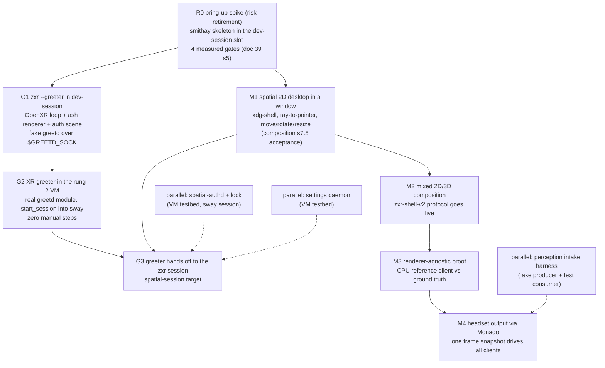

# The implementation path: from boot forward to the XR greeter, then the session

**Status:** accepted plan of record (2026-09-23).
**What this is:** the ordered build path from power-on to a zxr session, derived from the
dependency graph ([desktop-environment.md §6](desktop-environment.md)) — not a replacement for
it. Rungs are ordered only where a hard dependency exists; everything else is a parallel track.
**Base:** Rust + smithay, ratified ([ADR 0006 as amended](adr/0006-compositor-strategy.md);
evidence [research/39](../research/39-compositor-base-landscape.md)).
**Budget impact** (overview invariant 9): none at design time; every rung below inherits the
[budgets.md](budgets.md) partitions when it lands code, and R0's exit evidence includes the
first real frame-path measurements (GPU time, missed `xrWaitFrame` deadlines) that seed the
class-V (VM) budget column with data instead of estimates.

## 1. Why the greeter is the first shippable target

The strategic observation this path is built around: **`zxr --greeter` is the cheapest real
compositor milestone**, because ADR 0007 *disables* the client Wayland listening socket in
greeter mode ([specs/session-auth.md §5](../../specs/session-auth.md)). The greeter needs the
OpenXR loop, the Vulkan renderer, an internal (non-client) auth scene, input, and a greetd IPC
client — and none of the 2D client tier, no protocol server, no window model, no Xwayland. Every
one of those pieces is also the irreducible core of the session compositor, so nothing built for
the greeter is throwaway. Meanwhile the harnesses already exist: rung 1 (`nix run .#dev-session`)
runs a nested session against simulated-HMD Monado on the desktop, and rung 2
(`nix run .#virtual-headset-vm`) boots a full NixOS VM with virgl and an in-guest Monado socket
([README §Development](../../README.md)). The dev-session package was built with exactly this
swap in mind: "The nested compositor is sway until zxr's M1 lands; swap COMPOSITOR_CMD then"
([pkgs/dev-session](../../pkgs/dev-session/default.nix)).

The end state of the greeter track — **G2** — is the first thing that *feels* like spatial-os:
the VM powers on and lands in an XR auth scene with zero manual steps, and login hands off to a
real session. Everything after that is widening the session, not proving the system.

## 2. The boot chain, stage by stage

Each stage lists what exists today and what must be built. "VM" = the rung-2 virtual headset;
stages marked ▲ are forced decisions this path surfaces.

| # | Stage | Exists today | To build |
|---|---|---|---|
| B1 | Firmware → bootloader → initrd | per-family (uefi-rauc proven in the Frame workstream; android-bootimg gated on the Lynx spike) | nothing for this path — the VM boots systemd-boot already |
| B2 | ▲ Seat broker | ADR 0007 names logind/seatd as the DRM-master/hidraw broker and leaves "logind vs seatd on the appliance image" open | **the decision is forced at G2**: greetd's session worker needs a seat. Default: logind (NixOS default, zero work, `SetLockedHint` needs it anyway per ADR 0007); seatd remains an appliance-minimization option to revisit with image-size work |
| B3 | greetd | contract options `spatial.xr.session.{autoLogin,greeter}` + profile-exclusivity assertion ([lib/contract](../../lib/contract/default.nix)); research [11](../research/11-display-managers-greeters.md); the VM currently bypasses this (getty autologin → `exec sway` in [devices/virtual-headset](../../devices/virtual-headset/default.nix)) | the NixOS module consuming the contract: `services.greetd` wiring for both profiles (multi-user → `default_session` = zxr greeter; appliance → `initial_session`), replacing the VM's getty hack when G2 lands |
| B4 | `zxr --greeter` | the mode's restrictions and exit contract are normative ([session-auth §5](../../specs/session-auth.md)); per-unit calibration paths in the contract; safe default IPD pre-auth | the binary itself: G1's deliverable (§3), running on R0's core |
| B5 | Login authority | greetd's session worker is the **sole** login PAM authority; the greeter is an unprivileged greetd IPC client (session-auth §1, review-hardened) | the greeter's greetd client half (`create_session` → `post_auth_message_response` → `start_session`), rendering `auth_message`s in the auth scene |
| B6 | Session start | `spatial.xr.shell` contract enum (zxr/stardust/wayvr/kwin-vr/none) | `spatial-session.target` (systemd user target owning Monado + compositor + shell services; crash/restart semantics per ADR 0007), enumerating sessions from the module system |
| B7 | The session | rung-1/rung-2 loops run sway as the stand-in session | zxr session mode: M1 onward (§3) |
| B8 | Lock | lock state machine + invariants specified (ADR 0007, session-auth §2–§3); `ext-session-lock-v1` dev-profile-only | `spatial-authd` + the in-compositor lock states — a parallel track (§4), testable against sway+VM before zxr exists |

## 3. The rung ladder

### R0 — the bring-up spike (risk retirement, not a decision gate)

The smithay skeleton dropped into the dev-session slot, measured against the four gates of
[doc 39 §5](../research/39-compositor-base-landscape.md): real projection-layer presentation on
a runtime-created Vulkan device; zero-CPU-copy dmabuf import with explicit sync end-to-end;
window behavior under churn (resize/popups/kill-mid-frame, no unresolved GPU waits — previewing
M4's stopping rule); Xwayland early (smithay `X11Wm` vs xwayland-satellite is an R0 *output*).
Entry: nothing — the harness exists. Exit: a written result per gate + the instrumentation
numbers. Registry rows it moves: none directly (it's evidence, not a component), but every
authority-plane "specified" row becomes buildable on its skeleton.

### G1 — the greeter scene in dev-session

`zxr --greeter` as a window: R0's OpenXR loop + renderer, the internal auth scene (generic
prompt rendering per session-auth §2.3's style set — the PIN pad keys off `style=secret`, never
prompt text), a fake greetd speaking the JSON IPC over `$GREETD_SOCK`, session list from a
static config. **No Wayland listening socket** — assert it in the harness (`ss`/`lsof`, the
session-auth §6.6 conformance check, minus PAM which greetd owns). Exit: prompt → response →
`start_session` acknowledged → clean teardown, on the simulated HMD, with `--rotate` proving
the scene is really spatial.

### G2 — the XR greeter in the VM (the first shippable artifact)

The greetd NixOS module (B3) replaces the getty hack in `devices/virtual-headset`; multi-user
profile with `spatial.xr.session.greeter = "zxr-greeter"`; the real greetd spawns zxr-greeter as
the `greeter` user; login lands in **sway** as the stand-in session (B6's target can start any
`spatial.xr.shell`). Forced decision B2 (logind default) lands here. Exit: VM cold boot →
XR auth scene with zero manual steps → correct PAM conversation (real PAM, greetd worker) →
sway session; re-lock/logout returns to the greeter; the greeter process never loads PAM symbols
(session-auth §6.6).

### M1 — the spatial 2D desktop (composition §7.5)

The 2D tier on R0's skeleton, in the windowed dev backend: xdg-shell + baseline globals
(registry protocol-server row), ray→window-local `wl_pointer`, move/rotate/resize planes,
copy/paste, popups/menus — with composition §7.3's constraints 1–9 baked in from the start (no
window↔output binding, pluggable hover/focus, placement volumes, arbitration state machine,
settings from the schema artifact). Acceptance is the composition table's: "terminal + editor:
type, select, copy/paste, open menus, move/rotate/resize planes". When M1 lands, dev-session's
`COMPOSITOR_CMD` swaps sway for zxr and rung 1 becomes zxr's own loop.

### G3 — the full handoff

`spatial-session.target` (B6) starts Monado + zxr-session + shell services; greetd
`start_session` execs into it; ADR 0007's crash/restart and boot-locked-restart rules apply.
Needs M1 (a session someone can use) + G2 (the greeter) + the authd track (§4) for lock. Exit:
VM boots → XR greeter → login → **zxr session** → doff-grace/lock/unlock cycle works end to end.

### M2–M4 — widening the session (composition §7.5, unchanged)

M2: the `zxr-shell-v2` protocol server goes live (generated from the rev-2 XML via the
`checks.protocols`-validated scanner path) — a GL ray-march client and a Vulkan raster client
intersect and pass in front of/behind M1 windows, no CPU readback. M3: the CPU reference client
against a single-process ground truth (catches matrix/depth-origin/clip bugs). M4: headset
output via Monado — head motion drives all clients from one frame snapshot; stopping a client
never creates an unresolved GPU wait; a rootless Xwayland app participates. M4 runs entirely in
rung 1 (simulated HMD); real-HMD output stays behind the display-path feasibility gate
(desktop-environment §6.6).

## 4. Parallel tracks (no compositor dependency)

Per desktop-environment §6.4, the session cluster is HMD-independent; three specs have
conformance checklists that are ready-made test plans:

- **`spatial-authd` + the lock path** ([specs/session-auth.md](../../specs/session-auth.md)):
  the per-conversation PAM helper with nonce revocation and batched conversations. Testbed: the
  VM with sway standing in for the session — every §6 conformance item except the
  composition-introspection half of L2 is compositor-free. Feeds G3.
- **The settings daemon** ([specs/settings-schema.md](../../specs/settings-schema.md)): the
  contract is fully specified; the remaining gap is the daemon's own process design (spec §10).
  VM-testable standalone; M1's constraint-9 compliance (no compiled-in defaults) consumes it.
- **The perception intake harness** ([specs/perception-intake.md §8](../../specs/perception-intake.md)):
  fake producer + test consumer exercising registration, generations, overrun, epoch teardown,
  and the structural never-block check — validates the protocol before either real end exists.
  Feeds the M4-adjacent perception work without gating it.

Each track also exercises its NixOS module wiring (greetd module, authd PAM service stanza,
settings schema artifact emission) in the VM — the module system grows with the daemons, not in
a big-bang at the end.

## 5. Explicitly deferred (unchanged verdicts, restated here so the path is complete)

- **Shell-plane presentation** — launcher, panels, pager/overview, OSD, notifications UI: all
  downstream of M1's window model and the places implementation; registry status honest
  (missing), by design.
- **Places implementation** beyond what M1's window model needs; the model is specified
  (ADR 0016) and its protocol drafted (`zxr-workspace-v1`), but residency/currency machinery
  waits for a session that has windows worth organizing.
- **Delegation consumer** (`zext-toplevel-export-v1`): staged behind M1 per ADR 0014 M-A.
- **All hardware-gated work**: the Lynx spike rule stands (design-backlog standing rule);
  the Steam Frame donor workstream continues in parallel on its own ladder; nothing in this
  path requires hardware before M4's exit.
- **Docked mode, sharing bridges, avatar, mapping**: each behind its own recorded gate
  (ADR 0015; spatial-sharing; S-1/R-1; M0), joined to this path only after G3.

## 6. Standing references

The dependency graph that orders this: [desktop-environment.md §6](desktop-environment.md).
Milestone acceptance: [zxr-shell-v2-composition.md §7.5](zxr-shell-v2-composition.md).
R0 gates and base evidence: [research/39 §5](../research/39-compositor-base-landscape.md).
Session/greeter/lock contracts: [ADR 0007](adr/0007-session-greeter-lock.md) +
[specs/session-auth.md](../../specs/session-auth.md).
The dev loops this path runs on: [README §Development](../../README.md).
