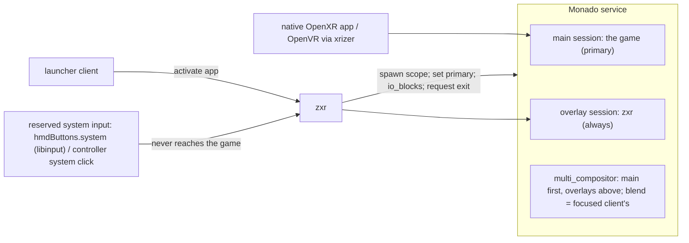

# Native OpenXR applications beside zxr — the fullscreen-game model and the reserved system input

**Status: DRAFT, rev 0 (2026-09-26).** Derived from
[research/66](../research/66-native-openxr-apps-and-the-system-input.md) under the owner's
framing: *zxr is a desktop environment's compositor, and a native OpenXR application is what a
fullscreen game is to GNOME/KDE.* Five items are open (§10) with the comparables' positions and a
labelled read; nothing there is a decision until the owner rules. Design docs specify; ordering
lives only in [implementation-path.md §5](implementation-path.md).

**What this document is.** A native OpenXR application — a game with its own session, an OpenVR
title through xrizer/OpenComposite, any program that talks to Monado directly — is not zxr's
client. It is Monado's *other* client. This document specifies how the two coexist: who is
Monado's primary, what zxr does while a game owns the display, how the game is launched and
closed, what it sees of the wearer's input, and the **reserved system input** by which the
wearer always gets the shell back. It resolves the exit item of
[window-workspace-management.md §9](window-workspace-management.md) for *both* exclusivity
mechanisms (a zxr client granted the environment layer; a native app as primary).

**Grounding.** OpenXR terms are the spec's (`XR_EXTX_overlay`, `XrSessionState`, `/input/system/click`,
`LOCAL`); Monado's are its source (`libmonado`, primary client, `io_blocks`, `z_order`); the
2D vocabulary — fullscreen, direct scanout/unredirect, `keyboard-shortcuts-inhibit`, the
compositor's reserved bindings — keeps its upstream meaning. Layers are spec §4's. The input
floor and `hmdButtons` roles are [device-contract.md](device-contract.md)'s.

**Budget impact** (overview invariant 9): zxr holds one OpenXR overlay session (it holds one
session today; the type changes, the count does not) and one `libmonado` connection (a Unix
socket, no thread). While a game is primary zxr **stops rendering** — no GPU pass, no texture
uploads, no frame callbacks to planes — the same saving the 2D desktops take by unredirecting;
what it still draws (§4) is bounded to overlay-class surfaces. Two renderers exist only while the
shell is summoned over a game, as on every platform. The reserved input adds no device: it is
an existing button reaching zxr instead of an app.

## 1. The model in one paragraph

Monado has one **main** session — the game — and any number of **overlay** sessions whose
layers are always composited above it (`extx_overlay.adoc:65-67`). zxr is an overlay session,
always (§10 Q-A). When no game runs, zxr's layers are the whole picture. When the launcher starts
a game, zxr spawns it, and when its session activates zxr makes it Monado's primary
(`mnd_root_set_client_primary`); from then on zxr **submits no layers** — the unredirect
analogue — until an overlay-class surface must be shown or the wearer presses the **reserved
system input**, which every platform owns and no application receives. On that press zxr draws
its shell layers over the still-rendering game and takes the game's input away (the game becomes
VISIBLE, not FOCUSED — the spec's and every platform's rule); the shell offers "back to it" and
"quit it"; releasing the shell returns the game to FOCUSED and zxr to silence. Closing is a
request the game may ignore, then a kill of its scope. Recenter re-seats `LOCAL` for everyone;
pinned places stay.

## 2. zxr's session

- **An `XR_EXTX_overlay` session, always** — the shape of WayVR (placement 5), kwin-vr (20),
  xrdesktop/gxr (1) and Valve's Frame shell (Steam's UI as the SteamVR dashboard overlay); all
  run with no game present, so no role switch is ever needed. Placement: above any other
  overlay Mura ships (a stand-in value until another overlay exists). Open: §10 Q-A.
- **Consequences zxr manages:** its layers are always above the game's (the platforms' "windows
  render in front of immersive content", spec §4's layers 5–6 semantics); Monado marks overlay
  sessions visible and focused unconditionally (`ipc_server_process.c:562-567`), so zxr always
  receives input — §5 is where that is turned into the wearer's experience.
- **Blend mode** is the focused client's in ascending z-order, i.e. the main session's while a
  game runs (`comp_multi_system.c:227-250`); zxr's passthrough preference applies only when it is
  the only session or when it is summoned and asks (§7).
- **Zero layers is legal** (`extx_overlay.adoc:182-191`); WayVR's "Monado freaks out if no
  layers are submitted" (`mod.rs:367-373`) is the first bring-up test; the fallback is one
  transparent quad.

## 3. Launch, primary, close (the lifecycle)

1. **Launch.** The launcher client requests activation of a native app (the `xdg-activation`
   path it already uses for Wayland apps; a native app's desktop entry is marked as such). zxr
   spawns it as a **transient systemd scope** in the session (the Steam Frame's shape:
   `STEAM_LAUNCH_WRAPPER_SCOPE`, with a CPU affinity mask leaving cores to the system —
   `steam.service:22-28`) with the runtime environment (the declared `active_runtime.json`;
   `openvrpaths` pointing at xrizer/OpenComposite for OpenVR titles — packaging).
2. **Primary.** When the new session activates, Monado makes a non-overlay session primary
   (`ipc_server_process.c:873-901`); zxr observes the client list over `libmonado` and confirms
   or sets primary explicitly (`mnd_root_set_client_primary`) so the shell, not Monado's
   first-come rule, decides which game is in front when two exist. zxr then enters **quiet mode**
   (§4).
3. **Switch.** From the summoned shell, "switch to" another running native app = set primary;
   "back to shell" with no primary = Monado's idle (`active_client_index = -1`); zxr resumes full
   rendering.
4. **Close.** "Quit" in the shell = `xrt_session_request_exit` (the game sees EXITING: "the
   runtime wishes the application to terminate… Applications should gracefully end their
   process"); after `quit.timeout` the scope is killed — the OpenVR `VREvent_Quit` →
   `AcknowledgeQuit_Exiting` → kill shape, WiVRn's Stop ("Request to quit, may be ignored by the
   application"). A force chord (§6) skips the request.
5. **Death.** If the primary dies, Monado falls back to the first non-overlay active session or
   idle (`:615-651`); zxr sees the client list change and resumes accordingly. If zxr dies, the
   game keeps running (it is Monado's client, not zxr's) and the session wrapper restarts zxr,
   which rebinds as an overlay — the game is unaffected (contrast: a Wayland client dies with its
   compositor).

## 4. Quiet mode — getting out of the way

While a native app is primary:

- zxr **submits no layers** and runs no GPU pass; planes get no frame callbacks (they are not
  presented — the 2D compositors do the same to windows behind a fullscreen one); texture
  uploads stop; the state loop keeps serving Wayland clients' protocol (commits are accepted and
  held). The `xrWaitFrame` thread keeps its cadence so `xrPollEvent` and the session state
  machine run (a tick with nothing to draw ends with an empty `xrEndFrame`).
- zxr **resumes rendering only for**: (a) overlay-class surfaces — layer-shell `overlay`
  (notifications, OSD), the lock/greeter scene (ADR 0007 — it *must* be presentable over a game),
  the foreground cutout if the perception layers are active; (b) whatever the wearer summons with
  the reserved input (§6); (c) planes the wearer explicitly kept over games (§10 Q-D). This is
  the DEs' list: the surfaces that take mutter's `disable_unredirect` are the overview, the
  message tray and the OSD; niri draws only its Overlay layer above a fullscreen window.
- Resuming for (a) draws *only* those surfaces, above the game, with the game still FOCUSED —
  a notification does not take the game's input (GNOME's notifications do not either). Summoning
  (b) does (§5).

## 5. Input while a game is primary

- **The game has input** (FOCUSED) while zxr is quiet. zxr's overlay session is also focused in
  Monado; zxr ignores everything but the reserved input in quiet mode.
- **When the shell is summoned**, the game becomes **VISIBLE, not FOCUSED**: its actions go
  inactive and it keeps rendering (`session.adoc:574-605`; Meta "focus awareness"; SteamVR
  `IsInputAvailable`). In Monado today this is `mnd_root_set_client_io_blocks` on the primary
  (inputs, hands, non-head poses; WiVRn's and WayVR's mechanism) — lifted when the shell is
  dismissed. A runtime-side focus switch replaces it when Monado has one (research/66 §14).
- **zxr's own components** (planes, shell layers) receive input through zxr's seat as always.
- **Hands and controllers** drawn by the game while the shell is up: the game is told to hide
  or idle them by the platform rule it already follows (Meta's VRC.Quest.Input.4); zxr renders
  the shell's own cursor/rays.

## 6. The reserved system input

**Rule (determination, research/66 §12 verdict 4):** one physical control per device tier is
the *system* control; it is consumed before any application and no application ever receives it
— the 2D compositor's non-maskable chord (mutter `restore-shortcuts`, niri's hardcoded binds:
"the user has no way to unlock the compositor… 'jailing' the user"), OpenXR's `system` semantics
("may not be available to applications"), Valve's ("not visible to applications"), Meta's
("Applications will never see Home"), Microsoft's ("Apps can't react specifically to Home
actions").

**Which control** — the device contract declares it:

- `hmdButtons.system` — an HMD-body button by role, like `selectRole`: the Steam Frame's Aux
  (`KEY_SELECT`), the Galaxy XR's top button (`KEY_POWER`, disambiguated by duration as the
  contract already says for select), Lynx R-1's R. Read through libinput by zxr, which owns HMD
  keys (contract A2). It may coincide with `selectRole` — at the input floor there is no game to
  escape from, so the same button is select there and system in a session; press length
  disambiguates as the Galaxy XR fork's driver does.
- **Controller system click** (`/input/system/click`) — the Frame's controllers, Touch, Index,
  Vive, PICO. Today Monado hands it to the focused app and zxr, being focused too, receives it
  as well; the game **also** gets it until Monado reserves it — a driver-level grab (the Galaxy
  XR fork's `EVIOCGRAB` → `system/click`) or a state-tracker reservation for a designated system
  client is the upstream item (research/66 §14). Until then: on tiers where the HMD-body button
  exists, that is the guaranteed path; the controller button is best-effort.
- **Hands-only tiers with no body button** — open (§10 Q-C).

**What a press does** — open as to the exact map (§10 Q-B); the platforms' unanimous split:

| press | action | the 2D analogue | precedent |
|---|---|---|---|
| short (< ~500 ms) | **summon/dismiss the shell** over the game: layers 4–6 and the launcher/switcher surface; the game → VISIBLE | Alt+Tab / Super | Meta system UI, Apple Home View, PICO home, Android XR Launcher, SteamVR dashboard, HoloLens Start |
| long | **recenter** (research/36 §8: rigid re-seat of head-relative content, pinned places exempt; re-seats the game's `LOCAL`) | — | Meta > 500 ms, Apple hold, PICO 1 s, Samsung touchpad hold |
| double | show/hide planes, or passthrough (tier-dependent: a device with a dedicated passthrough button keeps it) | — | Meta double-tap, Apple double-click, Quest 3S action button |
| chord (system + select held) | **force quit** the primary app: kill its scope | the compositor's kill chord | Apple Crown + top button, Deck Steam+B long |
| *quit* | a menu item in the summoned shell (§3.4) | Alt+F4 → close request | Navigator "quit and return home", SteamVR dashboard, HoloLens Start → home |

**What a press is not:** a gesture by assumption (owner). Where a platform's hands-only exit is a
reserved gesture, that is Q-C's evidence, not this rule.

**Named actions.** "summon shell", "recenter", "quit app", "force quit" are named actions the
accessibility stack, voice and switch devices can trigger (research/37, /42), independent of the
physical control.

## 7. Recenter and passthrough beside a primary app

Recenter is the runtime's re-seat of `LOCAL` (`mnd_root_recenter_local_spaces`): the game's
content moves with it as on every platform; pinned places do not. Passthrough while a game is
primary is the game's blend mode (§2); when the shell is summoned zxr is the focused overlay and
may request its own blend for the duration; the perception layers' safety occlusion (research/62
§3.5) is never suspended by a game.

## 8. The two exclusivity mechanisms — one experience

| | mechanism 1: a zxr client granted the environment layer | mechanism 2: a native app as Monado's primary |
|---|---|---|
| who renders | zxr, everything (one renderer) | the game; zxr quiet |
| shell layers 5–6 | drawn by zxr in the same pass | drawn by zxr's overlay session when needed |
| input to the app | zxr's seat, as any client | the game's own OpenXR actions; `io_blocks` when the shell is up |
| summon shell | reserved input → zxr draws layers 4–6 over the granted scene; the client's input paused by zxr | reserved input → zxr draws layers 4–6; game → VISIBLE |
| quit | `xdg_toplevel.close` / zxr-shell-v2 close → kill | `request_exit` → kill scope |
| recenter | zxr re-seats; the granted scene is head-relative content | runtime re-seats `LOCAL` |

The wearer sees one behaviour; the shell's "back to it / switch / quit" surface is the same
component in both.

## 9. Settings

`system.button.longPressMs` (stand-in 500 — Meta's threshold; Apple/PICO unpublished/1 s),
`system.doubleTapMs`, `system.doublePress` ∈ `show_hide_planes | passthrough | none`,
`quit.timeout` (stand-in from OpenVR's kill timeout once read), `games.keepPlanes` (Q-D's opt-in,
per window), `games.controllerSystemButton` (best-effort until the runtime reserves it). All
`ownership = declarative` (settings-schema.md), seeded from the device contract.

## 10. Open items (deciders named; research/66 §13 has the full positions)

- **Q-A — always an overlay session** (WayVR, kwin-vr, xrdesktop, Steam-on-Frame) **vs a main
  session that yields** (no comparable; zxr's layers would be dropped while a game runs). My
  read, labelled: always overlay. Owner.
- **Q-B — the press-length map.** The platforms' split as written in §6 (quit as a menu item +
  force chord, never a press) vs making long press the quit (no comparable; long press is
  recenter everywhere and research/36 §8's determination). My read, labelled: the split as
  written. Owner.
- **Q-C — hands-only tiers.** (a) a reserved gesture as every hands-first platform does; (b) the
  HMD-body button only, no exit on button-less devices; (c) the input floor's select long-press
  extended to the system role. My read, labelled: (b)+(c) where a body button exists; on a device
  with neither, (a) is the only exit and rule 3 argues for offering it. Owner, with the input
  workstream.
- **Q-D — what draws over a primary game by default.** (a) overlay-class only (GNOME/niri;
  layers 5–6), planes when summoned or kept per window (HoloLens Follow-me); (b) up to N planes
  (Horizon 3); (c) everything (the Linux XR shells — no rule). My read, labelled: (a) with the
  per-window opt-in. Owner.
- **Q-E — HMD-body vs controller system button when both exist.** One `system` role satisfied
  by either, identical (PICO's rule) — near a determination; flagged because Valve documents the
  Frame's Aux only as a login aid. Owner.

**Also open, not decisions:** the foreign-session mode-3 taxonomy for GNOME (headless mutter +
libei/PipeWire viewer, not a nested compositor — research/59 §9a, the `mdk` read in the
2026-09-26 owner conversation) — owner, in foreign-session-integration.md.
