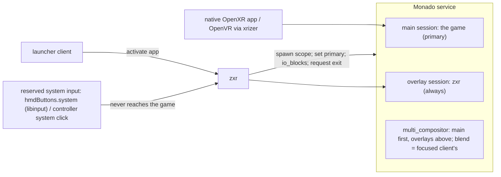

# Native OpenXR applications beside zxr — the fullscreen-game model and the reserved system input

**Status: DRAFT, rev 0.3 (2026-09-26; the five forks ruled by the owner the same day — §10; rev 0.2 adds the efficiency findings of [research/67](../research/67-overlay-efficiency-beside-native-apps.md): zero layers measured and the placeholder forbidden, the quiet-loop bound measured, the quiet-mode client rule, the summoned-footprint rule, the cutout lifetime rule, the client-list cadence; rev 0.3 records the cutout-over-games default as an open question with its options and costs tabled in §4(b), decided by the owner on the first device with the real matte pipeline over a real game).**
Derived from [research/66](../research/66-native-openxr-apps-and-the-system-input.md) under the
owner's framing: *zxr is a desktop environment's compositor, and a native OpenXR application is
what a fullscreen game is to GNOME/KDE.* Design docs specify; ordering lives only in
[implementation-path.md §5](implementation-path.md).

**What this document is.** A native OpenXR application — a game with its own session, an OpenVR
title through xrizer/OpenComposite, any program that talks to Monado directly — is not zxr's
client. It is Monado's *other* client. This document specifies how the two coexist: who is
Monado's primary, what zxr does while a game owns the display, how the game is launched and
closed, what it sees of the wearer's input, and the **reserved system input** by which the
wearer always gets the shell back. It resolves the exit item of
[window-workspace-management.md §9](window-workspace-management.md) for *both* exclusivity
mechanisms (a zxr client granted the environment layer; a native app as primary).

**Grounding.** OpenXR terms are the spec's (`XR_EXTX_overlay`, `XrSessionState`, `/input/system/click`,
`LOCAL`); Monado's are its source (`libmonado`, primary client, `io_blocks`, `z_order`); the
2D vocabulary — fullscreen, direct scanout/unredirect, `keyboard-shortcuts-inhibit`, the
compositor's reserved bindings — keeps its upstream meaning. Layers are spec §4's. The input
floor and `hmdButtons` roles are [device-contract.md](device-contract.md)'s.

**Budget impact** (overview invariant 9): zxr holds one OpenXR overlay session (it holds one
session today; the type changes, the count does not) and one `libmonado` connection (a Unix
socket, no thread). While a game is primary zxr **stops rendering** — no GPU pass, no texture
uploads, no frame callbacks to planes — the same saving the 2D desktops take by unredirecting;
what it still draws (§4) is bounded to overlay-class surfaces. Two renderers exist only while the
shell is summoned over a game, as on every platform. The reserved input adds no device: it is
an existing button reaching zxr instead of an app.

## 1. The model in one paragraph

Monado has one **main** session — the game — and any number of **overlay** sessions whose
layers are always composited above it (`extx_overlay.adoc:65-67`). zxr is an overlay session,
always (ruled, §10 Q-A). When no game runs, zxr's layers are the whole picture. When the launcher starts
a game, zxr spawns it, and when its session activates zxr makes it Monado's primary
(`mnd_root_set_client_primary`); from then on zxr **submits no layers** — the unredirect
analogue — until an overlay-class surface must be shown or the wearer presses the **reserved
system input**, which every platform owns and no application receives. On that press zxr draws
its shell layers over the still-rendering game and takes the game's input away (the game becomes
VISIBLE, not FOCUSED — the spec's and every platform's rule); the shell offers "back to it" and
"quit it"; releasing the shell returns the game to FOCUSED and zxr to silence. Closing is a
request the game may ignore, then a kill of its scope. Recenter re-seats `LOCAL` for everyone;
pinned places stay.

## 2. zxr's session

- **An `XR_EXTX_overlay` session, always — ruled (2026-09-26, Q-A).** The shape of WayVR
  (placement 5), kwin-vr (20), xrdesktop/gxr (1) and Valve's Frame shell (Steam's UI as the
  SteamVR dashboard overlay); all run with no game present, so no role switch is ever needed.
  Placement: above any other overlay Mura ships (a stand-in value until another overlay exists).
  The owner's condition — "efficient and minimally taxing when it yields" — is §4's bound.
- **Consequences zxr manages:** its layers are always above the game's (the platforms' "windows
  render in front of immersive content", spec §4's layers 5–6 semantics); Monado marks overlay
  sessions visible and focused unconditionally (`ipc_server_process.c:562-567`), so zxr always
  receives input — §5 is where that is turned into the wearer's experience.
- **Blend mode** is the focused client's in ascending z-order, i.e. the main session's while a
  game runs (`comp_multi_system.c:227-250`); zxr's passthrough preference applies only when it is
  the only session or when it is summoned and asks (§7).
- **Zero layers is the quiet shape — measured (research/67 §5).** An overlay `xrEndFrame`
  with `layerCount == 0` is a discarded frame (`oxr_session_frame_end.c:1840-1852`) and the
  multi-compositor retires the client's delivered frame (`comp_multi_compositor.c:609-623`;
  Monado !2769 "Fixes layers from the previous frame being displayed when an app submits 0
  layers"): the game's picture is intact and its frame stays single-layer — on the fast path.
  WayVR's 1 mm dummy layer (`mod.rs:366-373`) is that bug's workaround and is **forbidden here**:
  any layer from zxr, transparent or not, moves the game to the squasher (research/67 §2), and
  Quest's guidance is the same — "setting a layer texture to 0-alpha still incurs the full
  rendering cost — destroy layers you don't need".

## 3. Launch, primary, close (the lifecycle)

1. **Launch.** The launcher client requests activation of a native app (the `xdg-activation`
   path it already uses for Wayland apps; a native app's desktop entry is marked as such). zxr
   spawns it as a **transient systemd scope** in the session (the Steam Frame's shape:
   `STEAM_LAUNCH_WRAPPER_SCOPE`, with a CPU affinity mask leaving cores to the system —
   `steam.service:22-28`) with the runtime environment (the declared `active_runtime.json`;
   `openvrpaths` pointing at xrizer/OpenComposite for OpenVR titles — packaging).
2. **Primary.** When the new session activates, Monado makes a non-overlay session primary
   (`ipc_server_process.c:873-901`); zxr observes the client list over `libmonado` and confirms
   or sets primary explicitly (`mnd_root_set_client_primary`) so the shell, not Monado's
   first-come rule, decides which game is in front when two exist. zxr then enters **quiet mode**
   (§4).
3. **Switch.** From the summoned shell, "switch to" another running native app = set primary;
   "back to shell" with no primary = Monado's idle (`active_client_index = -1`); zxr resumes full
   rendering.
4. **Close.** "Quit" in the shell = `xrt_session_request_exit` (the game sees EXITING: "the
   runtime wishes the application to terminate… Applications should gracefully end their
   process"); after `quit.timeout` the scope is killed — the OpenVR `VREvent_Quit` →
   `AcknowledgeQuit_Exiting` → kill shape, WiVRn's Stop ("Request to quit, may be ignored by the
   application"). A force chord (§6) skips the request.
5. **Death.** If the primary dies, Monado falls back to the first non-overlay active session or
   idle (`:615-651`); zxr sees the client list change and resumes accordingly. If zxr dies, the
   game keeps running (it is Monado's client, not zxr's) and the session wrapper restarts zxr,
   which rebinds as an overlay — the game is unaffected (contrast: a Wayland client dies with its
   compositor).

## 4. Quiet mode — getting out of the way

While a native app is primary:

- zxr **submits no layers** and runs no GPU pass; planes get no frame callbacks (they are not
  presented — the 2D compositors do the same to windows behind a fullscreen one); texture
  uploads stop; the state loop keeps serving Wayland clients' protocol (commits are accepted and
  held). The `xrWaitFrame` thread keeps its cadence so `xrPollEvent` and the session state
  machine run (a tick with nothing to draw ends with an empty `xrEndFrame`).
- **The bound (owner's condition, Q-A):** quiet mode costs the OpenXR frame-loop IPC — one
  `xrWaitFrame`/`xrBeginFrame`/`xrEndFrame` triple per refresh, no rendering — and the Wayland
  event loop, nothing else. A running session may not stop its frame loop, and ending the
  session to save those messages would cost the summon latency none of the overlay shells
  accept. **Measured (host, research/67 §4):** quiet zxr beside xrgears costs ≈ 8 ms/s of zxr CPU
  (5 RPCs and ≈ 10 wake-ups per 60 Hz tick, 0 GPU) plus ≈ 5 ms/s in `monado-service` for the
  extra client; recreating the session on summon instead would take 37–41 ms to `FOCUSED` plus
  one display period here — viable, but no overlay shell does it (WayVR, gxr, kwin-vr all keep
  their loop), so the loop is kept and recreation is the recorded alternative. **The game keeps
  its fast path while zxr is quiet** — that, not the loop, is the number that matters.
- zxr **resumes rendering only for** — ruled (Q-D): (a) **layer 5 always** — layer-shell
  `overlay` (notifications, OSD), the lock/greeter scene (ADR 0007 — it *must* be presentable
  over a game), the system-gesture affordance; (b) **layer 6, the hand cutout, over games by
  default** — visionOS's default ("fully obscures passthrough except for the user's upper limbs"),
  the owner's stated preference — with a **wearer toggle in the OSD layer** to turn real hands off
  for a game (or on again). **Rev 0.2:** the owner lifted the hard constraint — off-by-default is
  acceptable provided the reserved input (§6) always gives summon and quit — and **rev 0.3 holds
  the default as an open question (decider: the owner) until the real matte pipeline has run over
  a real game on device**; the host stand-ins (research/67 §3) are billboards, not segmentation,
  and cannot measure the hands-in-view fraction that prices "on". What *is* ruled: any cutout
  layer moves the game to Monado's squasher, so the cutout layer **exists only while a hand is in
  the camera view** (the lifetime rule; no layer otherwise — never a faded one), and in
  passthrough/alpha-blend games the cutout is simply the shell's normal behaviour. The options and
  their measured cost, recorded for that decision:

  | Default over a game | Host stand-in (Monado GPU ms/s; game alone 32, ±5) | Owed by the device | Trades |
  |---|---|---|---|
  | Off; wearer turns hands on per game from the OSD toggle | 32–37, fast path kept | — | hands invisible until asked; the opt-in posture of every platform but visionOS |
  | On, always | 42 (two 300² billboards) | tiler round trip at panel resolution; shapes (i)/(ii)/(iii) of perception-passthrough-hands §1a | hands always visible; squasher for the whole session |
  | On, with the lifetime rule | 37 no hand in view, 39 at 50 % duty | hands-in-view fraction of a session; matte→layer create/destroy latency | fast path lost only while hands are in view |

  Under every row the reserved input (§6) gives summon and quit, so no option strands the
  wearer; (c) whatever the wearer summons with the reserved input (§6); (d) **planes only
  when summoned or explicitly kept over games per window** (HoloLens's Follow-me toggle is the
  precedent for the per-window keep). This is the DEs' list plus the hands: the surfaces that
  take mutter's `disable_unredirect` are the overview, the message tray and the OSD; niri draws
  only its Overlay layer above a fullscreen window.
- Resuming for (a) draws *only* those surfaces, above the game, with the game still FOCUSED —
  a notification does not take the game's input (GNOME's notifications do not either). Summoning
  (b) does (§5).

## 5. Input while a game is primary

- **The game has input** (FOCUSED) while zxr is quiet. zxr's overlay session is also focused in
  Monado; zxr ignores everything but the reserved input in quiet mode.
- **When the shell is summoned**, the game becomes **VISIBLE, not FOCUSED**: its actions go
  inactive and it keeps rendering (`session.adoc:574-605`; Meta "focus awareness"; SteamVR
  `IsInputAvailable`). In Monado today this is `mnd_root_set_client_io_blocks` on the primary
  (inputs, hands, non-head poses; WiVRn's and WayVR's mechanism) — lifted when the shell is
  dismissed. A runtime-side focus switch replaces it when Monado has one (research/66 §14).
- **zxr's own components** (planes, shell layers) receive input through zxr's seat as always.
- **Hands and controllers** drawn by the game while the shell is up: the game is told to hide
  or idle them by the platform rule it already follows (Meta's VRC.Quest.Input.4); zxr renders
  the shell's own cursor/rays.

## 6. The reserved system input

**Rule (determination, research/66 §12 verdict 4):** one physical control per device tier is
the *system* control; it is consumed before any application and no application ever receives it
— the 2D compositor's non-maskable chord (mutter `restore-shortcuts`, niri's hardcoded binds:
"the user has no way to unlock the compositor… 'jailing' the user"), OpenXR's `system` semantics
("may not be available to applications"), Valve's ("not visible to applications"), Meta's
("Applications will never see Home"), Microsoft's ("Apps can't react specifically to Home
actions").

**Which control** — the device contract declares it:

- `hmdButtons.system` — an HMD-body button by role, like `selectRole`: the Steam Frame's Aux
  (`KEY_SELECT`), the Galaxy XR's top button (`KEY_POWER`, disambiguated by duration as the
  contract already says for select), Lynx R-1's R. Read through libinput by zxr, which owns HMD
  keys (contract A2). It may coincide with `selectRole` — at the input floor there is no game to
  escape from, so the same button is select there and system in a session; press length
  disambiguates as the Galaxy XR fork's driver does.
- **Controller system click** (`/input/system/click`) — the Frame's controllers, Touch, Index,
  Vive, PICO. Today Monado hands it to the focused app and zxr, being focused too, receives it
  as well; the game **also** gets it until Monado reserves it — a driver-level grab (the Galaxy
  XR fork's `EVIOCGRAB` → `system/click`) or a state-tracker reservation for a designated system
  client is the upstream item (research/66 §14). Until then: on tiers where the HMD-body button
  exists, that is the guaranteed path; the controller button is best-effort.
- **The palm gesture — ruled (Q-C), on every tier, not only where no button exists.** The
  owner's requirement is that no reserved gesture may interrupt the experience; the platforms'
  shape meets it and is adopted: the gesture is **posture-gated** (palm turned toward the face —
  Meta's system gesture, Android XR's palm-inward menu; Apple's and HoloLens's look-at-palm/wrist
  are the gaze-tier form) **and deliberate** (pinch-and-hold, the most conservative of the four),
  a system-rendered affordance appears at the hand only while the posture is held (layer 5,
  drawn by zxr even over a game), and applications are told to suspend their own gesture
  recognition while it is in progress (Meta's rule) so an in-app gesture can neither fire it nor
  be fired by it. Posture thresholds, hold time and the affordance are the input workstream's to
  specify with the MRTK3/StereoKit evidence it pinned.
- **Both physical controls, identical — ruled (Q-E).** Where a target has an HMD-body control
  and a controller system button, both carry the same `system` role with the same semantics
  (PICO's rule: "Home button of the Controller or VR Headset"); which physical control carries
  it follows the hardware target's own convention.

**Per target** (from research/42 §4.3a and the device files; values become each device's
`systemRole` and controller mapping):

| target | HMD-body system control | controller system control | hands |
|---|---|---|---|
| Steam Frame | **Aux** (`KEY_SELECT`, right side above power) — the same button as `selectRole`; duration disambiguates | the **Steam-logo button** on each controller (`frame_controller` `/input/system/click`) | palm gesture |
| Quest 1/2/3 | none (power, volume only) | right controller **Meta/Oculus button** | palm gesture |
| Quest 3S | none for summon; the **action button** (`KEY_SWITCHVIDEOMODE`) is the passthrough toggle — the "double" action below | as above | palm gesture |
| Galaxy XR | **Top button** (= `KEY_POWER`, short press; Samsung: 1× launcher, hold = assistant, > 7 s force restart) | controller **Launcher** button | palm gesture; touchpad hold = recenter |
| Lynx R-1 | **R** button (opens the vendor menu today) | — | palm gesture |
| virtual headset (dev) | a keyboard key (Super) | — | — |

**What a press does — ruled (Q-B): the platforms' split as written.**

| press | action | the 2D analogue | precedent |
|---|---|---|---|
| short (< ~500 ms) | **summon/dismiss the shell** over the game: layers 4–6 and the launcher/switcher surface; the game → VISIBLE | Alt+Tab / Super | Meta system UI, Apple Home View, PICO home, Android XR Launcher, SteamVR dashboard, HoloLens Start |
| long | **recenter** (research/36 §8: rigid re-seat of head-relative content, pinned places exempt; re-seats the game's `LOCAL`) | — | Meta > 500 ms, Apple hold, PICO 1 s, Samsung touchpad hold |
| double | show/hide planes, or passthrough (tier-dependent: a device with a dedicated passthrough button keeps it) | — | Meta double-tap, Apple double-click, Quest 3S action button |
| chord (system + select held) | **force quit** the primary app: kill its scope | the compositor's kill chord | Apple Crown + top button, Deck Steam+B long |
| *quit* | a menu item in the summoned shell (§3.4) | Alt+F4 → close request | Navigator "quit and return home", SteamVR dashboard, HoloLens Start → home |

**What a press is not:** anything an application can rebind, receive or suppress; and the palm
gesture is not a free-air pinch — only the posture-gated, held form above qualifies.

**Named actions.** "summon shell", "recenter", "quit app", "force quit" are named actions the
accessibility stack, voice and switch devices can trigger (research/37, /42), independent of the
physical control.

## 7. Recenter and passthrough beside a primary app

Recenter is the runtime's re-seat of `LOCAL` (`mnd_root_recenter_local_spaces`): the game's
content moves with it as on every platform; pinned places do not. Passthrough while a game is
primary is the game's blend mode (§2); when the shell is summoned zxr is the focused overlay and
may request its own blend for the duration; the perception layers' safety occlusion (research/62
§3.5) is never suspended by a game. **Real hands over a game** (the layer-6 cutout) are toggled
from the OSD layer (§4, Q-D) — the one perception layer the wearer, not the game, decides; the
*default* position of that toggle is the open question of §4(b), held for the device.

## 8. The two exclusivity mechanisms — one experience

| | mechanism 1: a zxr client granted the environment layer | mechanism 2: a native app as Monado's primary |
|---|---|---|
| who renders | zxr, everything (one renderer) | the game; zxr quiet |
| shell layers 5–6 | drawn by zxr in the same pass | drawn by zxr's overlay session when needed |
| input to the app | zxr's seat, as any client | the game's own OpenXR actions; `io_blocks` when the shell is up |
| summon shell | reserved input → zxr draws layers 4–6 over the granted scene; the client's input paused by zxr | reserved input → zxr draws layers 4–6; game → VISIBLE |
| quit | `xdg_toplevel.close` / zxr-shell-v2 close → kill | `request_exit` → kill scope |
| recenter | zxr re-seats; the granted scene is head-relative content | runtime re-seats `LOCAL` |

The wearer sees one behaviour; the shell's "back to it / switch / quit" surface is the same
component in both.

## 9. Settings

`system.button.longPressMs` (stand-in 500 — Meta's threshold; Apple/PICO unpublished/1 s),
`system.doubleTapMs`, `system.doublePress` ∈ `show_hide_planes | passthrough | none`,
`quit.timeout` (stand-in from OpenVR's kill timeout once read), `games.keepPlanes` (Q-D's opt-in,
per window), `games.controllerSystemButton` (best-effort until the runtime reserves it). All
`mutability = mutable` (settings-schema.md rev 4 §3), seeded from the device contract: the wearer may change them live, `Reset` returns to the seed — ruled 2026-09-27 (research/73 §5 Q1; this section said `declarative` before the rename and the ruling).

## 10. Rulings (2026-09-26; research/66 §13 has the full positions)

- **Q-A — zxr is always an overlay session** (WayVR, kwin-vr, xrdesktop, Steam-on-Frame), with
  the owner's condition that yielding be "efficient and minimally taxing" — the bound in §4.
- **Q-B — the reserved control's press map is the platforms' split as written in §6**: short =
  summon the shell (Alt+Tab/Super), long = recenter, double = show-hide or passthrough, chord =
  force quit; quit is a menu item in the summoned shell (Alt+F4's analogue), never a press. The
  physical control per target is §6's table.
- **Q-C — (a)+(b)+(c): the posture-gated palm gesture on every tier, the HMD-body button where
  one exists, the input floor's select long-press convention kept.** The owner: "I said I was
  against gestures that might interrupt the user experience" — the requirement §6 turns into
  posture gating, a deliberate hold, an affordance only while the posture is held, and app
  gesture recognition suspended during it.
- **Q-D — layer 5 always; layer 6 (the hand cutout) over games with a wearer toggle in the OSD
  layer; planes only when summoned or kept per window.** (§4, §7.) The cutout's *default* was
  ruled on-by-default here (visionOS's approach, "my favourite"), then re-opened by the owner
  (rev 0.2/0.3): the options and costs are tabled in §4(b) and the decision waits for the real
  matte pipeline over a real game on device (implementation-path §5.1).
- **Q-E — one `system` role on both the HMD-body and controller controls, identical semantics;
  which physical control carries it follows the hardware target's convention.** (§6.)

**Recorded elsewhere from the same conversation:** the foreign-session mode-3 taxonomy splits
by producer — KWin as a nested compositor in one `xdg_toplevel`; GNOME as a headless shell plus
a PipeWire/libei viewer client hosted by zxr — in
[foreign-session-integration.md §2](foreign-session-integration.md) and the component registry.

**Still open, not decisions:** the Monado upstream items (a `/input/system/click` reservation
for a system client; a real `set_focused_client`). The zero-layer bring-up test is done
(research/67 §5). **From research/67:** the cutout default over games (§4(b)) is the owner's
item, options and costs recorded, decided on device with the real matte; the quiet-mode client rule (no tree walk,
textures, held buffers or passes for non-presented planes; fallback callbacks only — 20 → 6 ms/s
under a frame-callback-respecting client; for a client that ignores them the buffers are released
at replacement and the toplevel is `suspended` — research/69 §3, the comparables' converging shape;
holding backfires with Mesa EGL clients), the summoned-footprint rule (one panel for the shell's
own UI, one quad per notification, one for the affordance; surfaces not shown are destroyed,
not hidden), and the `libmonado` cadence (one `update_client_list` per second while a game is
primary, plus on the reserved input and on session events) are determinations recorded there.
