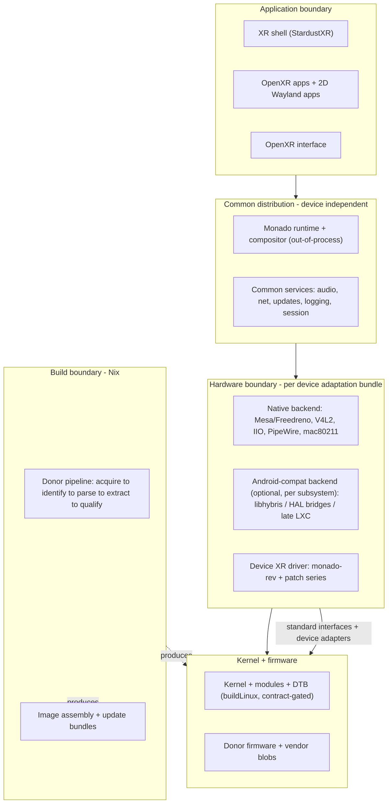

# spatial-os architecture: overview

**Status:** draft, derived from [docs/research/00-synthesis.md](../research/00-synthesis.md).
This document defines the layers, the boundaries between them, and the vocabulary the rest of
`docs/architecture/` uses. It is deliberately technology-specific where the research settled a
decision and deliberately open where a hardware spike is still required.

## What spatial-os is

A Nix-built, NixOS-based, Wayland-based Linux XR distribution that targets many standalone VR
headsets by turning **pinned vendor firmware ("donors") + device definitions + pinned sources** into
**reproducible flashable artifacts**. The distribution itself is device-independent; each supported
headset is a versioned hardware-adaptation bundle plus a small typed contract. The whole system is
deterministic: same inputs → same artifacts, with reproducibility treated as tested release
evidence rather than an assumed property of using Nix.

The central design rule, from the synthesis:

> Build the distribution independently of the device, but qualify and deploy it together with an
> explicit, versioned hardware dependency set.

## The four boundaries

1. **Build boundary.** Nix turns pinned sources, donor firmware, and device definitions into
   reproducible artifacts. `nix build` never touches hardware; flashing is a separate, human-driven
   step with its own verification. (See [donor-pipeline.md](donor-pipeline.md),
   [images-and-updates.md](images-and-updates.md).)
2. **Hardware boundary.** A per-device adaptation bundle binds kernel + modules + DTB + donor
   firmware + per-subsystem backends + the device's XR driver + hardware config into one qualified
   compatibility unit. (See [device-contract.md](device-contract.md).)
3. **Application boundary.** OpenXR and ordinary Wayland/Linux interfaces keep the shell and
   applications independent of any individual device.
4. **(Implicit) release boundary.** Signing, redistribution gating, and reproducibility evidence
   sit around the build boundary; keys live outside the Nix store.

## The layers, top to bottom

### Application layer (device-independent)
The XR shell (StardustXR reference server, an OpenXR client), OpenXR applications, and 2D Wayland
applications. Talks only OpenXR and Wayland. Knows nothing about specific hardware. This layer is
in scope for the project but deliberately not the focus of the build-system architecture; its
packaging is covered briefly in [device-contract.md](device-contract.md) §XR and in the XR research
doc.

### Common distribution layer (device-independent)
Owns the **packaging and session policy** for the shell, the application environment, networking
policy, user management, update policy, logging, diagnostics, security policy, and the **XR
runtime**: Monado running out-of-process and socket-activated, with
`/etc/xdg/openxr/1/active_runtime.json` declared by the module system. The shell *process* runs at
the application boundary (below) as an OpenXR/Wayland client; the common layer decides how it is
packaged, wired into the session, and configured — it does not embed hardware knowledge. "Common"
means a shared package closure per CPU architecture and runtime family, plus a small device-specific
configuration closure — not a byte-identical filesystem on every device.

Realized as NixOS modules under `modules/os/` (distro policy) and `modules/xr/` (runtime + session).

### Hardware-adaptation layer (per device)
Where hardware knowledge lives, below the OpenXR/Wayland interfaces. Three independently selectable
backend kinds **per subsystem** (display/GPU, camera, sensors/IMU, audio, Wi-Fi/BT, DSP tracking):

- **native** — the function is provided by the mainline Linux stack (default posture given the
  device landscape: Mesa/Freedreno, V4L2, IIO, PipeWire, mac80211/BlueZ).
- **android-backed** — an Android HAL/vendor library/service provides it, via libhybris `dlopen`,
  `libgbinder` IPC, or a late-starting, optional LXC container. Never a boot dependency.
- **device-specific** — a dedicated implementation, typically for tracking or display control.

The device's XR driver is part of this layer, expressed as a pinned Monado revision plus a patch
series (Monado has no stable out-of-tree driver ABI). Realized under `modules/adaptation/`, `soc/`,
`families/`, and `devices/<vendor-model>/`.

### Kernel + firmware layer (per device)
A standalone `buildLinux` derivation per device/family (vendor tag + `structuredExtraConfig` with
per-option provenance), a kconfig **contract** gate that verifies the kernel meets the userspace's
requirements, DTBs, and the donor-derived firmware/vendor-blob closure. Kernel builds are decoupled
from image builds so a shell change never rebuilds a kernel.

## Where each concern is documented

| Concern | Document |
|---|---|
| What a device must declare (typed options) | [device-contract.md](device-contract.md) |
| Turning donor firmware into pinned artifacts | [donor-pipeline.md](donor-pipeline.md) |
| Building flashable images and shipping updates | [images-and-updates.md](images-and-updates.md) |
| Monorepo layout and patch management | [repo-structure.md](repo-structure.md) |
| Contested decisions and their rationale | [adr/](adr/) |

## Non-negotiable invariants

These fall out of the research and hold across every document:

1. **`nix build` never flashes a device.** Tools refuse to write to block devices; flashing is a
   separate stage that independently verifies model, firmware prerequisites, slot state, and
   bootloader conditions.
2. **Every donor input is hash-pinned** (`fetchurl` public, `requireFile` non-redistributable,
   explicit path option for on-device extraction) with recorded provenance.
3. **Donor-containing outputs never reach a *public* cache.** Cache eligibility is a three-way
   policy on every artifact: `publicRedistributable` (public cache OK), `privateSubstitutable`
   (a private, access-controlled cache only), or `localOnly` (`allowSubstitutes = false;
   preferLocalBuild = true`). Any closure containing non-redistributable donor bytes inherits the
   strictest label of its inputs. `redistributable = false` in a donor manifest maps to
   `localOnly` for outputs embedding those bytes, and at most `privateSubstitutable` for the private
   device cache — never `publicRedistributable`. (Resolves the apparent
   [invariant-3 vs. private-cache](repo-structure.md) contradiction the review flagged.)
4. **Per-unit calibration/identity is sacred** — never copied between units, protected across flashes.
5. **Signing keys live outside the Nix store**; in-store artifacts use test keys and are cacheable.
6. **The common distribution is device-independent** — device modules select and configure, they do
   not fork services or ship replacement rootfilesystems.
7. **Reproducibility is tested** — releases carry independent-rebuild byte-comparison evidence, not
   an assumption.
8. **A kernel meeting the contract is a precondition for the default NixOS userspace** — an old
   vendor kernel does not freeze the whole distribution; see
   [adr/0002-nixos-vs-nix-built-userspace.md](adr/0002-nixos-vs-nix-built-userspace.md).
