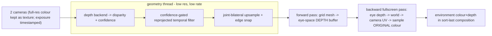

# Perception: passthrough view-correction and hand cutout

**Status:** design, extending [zxr-shell-v2-composition.md](zxr-shell-v2-composition.md).
**Date:** 2026-09-22. Synthesizes research docs [13-passthrough](../research/13-passthrough.md),
[14-mobile-stereo-depth](../research/14-mobile-stereo-depth.md),
[15-hand-segmentation-matting](../research/15-hand-segmentation-matting.md), and
[16-perception-claims-audit](../research/16-perception-claims-audit.md). Service placement is decided
in [adr/0008-perception-services-placement.md](adr/0008-perception-services-placement.md).

## The decomposition

"Passthrough with hand cutout and world mapping" is three problems in different architectural
places. This document covers the two that couple to the compositor; world mapping/anchors (SLAM,
planes, persistence) is a separate runtime-layer track and is out of scope here.

| Problem | What it is | Where it lives |
|---|---|---|
| **View correction (passthrough)** | reproject two cameras (displaced from the eyes, captured earlier) to each eye at display time, using a depth proxy | compositor **environment layer** (farthest contributor to the sort-last composition) |
| **Hand cutout** | a camera-aligned **alpha matte + hand depth**, composited over virtual content per policy | compositor **foreground top layer** + a per-client policy enum |

The unifying insight: **both are compositor-owned layers in the existing zxr-shell-v2 sort-last
pipeline** ([composition §2/§7.4](zxr-shell-v2-composition.md)), not new machinery. Passthrough
writes real colour + `gl_FragDepth` as the environment; the nearest-depth resolve then gives correct
per-pixel real/virtual occlusion **for free** — no new protocol, no vendor depth-test extension. The
hand matte is applied after that resolve as a policy-driven top layer. Neither is ever a *client*:
they are compositor-internal, like 2D-plane rasterization, so they are never subject to the client
composition cutoff.

The two are coupled through depth: **hands are simultaneously the hardest passthrough depth (nearest,
fastest, low-texture — reprojection error scales `≈ f·t·δZ/Z²`, so ~3 px of stereo-inconsistent swim
at 30 cm for a 1 cm error, invisible at 3 m) and the object of the cutout.** So the hand matte does
double duty: alpha for MR compositing *and* a mask giving hands their own geometry/latency policy
inside the passthrough warp. That coupling is why they share one research effort and one service
(ADR 0007); world mapping does not couple this way and is separable.

## The shared production architecture (settled)

Every deployed system converges on one shape ([13 §2](../research/13-passthrough.md): Passthrough+,
Quest Pro/3, Vision Pro, Play For Dream), differing only in the depth estimator:

> **Low-resolution, low-rate, temporally-fused geometry + full-resolution colour sampled at display
> rate through that geometry, with only the final per-eye warp on the display's critical path.**

Three decoupled rates, and the asymmetry that justifies the whole structure:

1. **Camera cadence** (~30 Hz) — the floor on colour freshness.
2. **Geometry cadence** (≤ camera; often lower) — depth solve. Passthrough+ measured photon-to-**geometry** 62 ms and tolerated >100 ms in prototypes.
3. **Display cadence** (72–120 Hz) — the per-eye warp runs here **and only here**.

Passthrough+ measured photon-to-**texture** 49 ms vs photon-to-**geometry** 62 ms and stated colour
freshness matters ~2× more than geometry freshness. Two hard rules fall out, both already required
of zxr-shell-v2 clients and now imposed on perception too:

- **Never block the display path.** A slow depth or matte update must never stall scanout; the warp
  reads the last *complete* snapshot and re-derives from the current head pose.
- **Latency beats cleanliness.** Three independent Play For Dream reviewers preferred its noisier
  14 ms mode over the cleaner 40 ms one. The quality knob lives on the geometry pipeline, never the
  display path; the default favours latency.

## Passthrough pipeline

The concrete implementable reference is Rectus (`references/openxr-steamvr-passthrough`), whose
shaders and reconstruction path [13 §3](../research/13-passthrough.md) documents line-by-line. Its
one load-bearing structural lesson is the **two-pass split**:



- **Forward pass** rasterizes a grid mesh to turn camera-space disparity into an **eye-space depth
  buffer** (hardware depth test resolves visibility). **Backward fullscreen pass** reads that eye
  depth, reconstructs the world point, projects into the source camera, and samples the **original**
  (never re-rectified) camera colour. This decouples geometry resolution from colour resolution: one
  colour resample, full-res detail, no splat holes, no triangle stretching.
- **Rectify only the matching input; correct UVs on the display path** via a baked per-pixel offset
  map. The colour that reaches the eye is resampled once.
- **Same-side camera → same-side eye** is the baseline (shortest warp per eye, full FOV coverage,
  preserved parallax). Cross-camera gap-fill is a per-device refinement, default off, gated on
  geometric agreement + mutual confidence ([13 §6](../research/13-passthrough.md)).
- A **bounded proxy surface** (fixed-depth cylinder/hemisphere) is only the backstop behind gaps,
  never the primary geometry — a fixed radius mis-registers near content by degrees.

### Anti-wobble (the actual quality battle)

"Wobble" is a temporal artifact of spatial depth error; the corpus spends more code here than on
accuracy ([13 §4](../research/13-passthrough.md)). spatial-os adopts the full set: confidence-gated
**reprojected** temporal depth filtering with geometric rejection **and depth-dependent history
length** (near hands: short memory ≤0.2 s; far walls: long); joint-bilateral upsampling guided by
full-res luma with taps rejected across depth edges; Sobel depth-discontinuity **snapping** so
silhouettes are hard (a soft edge swims); **never rasterize a triangle across a depth
discontinuity**; solve on **inverse depth**; bounded priors (treat unknown as *far*, floor clamp,
backstop surface).

### Hole-fill priority

Three hole kinds, three answers ([13 §5](../research/13-passthrough.md)): (1) other camera first
(real data from a valid viewpoint), (2) validated reprojected history (stale but real, good for
static backgrounds), (3) cheap weighted-convolution diffusion inpaint (viewcorrection's kernel; the
Huber-TV solver is the offline quality reference, too expensive for-frame), (4) bounded backstop.
Never hallucinate detail — both NeuralPassthrough and viewcorrection reject inpainting-with-detail
for temporal-flicker reasons.

## Depth backend (pluggable)

Depth is *which estimator*, behind a stable interface the compositor consumes. The interface
(`DepthFrame`, [14 §5](../research/14-mobile-stereo-depth.md); == the passthrough doc's
`DepthSnapshot`) is the contract:

- per-view **disparity/depth with a declared encoding** (`FLOAT` | `FIXED_16(frac)` |
  `HILBERT8(order)` — the two-channel Hilbert encoding is first-class so a W8A8 Hexagon backend
  needn't dequantize on CPU);
- **confidence + validity always present** (measured / temporally-propagated / completed / hole) —
  every anti-wobble stage is gated on it; a backend that can't produce it forces a fabricated one;
- **capture (mid-exposure) timestamp**, in the pose clock, not publish time;
- **calibration version** (droppable atomically on IPD/thermal recalibration);
- intrinsics + baseline + rectified pose per view (enough to build `Q`); a full-res rectified luma
  **guide image** for the joint-bilateral upsample.

Four interchangeable backends, all **gated on BSP inspection** per the claims audit
([16 Part 1](../research/16-perception-claims-audit.md)):

| Backend | Status | Role |
|---|---|---|
| **A. Classical GPU stereo** (Vulkan compute: census/SAD → aggregate → subpixel → confidence; or OpenCV SGBM day-1) | available, depends only on standard Vulkan + camera access | **the baseline and fallback** |
| **B. `VK_QCOM_image_processing2/3` block-match** | potentially valuable, unverified on XR2+ (Adreno 7xx drivers may omit it) | accelerate correspondence *with identical compute fallback* |
| **C. Adreno Depth-From-Stereo** (CVP DFS engine, "<1 ms") | real component, access **unverified** — vendor/OEM-negotiated plugin, do not infer from an Adreno GPU | drop-in hardware backend if exposed |
| **D. Hexagon HTP learned stereo** (TC-Stereo-/LightStereo-class via ONNX→QNN or ExecuTorch `.pte`) | documented on embedded Linux, BSP+model-gated (INT8, static shapes, memory) | quality backend where NPU headroom exists |

Adopt **temporal stereo** (TC-Stereo's carry-disparity+GRU-state-forward, proven 30 FPS on XR2 by
XR-Stereo — verified dataset-only release, paper-backed) as the phase-2 recipe. **Teacher–student**
is the shipping-weights workflow: an MIT teacher (RAFT-Stereo) run offline over headset-camera
captures pseudo-labels a small on-device student — which also sidesteps Fast-FoundationStereo's
non-commercial license. Evaluate every backend by **rendered eye-view error and temporal jitter on
fixed captured sequences**, never a disparity screenshot.

## Hand cutout

Four distinct artifacts, routinely conflated ([15 §1](../research/15-hand-segmentation-matting.md)):
**joints** (Mercury, 26/hand — a *prior*, not a cutout), **segmentation mask** (binary/semantic),
**alpha matte** (`I = αF + (1−α)B`; the compositor needs α *and* a foreground estimate F, because
reusing the camera pixel as F bleeds the real background into a halo at soft edges), **hand depth**
(for reprojection + `.automatic` ordering). The compositor consumes **matte (premultiplied αF, α) +
hand depth, aligned to one capture timestamp**.

Critical correction, cited from source: Monado's `xrt_hand_masks_sample` is **bounding boxes** (one
`xrt_rect_f32` per hand per view, consumed only by SLAM to *ignore* features on hands) — finding
"hand masks" in Monado does not mean a cutout exists.

Mercury's joints feed the cutout as priors (ROI crop → run the net on ~256² crops not full views;
21 projected 2D joints as a trimap/skeleton seed; capsule radii + the 22-bin depth head as a depth
prior; motion/handedness gating to reset recurrent state) — **but the cutout must be a parallel
camera-frame service that runs without Mercury**, because Mercury deliberately drops tracking exactly
when hands overlap (the visually most important moment).

Prototype path, each tier ships something:

- **Tier 0 — policy plumbing + geometry mask.** Add the upper-limb policy enum to the protocol and
  the compositor top-layer pass; render Mercury capsules per eye for a hard α and hand depth. No ML,
  no camera pixels. Validates the whole contract; remains the permanent fallback. (This is Meta's
  `HandsRemoval` geometry-mask approach.)
- **Tier 1 — Mercury-seeded greyscale segmentation.** A reimplemented Ego2Hands-CSM-class small net
  (1–2 ch grey+Canny, 3 classes + energy head — Ego2Hands is greyscale-native, matching monochrome
  tracking cameras) on Mercury ROI crops; binary mask → guided-filter feather as provisional α.
- **Tier 2 — recurrent matte.** RVM-style ConvGRU decoder + deep-guided-filter, predicting α **and**
  F-residual, with a Mercury-prior input channel; reset recurrent state on Mercury appearance
  events. Removes the halo and temporal flicker.
- **Depth refine.** Stereo patch refinement inside the matte ROI, seeded by capsule depth; keep a
  `smoothstep` fade for `.automatic` (a hard z-test on noisy hand depth flickers at contact).

**Composition policy** (the visionOS contract, verified: premultiplied alpha, reverse-Z,
`.visible`/`.hidden`/`.automatic`): a **per-spatial-client policy attribute** in the zxr protocol,
shell-owned default `automatic`, applied as a compositor top layer *after* the nearest-depth resolve:

```
resolve clients -> (C_scene, d_s)
per eye: warp (αF_hand, α, d_h) camera(t_capture) -> eye(t_display)   # ALL channels, one warp
  visible:   C = αF + (1-α)·C_scene
  hidden:    C = C_scene
  automatic: occ = smoothstep(-ε, +ε, d_h - d_s); α' = α·(1-occ·fade); C = α'F + (1-α')·C_scene
```

Clients declare policy only — never see the matte or camera frames (a privacy boundary; hand images
are biometric-adjacent), exactly as they declare bounds. The hand layer obeys the client deadline
rule: no fresh matte at cutoff → late-warp the previous one by head-pose delta, drop past a staleness
bound (degrade to passthrough-hands-absent), never stall.

**Licensing** ([15 §7](../research/15-hand-segmentation-matting.md)): every path to shippable weights
runs through **data we generate ourselves** (device captures + composited synthetic hands +
teacher pseudo-labels on our own footage). Ego2Hands (NC dataset, no code license) is
evaluation-only; RVM (GPL-3.0) informs the architecture and, if used as-is, runs as a separate
process; EgoHOS (MIT code, upstream-dataset caveats) is a teacher. All recorded in the device/build
contract where a shipping decision would hit them.

## The shared invariants (both layers)

1. **Same-timestamp atomicity.** Colour, depth/matte, confidence, and pose travel as one unit keyed
   to the camera exposure time; a perfect matte or depth on the *wrong* frame is a wrong result.
2. **Pose-at-exposure.** Every camera frame carries its mid-exposure timestamp; the pose is *queried
   for that timestamp* (Passthrough+ saw visible float from a 4 ms timestamp error). If Monado's
   pose query can't serve arbitrary timestamps at the needed rate/accuracy, that is a **blocking
   dependency**, not a detail.
3. **Non-blocking publication.** Both services publish latest-complete; the display path never awaits.
4. **Calibration-versioned; per-device geometry is a contract input.** Camera↔eye offset, baseline,
   camera-vs-display FOV, rolling-shutter, IR illumination, and which camera is the matte source all
   belong in the typed `spatial.*` device contract, not in compositor constants.

## Contract surface (additions)

Minimal typed options under `spatial.xr.passthrough.*`, consistent with this design (stubs now;
semantics tracked in the design backlog):

- `enable` (bool), `latencyMode` (enum `low-latency` | `high-quality`, default `low-latency`),
- `depthBackend` (enum `classical` | `vk-qcom` | `adreno-dfs` | `hexagon` | `none`, default
  `classical` — the BSP-independent baseline),
- `handCutout.enable` (bool) and `handCutout.upperLimbVisibility` (enum `visible` | `hidden` |
  `automatic`, default `automatic`) — the per-client-overridable shell default.

Per-device camera geometry (offset, baseline, FOV, matte-source camera, IR/exposure notes) extends
`spatial.adaptation.camera` / the device contract.

## Metrics and sequencing

Measure the **three ages separately** ([13 §8](../research/13-passthrough.md)): capture-to-display
(colour freshness), geometry age, late-pose response — a single "latency" number hides which is
broken. Report distributions (p90/p99), not means. Test scenes target specific failures: hands at
20–40 cm (still + fast), reach-and-grasp, printed text at 30/60/200 cm, thin structures, low light,
fast lateral head translation, textureless walls, mixed real/virtual occlusion, and a depth-source
outage (must degrade to stale-geometry warp, never stall).

Passthrough milestones P0–P6 ([13 §7.4](../research/13-passthrough.md)) and hand tiers 0–2 above
sequence independently but share the perception service and the camera pipeline. Both are gated
behind the display-path feasibility work and the BSP-access unknowns the claims audit enumerated.

## Open questions (carried to ADR 0007 and the backlog)

Where the perception services live (Monado-side vs compositor-internal vs sibling) and the dmabuf +
explicit-sync delivery interface — decided in [ADR 0008](adr/0008-perception-services-placement.md).
Plus: geometry resolution/topology (per-camera grid vs head hemisphere); whether a full-res per-eye
environment depth target is affordable; depth-dependent thresholds (`Z²` scaling nobody implements);
passthrough-depth vs Monado reprojection interaction (double-warp risk); the matte-source camera per
device; upper-limb scope (forearm/sleeve); held objects; two-hands-interlocked degradation; and the
BSP questions from [16 Part 1](../research/16-perception-claims-audit.md) (camera zero-copy, Adreno
DFS/HTP availability, the "12 ms mode" endpoints).
