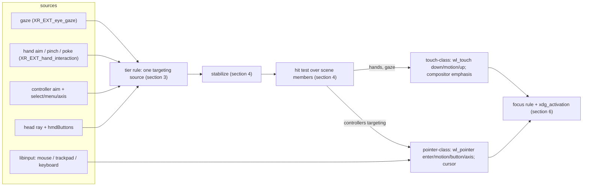

# Spatial input: targeting, hover, commit, focus, cursors, peripherals and text entry

**Status: DRAFT rev 0.7 (2026-09-29; rev 0.6 + §13 the body frame withdrawn — the default is the **world** frame on the shell's anchor, seeded where the scene appears and re-seated only by recenter; no comparable has a body frame, research/78 §9 F23). Rev 0.6 (2026-09-28; rev 0.5 + §13 the input floor as one rule for every surface, dwell global with its anchor on the hit point and progress on the reticle, and the body frame as the default placement — owner rulings; research/78 §7b, §9 F2). Rev 0.5 (2026-09-27; rev 0.4 + §6 layer-shell keyboard interactivity as the
focus module's rules — the exclusive override, `on_demand` as a stack member, `none` never, the
mode gate's exception as the trusted connection — [research/77](../research/77-shell-layer-mechanics-from-comparables.md);
rev 0.4 = same day; rev 0.3 + §5 a ray-owned pointer is **released when gaze
takes the tier**, §14 the `input.cursor.ray` / `input.cursor.scale` preferences — research/70 §9.2;
rev 0.3 = same day; rev 0.2 + §7 **one cursor element** ruled and built as one
composition layer in one fixed swapchain, [research/70 §9](../research/70-input-bring-up-results.md); rev 0.2 = 2026-09-26; rev 0.1 + §1a **implemented** markers from
[research/70](../research/70-input-bring-up-results.md) — the module as built in `pkgs/zxr/src/input/`, the §1a trigger measured and not met, `MNDX_system_buttons` wording corrected, the §7 cursors as quads and the theme mechanism; rev 0.1 = rev 0 + §1a "Where input lives, and how it is built" from
[research/68](../research/68-input-architecture-from-comparables.md), §10 and §13 amended).** The design of the compositor's `input` module
([specs/zxr-core.md §3, §8](../../specs/zxr-core.md)) and of the input authority the registry
names, derived from [research/63](../research/63-xr-input-focus-selection-from-comparables.md)
and ruled in [ADR 0013](adr/0013-kwin-vr-disposition.md)'s 2026-09-26 amendment. It consumes the
input floor ([research/42](../research/42-input-bootstrap.md); `mura.hardware.input.*` in the
[device contract](device-contract.md)), the interaction patterns already selected
([research/36 §9](../research/36-vr-shell-interaction-patterns.md): keyboard dual mode,
dictation fallback, recenter), composition §7.3 constraints 2 and 7
([zxr-shell-v2-composition.md](zxr-shell-v2-composition.md)), and the scene arenas
([specs/zxr-core.md §5a](../../specs/zxr-core.md)) whose member pass is the hit test. It is
consumed by [window-workspace-management.md](window-workspace-management.md) (arrangement rules
and grab *policy* are its; the gestures, focus *rules*, routing and cursors are this document's).
**Grounding.** "XDG" here means the `xdg_*` Wayland protocol namespace (`xdg_wm_base`,
`xdg_activation_v1`); OpenXR terms are the specification's (`aim`/`grip`/`pinch_ext`/`poke_ext`
poses, interaction profiles, `XR_SESSION_STATE_FOCUSED`); Wayland terms are the core protocol's
(`wl_seat`, `wl_pointer`, `wl_touch`, `wl_keyboard`). Every threshold below is a **stand-in**
from a named comparable until measured on Mura's trackers; the design says which.
**Budget impact** (overview invariant 9): no thread. Per tick: one stabilization filter per
active source (a quaternion low-pass and a scalar hysteresis — arithmetic), one hit test over the
scene's member pass (the pass the renderer already makes, [research/62 §7](../research/62-scene-data-model-from-comparables.md)),
and the seat's event emission. libinput runs on the state loop through smithay's backend (fd
source). Hand aim/pinch synthesis is the runtime's (§10), so it costs zxr nothing when Monado
provides it; the bridge costs one joint-set read per hand per tick while it does not.

## 1. The model in one paragraph

Input has **sources** (where a ray or point comes from), a **tier rule** that picks the one
targeting source active now by precision, a **stabilization** stage, a **hit test** over the
scene, and **two transports** to clients: touch-class for hands and gaze, pointer-class for mice,
trackpads and (when they target) controllers. Hover is the compositor's — never a client's — for
touch-class sources; it is the client's for pointer-class ones. **Commit** is pinch, trigger,
button or dwell mapped onto `down`/`button`. **Focus follows the commit and never hover**;
activation is serial-validated; refusal is urgency. Gaze never reaches a client (one specified
exception). The cursor exists only for pointer-class sources. A physical keyboard follows the
seat's keyboard focus. Text fields summon the keyboard component through `text-input-v3`.



## 1a. Where input lives, and how it is built (rev 0.1; research/68)

**Placement, per seam** — each a determination from converging comparables with reasons that
transfer, except where marked as the owner's:

| seam | lives in | evidence and reason |
|---|---|---|
| the seat, hit test, focus, routing | **the compositor** (`input` module on the state loop) | `wl_seat` is a compositor global; every Wayland compositor read owns it in-process; the one separate-process dispatcher (Android InputFlinger) exists for a Java policy layer, per-app ANR accounting and a compositor that is not the window manager — none present (research/68 §1.1, §4) |
| device sensing, interaction-profile binding, aim/pinch/poke synthesis, the reserved `system` click, per-session focus | **the OpenXR runtime** | the standard's placement (`input.adoc:499-505`, `ext_hand_interaction.adoc:48-61`, `extx_overlay.adoc:194-199`); every XR shell polls actions and hit-tests in its own process (research/68 §3) |
| the **system-gesture recogniser** (the posture-gated palm gesture of native-openxr-apps §6) | **the runtime**, reported as a flag on the hand data; **zxr bridges** until Monado has it | every platform recognises it system-side and tells the app to stand down through a flag (Meta `SystemGestureProcessing`, Android XR `AimFlags.SystemGesture`, HoloLens's shell); it is already OpenXR-shaped — `XR_FB_hand_tracking_aim`'s `SYSTEM_GESTURE_BIT_FB` / `MENU_PRESSED_BIT_FB` (`xr.xml:8374-8376`); Monado implements neither the extension nor a gesture → the same bridge pattern as §10, an upstream item on ADR 0013's list (research/68 §3.1, §3.5) |
| libinput intake (mouse, keyboard, HMD-body buttons) | **the state loop**, as a calloop source — **ruled (owner, 2026-09-26; research/68 §9.1); implemented** (`input/libinput.rs`, `ei.rs`; every event dispatched through the chain on arrival, `input::dispatch`). The trigger was measured (research/70 §3.2): event→`xrEndFrame` 8.4–8.7 ms per event under a 1 kHz stream with the research/62 §8 storms, intake age 0 — under one display period; **no input thread**. (The priority above client sources is not set: this smithay's calloop exposes none — recorded.) | research/68 §1.2–1.3, §7; research/70 §3 |
| XR intake (head, gaze, hands, controllers) | **once per tick**, `xrSyncActions` after `xrLocateViews`, before the flatten — **implemented** (`input/actions.rs`; the action spaces ride the tick's one batched `xrLocateSpaces`) | the standard freezes action state between syncs (`input.adoc:826-830`); on Monado a sync is **one IPC round trip per device** (`oxr_input.c:2045-2050`, `ipc_client_xdev.c:37-70`) — measured 21 µs without controllers, 45 µs with two, 7.07 calls/frame in all (research/70 §3.1); the upstream item stands (batch across devices, as `xrLocateSpaces` does) |
| input methods / virtual keyboard | **separate clients** over `input-method-v2` + `virtual-keyboard-v1`; the compositor's seat re-emits — **implemented** (`input/text.rs`; wvkbd bound in the nested harness) | every desktop; KWin spawns and restarts its IM process (`kwin/src/inputmethod.cpp:864-925`) — third-party code must not take the compositor down |
| emulated / remote input | **libei clients**; **zxr is the EIS server**; the portal brokers consent — **implemented** (`input/ei.rs`; samples carry `EMULATED`; a reis sender typed into foot in the harness) | libei's stated purpose — separation, distinction and control of emulated input (`libei/README.md:32-71`); mutter, KWin and cosmic-comp terminate EIS in the compositor |
| accessibility *transforms* (dwell, sticky/slow/bounce keys, mouse keys) | **in-compositor pipeline stages, ahead of the lock/greeter mode** — **implemented** for dwell and pointer gain (`input/a11y.rs`; the reserved stage runs *before* a11y, the design's divergence from KWin, flagged) | KWin's filter order puts them first (`kwin/src/input.h:366-393`) as plugins; mutter runs them on its input thread; switch *scanning UI* stays a client (§13) |

**Inside the module.** The comparables share two seams — a source/device abstraction the intake
backends produce into, and an ordered policy chain between raw events and the client (research/68
§5). zxr's:

- **The XR source seam is the OpenXR action set.** One action per semantic input — aim pose,
  select, grip, menu, `system`, gaze pose, pinch/poke/`ready` values per hand — with suggested
  bindings per interaction profile (`khr/simple_controller`, `ext/hand_interaction_ext`,
  `ext/eye_gaze_interaction`, each controller profile the contract names; `XR_MNDX_system_buttons`
  where advertised — it *exposes* a controller's home/system button as an ordinary input, it does
  not reserve it: zxr's reserved stage does that; HMD-body buttons arrive through libinput,
  research/42). **Implemented** (`input/actions.rs`: action set `mura`, four profiles bound on
  the simulated HMD, six action spaces). A new controller is a bindings entry,
  not code — the shape wayvr, xrdesktop and WiVRn already rely on. The runtime may rebind
  (`input.adoc:499-505`), which is what lets the wearer's accessibility settings act below zxr.
- **The non-XR source seam is smithay's `InputBackend`** (`backend/input/mod.rs:57-89`): the
  libinput backend and the EI backend both produce `InputEvent`s; zxr adds no abstraction of
  its own beneath it.
- **zxr's own seam is a closed `enum` of source *kinds*** — `Head`, `Gaze`, `Hand(Left|Right)`,
  `Controller(Left|Right)`, `Pointer` (mouse/trackpad/controller-as-pointer), `Keyboard` — over
  which the tier rule (§3) is a `match`. **Implemented** (`input/mod.rs` `SourceKind`, `Sample`,
  `Stage`/`Chain`; research/70 §1). Not trait objects, not loadable plugins: StereoKit's
  reason for a fixed set (the consumer must know which kind it has — articulated, simulated,
  override) is the tier rule's own; KWin's and MRTK3's reasons for plugins (third-party,
  post-hoc addition) are absent in a single binary whose device set the hardware contract fixes.
  **Ruled (owner, 2026-09-26; research/68 §9.2).** Adding a kind the contract does not name
  (an external tracker that is not an OpenXR device) is an enum variant and a bindings entry.
- **The stage order**, one function per stage on a by-value event, short-circuiting, static:

```
intake      libinput fd source · EI · xrSyncActions (per tick)
   ↓
synthesis   aim/pinch/poke/ready + system-gesture flags from the runtime; the joint-derived
            bridge behind the same interface while Monado lacks them (§10)
   ↓
reserved    the system input (native-openxr-apps §6): consumed here, never forwarded
   ↓
mode        --greeter / lock: only the auth scene may receive anything below this line
   ↓
a11y        dwell-as-commit, sticky/slow keys, pointer gain — transforms on raw events
   ↓
stabilize   per-source filter, target lock, relaxation, event-time compensation (§4)
   ↓
tier        the arbiter: which kind targets now (§3); class = touch or pointer (§5)
   ↓
hit test    scene member pass → plane-local point → smithay surface-tree hit (spec §5a)
   ↓
grabs       WM policy: move/resize/grab-all, popup grab, decoration/affordances, DnD
            (window-workspace-management.md — policy owns these stages' decisions)
   ↓
IM          text-input / input-method routing — sees only what nothing above consumed
   ↓
seat        wl_touch / wl_pointer / wl_keyboard emission; xdg-activation; cursors (§7)
```

  **Implemented** as nine static slots (`reserved:system`, `mode:greeter-lock`, `a11y:dwell-gain`,
  `stabilize:ray-lock-compensate`, `tier:arbiter`, `hit:scene-members`, `grabs:wm` (the window
  grab — bar, body grabs, client move/resize requests; window-workspace-management §4a, research/76), `im:text`, `seat`), the startup log's `input chain stages=` line. This is
  KWin's `InputFilterOrder` (`kwin/src/input.h:366-393`) with the XR stages inserted
  where their inputs exist, and without the plugin loader: rebinding and a11y before the lock,
  the compositor's non-maskable input first of all, WM grabs after targeting, the IM last before
  the seat. Mir's `EventFilterChainDispatcher` and Android's reader→filter→classifier→dispatcher
  chain express the same order.

**Budget** (invariant 9): no thread; per tick one `xrSyncActions` (N_devices RPCs on Monado
today — Monado updates every device regardless of which action sets are passed,
`oxr_input.c:2045-2050`; the largest per-tick input cost, and the runtime's to fix) + the
batched locate zxr already makes; per libinput event one loop dispatch through a ≤ 10-stage
chain of by-value calls; the enum dispatch is free. The numbers to measure at the M1 gate:
libinput-event→`xrEndFrame` under the research/62 §8 client storm against one display period
(the research/68 §9.1 trigger — **after** the quiet-mode buffer-hold policy is resolved, since a
withheld `wl_buffer.release` is the only throttle that storm feels and input placement cannot
fix it); `runtime_calls_per_frame` with the action set attached; and, while a native app is
primary, the joint-bridge gesture recogniser's cost — two hand-locate RPCs per sample in the
state where zxr is meant to cost nothing — at 90 Hz vs a lower sampling rate for a hold
gesture (30 Hz is the candidate). A tick-bound libinput read (poll the fd only at the tick, as
`xrSyncActions` is) is recorded as a rethink candidate with no comparable: 90 wake-ups/s for a
1 kHz device instead of 1 000, at up to one frame of client responsiveness; not the default.

**Measured (research/70 §3, nested host):** 7.07 runtime calls per frame with the action set
attached (5.07 before), `xrSyncActions` 21/45 µs without/with two controllers; event→`xrEndFrame`
8.4 ms per event idle and 8.7 ms under the vkcube MAILBOX and glmark2 EGL storms at a 1 kHz
pointer stream, intake age 0 — the trigger above is not met; wake-ups 1.7–1.9 k/s idle against
1.0 k on the spine (the two added round trips), 2.8 k with the stream; CPU 10–13 ms/s idle. The
tick-bound libinput read was measured on the way (14.8/31.5 ms oldest-event mean/max against
8.3/14.0 per-event dispatch) and stays a rethink candidate, not the default.

**Non-goals (recorded):** a Mura input daemon; the runtime as the hit-tester (SteamVR's overlay
model assumes the runtime owns the overlays' geometry — false for zxr's scene); input source
plugins loaded at runtime.

## 2. Sources

| source | provided by | what it yields | present when |
|---|---|---|---|
| gaze | runtime, `/user/eyes_ext/input/gaze_ext/pose` (`XR_EXT_eye_gaze_interaction`) | a ray in LOCAL, `sample_time`, nominal/sub-nominal tracking | the contract's eye-tracking class and the runtime's `supportsEyeGazeInteraction` |
| hand | runtime, `/interaction_profiles/ext/hand_interaction_ext`: aim, pinch, poke, grip poses; `pinch_ext/value`, `aim_activate_ext/value`, `grasp_ext/value` with `ready_ext` | per hand: a stabilised aim ray, a pinch point and value, a poke tip | hand tracking up (cameras on); §10 for the Monado gap |
| controller | runtime, the device's interaction profile (falls back to `khr/simple_controller`: `aim/pose`, `select/click`, `menu/click`) plus thumbstick/trackpad axes where the profile has them | per controller: aim ray, select, menu, axes | the contract's `controllers` class; `optical-6dof` counts as `imu-3dof` pre-login |
| head | runtime, `VIEW` space; `hmdButtons` through libinput (device-contract `input`) | a ray from the head; select/back | always (the floor) |
| peripherals | libinput on the seat (BlueZ HID → evdev; no Bluetooth-specific path — `libinput/src/udev-seat.c:82-99`) | pointer deltas, buttons, wheel/finger scroll, keys, touchpad gestures | when present; hot-plug through udev |

All XR sources arrive through the one OpenXR session zxr holds; the runtime gives zxr input only
while the session is `FOCUSED` (`input.adoc:839-843`), which zxr always is — as the only session,
and as an overlay session beside a native OpenXR application (Monado keeps overlay sessions
focused, `ipc_server_process.c:562-567`; [native-openxr-apps.md §2, §5](native-openxr-apps.md)).

**The reserved system input (added 2026-09-26; research/66 §12 verdict 4).** One control per
device tier — the contract's `hmdButtons.systemRole` and the controller's `/input/system/click`
— is consumed by zxr before any client and **never delivered to any client**, native or Wayland:
it is the compositor's non-maskable chord (mutter's `restore-shortcuts`, niri's hardcoded binds —
"the user has no way to unlock the compositor… 'jailing' the user"), OpenXR's `system` semantics
("may not be available to applications"), and every platform's rule. Short press summons the
shell, long press recenters (research/36 §8), double press shows/hides or toggles passthrough;
quit is a shell menu item plus a force chord ([native-openxr-apps.md §6](native-openxr-apps.md),
ruled). On every tier the same role is also carried by a **posture-gated, held palm gesture**
(palm toward the face + pinch-and-hold, the platforms' shape) — the owner's requirement is that
no reserved gesture may interrupt the experience, which is why it is posture-gated, deliberate,
shows its affordance only while the posture is held, and suspends clients' gesture recognition
while in progress; thresholds and affordance are this workstream's to specify. Where both an
HMD-body and a controller control exist they carry identical semantics (PICO's rule). On Monado today a
controller system click also reaches the focused app — the runtime-side reservation is an
upstream item (research/66 §14); HMD-body buttons reach zxr alone through libinput (contract A2).

## 3. The tier rule (ruled)

Exactly one **targeting** source is active at a time; the commit device may be any. Precedence,
highest precision first, chosen from what the contract declares and the runtime reports:

1. **Gaze**, when nominal. Whatever commits — pinch, controller trigger, `hmdButtons.select`,
   dwell — commits *at the gaze target*. Tracked controllers do not take over targeting (the
   dissent, Meta's switch to the controller ray, is recorded in research/63 §15).
2. **Controller aim ray**, when controllers are held and gaze is absent or sub-nominal for
   longer than the fallback timeout (stand-in **500–1500 ms**, HoloLens' order). Pointer-class.
3. **Hand aim ray**, when hands are tracked and neither of the above. Touch-class.
4. **Head ray** + `hmdButtons.<selectRole>` / dwell — the floor (research/42 §4.4). Touch-class.

**Direct touch overrides a ray** for hands within a distance band of the plane: enter direct at
**0.18 m**, leave at **0.22 m** (WiVRn `constants.h:45-47`, the one comparable with both bounds;
research/36 §7 already selected it for the keyboard). Poke uses the `poke_ext` tip; a plane
crossing in the surface normal's direction is the `down` (Meta's poke semantics), with the
StereoKit rule that the focus volume grows once focused so a finger passing through the plane
does not lose the target.

Tier changes are **events**, not silent: the cursor appears or disappears (§7), the shell may show
which source is active, and a change never happens mid-gesture (kwin-vr's "do not stop movement
when we already started"; MRTK3's near-mode latch while a grab continues).

## 4. Targeting, stabilization and the hit test

**Stabilize before arbitrating** (constraint 7). Per active source: a low-pass on the ray
orientation (stand-in: MRTK3's exponential decay, half-life **0.01 s** position / **0.05 s**
direction, `LOSAngularOffsetHandRayPoseSource.cs:18-23`; the runtime already stabilises hand
aim per `ext_hand_interaction.adoc:86-88`, so the compositor's filter is light for tier 1–3 and
matters for the head ray); a **target lock** for the duration of a commit (godot's press lock;
StereoKit's pinch-point lock; MRTK3's sticky hover once select progress passes **0.5**); a
**relaxation** threshold before a new target may be taken after release (MRTK3: **0.1** for
gaze-pinch, **0.5** for rays — "fewer accidental activations will occur with rays"); and
**event-time compensation** — the commit is applied at the target held when the gesture began,
not where the ray drifted during the pinch (xrdesktop's replay, `xrd-input-synth.c:340-362`;
Meta's "the pinch gesture itself causes a slight hand shift"). Target magnetism is a policy option
per constraint 7, off by default, with MRTK3's poke reticle magnetism (**0.07 m**) as the
reference shape.

**The hit test** is the scene's member pass with a ray (spec §5a; research/62 §6.8): nearest
plane wins; then smithay's surface-tree hit within the plane; events bubble to the parent node
when a child declines (zen's contract). Arbitration is **class-aware** (constraint 7): the
compositor's own affordances (bar, handles, close — §8), the shell's layer-shell surfaces, and
client content are distinct classes, and an affordance within its band wins over content behind
it even when farther along the ray by the affordance's depth offset.

**Hover.** For **touch-class** sources the client receives nothing before `down`; the compositor
renders plane-level emphasis of the targeted member (the shell's presentation; the WM doc's
`focus.dim`/`sibling_alpha` are the same state) with a ramp of the HoloLens order (**500–1000
ms**). No cursor. For **pointer-class** sources hover is the ordinary `wl_pointer.enter/motion`
and the client styles itself; the compositor renders the cursor (§7).

**Target size** is a shell rule, not a compositor one: Mura's own components respect **60 pt
area / 16 pt spacing** (visionOS) and **≥ 2° visual angle** (HoloLens) for gaze-targetable
controls; 2D clients cannot be resized by the compositor, which is one reason gaze is never a
fine pointer into their content (§5).

## 5. Transports (ruled)

**Touch-class — hands and gaze.** The seat's `wl_touch`. A commit is `down(id, surface, x, y)`
at the plane-local hit; holding is `motion`; release is `up`; `frame` groups them. Each hand is a
contact id, so two hands are two contacts and toolkits' native two-finger zoom/rotate apply
(visionOS's two-handed gestures in Wayland terms). Scroll is drag or flick (a flick is a short
drag with velocity; toolkits' kinetic scrolling handles it); a pinch-and-hold is the toolkits'
long-press (context menus). The client never sees a position before `down` — gaze privacy is a
property of the transport (§9).

**Pointer-class — mice, trackpads, controllers when targeting.** The seat's `wl_pointer`:
`enter/motion/button/axis/frame`. Mouse buttons and controller `select` → `BTN_LEFT`; the
profile's secondary button (or a trackpad two-finger tap, libinput's tapping) → `BTN_RIGHT`;
wheel → `axis` source `wheel` with `axis_discrete`; trackpad and controller stick → `axis` source
`finger`/`continuous` with `axis_stop`; touchpad pinch/swipe → `zwp_pointer_gestures_v1` as
libinput delivers them. Relative motion and pointer constraints are served (`relative-pointer`,
`pointer-constraints`) for clients that lock the pointer.

**One logical pointer per seat** (Wayland's model; kwin-vr, xrdesktop, WiVRn). When two
controllers target, the one that last committed owns the pointer; the other's ray is drawn but
inert until it commits. Mice and controllers share the same pointer. **When gaze takes the tier
(ruled 2026-09-27; research/70 §9.2), a ray-owned pointer is released:** the ray no longer targets
(ADR 0013 amendment item 1 — with gaze, gaze targets and the ray's trigger commits at the gaze
point), so the client receives `leave` and the pointer is between planes until the ray retakes
the tier (its next sample re-enters) or a pointer-class device claims it; ownership is kept. A
mouse-owned pointer is not released — its position is the mouse's, and a pointer coexists with
gaze (visionOS's pointer "appears where you're looking" [external], research/63 §8). §3's
no-transition-mid-gesture rule means this never happens with a button held. Verified nested:
`enter → leave → enter` on the client across a gaze interlude (`input_pointer_releases`).

**The system gesture** (palm-facing pinch, or the contract's reserved button chord) is the
compositor's; it is never forwarded — the Wayland equivalent of a compositor keybinding — and
opens the shell's launcher/menu through the standard seam (ADR 0012).

**The scroll exception under gaze targeting.** A controller stick or mouse wheel while gaze
targets scrolls the gazed element. Wayland scroll is `wl_pointer.axis` and requires pointer
focus, so the compositor sends `enter` at the gaze point, `axis`, `frame`, `leave`. The position
is disclosed only on the user's scroll action — the class of disclosure a tap already makes.
This is the one place gaze position reaches a client, and it is named as such.

## 6. Focus and activation (ruled)

- **Keyboard focus follows the commit.** A `down` or `button` press on a member's surface makes
  that member the keyboard focus (`wl_keyboard.enter`), raises it in its place (WM policy applies
  the arrangement), and makes it the *committed* member for the seat. Hover, gaze and a pointer
  moving over a plane never change keyboard focus. The physical keyboard types into the
  committed member; a keyboard never follows the eyes (visionOS requires the tap; research/63
  §4).
- **New windows** take focus unless a user commit intervened since the request that mapped them
  (mutter's `intervening_user_event_occurred`; niri's Smart) — the WM doc's lifecycle rule
  supplies the placement, this rule the focus.
- **Activation** (`xdg_activation_v1`): a token is granted with the serial of the commit that
  produced it; `activate` with a token whose serial is at least the seat's last commit serial
  focuses and raises; a token without a valid serial, or an expired one, is **urgency-only**
  (niri/cosmic's reading; KWin's `demandAttention`; mutter's pulsing indicator). Urgency is a
  state on the member the shell presents (a notification/attention affordance in the overlay
  layer); the compositor never moves or raises for it.
- **Focus restore** on close: the seat's most-recently-committed member still mapped (the focus
  stack; cosmic-comp, KWin's focus chain).
- **Layer-shell keyboard interactivity** (rev 0.5, [research/77 §2.3, §4.2](../research/77-shell-layer-mechanics-from-comparables.md);
  every compositor read converges). `exclusive` on `top`/`overlay` is the **override**: the
  topmost mapped exclusive surface (overlay before top, most recently mapped first) holds the
  keyboard whatever the stack says and no toplevel is activated meanwhile (cosmic-comp's rule:
  "only exclusive shell surfaces can have focus, on the highest layer"; sway's topmost loop;
  niri's `update_keyboard_focus`). It is the greeter/lock program's mode. `on_demand` is a
  **member of the focus stack** — it takes focus on map by the new-windows rule and on a commit
  like any member, and focus returns to the stack on its unmap (sway, river, niri's marker); a
  launcher's mode. `none` is never focused and never in the stack — a commit on a panel, an OSD,
  a notification or the OSK changes no focus (every non-lock component read sets `none`,
  squeekboard included: it types through `virtual-keyboard`, not the seat). `exclusive` on
  `bottom`/`background` is the override only while no window is mapped (niri). Popups inherit
  their root's mode. **The mode gate's exception** (§1a's mode row) is the *connection*, not the
  interactivity: while gated, only members of a trusted client (the socketpair) receive
  anything — the greeter's exclusive surface and the OSK's `none` surface alike.
- **What a manager may do** ([window-workspace-management.md §11](window-workspace-management.md),
  ruled 2026-09-26): request focus with the serial of a user commit the compositor delivered to
  it (`interaction` → `focus(window, serial)`); the rule above decides, and refusal is
  urgency-only — the manager has an application's standing under `xdg-activation`, no more. The
  rule itself is the compositor's and is not on the wire. **Built (2026-09-27):** `commit_focus`
  emits `interaction` to the connected manager (`policy/seam.rs`); `focus(window, serial)` with
  one of the last 64 serials so delivered goes through `manager_focus_request` → `activate`,
  anything else marks urgency (`activations_urgent`). The nested proof (spec §12 gate 7): a
  stale serial → `urgent=true`; a click on one plane then `focus` on another with that click's
  serial → focus moves.

## 7. Cursors

| source class | what is drawn | where |
|---|---|---|
| gaze (touch-class) | nothing; plane-level emphasis of the target (§4) | — |
| hand ray, head ray (touch-class) | a compositor **reticle** at the hit, sized in visual angle (dynamic scale: constant apparent size regardless of plane distance) | on the plane at the hit |
| poke | a compositor fingertip indicator that shrinks with proximity (HoloLens' donut) | at the tip's projection |
| controller ray (pointer-class) | reticle at the hit **plus** the client's cursor meaning: `cursor-shape-v1` names rendered from the compositor's theme at the reticle's scale, else the client's `wl_pointer.set_cursor` image drawn on the plane with its hotspot | on the plane at the hit; the ray itself drawn from the aim pose |
| mouse / trackpad (pointer-class) | the pointer-class cursor as above (a circle in visionOS's theme; Mura's is the shell theme's) | on the plane; between planes as an angular reticle (§8) |

The client's cursor *image* is drawn where the client would expect it (the hotspot at the hit)
because I-beams, resize arrows and link hands carry meaning the wearer needs; `cursor-shape-v1`
is preferred so the compositor renders one theme at one scale across applications (the
protocol's own stated reason).

**One cursor element at a time (ruled 2026-09-27; research/70 §9).** The seat has one logical
pointer (§5; ADR 0013 item 4), so it has one cursor element, by precedence: (1) the logical
pointer is on a plane (mouse, trackpad, or a controller that owns the pointer) → the **client's
cursor** at the pointer, its hotspot at the point; when the pointer's owner is a **ray**
(controller, head), the ring is composited around the image in the same panel — the row above's
"reticle plus the client's cursor meaning", as one image; (2) otherwise a ray targets (hand,
head, a non-owning controller, or the pointer between planes per §8) → the **reticle** at the
hit; (3) gaze targeting, or nothing → no cursor, nothing submitted. While a **mouse** owns the
pointer on a plane the ray's reticle is not shown beside it — the look changes no focus (§6) and
only decides where the pointer warps (§8); "the pointer-class cursor as above" in the table means
the cursor, not the cursor and a ring. This resolves the table's ambiguity by the owner's ruling
(the mouse takes priority; the head ray is the degraded-state device). The second controller's
"ray drawn" while the first owns the pointer (§5) is a second element by design and is not
built (§15).

**Implemented (research/70 §9; `input/cursor.rs`, `theme.rs`, `main.rs`):** one **band-5 quad**
from **one fixed 64×64 swapchain** — grown only when a `set_cursor` image needs more room around
its hotspot, never shrunk; the hotspot at the panel's centre so the quad is centred on the point;
drawn into only when its content changes (the ring once, a `set_cursor` surface on its commits,
a `cursor-shape-v1` name when the name changes) — never a pass per pointer motion; sized so the
64 px span subtends 1.5° at the point's distance, the client image at its theme pixel size
inside it (a 24 px cursor ≈ 0.6°); lifted 1 mm. Why one layer and one fixed panel: the runtime
redraws every submitted layer per view per frame (research/65 §2.1; ≈ 0.02 ms/quad on the host,
~0.1 ms and a 16-layer cap on Quest 2 [external], research/67 §1), so a second layer is a
permanent per-frame cost and a slot of the quad budget, and a swapchain recreated per cursor
size is runtime and Vulkan churn on every arrow ↔ I-beam. This is the cursor-plane shape: one
fixed-size plane, one image, composited by whoever scans out — wlroots `types/output/cursor.c:291,423`
(hardware cursor first, software fallback), mutter `meta-cursor-renderer-native.c:71,405`,
KWin `drm_output.cpp:308`, `drm_pipeline.cpp:506-527`; the quad is XR's cursor plane. The XR
comparables split on the composition axis — own node above the plane: wxrc `src/render.c:367-395`,
kwin-vr `plugins/vr/qml/VrKwinCursor.qml:20-41` (one node, texture rebuilt only on
`currentCursorChanged`, `kwincurrentcursor.cpp:24` — the shape here), motorcar
`sixdofpointingdevice.cpp:98-107`, xrdesktop `xrd-shell.c:1812-1815`; drawn into the window's
texture every frame: Simula `CanvasBase.hs:162-163,773-796`, wayvr `overlays/screen/capture.rs:251-281`
— and none composites through OpenXR quad layers, which is why the cursor plane, not they, is
the structural precedent. Names resolve through the Xcursor theme named by
`XCURSOR_THEME`/`XCURSOR_SIZE` on `XCURSOR_PATH` — KWin's first step before its own config
(`kwin/src/cursor.cpp:117-126`), wlroots' path search (`xcursor/xcursor.c:515-563`), niri sets
the same variables for clients (`niri/src/cursor.rs:189-193`) — with `input.cursor.{theme,size}`
(§14) overriding them when set; the key's default `"default"` *is* the environment's theme. A
name the theme lacks draws nothing and is counted
(`input_cursor_named_ticks`); a ray owner's ring stays. The poke indicator and the ray line are
not drawn yet (hardware-deferred with the trackers). Stand-ins (§15): the 1.5° span, the 64 px
panel, the 1 mm lift (kwin-vr 15 mm, motorcar 10 mm — no comparable states a reason), the client
image at theme pixels inside the span.

## 8. Peripherals: mouse, trackpad, keyboard, controllers

**Where the mouse pointer is** (ruled): it lives on a plane and moves in that plane's local
coordinates, 1:1 like a screen (Meta's on-panel behaviour; libinput **flat** profile with a
compositor gain, because there is no screen for adaptive acceleration to refer to). When the
wearer's look has moved to another member and the mouse moves, the pointer **warps** to the
looked-at plane at the gaze point (visionOS: "A circle-shaped pointer appears where you're
looking"), degrading to the head ray's hit when gaze is unavailable. When the pointer leaves a
plane's bounds without a look change, it continues as an **angular ray from the head** — deltas
rotate the direction (wxrc's model, `input.c:300-307`) — drawn as a reticle in space until it
lands on another plane, where it resumes plane-local motion. Meta's "invisible extension of the
panel surface" is what this rule produces when planes are coplanar. The pointer space is
unbounded (ADR 0013 constraint 2); nothing clamps it to an output.

**Keyboard.** Keys go to the seat's keyboard focus (§6). `keyboard-shortcuts-inhibit` is honoured
with the compositor's escape chord kept (the protocol's "under no obligation to disable all of
its shortcuts"). A connected physical keyboard **suppresses** the virtual keyboard component
while keys are being pressed (Meta minimizes it; StereoKit's five-minute suppression is the
stand-in duration) and the shell may show a completion overlay (visionOS) — a shell component,
not the compositor.

**Controllers.** OpenXR actions on the device's interaction profile, `khr/simple_controller` as
the guaranteed set: `select` = commit, `menu` = the system gesture's button form, `aim/pose` =
the ray (§3). Haptics on commit through `/output/haptic` where present. `hmdButtons` are read
through libinput today (device-contract); when Monado grows a generic `/user/head` HMD-button
profile (the Vive Pro profile is the precedent, `semantic_paths.adoc:985-1002`) they move there.

## 9. Gaze privacy (ruled)

Gaze exists in one process: zxr, which holds the OpenXR session. No client can bind the gaze
profile (they are Wayland clients), and the touch-class transport (§5) forwards no position
before a commit. Therefore **no 2D client ever receives where the wearer looks**, with the one
scroll exception of §5 — visionOS's and Android XR's position, and Mura's own for the consent
picker (research/36 §9). Compositor-side uses of gaze beyond targeting — Look-to-Dictate on the
shell's own mic affordance, dwell — stay compositor-side. Fallback when gaze is sub-nominal or
lost: tier 2/3/4 after the timeout (§3), surfaced as the tier change it is; never a guessed pose
(the OpenXR extension's own rule for sub-nominal tracking, `ext_eye_gaze_interaction.adoc:147-158`).
The M2 question — whether a 3D client may request gaze under a per-app permission (HoloLens'
model; Android XR's "dangerous permission") — is recorded in §11, decider the owner at M2.

## 10. Hand aim, pinch and poke: whose job (ruled)

The standard puts the stabilised aim pose, `pinch_ext/value` ("linear to tip distance",
`ext_hand_interaction.adoc:316-338`), `poke_ext/pose` and the `ready_ext` gates on the
**runtime**. Monado today exposes the profile's bindings but no driver fills them from hand
tracking; `ht_ctrl_emu` derives a simple-controller `select` from tip distance
(`monado/src/xrt/drivers/ht_ctrl_emu/ht_ctrl_emu.cpp:411-464`). The design therefore names an
**`XR_EXT_hand_interaction` device in Monado over Mercury's joints** as the mechanism — the same
derivation as `ht_ctrl_emu`, producing the four poses and three values — recorded as an upstream
work item. Until it exists, zxr derives the same values from `XR_EXT_hand_tracking` joints
behind the same internal interface (MRTK3's polyfill and StereoKit's `input_hand.cpp` are the
shape; their thresholds are the stand-ins: pinch closed at **0.25**, open at **0.75** of index
length with **1.0/0.9** debounce, or StereoKit's **1.0 cm / 1.5 cm**), so the bridge deletes
cleanly. Never the perception service: it produces layers (matte, depth) for composition and
is not an input authority (ADR 0008, ADR 0012).

**The system-gesture recogniser is the runtime's too (rev 0.1; research/68 §3.1, §3.5).** The
reserved palm gesture of native-openxr-apps §6 is, on every platform that has one, detected
system-side and reported to applications as a flag on the hand data so they stand down — and
OpenXR already carries that shape: `XR_FB_hand_tracking_aim`'s `XR_HAND_TRACKING_AIM_SYSTEM_GESTURE_BIT_FB`
"System gesture is active", `DOMINANT_HAND_BIT_FB` and `MENU_PRESSED_BIT_FB` "System menu
gesture is active" (`openxr-docs/specification/registry/xr.xml:8374-8376`), chained onto
`xrLocateHandJointsEXT`. Monado implements neither the extension nor any gesture. The design
therefore names **the recogniser as a runtime device output** (an `FB_hand_tracking_aim`-shaped
flag set on Monado's hand device, the same derivation the platforms describe: palm toward the
face + pinch-and-hold, dominant hand) as the mechanism — an upstream item beside the
`EXT_hand_interaction` device — and **zxr derives the same flags from `XR_EXT_hand_tracking`
joints behind the same internal interface until it exists**, exactly as for aim/pinch above.
The recogniser is never a Mura service and never an application's: what it produces is consumed
by the *reserved* stage of §1a before any client, and the "suspend your gesture processing" rule
native-openxr-apps §6 gives applications is the flag's meaning.

## 11. 3D clients (M2)

`zxr-shell-v2`'s input objects take the standard's shape rather than motorcar's mouse-shaped
`six_dof_pointer`: per hand, the aim/pinch/poke/grip poses with `pinch`, `grasp` and
`aim_activate` values and their `ready` flags; per controller, the aim pose and the profile's
buttons/axes; **exclusive capture** ordered by distance (StardustXR: a client that grabbed keeps
the input until release); event-time compensation applies before delivery. Gaze is not
delivered at M2 by default; the per-app permission model is the open item (§9).

## 12. Text entry

The chain is Wayland's: the client's `zwp_text_input_v3.enable` + `commit` after keyboard
`enter` tells the compositor a field has focus; the compositor's input-method side `activate`s,
and the **keyboard component** (a separate client, ADR 0012; research/36 §7's floating,
focus-bound keyboard with the dual mode) is summoned into a head-anchored place near the
committed member; `set_cursor_rectangle` positions the IM popup on the plane. A physical
keyboard's key presses suppress the component (§8). `hide_input_panel`/`disable` dismiss it.
Dictation is the shell's mic affordance; **Look-to-Dictate** — gaze on that affordance starts
it and looking away ends it — is a compositor-side gaze intent and never reaches the client.
Text editing under touch-class is the toolkits' touch editing (drag the insertion point,
double-tap to select) — visionOS's gestures are the same ones.

## 13. Accessibility hooks

The tier rule's sources are user-selectable as a setting (visionOS Pointer Control's "eyes, head,
wrist, or finger"): a wearer may pin the targeting source below the precision the hardware
allows. Dwell is a commit method on any tier (onset **150–250 ms** then **650–850 ms**, HoloLens;
research/42 §5's literature range), with a movement tolerance. Switch access is a shell client
over the seat (item/point scanning), needing nothing from the compositor beyond the seat. The
head ray with `hmdButtons` is always available (the floor).

**The floor is one rule for every surface (ruled 2026-09-28).** A ray lands on a member,
`select` commits; with no select button, dwell *is* the commit. Greeter, lock, an OSK's keys, a
window in the free floor — the same chain (§1a), nothing scene-specific; the pre-login scenes
were only its first consumers (first-run-onboarding §4.4). Three consequences, from the
comparables that built head-aim UIs:

- **Dwell is global** (ruled): KWin's dwell clicker clicks whatever is under a pointer that
  rested (`kwin/src/plugins/dwellclicker/dwellclicker.cpp:252-277`); MRTK3's per-interactable
  opt-in (`StatefulInteractable.cs:76-95` `UseGazeDwell`) and Cardboard's fuse are the other
  camp, and a Wayland compositor cannot see a client's widgets — the client's cursor shape
  (`pointer` over a link) is the only signal, recorded as an option, not taken.
- **The anchor is the hit point on the target, not the ray's direction.** KWin arms on pointer
  motion past `motionThreshold` in *screen pixels* and requires it "also after a click"
  (`:260-275`); the head ray's equivalent is motion of its hit point on the surface. A plane
  that moves with the head (a head-frame member) keeps the same hit point while the head turns,
  so it never re-arms — the phantom click a second that gate 9 saw (research/78 §7b) was the
  direction anchor re-arming on a head-locked plane.
- **A scene the head aims at is never head-locked — and never follows unasked.** visionOS's HIG
  names head-anchoring as the thing not to do and keeps windows world-fixed with a recenter;
  Android XR panels and SteamVR's dashboard are world-fixed where placed or summoned [external];
  HoloLens is world-fixed with a per-window *opt-in* Follow me (MRTK3 `Follow`, a behaviour on a
  world object); wayvr's default `Positioning::Floating` "stays in place, recenters relative to HMD"
  (`wlx-common/src/windowing.rs:8-16`); PICO's Head Control Mode moves a crosshair over UI that
  stays put (research/42 §4). None has a body frame (OpenXR's spaces are `VIEW`/`LOCAL`/`STAGE`;
  research/78 §9 F23). Hence the **world frame is the default** for every layer surface and the
  lock surface (shell-plane §2.6; spec §4–§5): hung off the shell's anchor — the head's position
  and heading captured when the scene appears, re-seated only by recenter — so the scene floats in
  front where it was summoned, head free; following is the wearer's opt-in (`wm.follow.*`, Q6).
  `head` is given only to a client that asks or a wearer's row. *(Rev 0.6 said "body frame";
  withdrawn 2026-09-29.)*
- **Progress is shown on the reticle** — Cardboard's fuse fills, KWin animates the cursor
  (`dwellclicker.cpp:91-114`), MRTK draws a ring (`InteractorDwellManager.cs`); none ships dwell
  silent. The compositor's reticle (§"cursor") fills over `onset + complete`.

**Where the hooks live (rev 0.1; research/68 §2, §5.5).** Accessibility *transforms* — dwell as
a commit method, sticky/slow/bounce keys, mouse keys, pointer gain — are **in-compositor stages
of §1a's chain, ahead of the lock/greeter mode**: KWin installs them as the first filters of its
order (`kwin/src/input.h:366-393`) and mutter runs them on its input thread, because they must
shape raw events before any policy sees them and must keep working on a locked screen. The
scanning UI of switch access is a *client*. Sources that are not OpenXR devices — an external
eye tracker, a switch interface, a remote controller — enter as libinput devices where they are
HID, otherwise as **libei clients with zxr as the EIS server** through the portal's consent gate
(libei's stated purpose: separation, distinction and control of emulated input,
`libei/README.md:32-71`; mutter, KWin and cosmic-comp all terminate EIS in the compositor). No
desktop gives an a11y source a seat or a process of its own, and neither does this design.

## 14. Settings (through `org.mura.Settings1`, settings-schema.md)

**Normative (rev 2026-09-27, settings Phase B — research/73).** Two kinds of key reach the
compositor on one artifact: the wearer's **preferences** (`lib/contract/preferences.nix`,
`mutability = mutable`, per-user store, `apply = live` unless stated) and the tracker's
**calibrations** (`lib/contract/input-calibration.nix`, `hardware.input.*`, `mutability =
immutable`, `locked`, build facts). zxr resolves both in-process (`settings.rs`, spec zxr-core §8)
and every stage takes its share when the generation moves. Preferences, not policy: none of them
can make gaze reach a client (§9).

**Preferences** — `input.*` (this document's), plus `ui.reduced_motion` (the shell's, read here):

| key | type · default | consumer | comparable / reason |
|---|---|---|---|
| `input.cursor.theme`, `.size` | string · `"default"`; int [16, 96] · 24 | `input/theme.rs` `Theme::from_prefs` — `"default"` means the environment's `XCURSOR_THEME` (the freedesktop fallback) | cosmic-comp reads the env only; niri exports its key to the env (§7, §15) |
| `input.cursor.ray` | enum `both` \| `image` \| `ring` · `both` | `input/cursor.rs` — what a ray that owns the pointer shows; a mouse always shows the image, a non-owning ray the ring; with `image`, typing hides the cursor entirely | ruled 2026-09-27 (§7; research/70 §9) |
| `input.cursor.scale` | enum `angle` \| `plane` · `angle` | `cursor.rs` — a constant visual angle (§7's dynamic-scale rule) or the plane's pixel scale (kwin-vr's) | ruled 2026-09-27 |
| `input.cursor.angle_deg` | double [0.5, 5] · 1.5 | `cursor.rs` — the angle the layer subtends under `angle` | §7; HoloLens ≥ 2° target size [external] |
| `input.cursor.hide_when_typing` | bool · true | `cursor.rs` `on_key` | GNOME/KDE hide-on-key (§8) |
| `input.cursor.hide_after_ms` | int · 0 (never) | `cursor.rs` idle hide of the pointer-class image; a ray's ring is targeting feedback and stays | sway `seat hide_cursor`, Hyprland `cursor:inactive_timeout` — both off by default |
| `input.pointer.gain` | double [0.25, 4] · 1.0 | `input/a11y.rs` — logical px per device unit on the flat profile | §8 line 326 |
| `input.pointer.accel_profile` | enum `flat` \| `adaptive` · `flat` | `input/libinput.rs` `DeviceConfig` on add and change | §8: no screen for adaptive to refer to; **flat by the owner's ruling** (research/73 Q3) |
| `input.pointer.left_handed`, `input.scroll.natural`, `input.touchpad.{tap,disable_while_typing,click_method}` | bool · false; bool · false; bool · true, bool · true, enum `default` \| `button_areas` \| `clickfinger` · `default` | `libinput.rs` `DeviceConfig` — libinput's own options passed through | every Wayland compositor passes them through (research/73 D3); niri `apply_libinput_settings` |
| `input.scroll.factor` | double [0.1, 10] · 1.0 | `input/pointer.rs` `AxisMap` — scales every axis value; the wheel's `v120` steps are the device's | GNOME touchpad `scroll-speed`, niri `scroll-factor` |
| `input.pointer.warp` | enum `gaze` \| `head` \| `off` · `gaze` | `pointer.rs` `plan()` — where the mouse pointer goes when the look moved to another plane | §8; ADR 0013 item 6 |
| `input.pointer.click_freeze_ms` | int · **= `hardware.input.stabilize.compensation_ms`** (layered) | `input/stabilize.rs` `StabilizeCfg::compensation_ns` — the event-time compensation window | §4; Q2 ruled layered (research/73 D4); Q4 default = the calibration |
| `input.pointer.stick_deadzone` | double [0, 0.9] · **= `hardware.input.stick.deadzone`** (layered) | `pointer.rs` `AxisMap` — a `Continuous` sample under it is a zero (the runtime's deadzone is upstream) | xrdesktop `analog-threshold`, WiVRn stick deadzone; Q2 ruled layered |
| `input.keyboard.xkb.{layout,variant,options,model}` | string · `""` (xkbcommon's defaults) | `settings.rs` `apply` → `KeyboardHandle::set_xkb_config` live (a rejected keymap keeps the previous one); EI seats take the same config | every compositor; `locale1` is the system's seed (§8) |
| `input.keyboard.repeat.{delay_ms,rate_hz}` | int [100, 2000] · 600; int [1, 100] · 25 | `apply` → `change_repeat_info`; the seat's default is the same | Hyprland/COSMIC 600/25; GNOME 500/33 |
| `input.keyboard.numlock` | enum `off` \| `on` \| `remember` · `remember` | `apply` at start (`on`/`off`: niri's shape; `remember`: the state file under `XDG_STATE_HOME/mura/zxr/numlock`, cosmic-comp's `LastBoot`), `input/seat.rs` writes it on change | niri `numlock`, cosmic-comp `numlock_state` |
| `input.osk.enabled`, `.suppress_after_key_s` | bool · true; int · 300 | `state.rs` `osk_suppressed` (disabled = permanent suppression); `input/text.rs` the window after a physical key | §12; StereoKit `platform.cpp:258` 5 min |
| `input.dwell.{enabled,onset_ms,complete_ms,tolerance_deg}` | bool · false; int [50, 1000] · 200; int [200, 3000] · 750; double · 2.0 | `input/a11y.rs` `Dwell` | §13 (HoloLens 150–250 / 650–850 ms; MRTK3 gaze dwell 1.0 s, `StatefulInteractable.cs:84`; first-run §4.4's 400–600 ms is the literature's low end); KWin `dwellclicker.cpp:150-152`. The tolerance is applied to the **hit point** on the target at the plane's pixels-per-degree (§13, ruled 2026-09-28) |
| `input.targeting.source` | enum `auto` \| `eyes` \| `hand` \| `controller` \| `head` · `auto` | `input/tier.rs` `Pin` — a **ceiling** on the §3 ladder: rungs above it are skipped, the ladder continues below it, the head stays the floor; direct touch is not aiming and is never pinned away | §13; visionOS Pointer Control [external]; HoloLens "head to aim rather than eyes" |
| `input.magnetism.enabled` | bool · false | `input/hit.rs` — a poke whose ray misses is drawn to the nearest plane point within 0.07 m | §4; MRTK3 `ReticleMagnetism.cs:37` |
| `input.hand.dominant` | enum `left` \| `right` · `right` | `input/bridge.rs` `BridgeCfg` (`Flags::DOMINANT`, the menu gesture's hand) | §10 |
| `input.hand.pinch.{close,open}` | double · **= `hardware.input.hand.pinch.{close,open}`** (layered) | **one** commit ladder: `input/touch.rs` `TouchLogic::pinch` and the tier's `loss::GestureCfg` (research/73 D2) | §10; Q2 ruled layered |
| `input.body.{shoulder_half_m,head_len_m,neck_len_m}` | double · 0.155, 0.10, 0.07 | `bridge.rs` `aim_pose_with` — the shoulder pivot of the §10 aim ray | Monado `ht_ctrl_emu.cpp:310-312` averages; **the wearer's**, not the tracker's (research/73 Q2, owner's reclassification) |
| `input.emphasis.{ramp_ms,strength}` | int [0, 3000] · 700; double · 0.15 | `input/emphasis.rs` `set_ramp`; `xr.rs` colour scale `1 + strength·e` | §4 (500–1000 ms; HoloLens hover ramp) |
| `ui.reduced_motion` | bool · false | `emphasis.rs` — the ramp becomes a step | GNOME `enable-animations`, KDE `AnimationDurationFactor` |
| `session.idle.count_emulated_input` | bool · true | `input/activity.rs` `count_emulated` | mutter/KWin's activity spy counts EI input; **Q5 flagged** (research/73) |

`system.*` and `games.*` are native-openxr-apps.md §9's; `wm.*` are window-workspace-management.md
§12's; `session.lock.*`, `session.idle.*`, `session.docked.*` are the lock machine's (ADR 0007;
`input/mode.rs` names them). Not declared: `input.pointer.{double_click_ms,drag_threshold_px,
middle_emulation}` (toolkit-side, no compositor consumer).

**Calibrations** — `hardware.input.*`, the tracker's (the first-hardware list of research/70 §5;
values are the code's stand-ins until measured at M1): `hand.pinch.{close 0.75, open 0.5,
close_m 0.010, open_m 0.015, max_m 0.08}`, `hand.poke.{down_m −0.01, up_m 0}`,
`near_band.{enter_m 0.18, leave_m 0.22}`, `gaze.{fallback_ms 800, return_ms 800}`,
`held.{timeout_ms 2000, motion_m 0.005, axis 0.01}`, `stabilize.{position_half_life_s 0.01,
direction_half_life_s 0.05, sticky 0.5, relaxation_ray 0.5, relaxation_gaze 0.1, pinch_closed 0.9,
compensation_ms 50}`, `hit.class_epsilon_m 0.02`, `palm.cone_deg 35`, `stick.deadzone 0`, and
`hmd.{buttons,select_role,back_role,system_role}` (device-contract.md). Consumers: `tier.rs`
`TierCfg`/`GazeCfg`/`HeldCfg`, `loss.rs` `GestureCfg`, `stabilize.rs` `StabilizeCfg`, `hit.rs`,
`bridge.rs` `BridgeCfg`, `libinput.rs` `HmdRoles` — all rebuilt from `Prefs::hardware` at every
settings generation (`settings.rs`).

**Mechanism.** zxr links `mura-settingsd` as a library (no bus), resolves its prefixes through
the daemon's `Engine` and watches the per-user store directory with one inotify fd on the state
loop (cosmic-comp `ConfigWatchSource`'s shape; research/73 §6 option b, the owner's Q7 ruling) —
a change written by the daemon is applied within one tick; a locked key resolves from the
artifact by construction (settings-schema.md §7). `zxr ctl cursor|a11y …` remain the harness's
direct path and win over the resolved value until the next change.

## 15. Open items (deciders named)

- The calibrations (§14 `hardware.input.*`) — measured on Mura's trackers at M1; the nested M1
  gate measured the architecture, not the thresholds — research/70 §5 lists every value the code
  carries, its source, and whether it is now a preference or a calibration (the first-hardware
  list is the calibrations).
- ~~The cursor theme and size key~~ — `input.cursor.{theme,size}` (§14, 2026-09-27); the
  environment stays the fallback.
- The second controller's drawn ray while the first owns the pointer (§5): a second cursor
  element by design, outside §7's one-layer rule as built (research/70 §9) — the owner, with two
  controllers in hand. The cursor stand-ins (64 px panel, 1 mm lift, the client image at theme
  pixels inside the 1.5° span) join the first-hardware list.
- Whether a held controller outranks a hand ray when both target: §3 says so and the code follows
  it; research/63 §1's "Transfer" line said the reverse (research/70 §6 item 1) — the owner.
- The `Head` kind's class: the code drives the reticle and, before any tier exists, the pointer
  from it (`Class::Pointer`); §3 lists the head ray under "whatever commits" — a label to settle,
  no behaviour hangs on it (research/70 §6 item 2) — the owner.
- Monado upstream (ADR 0013's list): `xrSyncActions` per-device fan-out; `FB_hand_tracking_aim`
  or an equivalent system-gesture flag; `XR_EXT_user_presence` and `MNDX_system_buttons` on the
  simulated devices, so the nested gate can exercise them without the injector.
- 3D-client gaze permission (§9, §11) — the owner, at M2.
- Bar placement below (visionOS) vs above (HoloLens, wayvr) the plane — the shell's presentation;
  window-workspace-management.md §3 owns the affordance's geometry.
- `xdg_toplevel_drag` (detachable tabs) — smithay lacks it; consumed when it exists, mapped onto
  the spatial move like `xdg_toplevel.move`.
- Whether libinput touchpad gestures (`zwp_pointer_gestures_v1`) should also be synthesised from
  two-hand pointer-class rays (two controllers) — no comparable does it; touch-class hands
  already have the toolkits' two-finger gestures; recorded, not designed.
