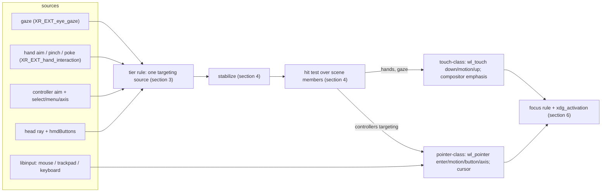

# Spatial input: targeting, hover, commit, focus, cursors, peripherals and text entry

**Status: DRAFT rev 0 (2026-09-26).** The design of the compositor's `input` module
([specs/zxr-core.md §3, §8](../../specs/zxr-core.md)) and of the input authority the registry
names, derived from [research/63](../research/63-xr-input-focus-selection-from-comparables.md)
and ruled in [ADR 0013](adr/0013-kwin-vr-disposition.md)'s 2026-09-26 amendment. It consumes the
input floor ([research/42](../research/42-input-bootstrap.md); `mura.hardware.input.*` in the
[device contract](device-contract.md)), the interaction patterns already selected
([research/36 §9](../research/36-vr-shell-interaction-patterns.md): keyboard dual mode,
dictation fallback, recenter), composition §7.3 constraints 2 and 7
([zxr-shell-v2-composition.md](zxr-shell-v2-composition.md)), and the scene arenas
([specs/zxr-core.md §5a](../../specs/zxr-core.md)) whose member pass is the hit test. It is
consumed by [window-workspace-management.md](window-workspace-management.md) (arrangement rules
and grab *policy* are its; the gestures, focus *rules*, routing and cursors are this document's).
**Grounding.** "XDG" here means the `xdg_*` Wayland protocol namespace (`xdg_wm_base`,
`xdg_activation_v1`); OpenXR terms are the specification's (`aim`/`grip`/`pinch_ext`/`poke_ext`
poses, interaction profiles, `XR_SESSION_STATE_FOCUSED`); Wayland terms are the core protocol's
(`wl_seat`, `wl_pointer`, `wl_touch`, `wl_keyboard`). Every threshold below is a **stand-in**
from a named comparable until measured on Mura's trackers; the design says which.
**Budget impact** (overview invariant 9): no thread. Per tick: one stabilization filter per
active source (a quaternion low-pass and a scalar hysteresis — arithmetic), one hit test over the
scene's member pass (the pass the renderer already makes, [research/62 §7](../research/62-scene-data-model-from-comparables.md)),
and the seat's event emission. libinput runs on the state loop through smithay's backend (fd
source). Hand aim/pinch synthesis is the runtime's (§10), so it costs zxr nothing when Monado
provides it; the bridge costs one joint-set read per hand per tick while it does not.

## 1. The model in one paragraph

Input has **sources** (where a ray or point comes from), a **tier rule** that picks the one
targeting source active now by precision, a **stabilization** stage, a **hit test** over the
scene, and **two transports** to clients: touch-class for hands and gaze, pointer-class for mice,
trackpads and (when they target) controllers. Hover is the compositor's — never a client's — for
touch-class sources; it is the client's for pointer-class ones. **Commit** is pinch, trigger,
button or dwell mapped onto `down`/`button`. **Focus follows the commit and never hover**;
activation is serial-validated; refusal is urgency. Gaze never reaches a client (one specified
exception). The cursor exists only for pointer-class sources. A physical keyboard follows the
seat's keyboard focus. Text fields summon the keyboard component through `text-input-v3`.

## 2. Sources

| source | provided by | what it yields | present when |
|---|---|---|---|
| gaze | runtime, `/user/eyes_ext/input/gaze_ext/pose` (`XR_EXT_eye_gaze_interaction`) | a ray in LOCAL, `sample_time`, nominal/sub-nominal tracking | the contract's eye-tracking class and the runtime's `supportsEyeGazeInteraction` |
| hand | runtime, `/interaction_profiles/ext/hand_interaction_ext`: aim, pinch, poke, grip poses; `pinch_ext/value`, `aim_activate_ext/value`, `grasp_ext/value` with `ready_ext` | per hand: a stabilised aim ray, a pinch point and value, a poke tip | hand tracking up (cameras on); §10 for the Monado gap |
| controller | runtime, the device's interaction profile (falls back to `khr/simple_controller`: `aim/pose`, `select/click`, `menu/click`) plus thumbstick/trackpad axes where the profile has them | per controller: aim ray, select, menu, axes | the contract's `controllers` class; `optical-6dof` counts as `imu-3dof` pre-login |
| head | runtime, `VIEW` space; `hmdButtons` through libinput (device-contract `input`) | a ray from the head; select/back | always (the floor) |
| peripherals | libinput on the seat (BlueZ HID → evdev; no Bluetooth-specific path — `libinput/src/udev-seat.c:82-99`) | pointer deltas, buttons, wheel/finger scroll, keys, touchpad gestures | when present; hot-plug through udev |

All XR sources arrive through the one OpenXR session zxr holds; the runtime gives zxr input only
while the session is `FOCUSED` (`input.adoc:839-843`), which zxr always is (it is the session).

## 3. The tier rule (ruled)

Exactly one **targeting** source is active at a time; the commit device may be any. Precedence,
highest precision first, chosen from what the contract declares and the runtime reports:

1. **Gaze**, when nominal. Whatever commits — pinch, controller trigger, `hmdButtons.select`,
   dwell — commits *at the gaze target*. Tracked controllers do not take over targeting (the
   dissent, Meta's switch to the controller ray, is recorded in research/63 §15).
2. **Controller aim ray**, when controllers are held and gaze is absent or sub-nominal for
   longer than the fallback timeout (stand-in **500–1500 ms**, HoloLens' order). Pointer-class.
3. **Hand aim ray**, when hands are tracked and neither of the above. Touch-class.
4. **Head ray** + `hmdButtons.<selectRole>` / dwell — the floor (research/42 §4.4). Touch-class.

**Direct touch overrides a ray** for hands within a distance band of the plane: enter direct at
**0.18 m**, leave at **0.22 m** (WiVRn `constants.h:45-47`, the one comparable with both bounds;
research/36 §7 already selected it for the keyboard). Poke uses the `poke_ext` tip; a plane
crossing in the surface normal's direction is the `down` (Meta's poke semantics), with the
StereoKit rule that the focus volume grows once focused so a finger passing through the plane
does not lose the target.

Tier changes are **events**, not silent: the cursor appears or disappears (§7), the shell may show
which source is active, and a change never happens mid-gesture (kwin-vr's "do not stop movement
when we already started"; MRTK3's near-mode latch while a grab continues).

## 4. Targeting, stabilization and the hit test

**Stabilize before arbitrating** (constraint 7). Per active source: a low-pass on the ray
orientation (stand-in: MRTK3's exponential decay, half-life **0.01 s** position / **0.05 s**
direction, `LOSAngularOffsetHandRayPoseSource.cs:18-23`; the runtime already stabilises hand
aim per `ext_hand_interaction.adoc:86-88`, so the compositor's filter is light for tier 1–3 and
matters for the head ray); a **target lock** for the duration of a commit (godot's press lock;
StereoKit's pinch-point lock; MRTK3's sticky hover once select progress passes **0.5**); a
**relaxation** threshold before a new target may be taken after release (MRTK3: **0.1** for
gaze-pinch, **0.5** for rays — "fewer accidental activations will occur with rays"); and
**event-time compensation** — the commit is applied at the target held when the gesture began,
not where the ray drifted during the pinch (xrdesktop's replay, `xrd-input-synth.c:340-362`;
Meta's "the pinch gesture itself causes a slight hand shift"). Target magnetism is a policy option
per constraint 7, off by default, with MRTK3's poke reticle magnetism (**0.07 m**) as the
reference shape.

**The hit test** is the scene's member pass with a ray (spec §5a; research/62 §6.8): nearest
plane wins; then smithay's surface-tree hit within the plane; events bubble to the parent node
when a child declines (zen's contract). Arbitration is **class-aware** (constraint 7): the
compositor's own affordances (bar, handles, close — §8), the shell's layer-shell surfaces, and
client content are distinct classes, and an affordance within its band wins over content behind
it even when farther along the ray by the affordance's depth offset.

**Hover.** For **touch-class** sources the client receives nothing before `down`; the compositor
renders plane-level emphasis of the targeted member (the shell's presentation; the WM doc's
`focus.dim`/`sibling_alpha` are the same state) with a ramp of the HoloLens order (**500–1000
ms**). No cursor. For **pointer-class** sources hover is the ordinary `wl_pointer.enter/motion`
and the client styles itself; the compositor renders the cursor (§7).

**Target size** is a shell rule, not a compositor one: Mura's own components respect **60 pt
area / 16 pt spacing** (visionOS) and **≥ 2° visual angle** (HoloLens) for gaze-targetable
controls; 2D clients cannot be resized by the compositor, which is one reason gaze is never a
fine pointer into their content (§5).

## 5. Transports (ruled)

**Touch-class — hands and gaze.** The seat's `wl_touch`. A commit is `down(id, surface, x, y)`
at the plane-local hit; holding is `motion`; release is `up`; `frame` groups them. Each hand is a
contact id, so two hands are two contacts and toolkits' native two-finger zoom/rotate apply
(visionOS's two-handed gestures in Wayland terms). Scroll is drag or flick (a flick is a short
drag with velocity; toolkits' kinetic scrolling handles it); a pinch-and-hold is the toolkits'
long-press (context menus). The client never sees a position before `down` — gaze privacy is a
property of the transport (§9).

**Pointer-class — mice, trackpads, controllers when targeting.** The seat's `wl_pointer`:
`enter/motion/button/axis/frame`. Mouse buttons and controller `select` → `BTN_LEFT`; the
profile's secondary button (or a trackpad two-finger tap, libinput's tapping) → `BTN_RIGHT`;
wheel → `axis` source `wheel` with `axis_discrete`; trackpad and controller stick → `axis` source
`finger`/`continuous` with `axis_stop`; touchpad pinch/swipe → `zwp_pointer_gestures_v1` as
libinput delivers them. Relative motion and pointer constraints are served (`relative-pointer`,
`pointer-constraints`) for clients that lock the pointer.

**One logical pointer per seat** (Wayland's model; kwin-vr, xrdesktop, WiVRn). When two
controllers target, the one that last committed owns the pointer; the other's ray is drawn but
inert until it commits. Mice and controllers share the same pointer.

**The system gesture** (palm-facing pinch, or the contract's reserved button chord) is the
compositor's; it is never forwarded — the Wayland equivalent of a compositor keybinding — and
opens the shell's launcher/menu through the standard seam (ADR 0012).

**The scroll exception under gaze targeting.** A controller stick or mouse wheel while gaze
targets scrolls the gazed element. Wayland scroll is `wl_pointer.axis` and requires pointer
focus, so the compositor sends `enter` at the gaze point, `axis`, `frame`, `leave`. The position
is disclosed only on the user's scroll action — the class of disclosure a tap already makes.
This is the one place gaze position reaches a client, and it is named as such.

## 6. Focus and activation (ruled)

- **Keyboard focus follows the commit.** A `down` or `button` press on a member's surface makes
  that member the keyboard focus (`wl_keyboard.enter`), raises it in its place (WM policy applies
  the arrangement), and makes it the *committed* member for the seat. Hover, gaze and a pointer
  moving over a plane never change keyboard focus. The physical keyboard types into the
  committed member; a keyboard never follows the eyes (visionOS requires the tap; research/63
  §4).
- **New windows** take focus unless a user commit intervened since the request that mapped them
  (mutter's `intervening_user_event_occurred`; niri's Smart) — the WM doc's lifecycle rule
  supplies the placement, this rule the focus.
- **Activation** (`xdg_activation_v1`): a token is granted with the serial of the commit that
  produced it; `activate` with a token whose serial is at least the seat's last commit serial
  focuses and raises; a token without a valid serial, or an expired one, is **urgency-only**
  (niri/cosmic's reading; KWin's `demandAttention`; mutter's pulsing indicator). Urgency is a
  state on the member the shell presents (a notification/attention affordance in the overlay
  layer); the compositor never moves or raises for it.
- **Focus restore** on close: the seat's most-recently-committed member still mapped (the focus
  stack; cosmic-comp, KWin's focus chain).
- **Layer-shell keyboard interactivity** (`exclusive` for the greeter/lock scene and the
  keyboard component while shown; `on_demand` otherwise) sits above member focus as in niri's
  `update_keyboard_focus`.
- **What a manager may do** ([window-workspace-management.md §11](window-workspace-management.md)):
  send focus *hints*; the rule above is the compositor's and is not on the wire.

## 7. Cursors

| source class | what is drawn | where |
|---|---|---|
| gaze (touch-class) | nothing; plane-level emphasis of the target (§4) | — |
| hand ray, head ray (touch-class) | a compositor **reticle** at the hit, sized in visual angle (dynamic scale: constant apparent size regardless of plane distance) | on the plane at the hit |
| poke | a compositor fingertip indicator that shrinks with proximity (HoloLens' donut) | at the tip's projection |
| controller ray (pointer-class) | reticle at the hit **plus** the client's cursor meaning: `cursor-shape-v1` names rendered from the compositor's theme at the reticle's scale, else the client's `wl_pointer.set_cursor` image drawn on the plane with its hotspot | on the plane at the hit; the ray itself drawn from the aim pose |
| mouse / trackpad (pointer-class) | the pointer-class cursor as above (a circle in visionOS's theme; Mura's is the shell theme's) | on the plane; between planes as an angular reticle (§8) |

The client's cursor *image* is drawn where the client would expect it (the hotspot at the hit)
because I-beams, resize arrows and link hands carry meaning the wearer needs; `cursor-shape-v1`
is preferred so the compositor renders one theme at one scale across applications (the
protocol's own stated reason).

## 8. Peripherals: mouse, trackpad, keyboard, controllers

**Where the mouse pointer is** (ruled): it lives on a plane and moves in that plane's local
coordinates, 1:1 like a screen (Meta's on-panel behaviour; libinput **flat** profile with a
compositor gain, because there is no screen for adaptive acceleration to refer to). When the
wearer's look has moved to another member and the mouse moves, the pointer **warps** to the
looked-at plane at the gaze point (visionOS: "A circle-shaped pointer appears where you're
looking"), degrading to the head ray's hit when gaze is unavailable. When the pointer leaves a
plane's bounds without a look change, it continues as an **angular ray from the head** — deltas
rotate the direction (wxrc's model, `input.c:300-307`) — drawn as a reticle in space until it
lands on another plane, where it resumes plane-local motion. Meta's "invisible extension of the
panel surface" is what this rule produces when planes are coplanar. The pointer space is
unbounded (ADR 0013 constraint 2); nothing clamps it to an output.

**Keyboard.** Keys go to the seat's keyboard focus (§6). `keyboard-shortcuts-inhibit` is honoured
with the compositor's escape chord kept (the protocol's "under no obligation to disable all of
its shortcuts"). A connected physical keyboard **suppresses** the virtual keyboard component
while keys are being pressed (Meta minimizes it; StereoKit's five-minute suppression is the
stand-in duration) and the shell may show a completion overlay (visionOS) — a shell component,
not the compositor.

**Controllers.** OpenXR actions on the device's interaction profile, `khr/simple_controller` as
the guaranteed set: `select` = commit, `menu` = the system gesture's button form, `aim/pose` =
the ray (§3). Haptics on commit through `/output/haptic` where present. `hmdButtons` are read
through libinput today (device-contract); when Monado grows a generic `/user/head` HMD-button
profile (the Vive Pro profile is the precedent, `semantic_paths.adoc:985-1002`) they move there.

## 9. Gaze privacy (ruled)

Gaze exists in one process: zxr, which holds the OpenXR session. No client can bind the gaze
profile (they are Wayland clients), and the touch-class transport (§5) forwards no position
before a commit. Therefore **no 2D client ever receives where the wearer looks**, with the one
scroll exception of §5 — visionOS's and Android XR's position, and Mura's own for the consent
picker (research/36 §9). Compositor-side uses of gaze beyond targeting — Look-to-Dictate on the
shell's own mic affordance, dwell — stay compositor-side. Fallback when gaze is sub-nominal or
lost: tier 2/3/4 after the timeout (§3), surfaced as the tier change it is; never a guessed pose
(the OpenXR extension's own rule for sub-nominal tracking, `ext_eye_gaze_interaction.adoc:147-158`).
The M2 question — whether a 3D client may request gaze under a per-app permission (HoloLens'
model; Android XR's "dangerous permission") — is recorded in §11, decider the owner at M2.

## 10. Hand aim, pinch and poke: whose job (ruled)

The standard puts the stabilised aim pose, `pinch_ext/value` ("linear to tip distance",
`ext_hand_interaction.adoc:316-338`), `poke_ext/pose` and the `ready_ext` gates on the
**runtime**. Monado today exposes the profile's bindings but no driver fills them from hand
tracking; `ht_ctrl_emu` derives a simple-controller `select` from tip distance
(`monado/src/xrt/drivers/ht_ctrl_emu/ht_ctrl_emu.cpp:411-464`). The design therefore names an
**`XR_EXT_hand_interaction` device in Monado over Mercury's joints** as the mechanism — the same
derivation as `ht_ctrl_emu`, producing the four poses and three values — recorded as an upstream
work item. Until it exists, zxr derives the same values from `XR_EXT_hand_tracking` joints
behind the same internal interface (MRTK3's polyfill and StereoKit's `input_hand.cpp` are the
shape; their thresholds are the stand-ins: pinch closed at **0.25**, open at **0.75** of index
length with **1.0/0.9** debounce, or StereoKit's **1.0 cm / 1.5 cm**), so the bridge deletes
cleanly. Never the perception service: it produces layers (matte, depth) for composition and
is not an input authority (ADR 0008, ADR 0012).

## 11. 3D clients (M2)

`zxr-shell-v2`'s input objects take the standard's shape rather than motorcar's mouse-shaped
`six_dof_pointer`: per hand, the aim/pinch/poke/grip poses with `pinch`, `grasp` and
`aim_activate` values and their `ready` flags; per controller, the aim pose and the profile's
buttons/axes; **exclusive capture** ordered by distance (StardustXR: a client that grabbed keeps
the input until release); event-time compensation applies before delivery. Gaze is not
delivered at M2 by default; the per-app permission model is the open item (§9).

## 12. Text entry

The chain is Wayland's: the client's `zwp_text_input_v3.enable` + `commit` after keyboard
`enter` tells the compositor a field has focus; the compositor's input-method side `activate`s,
and the **keyboard component** (a separate client, ADR 0012; research/36 §7's floating,
focus-bound keyboard with the dual mode) is summoned into a head-anchored place near the
committed member; `set_cursor_rectangle` positions the IM popup on the plane. A physical
keyboard's key presses suppress the component (§8). `hide_input_panel`/`disable` dismiss it.
Dictation is the shell's mic affordance; **Look-to-Dictate** — gaze on that affordance starts
it and looking away ends it — is a compositor-side gaze intent and never reaches the client.
Text editing under touch-class is the toolkits' touch editing (drag the insertion point,
double-tap to select) — visionOS's gestures are the same ones.

## 13. Accessibility hooks

The tier rule's sources are user-selectable as a setting (visionOS Pointer Control's "eyes, head,
wrist, or finger"): a wearer may pin the targeting source below the precision the hardware
allows. Dwell is a commit method on any tier (onset **150–250 ms** then **650–850 ms**, HoloLens;
research/42 §5's literature range), with a movement tolerance. Switch access is a shell client
over the seat (item/point scanning), needing nothing from the compositor beyond the seat. The
head ray with `hmdButtons` is always available (the floor).

## 14. Settings (through `org.mura.Settings1`, settings-schema.md)

`input.targeting.source` (auto | eyes | hand | controller | head), `input.dwell.enabled`,
`input.dwell.onset_ms`, `input.dwell.complete_ms`, `input.pointer.gain`, `input.pointer.warp`
(gaze | head | off), `input.magnetism.enabled`, `input.hand.pinch.{close,open}` (the stand-ins,
exposed because the design says they are stand-ins). Preferences, not policy: none of them can
make gaze reach a client.

## 15. Open items (deciders named)

- The stand-in thresholds (§3, §4, §10, §13) — measured on Mura's trackers at M1; the M1 gate
  records the numbers.
- 3D-client gaze permission (§9, §11) — the owner, at M2.
- Bar placement below (visionOS) vs above (HoloLens, wayvr) the plane — the shell's presentation;
  window-workspace-management.md §3 owns the affordance's geometry.
- `xdg_toplevel_drag` (detachable tabs) — smithay lacks it; consumed when it exists, mapped onto
  the spatial move like `xdg_toplevel.move`.
- Whether libinput touchpad gestures (`zwp_pointer_gestures_v1`) should also be synthesised from
  two-hand pointer-class rays (two controllers) — no comparable does it; touch-class hands
  already have the toolkits' two-finger gestures; recorded, not designed.
