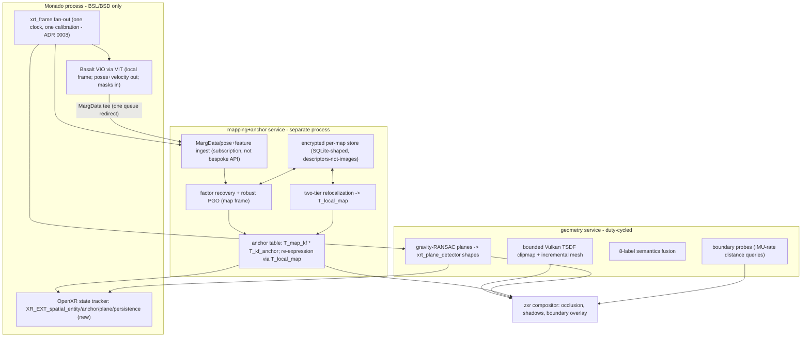

# Spatial mapping: anchors, persistence, and world understanding (Tier 4)

**Status:** design, extending [perception-passthrough-hands.md](perception-passthrough-hands.md)
and [zxr-shell-v2-composition.md](zxr-shell-v2-composition.md).
**Date:** 2026-09-22. Synthesizes research docs
[20-slam-stacks-for-xr](../research/20-slam-stacks-for-xr.md),
[21-anchors-persistence-openxr](../research/21-anchors-persistence-openxr.md),
[22-dense-geometry-no-lidar](../research/22-dense-geometry-no-lidar.md), and
[23-relocalization-multisession](../research/23-relocalization-multisession.md). The stack choice
is decided in [ADR 0009](adr/0009-spatial-mapping-architecture.md); service placement follows
[ADR 0008](adr/0008-perception-services-placement.md).

## 1. Goal and non-goals

**Goal:** apps are *physically located* in the user's environment — place a window above the desk,
take the headset off, reboot, put it on tomorrow, and the window is above the desk — on
camera+IMU hardware with **no LiDAR**. The continuity guarantee is scoped precisely: the rendered
head pose and `LOCAL`/`STAGE` never receive a map discontinuity; anchored *content* moves only
under the explicit, bounded correction policy of §3 (REVIEW-mapping M-4).

Non-goals (v1): LiDAR-grade watertight meshes; shared/cloud anchors (the spatial-sharing track
consumes this design later); object-level scene understanding beyond an 8-label vocabulary;
correcting VIO itself (drift is absorbed by anchors, not fed back — [23 §11 Q2](../research/23-relocalization-multisession.md)).

## 2. The five layers

| Layer | Function | RT class | Implementation |
|---|---|---|---|
| **A. VIO** | 6DoF head pose, gravity, velocity | latency-critical soft RT (camera rate; bounded queues, no WCET proof) | **Basalt via VIT from nixpkgs** (`basalt-monado`, cached; VIO algorithm unmodified, integration package patched for the keyframe egress) — [20 §2–3](../research/20-slam-stacks-for-xr.md) |
| **B. Mapping** | keyframes, loop closure, map optimization | async (100 ms–s) | **mapping service** (separate process): MargData ingest + NfrMapper-derived factor recovery + robust PGO (Kimera-RPGO-shaped) — [20 §3, §7](../research/20-slam-stacks-for-xr.md) |
| **C. Reloc + persistence** | recognize the room at boot; encrypted store; `T_local_map` | boot ≤1–2 s; background low-rate | **two-tier reloc** (classical always-on + learned at boot) over an RTAB-Map-shaped store — [23](../research/23-relocalization-multisession.md), [21 §5](../research/21-anchors-persistence-openxr.md) |
| **D. Geometry** | planes, TSDF mesh, semantics, boundary | duty-cycled (1–5 Hz keyframes; ≤1 Hz mesh/labels) | gravity-RANSAC planes (v1) → bounded Vulkan TSDF clipmap (v1.5) → 8-label fusion — [22](../research/22-dense-geometry-no-lidar.md) |
| **E. API surface** | anchors/planes/persistence to apps | n/a | **`XR_EXT_spatial_entity` family in Monado** (upstream); compositor consumes services directly — [21 §2, §7](../research/21-anchors-persistence-openxr.md) |

## 3. The two-frame architecture (the core contract)

With `T_A_B` transforming coordinates from frame B into A ([21 §4.2](../research/21-anchors-persistence-openxr.md)):

- **`local`**: the smooth, gravity-aligned VIO/render frame. The compositor and head pose live
  here, always. It drifts; that is allowed.
- **`map`**: the optimized, persistent frame. Loop closure and relocalization change map-side
  estimates; that is allowed.
- **One transform name, one direction** (REVIEW-mapping M-3): the correction transform is
  **`T_local_map`** everywhere in this design (research docs sometimes write its inverse
  `T_map_local`; same information). It is estimated from matched keyframes at a shared timestamp:
  `T_local_map = T_local_kf · inverse(T_map_kf)` (multi-match: robust average with covariance).
- Anchors are stored **relative to reference keyframes**: `T_map_anchor = T_map_kf · T_kf_anchor`
  (ORB-SLAM3's internal `mTcp` parent-relative pattern, adopted as design —
  [20 §5.3](../research/20-slam-stacks-for-xr.md)).
- Rendering re-expresses continuously: `T_local_anchor(t) = T_local_map(t) · T_map_anchor`.
  A correction must change **either** `T_local_map` **or** the keyframe poses it was estimated
  from in the same atomic update — never both independently (double-application invariant).

**Correction policy (scoped guarantee):** loop-closure/reloc corrections update the map side; the
*head pose and reference spaces* are untouched by construction (VIO never receives corrections).
Anchored content, however, necessarily moves when its map-side estimate improves — the policy
bounds *how*: applied immediately below a step threshold, interpolated with a bounded velocity
above it, and surfaced as `PAUSED`/degraded anchor state when very large — explicit and bounded,
never silent, with the step/velocity/misregistration budgets to be fixed by M1 measurement
([21 §4.2](../research/21-anchors-persistence-openxr.md), REVIEW-mapping M-4). Honesty note from
the research: no policy provides zero visual motion *and* perfect registration simultaneously;
no shipping platform guarantees camera-pose smoothness across corrections either (ARCore
documents both camera and anchors may jump) — the layered design guarantees the head-pose half
([20 §11](../research/20-slam-stacks-for-xr.md)).

**Reset epochs (M-2):** every packet crossing the VIO→mapping boundary (pose, frame ref,
keyframe, marg data) carries a monotonic `tracking_epoch`; VIT/tracker resets bump it and publish
`RESET`/`REINITIALIZED` events. The mapping service never creates odometry edges across epochs —
epochs are joined only by a verified relocalization match, and the anchor/`T_local_map` handoff
across an epoch join is atomic.

**OpenXR fit:** `LOCAL`/`STAGE` stay stable through routine map optimization; anchor corrections
appear as changed anchor component poses in update snapshots; the
`XrEventDataReferenceSpaceChangePending` event is reserved for genuine LOCAL/STAGE redefinition
([21 §4.3](../research/21-anchors-persistence-openxr.md)).

## 4. Service topology and seams

Per [ADR 0009](adr/0009-spatial-mapping-architecture.md) (layered, not single-SLAM):

- **VIT stays a thin pose seam.** No map API grows into it; v2.0.1's pose+timing+features surface
  is enough, and its pose queue is single-consumer by contract
  ([20 §2](../research/20-slam-stacks-for-xr.md), §10).
- **The keyframe egress point is Basalt's `out_marg_queue`** — with a payload we must define.
  In-memory `MargData` carries the marginalization Hessian/gradient, keyframe poses/states, and
  optical-flow observations, and today feeds a disk saver (`MargDataSaver`)
  ([20 §3.2](../research/20-slam-stacks-for-xr.md)). Two corrections from review
  (REVIEW-mapping M-1, M-5): (i) Hessians+tracks alone do **not** drive loop closure —
  NfrMapper detects descriptors *from keyframe pixels*, so the egress packet must carry either
  calibrated keyframe images+masks or precomputed descriptors+observations; (ii) the queue push
  is blocking, so the egress needs a non-blocking relay/spool outside the tracking thread with
  bounded memory and explicit `GAP` events (mapper death degrades mapping only, never VIO). The
  wire format is a **versioned keyframe packet** (epoch, sequence, calibration id, masks,
  descriptors-or-images, marg prior); prototyping it is the M0 gate. Still bounded work in
  maintained BSD code, and a candidate VIT minor-version extension upstream.
- **The mapping+anchor service is a separate process** — for the frame contract (corrections
  computed where they belong), for duty-cycling/kill-ability, and because it quarantines any
  GPL-derived code behind IPC while Monado stays BSL/BSD in-process
  ([20 §8](../research/20-slam-stacks-for-xr.md)). Its input is a **subscription** to
  {frames, IMU, poses(+features), MargData} — ILLIXR's topic framing, not a bespoke pairwise API
  ([20 §6](../research/20-slam-stacks-for-xr.md)).
- **Internals are Kimera-shaped**: odometry factors in → robust pose-graph optimization
  (Kimera-RPGO is BSD and importable) with outlier-rejected loop factors owning the map estimate;
  Basalt's in-tree NfrMapper (factor recovery + HashBow + PGO) is the starting point, driven
  online instead of batch ([20 §3.3, §7, §9](../research/20-slam-stacks-for-xr.md)).
- **The geometry service** consumes the same fan-out plus keyframe-rate depth at the mapping
  operating point, and publishes planes in Monado's existing `xrt_plane_detector` shapes and mesh
  as dmabuf — the same transport as every other compositor layer source
  ([22 §4.2, §3](../research/22-dense-geometry-no-lidar.md), ADR 0008).

## 5. Relocalization and the boot flow

Two-tier reloc ([23 §3.3, §9](../research/23-relocalization-multisession.md)): classical
BoW/inverted-index place recognition with Bayes-filter temporal accumulation always-on in the
mapping service; learned features (SuperPoint-class + LightGlue) invoked **only at boot and
lost-tracking**, sharing the same retrieve→match→PnP-verify skeleton. Acceptance discipline is
ORB-SLAM3's: inlier-count gates in the 50-class (precedent, not a law — calibrate on inlier
ratio/coverage and reprojection error, REVIEW-mapping M-19) plus **multi-frame confirmation
before any anchor-visible action**. Wrong-reloc is the unacceptable failure mode; the
zero-wrong-accept observation is specific to the RTAB-Map multi-session study
([23 §4.1](../research/23-relocalization-multisession.md)) and is a target to re-verify on our
own eval protocol, not an inherited guarantee. Room-transition behavior (booting in a doorway,
walking during confirmation, switch hysteresis) needs its own state machine — dispositioned to
the backlog (M-13).

Boot never blocks: VIO initializes in `local` immediately (passthrough + head-locked UI); reloc
runs concurrently and publishes `T_local_map` on confirmation — anchored content *appears*,
nothing *moves*. UX states: `UNLOCALIZED` (anchored content hidden — never shown at guessed
poses) → `LOCALIZED_TENTATIVE` (fade in, interaction disabled) → `LOCALIZED` → `DEGRADED`
(per-anchor confidence, "may have moved" affordance). Budget target 1–2 s, decomposed in
[23 §5](../research/23-relocalization-multisession.md); the learned-tier NPU numbers are
explicitly unmeasured (no published Snapdragon timings exist) and the design degrades gracefully
to classical-only + multi-condition maps if a device tier misses the budget.

**Illumination robustness is multi-condition mapping** (the verified Labbé & Michaud 2022
result): every session the user wears the device is passively a mapping pass at a new light
level; merged sessions lift even binary features to high reloc rates at any hour
([23 §4.1](../research/23-relocalization-multisession.md)).

## 6. Data model, store, and privacy

The store is **RTAB-Map-shaped, not ORB-SLAM3-shaped** ([23 §2.3, §10](../research/23-relocalization-multisession.md)):
a versioned transactional SQLite-class database with in-tree schema migrations — graph
(nodes/links with information matrices), descriptors (words/features/global descriptors), and
*optional, default-absent* raw sensor blobs in a separate table — never a monolithic shutdown-time
serialization blob. The durability rules of [21 §5.2–5.4](../research/21-anchors-persistence-openxr.md)
are **normative**: checksummed blobs, copy-on-write migration with atomic generation switch,
`fsync`-before-success, tombstoned deletion; recovery only ever restores a verified generation,
and M2's gates include power-cut/torn-write/wrong-key tests (REVIEW-mapping M-12). The full
schema sketch is [21 §5.2](../research/21-anchors-persistence-openxr.md);
the reloc payload inventory (descriptors, keypoint geometry, poses, covisibility, vocabulary
identity — **no raw images required**) is [23 §2.2](../research/23-relocalization-multisession.md).

Identity discipline: durable `persist_uuid` ≠ context-local `XrSpatialEntityIdEXT` ≠ process
handles ≠ internal map ids; only the UUID crosses OpenXR sessions
([21 §5.2](../research/21-anchors-persistence-openxr.md)).

**Privacy posture** ([21 §6](../research/21-anchors-persistence-openxr.md)): maps are geometry and
recognizable structure of homes — sensitive by default. On-device only; descriptors-not-images as
the target (construction images bounded and volatile); per-map encryption with device/user-bound
key wrapping (TPM2 + systemd credentials); user-visible list/usage/delete/delete-all; deletion
covers WAL, blobs, backups, stale generations; sharing only via deliberate, separately-encrypted
export with consent UI. Dynamic-content gating is a **stated objective with residual risk, not an
absolute** (REVIEW-mapping M-11): masks must travel in the keyframe packet and be applied at
*every* descriptor-extraction site (Basalt's frontend honors mask boxes; NfrMapper's mapping-side
re-detection does not today — that gap is ours to close), and segmentation is fallible. Target:
masked people/pets/hands contribute no descriptors to the persistent map, verified by
descriptor-region tests ([23 §7](../research/23-relocalization-multisession.md)).

## 7. Geometry without LiDAR

The representation ladder and policies are [doc 22](../research/22-dense-geometry-no-lidar.md)'s;
normative summary:

- **Planes first (v1):** gravity-constrained RANSAC (1-DoF horizontal height modes; 2-DoF
  vertical (θ,d)) over SLAM landmarks + keyframe depth; CAPE-style growing when dense depth
  exists; published through `xrt_plane_detector.h` shapes (FLOOR/WALL/CEILING/PLATFORM) so the
  standard plane extension works for free. The floor plane is the single highest-value output
  (shadows, placement, boundary).
- **Bounded Vulkan TSDF clipmap (v1.5):** room-scale dense grid (≈1.5 M voxels @5 cm ≈ 12 MB),
  nvblox's projective integration as the compute-shader blueprint, voxblox's dirty-bit
  incremental meshing, mesh delivered as dmabuf. No GPU voxel hashing in v1.
- **Tri-state map state** (observed/inferred/unknown) lives *in the map*, with opposite
  conservatisms per consumer: occlusion — unknown never occludes, inferred occludes feathered;
  boundary — inferred counts occupied, unknown is keep-out.
- **Two operating points, one `DepthFrame` interface:** passthrough (per-frame, stability-biased,
  hole-filling) vs mapping (keyframe-rate, accuracy-biased, hard confidence gate, no filling).
- **Semantics:** 8-label uint8 histogram fusion (Kimera's pattern at 1/10 memory), labels lifted
  to planes/mesh at extraction.
- **Boundary:** floor + play volume + tri-state kept-out volumes; compositor-owned overlay +
  composition-policy breach response (no client cooperation), IMU-rate point probes; threshold
  semantics are part of the contract (the SteamVR +40 cm lesson).
- **Geometry lives in the map frame** (REVIEW-mapping M-9): plane/mesh/boundary snapshots are
  stamped with the map-graph generation and re-expressed through the same `T_local_map` authority
  as anchors, so a correction moves anchors, planes, occlusion, and boundary *atomically* —
  geometry is never left in a stale local gauge. Cross-fades on plane updates per
  [22 §7](../research/22-dense-geometry-no-lidar.md).

Per-device policy via `spatial.xr.mapping.depthAssist`
(`none | flood-ir | active-ir-pattern | tof-sensor | android-backed`; named *assist* because
`none` still means passive RGB stereo, not "no depth" — REVIEW-mapping M-17): controls the
inferred-state budget and illuminator duty, **not** backend selection (that stays
`spatial.xr.passthrough.depthBackend`). Steam Frame's IR is flood (SNR, not texture — blank walls
still fail at night); Quest 3's dot projector is the no-LiDAR existence proof
([22 §6](../research/22-dense-geometry-no-lidar.md)).

## 8. The OpenXR surface and upstream posture

Implement the ratified `XR_EXT_spatial_entity` + `_anchor` + `_plane_tracking` + `_persistence`
(+`_persistence_operations`) family in Monado — currently absent there, while Android XR ships it
([21 §2, §7](../research/21-anchors-persistence-openxr.md)). Reusable foundations already in
Monado: **`XR_EXT_future` is implemented** (`oxr_future_ext`, async IPC futures), and the old
plane-detection plumbing (`xrt_plane_detector.h`, IPC arrays) is reusable *below* a new canonical
plane tracker that owns association and stable entity IDs — the old request-scoped IDs cannot be
wrapped directly ([21 §7.3](../research/21-anchors-persistence-openxr.md)).

State mapping is explicit (REVIEW-mapping M-10): `EXT` anchors expose only
TRACKING/PAUSED/STOPPED, with no confidence component — so `LOCALIZED_TENTATIVE` entities are
*omitted or PAUSED* until confirmation (never TRACKING at a guessed pose), PAUSED is used exactly
when component data is invalid, confidence stays internal, and STOPPED marks unrecoverable epoch
loss. A full internal-state → OpenXR-state table is an M4 deliverable.

Upstream in dependency order ([21 §7.4](../research/21-anchors-persistence-openxr.md)):
(1) generic entity/snapshot xrt interfaces + oxr handles; (2) the plane adapter proving
discovery/update/snapshot semantics; (3) anchor service interface + map/local poses;
(4) persistence contexts + encrypted-store adapter; (5) persistence operations + policy hooks.
Storage stays behind an implementation-neutral xrt interface; distro-specific encryption/UI stays
service-side.

## 9. Scheduling, power, dynamic content

- **Duty-cycling** (ADR 0008): map on novelty/change triggers; heavy refinement (teacher-grade
  depth, mesh cleanup, semantic re-pass, multi-session merge optimization) only while docked.
- **Dynamic-object gating at three stages** ([23 §7](../research/23-relocalization-multisession.md)):
  VIO feature detection (the existing `masks_sink`→`vit_mask_t` box path, honored in Basalt's
  keypoint detector), map updates (drop masked features; skip mostly-masked keyframes; record
  mask coverage), and reloc queries. Mask sources generalize from hand boxes to Tier 3
  person/pet segmentation.
- **Latency-critical exception:** boundary distance probes run at IMU rate on CPU — queries, never
  reconstruction ([22 §8](../research/22-dense-geometry-no-lidar.md)).

## 10. Packaging and evaluation status

- `basalt-monado` is packaged in nixpkgs (0-unstable-2025-09-25, cache-served; ships `basalt_vio`,
  `basalt_mapper`, calibration tools) — layer A is zero packaging cost *as VIO*; the keyframe
  egress means a patched integration package (overlay) until the extension lands upstream
  (REVIEW-mapping M-18).
- ORB-SLAM3 is not in nixpkgs and hard-requires Pangolin (also unpackaged; `-Werror` friction on
  new GCC) plus vendored Thirdparty — a real but bounded cost, relevant only as an **evaluation
  baseline**, not production ([20 §8–9](../research/20-slam-stacks-for-xr.md)).
- The originally-planned EuRoC replay and Atlas save/reload validation spikes were **cancelled per
  scope** (research/architecture task); the **M0 foundations spike** (§11) absorbs them as the
  first implementation-phase step, with the measurement protocol specified in
  [23 §8](../research/23-relocalization-multisession.md).

## 11. Phasing

| Phase | Deliverable | Gate |
|---|---|---|
| **M0: foundations spike** (added per REVIEW-mapping M-6/M-15) | versioned keyframe packet (epoch, masks, descriptors-or-images) over a non-blocking egress; NfrMapper driven incrementally on replayed data; transform/reset contract implemented; same data replayed through an RTAB-Map-core and an ORB-SLAM3 split-output baseline for comparison | online loop closure from the packet alone with bounded RAM/latency; forced-reset and service-restart tests pass; mapping-core choice (NfrMapper-derived vs RTAB-Map-core) confirmed with numbers |
| **M1: session anchors** | mapping service ingesting the M0 egress; anchors parent-relative to keyframes; `T_local_map` estimator; internal shell↔anchor API (minimal xrt entity interface); shell pins windows within one session (no store) — the shell-side consumer of this API is the places model's frame graph ([places-model.md](places-model.md) §2: map-anchor frames; pinning = ADR 0016 lifecycle) | window stays put over a 30-min session incl. loop closures; head pose measurably jump-free; anchor corrections within the step/velocity budgets (measured separately) |
| **M2: persistence** | encrypted store with normative durability (§6); classical reloc; boot flow + UX states + room-transition state machine; app/user authorization model; `LOCAL_ANCHORS_EXT` scope | reboot → relocalized ≤2 s in a mapped room; ~zero wrong-reloc and measured false-switch rate on the eval protocol; power-cut/torn-write/wrong-key recovery; cross-app anchor denial |
| **M3: geometry** | gravity-RANSAC planes; floor-plane shadows in compositor; boundary v1 | plane snap + shadow demo; boundary breach → passthrough without client cooperation |
| **M4: standard surface** | `XR_EXT_spatial_entity`/`_anchor`/`_plane_tracking`/`_persistence` in Monado; upstream MRs | conformance-shaped tests pass; first upstream review round |
| **M5: dense** | Vulkan TSDF clipmap + mesh occlusion; semantics; learned reloc tier | measured Adreno budgets; multi-condition reloc matrix |

## 12. Open questions (consolidated)

Carried from the research docs and REVIEW-mapping, deduplicated. **Blocking (M0/M1/M2 gates):**

1. **Keyframe packet contents** (M-1): images+masks vs precomputed descriptors — bandwidth,
   copies, privacy, drop behavior; the M0 prototype decides.
2. **Online-mapper feasibility** (M-6): incremental NfrMapper vs adopting RTAB-Map's core as the
   mapping service — the M0 replay comparison decides (see also M-7).
3. **Reset-epoch contract details** (M-2): epoch propagation through every consumer, atomic
   anchor handoff on epoch joins.
4. **Egress backpressure/wire versioning** (M-5): relay memory bounds, GAP semantics, restart
   replay.
5. **`T_local_map` estimator observability** (M-3): multi-match estimation, covariance, and the
   double-application invariant under concurrent keyframe updates.
6. **Anchor reparenting** (M-8): parent keyframe culling/merge/deletion → atomic anchor
   migration semantics.
7. **Correction-policy budgets** (21 §10, M-4): step threshold, interpolation velocity, what
   triggers `PAUSED` — fixed by M1 measurement.
8. **App/user authorization** (M-14): stable app identity, ACLs, IPC credentials,
   NixOS-rebuild identity migration.
9. **Room-transition state machine** (M-13): doorway boot, walking during confirmation, switch
   hysteresis, false-switch rate.
10. **Fan-out resource policy** (M-16): per-consumer queue bounds, retention, zero-copy
    ownership, topic-specific gap rules under all consumers running.

**Non-blocking (M3+):**

11. **NPU reloc reality** (23 §11): SuperPoint/LightGlue latency/warm-up on XR2-class HTP — no
    published numbers.
12. **Adreno compute budgets** (22 §11): TSDF + marching cubes vs compositor bandwidth.
13. **Vocabulary strategy** (23 §11): fixed pretrained vs incremental; interacts with store size
    and sharing.
14. **Screens/TVs** (23 §11): geometrically stable, appearance-unstable content.
15. **Depth-sensor reachability** on Galaxy XR/PFDM (22 §11): `tof-sensor` vs `android-backed`.
16. **Repeated-looking rooms** (21 §10): disambiguation without images.
17. **Key recovery** after TPM replacement; deletion SLA across backups (21 §10).
18. **Per-pixel masks through VIT** (23 §11): pixel masks vs box-fitting; plus mask enforcement
    at mapping-side descriptor extraction (M-11).
