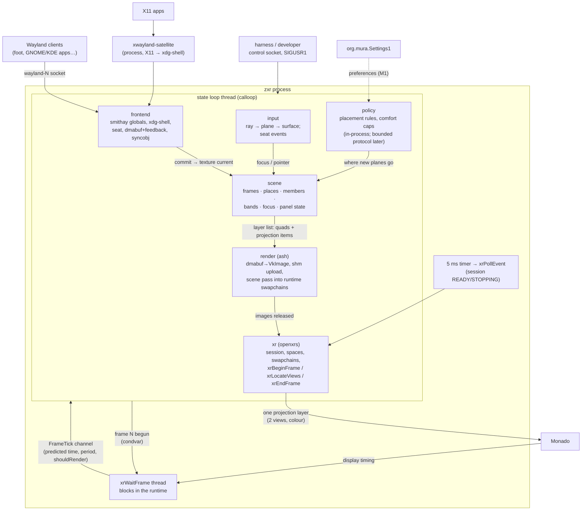
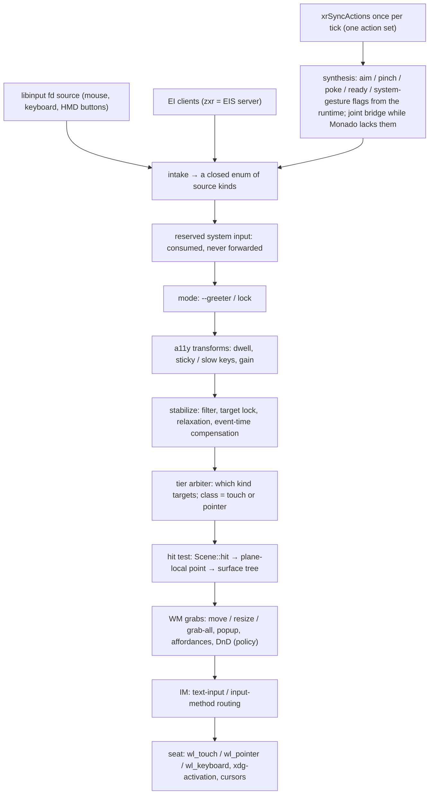

# zxr — the program architecture, as built at R0

**Status: DRAFT, rev 0.2 (2026-09-26; rev 0.1 + the input module as built, from
[research/70](../research/70-input-bring-up-results.md) — §3a measured, §5 the `input` row and
its file table; rev 0.1 = updated with the gate results of
[research/61](../research/61-r0-bring-up-results.md)). Everything here is subject to change.** This document
describes the compositor *as it exists in `pkgs/zxr` at time of writing* and records the decisions behind that
shape with their status (ruled / determined / R0 discovery / stand-in / open). It is the reader's
map between three things that must agree: [specs/zxr-core.md](../../specs/zxr-core.md) (the
program specification — binding; this doc never contradicts it, and where they diverge the spec
wins and this doc is wrong), [research/59](../research/59-xr-compositor-architecture-from-comparables.md)
and [research/60](../research/60-de-abstractions-mapped-to-xr.md) (the evidence), and the code.
Ordering and deferral live only in [implementation-path.md §5](implementation-path.md); this doc
states conditions, not schedules.

**Budget impact** (overview invariant 9): unchanged from the spec — one process per session, two
threads on the frame path (state loop + `xrWaitFrame`), no async runtime, no interpreter.
Measured at R0 on the dev host (`dev-session --zxr`, simulated HMD, 896×1007 per view, one
shm client): release binary 4.8 MB (fence ≤ 40 MB), 5 OS threads of which 2 are Mesa's shader
disk-cache workers (`zxr:disk$0/1`, RADV's `util_queue` [external], idle after startup) — zxr's
own are the state loop and the wait thread (fence ≤ 4: 2 on the frame path),
GPU 109 µs per frame mean, wake→`xrEndFrame` 477 µs mean / 4.7 ms max at 60 Hz. RSS is measured
at gate 1.

## 1. The shape

One process. Everything mutable lives on one thread — the **state loop** (calloop) — which owns
every Wayland object, the scene, the renderer and the OpenXR frame begin/end. A second thread
owns exactly one thing: the blocking `xrWaitFrame`. X11 lives in a separate process
(xwayland-satellite). Shell components (panel, launcher, keyboard, tray host) are separate
clients over standard seams (ADR 0012, amendment 2026-09-26).

Why this shape and not the lineage's single loop (wxrc) or the runtime-owned loop of the VR
overlays: [research/59 §1, §15 Q1](../research/59-xr-compositor-architecture-from-comparables.md)
and ADR 0006's amendment. In one line: the OpenXR spec intends the runtime to own the throttle and
allows `xrWaitFrame` on any thread; every comparable that has a compositor's worth of fds to serve
moves the blocking wait off its loop; smithay's own design turns waits into fds. The state loop
therefore never blocks on the runtime or on a GPU.

## 2. Ownership

| thing | owner | lifetime rule |
|---|---|---|
| Wayland objects, globals, clients | `frontend` (smithay states on `Zxr`) | the display's |
| a client's committed buffer | `scene` holds a smithay `Buffer` clone per frame that sampled it | dropped after that frame's fence completes → smithay sends `wl_buffer.release` / signals the syncobj release point (§4) |
| a dmabuf's `VkImage` | `render`, cached by `wl_buffer` id | destroyed on `wl_buffer` destroy |
| an shm surface's texture | `render`, owned by the surface | re-created on size change, re-uploaded on commit change, dropped when the surface is unseen for 120 frames |
| the Vulkan instance/device/queue | the **runtime** creates them (`XR_KHR_vulkan_enable2`); `render` borrows | the session's |
| swapchain images | the runtime; `render` holds framebuffers for them | the session's |
| a plane's panel swapchain (one per 2D plane; ADR 0006 amendment 2) | the runtime allocates it; `scene`'s member payload owns the handle and the dirty flag | grows when the tree's bounds exceed it; kept while they shrink; dropped on unmap or after a debounce (§5a) |
| planes (windows in space), focus, stacking | `scene` | mapped on first buffer, removed on toplevel destroy |
| the head pose of the frame | `input`, from `xrLocateViews(predicted_display_time)` | the frame's |
| the OpenXR session state machine | `xr` (`poll_events` → begin/end session) | driven by the runtime's events |

Two invariants follow and are checkable by reading imports: `xr.rs` and `render.rs` name no
Wayland type; `scene.rs` names no Vulkan type. `main.rs` is the only file that touches all three.

## 3. The frame spine (spec §7; `main.rs::on_tick`)

Every `FrameTick` from the wait thread runs this once, in order, on the state loop:

1. `xrBeginFrame`; release the wait thread for frame N+1 (the handshake: it may call
   `xrWaitFrame` again only once frame N is begun — `rendering.adoc:792-794`). One frame in
   flight between the threads.
2. `xrLocateViews(predicted_display_time)`; the head pose casts the **gaze ray** (input floor at
   R0): `scene.hit` → nearest plane → surface under the point → `wl_pointer.motion` + `frame`.
3. Slot N mod 2: wait the fence of the frame that used this slot two frames ago; read its GPU
   timestamps; **drop the `Buffer` clones it held** (= release to clients, §4).
4. **Panel passes** (ADR 0006 amendment 2): for each mapped plane whose surface tree committed
   since its last panel image, walk the tree (`with_surface_tree_downward`, offsets from
   `SurfaceView`) plus its popups (`PopupManager::popups_for_surface`), bring every texture
   current (shm: staging upload on commit change; dmabuf: one import per `wl_buffer`, then none),
   hold `Buffer` clones, acquire the plane's runtime-owned panel swapchain image and record an
   orthographic pass of the whole tree into it (bounds = geometry ∪ popups). Every dmabuf drawn
   gets a foreign-queue **acquire** barrier before and **release** barrier after (wlroots' shape,
   `render/vulkan/pass.c:337-359`).
5. **Depth content present?** (a mapped 3D volume, an environment or cutout source, or panel
   overflow past `maxLayerCount − 1`). *No:* submit the panel passes on the slot fence, release
   the panel images, `xrEndFrame(quads)` — no projection images acquired, no scene pass; with no
   commit in the tick, nothing reaches the GPU. *Yes:* acquire the projection images, record the
   scene pass (volumes, environment, cutout, overflow planes) alongside the panel passes, submit,
   release, `xrEndFrame(projection, quads)`. Quads ordered by band then distance; the projection
   layer first.
6. `wl_surface.frame` callbacks — visibility-gated (frustum test on the quad pose), with a
   fallback cadence for out-of-view planes (spec §6.6).
7. Journal: shape taken, panel passes, GPU ns, wake→end ns, missed, retention, runtime calls.

A tick with `shouldRender = false` does 1, then `xrEndFrame` with no layers, then 7.

### 3a. The input stages (spatial-input §1a; research/68)

Input has two intakes and one pipeline, all on the state loop. libinput and EI arrive as
calloop sources whenever a device speaks; the XR sources arrive once per tick with
`xrSyncActions`, after `xrLocateViews` and before the flatten (step 1 above). Both feed the same
ordered stages — KWin's `InputFilterOrder` with the XR stages inserted where their inputs exist:

No input thread: the comparables that have one (mutter, KWin, Mir) added it for a UI thread
that stalls for frames and a KMS cursor plane, neither of which zxr has; the M1 input gate
measures libinput-event → `xrEndFrame` under a client storm and adopts a thread for the libinput
source only if that exceeds one display period (ruled, research/68 §9.1). **Built and measured
(research/70):** the chain is `pkgs/zxr/src/input/` — `mod.rs` (types, `Chain`, `Input`,
`dispatch` per event, `tick` per frame, the injector) and one file per stage; every libinput/EI/
injector sample runs the chain on arrival, XR samples at the tick after `xrLocateViews`. 7.07
runtime calls per frame with the action set (5.07 before: `xrSyncActions` and the action spaces
in the batched locate); event→`xrEndFrame` 8.4 ms per event at a 1 kHz pointer stream, 8.7 ms
under the vkcube MAILBOX and glmark2 EGL storms, intake age 0 — the trigger is not met.

## 4. Acquire and release (spec §6)

**Acquire is not on the frame path.** `CompositorHandler::new_surface` installs a pre-commit hook
(cosmic-comp's shape, `wayland/handlers/compositor.rs:177-232`): if the pending buffer is a dmabuf
and the client attached a `linux-drm-syncobj` acquire point, the point becomes a calloop
**eventfd blocker** (`DrmSyncPoint::generate_blocker`); otherwise the dmabuf's implicit fence
becomes a readable-fd blocker. The commit is not applied until the fd fires. The loop never waits
on a GPU for a client.

**Release is GPU-done, nothing earlier.** The scene holds one `Buffer` clone per surface per
*panel pass* that sampled it — a member whose tree did not commit holds nothing (spec §5a).
smithay's `InnerBuffer::drop` sends `wl_buffer.release` and signals the release point
(`backend/renderer/utils/wayland.rs:68-79`); zxr drops the clones only after the fence of the
frame that used them completes (step 3). Retention at R0 with one client: max 2
frames (the two slots), mean 2.0 — gate 2's bound.

## 5. Code layout: the spec's nine modules in six files plus the `input` directory

Spec §3 names nine modules. R0 implements them in six files. The collapse is deliberate — the R0
gates test the frame path, not the decomposition — and the seams are already where the spec puts
them, so splitting later is a file move, not a redesign.

| spec §3 module | R0 file | present at R0 | absent at R0 (condition that adds it) |
|---|---|---|---|
| `xr` | `src/xr.rs` | instance → system → runtime-created Vulkan instance/device → session → per-view swapchains → `LOCAL` space; the wait thread + handshake; `math` (column-major mat4, asymmetric-fov projection, pose inverse, ray rotate) | `STAGE`/hand spaces (with hands, M1); session restart (with `modes`) |
| `render` | `src/render.rs` | render pass + pipeline (push constants, alpha blend, depth), shm staging path, dmabuf import with DRM modifiers, per-view depth + framebuffers, 2 frame slots (cmd + fence), timestamp queries, `sampled_modifiers` for the feedback table | 3D clients' colour+depth composition (M2, zxr-shell-v2); damage-aware upload |
| `frontend` | `src/state.rs` (handler half) | every smithay delegate state + handler impl (compositor, buffer, shm, dmabuf, syncobj, xdg-shell, seat, data-device, DnD, output, pointer-constraints); `ClientState`; the acquire hook; dmabuf validation; the one `wl_output` | layer-shell and the M1 protocol set (spec §10); `--greeter` mode |
| `scene` | `src/scene.rs` (arenas, verbs, flatten, hit) + `src/state.rs` (the member payload: window, panel, dirty) | `Arena<T>` with generational handles; `frames` / `places` / `members` (spec §5a normative); `add / remove / reparent / set_local / set_flags / focus`; `flatten` → band-ordered quad list + overflow, budget by band priority; full-pose ray→plane→surface hit; fan placement as the stand-in policy | 3D nodes (M2); the WM `free` engine (M1) |
| `input` | `src/input/` (22 files): `mod.rs` types + `Chain` + `Input` + injector; `reserved.rs`, `mode.rs`, `a11y.rs`, `activity.rs`, `stabilize.rs`, `tier.rs` + `quality.rs` + `held.rs` + `loss.rs`, `hit.rs`, `seat.rs` + `touch.rs` + `pointer.rs` + `cursor.rs` + `emphasis.rs` + `theme.rs`, `actions.rs` + `bridge.rs`, `focus.rs`, `text.rs`, `libinput.rs`, `ei.rs` | the module of spatial-input §1a as built (research/70 §1): nine static slots in KWin's order over a closed `SourceKind` enum; one action set (`actions.rs`) as the XR seam, the §10 joint bridge; smithay `InputBackend` for libinput (libseat) and EIS; `wl_touch` + `wl_pointer` transports; reticle and client cursor as band-5 quads; focus/activation, text-entry seam, presence, idle activity; per-event dispatch, XR at the tick; no input thread (trigger measured, not met) | the `Grabs` slot's WM policy (window-workspace-management); the poke indicator and ray line; the theme/size settings key; every stand-in's value (first hardware) |
| `policy` | `Scene::add` (the fan) | — (a stand-in, §6) | placement rules and comfort caps from research/36; preferences from `org.mura.Settings1`; the bounded `zxr_window_management` face (ADR 0012 amendment) |
| `modes`, `unit` | — | — | `--greeter` restricted scene, `sd_notify`, variable publication (M1; session-bootstrap rev 3) |
| `trace` | `src/journal.rs`, `src/control.rs` | counters; SIGUSR1 / exit dump; the line-protocol control socket | tracing spans |
| the loop + spine | `src/main.rs` | args; calloop sources (ticks, event timer, signals, control, display, listening socket); `on_tick`; `collect_tree` | — |

Build: `pkgs/zxr/default.nix` (rustPlatform; glslc at build time; the OpenXR loader and the
satellite baked in by path; `libvulkan` by rpath, no wrapper so the gates measure the bare
process). Harness: `dev-session --zxr [--x11] [-- zxr flags]`.

## 6. Decisions and their status

Vocabulary: **ruled** = the owner decided (recorded in an ADR/spec); **determined** = converging
comparables with transferable reasons, acted on under AGENTS.md rule 8; **R0 discovery** = a
mechanism the bring-up showed was missing, no comparable needed, recorded for the spec's rev 2;
**stand-in** = a value or mechanism present so the gates can run, explicitly not a design;
**open** = named decider.

| decision | status | where |
|---|---|---|
| calloop owns the thread; a dedicated `xrWaitFrame` thread posts frame states | ruled (b) | ADR 0006 amendment; research/59 §15 Q1 |
| WM policy in-process first; bounded `zxr_window_management` protocol after M1 | ruled (c) | ADR 0012 amendment |
| every shell component its own process over a standard seam; tray carried as an SNI host applet | ruled | ADR 0012 amendment; component-registry |
| Rust + smithay, renderer-free (`default-features = false`, no GL/pixman, no winit, no in-process Xwayland) | re-affirmed | ADR 0006; research/59 §1 |
| Vulkan instance/device created by the runtime (`XR_KHR_vulkan_enable2`) | determined | research/59 §3 |
| xwayland-satellite for X11; smithay `X11Wm` the recorded fallback | determined; re-examined against the virtual-desktop modes at the owner's request and **stands** (nested DEs are Wayland clients; delegated X11 windows carry the *producer's* X11 issues; satellite's fatal set is in the R0 protocol set) | research/59 §9 + §9a |
| no compositor-side windowed backend; Monado's mirror is the dev view | ruled | research/59; spec §1 |
| painter's order across layers; depth test only within the projection layer | determined | research/59 §2 (`rendering.adoc:1143-1147`; Monado `comp_render.h:42-43`) |
| **2D planes are runtime quad layers; the projection layer exists only with depth content** (volumes, environment, cutout, or panel overflow) — a windows-only session has no render pass | **ruled** 2026-09-26 (ADR 0006 amendment 2) on research/65 §2: equal pass counts on Monado, −47 % CPU / −48 % wake-ups / 0 GPU for static UI under head motion, the spec's quad-for-UI text, wayvr; accepted: one GPU copy per commit, painter's order only; **the cutout is the last layer — hands above all windows** (shape open, perception-passthrough-hands §1a) | ADR 0006 amendment 2; spec §4, §6.2, §7 |
| acquire via fd blockers (syncobj eventfd, else implicit fence) | determined | research/59 §4–5; cosmic-comp shape |
| release = drop held `Buffer` after the frame's fence | determined | research/59 §5; smithay `InnerBuffer::drop` |
| one `VkImage` per `wl_buffer` (dmabuf), one texture per surface (shm) | determined | research/59 §4 (niri/cosmic/wlroots caches are per buffer) |
| foreign-queue acquire/release barriers around every dmabuf drawn, layout `GENERAL` outside | determined | wlroots `render/vulkan/pass.c:337-359` |
| two frame slots, one frame in flight with the runtime | determined | research/59 §2–3; spec §2 |
| frame callbacks once per refresh after `xrEndFrame` | determined | research/59 §5; spec §6.6 |
| **periodic `xrPollEvent` timer (5 ms until running, 250 ms after)** | **R0 discovery** — session `READY` precedes any tick, so an event poll bound to ticks deadlocks; every OpenXR app polls events every loop iteration (hello_xr, Monado's own clients); the loop-shape ruling is unaffected | spec rev 2 §7 |
| **signals blocked before any thread exists; children unblock in `pre_exec`** | **R0 discovery** — calloop's `Signals` blocks on its own thread only; SIGTERM reaching the wait thread killed the process before the journal (`exit=143`) | spec rev 2 §9; research/61 §6.2 |
| **teardown: `xrRequestExitSession` → STOPPING → EXITING, idle device, release buffers, destroy textures, renderer before `xr`** | **R0 discovery** — the session's swapchain images dropped before the renderer's views of them (`exit=139`) | spec rev 2 §9; research/61 §6.3 |
| per-commit acquire cost ≈ 21 µs (14.7 k commits/s → 31 % of a desktop core) | measured; mechanism confirmed (0 missed), source granularity an M1 budget item | spec rev 2 §6.3; research/61 §3 |
| gaze ray from the head pose as the R0 pointer | stand-in for the input floor (spec §8: head-aim + select) | spec §8 |
| `input` lives in the compositor on the state loop: seat, hit test, focus, routing in-process; sensing, binding, aim/pinch/poke and the system-gesture recogniser in the runtime (bridged while Monado lacks them); IMs and emulated input as clients over `input-method-v2` / libei with zxr as EIS server; a11y transforms as in-compositor stages ahead of the lock | **determined** (every Wayland compositor; the standard's placement; every XR shell; the one separate-process design's assumptions absent) — the libinput thread question and the closed-enum source seam **ruled** by the owner 2026-09-26 (research/68 §9.1, §9.2): the state loop with a measured M1 trigger; a closed enum of kinds | spatial-input §1a; research/68 |
| inside `input`: one OpenXR action set as the XR source seam, smithay `InputBackend` as the non-XR one, a closed enum of source kinds for the tier rule, an ordered static stage list in KWin's order (reserved → mode → a11y → stabilize → tier → hit → grabs → IM → seat) | **determined** (KWin's `InputFilterOrder`, Mir's filter chain, Android's stage chain converge on the order; StereoKit's reason for a fixed set transfers, KWin's/MRTK3's for plugins do not) | spatial-input §1a; research/68 §5, §7 |
| fan placement: centre, then alternating right/left at 0.9 m, yaw 0.35 rad toward the viewer | stand-in for `policy` | research/36 §prose: "head-relative spawn … second window adjacent" — the shape, not the numbers |
| plane distance 1.5 m; 0.0012 m/px (≈ 8.3 px/cm) | **stand-in, discretionary — flagged**: comparables range WiVRn 0.5 m, KWin VR 1.0 m at 20 px/cm, Android XR 1.75 m (research/36 §placement; research/31 §2.12); the M1 `policy` module takes these from the device contract / settings, not from code | owner / M1 |
| one virtual `wl_output` "XR-1", 1920×1080 @ 60 Hz, scale 1 | **stand-in, discretionary — flagged**: KWin VR's virtual output is also scale 1 / 60 Hz (research/31 §2.12); clients need *some* output to size against; what the output(s) should advertise in XR is an M1 question (research/60 §17 notes) | owner / M1 |
| control socket line protocol (`focus next`, `list`, `journal`, `move`, `resize`, `close`, `spawn`, `quit`) | stand-in for the harness; **not** a policy seam (ADR 0012) | — |
| dmabuf import rejects multi-plane and non-8888 formats at R0 | stand-in (R0 clients are ARGB/XRGB) | gate 2 widens by evidence |
| `scene` = three typed arenas (frames / places / members) whose per-tick output is a band-ordered layer list (quads) plus the projection draw items; commit-driven dirtiness; non-dirty members hold no buffers; grow-only panel swapchains; frames located by one `xrLocateSpacesKHR` only when a frame the views do not give exists | **normative** (spec rev 3.3, 2026-09-26; two agents converged on the shape — research/62 §7, research/65) | spec §5a; research/62 §6–§7; research/67 (the 16-client and popup costs it removes) |
| pinning ownership: runtime + mapping service → where the anchor is; zxr → what is attached (place.frame); session state → which named place on which anchor UUID | draft, restating ADR 0009 / ADR 0016 / spatial-mapping §3–§4 | spec §5a |

## 7. Open items (deciders named)

- **The scene data model** — normative since spec rev 3.3 (§5a) and implemented
  (`src/scene.rs`); no longer open. What remains inside it are two stand-ins the M1 gate fixes by
  measurement: the panel-swapchain shrink debounce (60 ticks) and overlay-class members as a
  `Views`-parented place.
- **Xwayland** — examined against the virtual-desktop case in research/59 §9a; the
  determination stands. Two items left that section for other deciders: mode 3 for GNOME is a
  viewer client of *headless* mutter (mutter has no nested-Wayland-client backend any more) —
  foreign-session-integration.md, owner; delegated X11 windows inherit the producer's X11 issues
  (kwin-vr's origin move; xserver!2118/!2119 still open) — the KWin producer brief.
- **The output(s) zxr advertises** and the density/distance defaults — M1 `policy`, from the
  device contract and `org.mura.Settings1`; the R0 values are stand-ins (§6).
- **Foreground/cutout layer name; cross-plane DnD; GPU-side acquire** — spec §14, unchanged.
