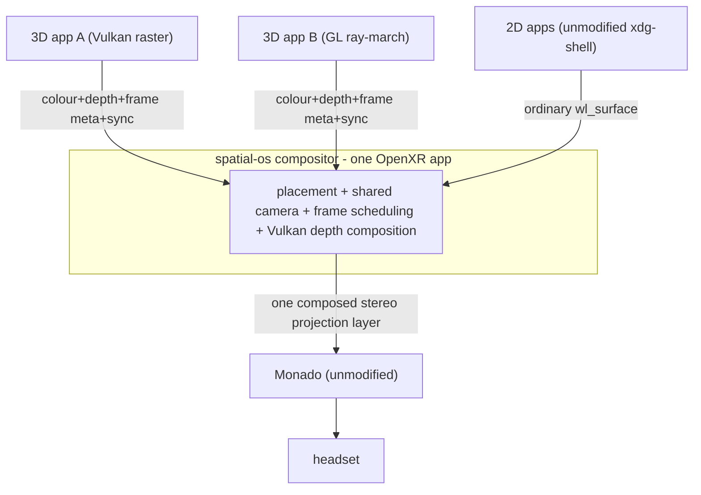

# zxr-shell-v2: the renderer-agnostic composition model and MVP

**Status:** design note elaborating [adr/0006-compositor-strategy.md](adr/0006-compositor-strategy.md).
**Date:** 2026-09-22.

ADR 0006 decided *what* to build (a Wayland-native, client-renders / compositor-composites XR shell
on Monado, `zxr-shell-v2`). This note works out the load-bearing *how*: the composition model that
lets the compositor intermix 3D output from arbitrary applications, what that model can and cannot
do, and the smallest MVP that proves it — including first-class 2D windows.

It incorporates a body of prior web research the project owner supplied, **explicitly scrutinized
rather than accepted**: the verified parts are cited to primary sources below; the parts that turned
out to be fabricated or unverifiable are called out in §6 so they don't silently enter the design.

## 1. The real goal, decomposed

The ambition is a spatial desktop that composes 3D output from *any* application — a triangle
rasterizer, a compute ray-marcher, a Gaussian-splat renderer, an ordinary 2D app on a plane — into
one coherent, occlusion-correct space, without forcing every app into a common scene format (the
glTF path) or intercepting its GPU commands. This is exactly Motorcar's thesis
([08 §1.4](../research/08-wxrc.md)): the compositor coordinates *projection* and merges *results*;
geometry never crosses the wire.

"Intermix arbitrary 3D" is not one problem. It is four, of strictly increasing difficulty, and the
architecture must be honest about which tier it delivers:

| Tier | What it means | Feasibility | Mechanism |
|---|---|---|---|
| **T1 Opaque primary visibility** | Each app's nearest opaque surface occludes correctly against every other app and against 2D window planes | **Solved, renderer-agnostic** | per-view colour + depth, nearest-depth-wins (sort-last) |
| **T2 Transparency** | Translucent surfaces from different apps interleave correctly | **Feasible with a richer payload** | ordered per-pixel samples (deep buffers) or deferred stochastic samples |
| **T3 Head-motion reprojection** | Reusing an app's last frame after the head moves | **Fundamentally lossy** | a colour+depth image lacks occluded geometry; needs re-render, LDI, or bounded reprojection |
| **T4 Shared light transport** | Cross-app shadows, reflections, refraction | **Much harder; out of scope** | needs cross-app visibility/shading *queries*, not a result image |

**zxr-shell-v2 targets T1 as the guaranteed baseline**, designs the protocol so T2 is an additive
capability (not a rewrite), treats T3 as an explicit, declared approximation (never silent), and
leaves T4 to optional future query extensions. The MVP (§7) delivers T1 + first-class 2D.

## 2. Why opaque colour + depth is genuinely renderer-agnostic

The T1 claim rests on a trivial but decisive identity. Have every application render the **same
world-space camera ray** `r` for the same intended display time, each reporting the distance to its
nearest opaque surface `t_i(r)` and that surface's colour. The composited nearest surface is:

```
i*(r) = argmin_i t_i(r)
```

and this is *exactly* the nearest surface of the combined scene, because

```
min_i ( min_{s in S_i} t_s(r) )  =  min_{s in (union of S_i)} t_s(r).
```

The compositor never needs any app's geometry or rendering commands — only a colour and a depth
sample per ray. An app may rasterize triangles, ray-march an SDF in a compute shader, splat
Gaussians, or be a 2D window whose plane depth the compositor computes; the interface is identical.
This is classical **sort-last composition** (Molnar's taxonomy; Humphreys et al., *Chromium*,
SIGGRAPH 2002), applied per-application instead of per-GPU. It is the mechanism Motorcar chose and
the reason its abstraction remains sound.

Three constraints make it *correct* rather than merely plausible, and each is a protocol
requirement:

1. **Shared camera, per-app model transform.** For eye `e` and app `i`, the app renders with
   `clip = P_e · V_e · T_i`, where `P_e`/`V_e` (projection/view) are compositor-owned and shared and
   `T_i` places the app's local space in the world. This is Motorcar's view/projection/model split
   that zxr-v1 regressed into a folded MVP ([10 §4.1](../research/10-xr-wayland-protocol-comparison.md));
   restoring it is what makes every app's depth *comparable*.
2. **Depth *meaning*, not depth *format*.** Two apps' raw depth values of `0.4` do not denote the
   same distance. The protocol must fix a depth encoding (near/far, reversed-Z policy,
   normalization) — OpenXR's `XrCompositionLayerDepthInfoKHR` already models exactly this
   metadata (`minDepth`/`maxDepth`/`nearZ`/`farZ`) and is the template to copy. Storage can be a
   native depth image *or* a scalar `R32_SFLOAT` image; the meaning is mandatory, the format is
   negotiated (§5).
3. **Clipping is cooperative *and* enforced.** An app renders its nearest surface *inside* its
   assigned bounds (cuboid/portal, [08 §1.3](../research/08-wxrc.md)); the compositor also validates
   sample bounds. This matters for a subtle information reason: discarding an app's out-of-bounds
   *near* sample after the fact cannot reveal the valid in-bounds surface the app already discarded
   behind it. Early visibility resolve is lossy, so clipping must happen before submission.

## 3. What one colour+depth image cannot do (and the honest answers)

**T2 — transparency.** Once an app flattens a translucent pane in front of an opaque wall into one
colour + one depth, the compositor cannot insert another app's object *between* them. The fix is not
geometry exchange; it is **multiple ordered samples per pixel** `{(z_j, C_j, α_j)}` — the semantics
of **OpenEXR deep data** (front/back depth, opacity, colour, volumetric intervals), borrowed as a
wire representation, not as EXR files. A fixed max sample count bounds cost and becomes an
approximation past the limit. An alternative research direction is **deferred stochastic
transparency** (Enderton et al., TVCG 2011; StochasticSplats, 2025): each app returns its nearest
stochastically-accepted surface, the compositor takes the cross-app nearest, and the resolve happens
*after* composition — the same min-depth identity applies to accepted samples. Both are post-MVP;
the point for now is that the protocol's per-view buffer set is designed to *grow* an ordered-sample
profile without changing the T1 core.

**T3 — head motion.** Two different scenes can produce an identical colour+depth image and differ
only in geometry hidden behind a wall; after the head moves sideways, no algorithm with only that
image knows which scene was there. **Layered Depth Images** (Shade et al., SIGGRAPH 1998) preserve
some hidden samples and improve nearby views but remain sampled and view-dependent. Practical
consequence for the protocol: for a *3D* submission the compositor uses the current frame or shows a
compositor-owned placeholder — it must **not** silently reuse a stale eye-space depth image in the
current frame's depth test. (2D windows are different — §7.3.) Motorcar itself flagged this
scheduling tension ([08 §1.6](../research/08-wxrc.md)).

**T4 — shared light transport.** A mirror in app A reflecting a sculpture in app B needs B's
appearance from the *reflected* view; a shadow needs visibility from a *light*. These are *queries
into other applications*, not results in the eye image. The honest architectural split is **spatial
coexistence** (placement, clipping, occlusion, input — T1/T2) versus **shared light transport**
(T4). A useful 3D desktop delivers the first and preserves independent visual styles, exactly as a
2D desktop does not share light between windows. T4, if ever pursued, is an optional renderer-owned
*ray-query service* ("given these rays in this space/time, return intersections/shading"), never a
prerequisite for drawing a 3D window.

## 4. Going "down to Vulkan" helps transport, not meaning

A recurring temptation is to intercept GPU commands or share Vulkan command buffers for full
generality. Verified reality: Vulkan **external memory** (`VK_EXT_external_memory_dma_buf`) +
**DRM-format-modifier** images (`VK_EXT_image_drm_format_modifier`) make *transport* of separate
colour and depth images a solved problem on Linux, and interop is genuinely cross-API (see §5). But
a Vulkan command buffer is bound to device objects and is **not** a portable cross-process scene; an
app rendering via a compute shader exposes no camera, no "final depth", no re-render-from-new-view
knob. GPU access supplies *execution and transport*, not *semantics*. So interception is at best a
compatibility layer for unmodified apps (cf. RealityCheck's heuristic eye/depth-buffer detection;
UEVR's engine-specific integration), never the clean contract. zxr-shell-v2 gives new apps an
explicit colour+depth+frame contract and leaves interception as a separate, out-of-scope
compatibility project.

## 5. Renderer-agnostic in practice: the transport is negotiated, not Vulkan-only

The compositor backend is Vulkan (ADR 0006), but a client must not be forced to become a Vulkan app.
This is verified-feasible on Linux today:

- **dma-buf path (preferred, most portable):** client exports its colour/depth images as dma-bufs;
  GL via `EGL_MESA_image_dma_buf_export`, Vulkan via `VK_EXT_external_memory_dma_buf`; the compositor
  imports via `EGL_EXT_image_dma_buf_import_modifiers` (GL) or `VK_EXT_image_drm_format_modifier`
  (Vulkan). The **crux is DRM FourCC + modifier negotiation**: `DRM_FORMAT_MOD_INVALID` is
  implementation-defined and must not be hardcoded (a real, documented footgun). This is the same
  machinery Wayland's `zwp_linux_dmabuf_v1` already uses.
- **Opaque-FD path:** `VK_KHR_external_memory_fd` ↔ GL `GL_EXT_memory_object_fd` /
  `GL_EXT_semaphore_fd`. `OPAQUE_FD` is *not* Vulkan-only — the GL external-object extensions import
  it explicitly. Distinct handle type from dma-buf; not interchangeable.
- **Depth as meaning:** prefer sharing a native `D32_SFLOAT`, but **query
  `vkGetPhysicalDeviceImageFormatProperties2` + `VkPhysicalDeviceExternalImageFormatInfo` for the
  exact (format, tiling, usage, handle-type) combo and fail negotiation cleanly** if unsupported;
  fall back to a separate scalar `R32_SFLOAT` depth image (a cooperative raster client writes the
  agreed depth value in the same pass; a GPU conversion pass otherwise). This is **not** Motorcar's
  pack-depth-into-RGBA hack — depth stays a separate float image; there is no double-height colour
  surface and no unpack stage.
- **Sync as meaning:** the requirement is "compositor knows when reading is safe; client knows when
  writing is safe again," per pool slot. Prefer `wp_linux_drm_syncobj_v1` timeline points (StardustXR's
  `dmatex` proves this path in this exact stack, [10 §4.4](../research/10-xr-wayland-protocol-comparison.md))
  and/or `SYNC_FD` fences (`VK_EXTERNAL_SEMAPHORE_HANDLE_TYPE_SYNC_FD` ↔ EGL native fences) — **not**
  a mandatory Vulkan-timeline-semaphore contract, which would exclude GL clients.
- **Allocation ownership is negotiable:** the compositor/allocator may allocate the pool (after
  negotiating the client's requirements) and hand images to the client to import — which lets a GL
  client participate without ever touching Vulkan. Client-allocated pools remain a supported path.

Acceptance implication: renderer-agnosticism is proven only if the MVP includes a **GL client, a
Vulkan client, and a CPU client** — two Vulkan clients would not test the abstraction.

## 6. Scrutiny of the supplied prior research

Per the owner's instruction to distrust it, checked against primary sources:

- **CORRECTED — "wxrc settled on glTF."** No. wxrc's `zxr` protocol defines typed per-view *pixel*
  and *depth* buffers; glTF appears only in a trailing TODO ([08 Part 1 §1.8](../research/08-wxrc.md),
  [10 §2.2](../research/10-xr-wayland-protocol-comparison.md)). The recovered spec is closer to
  Motorcar than the recollection suggested. The renderer-agnostic colour+depth model is *already*
  the lineage's design.
- **FABRICATED / UNVERIFIED — "OpenXR 1.1.63 (Sept 1 2026) added `XR_EXT_spatial_container` +
  `XR_EXT_spatial_container_self_rendering`."** `XR_EXT_spatial_container` is real and **ratified**
  (registered #811, rev 1) but is a **container-*state*** extension only — `visible`,
  `interactable`, `boundsMode` + change events
  ([registry](https://registry.khronos.org/OpenXR/specs/1.1/man/html/XrSpatialContainerStateEXT.html)).
  There is **no** `..._self_rendering` extension in the registry; the only "self-rendering spatial
  windows" is DisplayXR's **provisional, unregistered** `XR_DXR_spatial_workspace` (a vendor
  experimental extension, not core OpenXR). Treat the "2026 self-rendering spatial containers" claim
  as not established. Its *conclusion* — containers give lifecycle/placement, **not** guaranteed
  per-pixel cross-app depth interleaving — is nonetheless correct.
- **VERIFIED — depth-tested composition layers are vendor-only.** `XR_FB_composition_layer_depth_test`
  (Meta, registered #213, **not ratified**) and `XR_VARJO_composition_layer_depth_test` exist;
  `XR_KHR_composition_layer_depth` supplies depth but **explicitly does not change layer composition
  order** — unsupported runtimes revert to painter's algorithm
  ([Khronos forum](https://community.khronos.org/t/is-it-possible-for-composition-layers-to-take-worlds-depth-into-account/110118)).
  **Design consequence:** these are irrelevant to zxr-shell-v2, because we are a *single* OpenXR app
  that composites all clients ourselves and submits **one** projection layer to Monado (§7.4). We
  never ask the runtime to depth-test our clients' layers.
- **VERIFIED — GL/Vulkan/CPU colour+depth sharing is real** (§5 citations). The research's "make it
  renderer-agnostic, not Vulkan-only" correction is sound and adopted.
- **SOUND (established prior art) — the reading list:** Chromium/sort-last, Layered Depth Images,
  OpenEXR deep data, Stochastic Transparency, RealityCheck (interception), the Khronos/PICO
  multi-app-XR transparency example. These are legitimate and inform §2–§3. (Not re-verified
  individually; they are well-known.)

## 7. The MVP

### 7.1 Architecture: Wayland inward, one OpenXR layer outward



The decisive simplification (verified in §6): **Monado sees only our compositor, not its clients.**
We perform cross-app depth composition ourselves and submit one already-composed stereo projection
layer. No runtime multi-app support, no vendor depth-test-layer extension, no spatial-container
extension is required. A **windowed desktop output mode** (mouse-driven camera) lets almost
everything be developed without a headset.

### 7.2 The client contract (renderer-agnostic)

A 3D client does *not* use our engine; it renders into compositor-described targets for a
compositor-described frame:

```text
frame = wait_for_spatial_frame()          # frame id, target display time, deadline,
                                          # per-view P·V, window bounds, depth encoding
slot  = acquire_reusable_slot()           # pooled colour+depth images (both eyes)
for eye in views:
    render into slot.colour[eye], slot.depth[eye] using frame.clipFromClient[eye], bounds
submit_spatial_frame(frame.id, slot)      # atomic: both eyes, both buffers, one frame id
```

Non-negotiable: **both eyes, both colour and depth images, and their view metadata are one atomic
submission** — never four buffers on unrelated surfaces hoping their commits line up, never "latest
matrix" paired with "latest colour." A small client library hides descriptor registration, the pool,
sync, and errors, in GL, Vulkan, and CPU flavors.

### 7.3 2D windows are first-class from the first milestone, not bolted on

A 2D window is an ordinary unmodified `xdg-shell` client. The compositor holds its texture, logical
size, and world transform, and for each eye rasterizes its plane with `P_e · V_e · T_window`,
**generating the plane's depth per pixel** (the true tilted-plane depth, not one constant). That
depth competes in the same nearest-depth test — so a 3D object can pass behind one edge of a
terminal and in front of another, and a window can occlude part of a 3D object. No separate depth
image is transferred for 2D windows.

Crucially, 2D windows do **not** obey the strict per-frame 3D redraw rule: their texture is
window-local, so the compositor re-projects the *plane* every headset frame while reusing the last
app content until the app updates it. A terminal never re-renders for head motion and never supplies
per-eye images. Requirements for "2D support" to be real: full surface trees (subsurfaces, popups
anchored in the parent's spatial frame), seat/input via a pointer **ray → plane-intersection →
window-local `wl_pointer` events**, shm *and* dma-buf buffers, focus/activation, copy-paste, and
rootless Xwayland. Opaque baseline: each toplevel/popup gets an opaque backing and its ordinary
alpha UI is composited locally over it *before* entering the shared depth-composed scene — so local
UI blending is preserved while inter-app visibility stays opaque (T1). This reuses wlroots/smithay
plumbing WayVR already demonstrated end-to-end ([10 §2.5](../research/10-xr-wayland-protocol-comparison.md)).

### 7.4 OpenXR-outward loop and composition pass

```text
xrWaitFrame -> target display time
xrBeginFrame; xrLocateViews(target)
  distribute one frame snapshot (P·V per view, bounds) to all clients
  collect ready submissions until the composition cutoff (deadline)
xrAcquireSwapchainImage/Wait
  compose: draw 2D planes + compositor objects into colour+depth;
           then a fullscreen pass per ready 3D client whose fragment shader fetches its
           colour+depth, validates/clips the sample, writes depth via gl_FragDepth,
           letting the ordinary depth test pick the nearest across all clients
xrReleaseSwapchainImage; xrEndFrame -> submit ONE stereo projection layer
```

The same target display time threads through the whole pipeline. Vulkan init follows
`XR_KHR_vulkan_enable2` (ADR 0006). Optionally attach `XR_KHR_composition_layer_depth` to our single
projection layer to *aid Monado's reprojection* — but that does not and need not do cross-client
composition (we already did it). **Scheduling rule:** at the deadline, include only complete, ready
submissions; never enqueue an unsignaled client dependency onto the headset's critical path — a slow
3D client shows its world-space bounding box + a "waiting" placeholder, it does not stall the
display. This is the T3 honesty rule in practice.

### 7.5 Milestones / acceptance tests

| # | Deliverable | Acceptance test |
|---|---|---|
| M1 | Spatial 2D desktop in a desktop window | terminal + editor: type, select, copy/paste, open menus, move/rotate/resize planes |
| M2 | Mixed 2D/3D composition | a GL ray-march client and a Vulkan raster client intersect each other *and* pass correctly in front of/behind the M1 windows; no CPU readback, no geometry on the wire |
| M3 | Renderer-agnostic proof | add a CPU reference client; compare multiprocess result against a single-process ground-truth render of the same scene (catches matrix/depth-origin/clip bugs) |
| M4 | Headset output via Monado | head motion drives all clients from one frame snapshot; stopping a client never creates an unresolved GPU wait; rootless Xwayland app participates |

Deliberately out of MVP: transparency (T2), independent MSAA/TAA resolves, per-client reprojection,
cross-app shadows/reflections (T4), unmodified-app interception, multi-GPU, curved panels.

## 8. Relationship to the protocol and open questions

This composition model *is* the concrete content of the `zxr-shell-v2` protocol from ADR 0006: the
per-view colour+depth composite buffers, the restored view/projection/model split, cuboid/portal
clipping, the atomic frame submission with predicted-display-time, dmabuf + `wp_linux_drm_syncobj_v1`
transport, and the 6DoF/ray input from [10 §4.4](../research/10-xr-wayland-protocol-comparison.md).
The T2/T3/T4 tiers map to optional, negotiated protocol capabilities (an ordered-sample/deep profile;
a declared-reprojection-validity capability; a ray-query service) that extend but never alter the T1
core.

Open questions carried forward (and from [10 §4.5](../research/10-xr-wayland-protocol-comparison.md)):
frame-pacing policy across heterogeneous clients (per-client deadline vs one clock); how 2D toplevels
map to initial 3D placement; whether a deep-sample profile or deferred-stochastic-sample profile is
the better T2 path; the depth-dmabuf driver matrix (per §5, negotiate + fall back to scalar depth);
and bandwidth (two 2048² eyes × RGBA8 + D32 ≈ 96 MiB/app/frame ≈ 8.4 GiB/s read at 90 Hz before
output — so cropped regions and resolution negotiation matter even with zero CPU readback).
