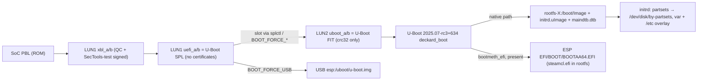

# 74 — Steam Frame recovery image: QDL package, USB repair image, physical layout, boot chain

**Status:** research complete (static inspection; no hardware). **Date:** 2026-09-27.
**Subject:** Valve's official Steam Frame recovery release `20260922.5153644-0.3.0` in both published
forms — the **QDL/EDL package** `steamframe-oobe-repair-qdl-20260922.5153644-0.3.0.tar.gz` and the
**USB-bootable repair image** `steamframe-oobe-repair-20260922.5153644-0.3.0.img.bz2` — archived at
`references/archive-steam-frame/frame-recovery-deckard-20260922.5153644-0.3.0/` (git-ignored;
recipe: `references/archive-steam-frame/archive-steam-frame-recovery.sh`). Inspection transcripts,
carved partitions and copied scripts persist under `extracted/` in that directory; every path of the
form `extracted/…` below is relative to it, and `0.5.0/extracted/…` means the sibling
`frame-archive-deckard-20260921.6090922-0.5.0/extracted/` audited in
[33](33-steam-frame-donor.md).

**What this is and is not.** Doc 33 audited the *update payload* (one RAUC slot image). This release is
the *first-install/repair* artifact: it carries the complete GPT of the OS LUN, both boot-firmware LUNs,
the Firehose programmer Valve ships to retail owners, and the vendor's own install script. It therefore
answers most of the `UNKNOWN on hardware` items of [72 §7](72-xr-unlock-and-flash-targets.md) at the
SOURCE-VERIFIED / VENDOR-DOCUMENTED level (vocabulary: 72 §1). It does **not** run on hardware: fuse
state, what the boot ROM enforces, and runtime behaviour remain hardware-only. No shipped binary
(`qdl`, `loader.melf`) was executed; everything was read by headers, strings, `sfdisk`, `debugfs`,
`mtools`, `guestfish` and `dumpimage`.

**Framing flagged for the owner (rule 4).** The userspace inside this release is build
`20260922.6152327`, version `0.3.0` (`extracted/rootfs-A-batch1.txt`, os-release), older than the
`vr` `0.5.0` donor of doc 33. This document treats the recovery release as the **layout, boot-chain
and flash donor** and keeps the 0.5.0 payload as the userspace/kernel donor. Whether `donor.nix`
should eventually pin a *second* donor entry or a *replacement* is an owner decision (§10 Q5).

## 1. Provenance chain

| Hop | Value | Evidence |
|---|---|---|
| Click-through page | `https://store.steampowered.com/steamos/download/?ver=steamframe-qdl` (EULA; "Download SteamOS: Steam Frame Image") | `metadata/store-download-page.html` |
| Alias the page links | `https://steamdeck-images.steamos.cloud/recovery/steamframe-repair-qdl-latest.tar.gz` | `metadata/REDIRECT.txt:1` |
| Redirect (HTTP 302, nginx) | `…/recovery/steamframe-oobe-repair-qdl-20260922.5153644-0.3.0.tar.gz` | `metadata/redirect-headers.txt:1-5` |
| Tarball | 4 100 462 821 bytes; sha256 `d3323bfa8efe9ece1954948421cdf5f705e8942eb50c960e2916d935d1b850ab` | `SHA256SUMS` |
| Members | `loader.melf` `ce0ad658…`, `lun0.img` `4adb146e…`, `lun1.img` `9721b3dc…`, `lun2.img` `f20f636c…`, `x86_64-linux-qdl` `a1c9a010…`, `aarch64-linux-qdl` `f4d8ebc6…`, `x86_64-windows-qdl.exe` `e30fad79…` | `SHA256SUMS` |
| Index snapshot | `/steamos-holo/recovery/` lists, dated 2026-Sep-22 22:49–22:57: `…-qdl-…tar.gz`, `…-qdl-….zip`, `…-0.3.0.img.bz2`, `…-0.3.0.img.zip` (all 3.8 GiB), beside the Steam Deck `steamdeck-oobe-repair-*` and `steamdeck-recovery-*` images | `metadata/recovery-index.html` |
| USB image | `…/recovery/steamframe-oobe-repair-20260922.5153644-0.3.0.img.bz2`, 4 068 109 407 bytes, sha256 `3a4a077f1b1f40688ab3279affcb56776bd97c54db1573e7c65fc52a97106676` → 7 GiB raw (`081a38c0…`) | `metadata/REDIRECT.txt:3`, `metadata/SIZES.txt`, `SHA256SUMS` |
| Vendor procedure | Steam Support "SteamOS Installation and Repair" (`65B4-2AA3-5F37-4227`), sections *Steam Frame* and *Flashing SteamOS over USB (Steam Frame only)* | `metadata/help-steamos-installation-and-repair.html` [external, retrieved 2026-09-27] |

Build identity inside the release: `BUILD_ID=20260922.6152327`, `VERSION_ID=0.3.0`, `VARIANT_ID="vr"`
(`extracted/rootfs-A-batch1.txt`, os-release), identical in the QDL LUN0 rootfs and the USB rootfs.
The public `vr/20260922.6152327/` directory carries the same build as an update bundle, branch **`rc`**
(`metadata/vr-20260922.6152327/deckard-20260922.6152327-0.3.0.manifest.json`; its `manifest.raucm`
in `metadata/vr-20260922.6152327/bundle/`). The `5153644` in the artifact name is the recovery
packaging job, not the OS build. The `vr/oobe/` channel has parallel `20260922.51xxxxx-0.3.0` builds
(`branch main`, `"skip": true`), and `latest-oobe-test-image.txt` still points at goldmaster `0.1.0`
[external, both retrieved 2026-09-27]. The rootfs payload bytes differ from the `rc` bundle's
`[image.rootfs] sha256=61ef54fb…` (ours: `39f16ec7…`, `extracted/rootfs-A-partition.sha256`) — same
build, different btrfs instance (installers randomize the btrfs UUID, §6.3) — while the boot payloads
inside are byte-identical across the QDL rootfs and the USB rootfs (`Image`, `initrd.uImage`,
`bootfw.tar.xz`, `uboot_ev3.img`, `kernelsetup.sh`; `extracted/usb-rootfs-batch1.txt` checksums).

Vendor-documented procedures [external, `65B4-2AA3-5F37-4227`]:

- **EDL flashing (Steam Frame only):** extract, run `flash.cmd` (Windows) or `flash.sh` (Linux) → "Waiting
  for EDL device"; with the headset fully off, wait 10 s, hold **Power + Volume Up + Volume Down for
  10 s**; connect USB-C; the script flashes and the headset reboots. Fallback: hold Power 16 s to force off.
- **USB repair boot:** write the `.img` to an 8 GB+ USB key; hold the **Aux** button while pressing Power
  until the Boot Menu appears; Volume Up/Down navigate, Aux selects; choose the USB drive; in the
  repair desktop use the Frame controllers or head-as-mouse; options *Wipe Device & Install SteamOS*,
  *Repair SteamOS*, *Recovery tools*.

## 2. The QDL package

Members (`metadata/MEMBERS.txt`; owner `sabae`, mtimes 2026-09-23 00:46):

| Member | Size | Identity |
|---|---|---|
| `loader.melf` | 1 549 300 B | Qualcomm Firehose *device programmer* for **Lanai = SM8650**: outer ELF is 32-bit **RISC-V** (`package-identity.txt:7,26`) wrapping four nested ELFs at offsets 2308/193908/1102164/1401164 (`package-identity-2.txt:164-170`); `QC_IMAGE_VERSION_STRING=BOOT.MXF.2.1-01643.1-LANAI-1`, `IMAGE_VARIANT_STRING=SocLanaiLAA`, `SBL1 BUILD @ 07:51:02 on Sep 25 2023`, TME firmware `ssg.tmefw.3.0-00576-release` (`package-identity.txt:59-72`) |
| `lun0.img` | 34 359 738 368 B (32 GiB, sparse 4.2 GiB) | OS LUN image, GPT with 4096-byte sectors (§3.1) |
| `lun1.img`, `lun2.img` | 268 435 456 B each | boot-firmware LUN images, GPT, 4096-byte sectors (§3.2–3.3) |
| `lun0.xml`, `lun1.xml`, `lun2.xml` | rawprogram XML | `SECTOR_SIZE_IN_BYTES="4096"`, `physical_partition_number` 0/1/2 |
| `x86_64-linux-qdl`, `aarch64-linux-qdl`, `x86_64-windows-qdl.exe` | 2.2–2.6 MB | static builds of Linaro/linux-msm **`qdl`** (BSD licence in `LICENSE.qdl.md`); option set includes `--storage <emmc|nand|nvme|spinor|ufs>`, `--serial`, `--dry-run`, `--allow-missing`, `--include`, `--out-chunk-size`, `--finalize-provisioning`, `--create-digests`/`--vip-table-path` (`package-identity-2.txt`) |
| `flash.sh` | | `sudo "${SCRIPT_DIR}/${ARCH}-${OS}-qdl" loader.melf *.xml` (no `--storage`; the tool detects UFS from the programmer) |
| `flash.cmd`, `install_driver.cmd` | | Windows: if the `qcserlib.inf` driver is absent, downloads `QDL_2.4_Win_x64.zip` from `softwarecenter.qualcomm.com` and installs it with `pnputil`, then `x86_64-windows-qdl.exe loader.melf *.xml` |

**Signing evidence on the programmer (static).** `loader.melf` embeds two certificate chains per image
(MBNv7 double signing): the Qualcomm root chain *SRoT MBNv7 Image Signing Root CA 6 → SubCA 1 → CASS - SBL4*
(`extracted/loader-certs.txt:13-24`) and an OEM chain whose root is **`SECTOOLS SECP384R1 CURVE TEST ROOT` /
`General Use Test Key 0 (for testing only)` / `SecTools Test User`** (`loader-certs.txt:31-37`). The same
pair appears in every Qualcomm-signed boot-firmware member of `bootfw.tar.xz` (`xbl`, `tz`, `hyp`, `aop`,
`cpucp`, `shrm`, `qupfw`, `devcfg`, `cpucpconfig`; `extracted/bootfw-identity.txt:34-46`). Valve's
public, retail-usable programmer therefore carries Qualcomm's *published test* OEM key. What that
implies for the device (OEM PK hash unfused, or fused to the test root) cannot be decided statically;
72 §7's *secure-boot fuse policy* stays UNKNOWN, but it is now UNKNOWN with a strong static prior.

**rawprogram semantics — the vendor's own write boundary.** `lun0.xml` has 57 `<program>` entries with
auto-generated labels `p_<start>_<n>`: a **sparse extent map** of the non-zero regions of `lun0.img`
(GPT header/entries at sectors 0–5, FAT metadata of `esp`/`efi-A`/`efi-B`, ~4.4 GiB of btrfs extents
inside `rootfs-A`, ext4 metadata of `var-A`/`var-B`/`home`, backup GPT at 8388603). There is **no
`<patch>` XML and no `<erase>`**: `rootfs-B` and every other unlisted LBA are left as they were
(`extracted/lun0-small-partitions.txt`: the first 16 MiB of `rootfs-B` in the image are zero, but the
flash does not write them). `lun1.xml` and `lun2.xml` each write one whole-LUN extent (`xbl`, `lun2`).
Nothing addresses LUN 3 or higher (§3.4).

## 3. Physical LUN map (authoritative for this release)

All three images are GPT with **4096-byte logical sectors** (`extracted/gpt-luns.txt`; `sgdisk` on a
file misreads them as empty — use `sfdisk --sector-size 4096`).

### 3.1 LUN 0 — the OS disk (`/dev/sda`), GPT declares 32 GiB

| # | Name | Type GUID (systemd DPS name) | Start (4K sectors) | Size | Content in the image |
|---|---|---|---|---|---|
| 1 | `esp` | `C12A7328…` esp | 512 | 256 MiB | FAT32, **empty** |
| 2 | `efi-A` | `EBD0A0A2…` "Microsoft basic data" | 66048 | 64 MiB | FAT32: `/SteamOS/partsets/{A,B,all,other,self,shared}` |
| 3 | `efi-B` | same | 82432 | 64 MiB | same, with `self`/`other` swapped |
| 4 | `rootfs-A` | `4F68BCE3…` root-x86-64 (sic, on aarch64) | 98816 | 10 GiB | btrfs, 4 474 454 016 B used, build 20260922.6152327 |
| 5 | `rootfs-B` | same | 2720256 | 10 GiB | **not written** by `lun0.xml` |
| 6 | `var-A` | `4D21B016…` var | 5341696 | 256 MiB | ext4, empty (`lost+found`) |
| 7 | `var-B` | same | 5407232 | 256 MiB | ext4, empty |
| 8 | `home` | `933AC7E1…` home | 5472768 | **100 MiB** | ext4 `casefold`, empty |

`gpt-luns.txt:28-35`; disk GUID `ECD1E9C4-…`, `last-lba: 8388602` (`:25`), 2 890 741 free sectors (~11 GiB)
after `home`. Partsets files (`extracted/partsets.txt`) map partset names to PARTUUIDs:
`A = {efi, rootfs, var}` of the `-A` set, `B` likewise, `shared = {esp, home}`, `all` = the eight, and
per-`efi` partition `self`/`other`. **No `syspersist` partition exists on LUN 0** although `fstab`
mounts `PARTLABEL=syspersist` at `/persist` with `nofail` (`extracted/rootfs-A/etc/fstab`) — see §3.4.

**The 32 GiB template and how it grows (SOURCE-VERIFIED mechanism, runtime INFERRED).** The retail
Frame has 256 GB or 1 TB of UFS; the image's GPT is a 32 GiB template with `home` at 100 MiB. The vendor
install script says so in its own words: *"For the stub .img file we're making this can be tiny, OS
expands to fill physical disk on first boot"* (`extracted/usb-var-A/tools/repair_device.sh:58`). The
mechanism is stock systemd: `/usr/lib/repart.d/90-home.conf` contains only `[Partition] Type=home`
(`extracted/rootfs-A/etc/repart.d/90-home.conf:10-11`, LGPL header "part of steamos-customizations"), and
the unmodified `systemd-repart.service` from systemd 257.7 runs with `--dry-run=no`
(`extracted/rootfs-A/units/systemd-repart.service`), which grows the matching partition into all free
space of the backing device (systemd's documented `SizeMaxBytes=` default: no maximum,
`references/systemd/man/repart.d.xml:336-352`; free-area computation from libfdisk's last LBA,
`references/systemd/src/repart/repart.c:4333-4368`). `x-systemd.growfs` on the `home` fstab line then
grows the ext4 (`extracted/rootfs-A/etc/fstab:5`). Relocation of the backup GPT header from the 32 GiB
mark to the real end of the LUN is libfdisk's behaviour on write; not independently verified here.

### 3.2 LUN 1 — boot firmware (`/dev/sdb`), 28 partitions, all A/B

`xbl_a` (type `DEA0BA2C-CBDD-4805-B4F9-F428251C3E98`, **`attrs="LegacyBIOSBootable"`**) / `xbl_b`
(type `…3E9B`), then `xblconfig`, `shrm`, `aop`, `aopconfig`, `cpucp`, `cpucpconfig`, `tz`, `devcfg`,
`hyp`, `uefi` (32 MiB), `uefisecapp`, `keymaster`, `qupfw` (80 KiB), each `_a`/`_b`; `table-length: 32`
(`gpt-luns.txt:92-119`). This is exactly the model `kernelsetup.sh` encodes: slot detection by the
legacy-bootable attribute on `/dev/sdb` partitions 1/2, fallback to the XBL_SC parttype
`dea0ba2c-…3e98`, `qupfw_{a,b}` fix-ups (`extracted/rootfs-A/boot/kernelsetup.sh:42-56,303-330`).
`/dev/sdb` **is LUN 1**.

**Every LUN 1 partition's content is byte-identical to the corresponding `bootfw.tar.xz` member from the
rootfs `/boot`** — 28/28 `MATCH`, both slots, nothing beyond the member length
(`extracted/boot-luns.txt:2-29`). `keymaster.fw` and `uefisecapp.fw` are **empty files** (0 bytes): no
Keymaster TA and no Qualcomm UEFI secure application are deployed. `uefi.fw` (299 712 B) is **not
Qualcomm UEFI: it is `U-Boot SPL 2025.07-rc3-00634-gbb0a2a01cb6d`** (`bootfw-identity.txt:68`) and
carries **no certificate chain at all** (`bootfw-identity.txt:43`). Versions: `xbl` BOOT.MXF.2.1-01945-LANAI-1
(Aug 2024), `tz`/`hyp` TZ.XF.5.0, `aop` AOP.HO.5.0-00773-LANAI_E-1 (`bootfw-identity.txt:49-76`).

### 3.3 LUN 2 — U-Boot and platform data (`/dev/sdc`), 14 partitions

`bootenv`, `bootenvb` (128 KiB), `uboot_a`/`uboot_b` (32 MiB), `ubootenv_a`/`ubootenv_b` (128 KiB),
`ubootfw_a`/`ubootfw_b` (4 MiB), `uefivarstore` (512 KiB, **all zero**), `cdt` (133 non-zero bytes:
Qualcomm Configuration Data Table, `CDT\0` magic), `ddr` (zero), `xblramdump` (Qualcomm RAMDUMP ELF,
BOOT.MXF.2.1-01543), `toolsfv`, `adpd` (`gpt-luns.txt:161-174`, `extracted/lun2-misc.txt`,
`boot-luns.txt:40-53`). Again byte-identical to the rootfs `/boot` files: `uboot_{a,b}` = `uboot_ev3.img`,
`ubootfw_{a,b}` = `ubootfw_ev3.img`, `ubootenv_{a,b}` = `uboot.env` (`boot-luns.txt:34-39`). All four
`uboot_{dv1,dv2,mp}.img` names in `/boot` are symlinks to the `ev3` image (`rootfs-A-batch1.txt`, `/boot ll`).

### 3.4 LUN 3 — `syspersist` (`/dev/sdd`), not in the package

`restore-calibration` remounts `/persist` read-write by toggling `blockdev --setrw /dev/sdd*` and, on
restore, reformats the `/persist` source as `mke2fs -t ext4 -b 4096 -L syspersist`
(`extracted/rootfs-A/tree/deckard-hw-support/restore-calibration:99-103,142`). `syspersist` is therefore
a **fourth UFS LUN** that the QDL package never touches. Its content is a *cache*: the three
calibration JSONs are regenerated from an **I²C EEPROM** (`eeprom_console get eyetracking|device_config|xrservice`,
`restore-calibration:32-44`), then committed into a git repository on `/persist`. The per-unit truth
lives in the EEPROM, not on UFS — the reason a full LUN 0–2 flash is safe on the Frame, and the exact
protected-state class 72 §2 item 6 asks for. (INFERRED beyond `/dev/sdd`: LUN number and size.)

## 4. Boot chain as the artifacts describe it

- **SPL** (`uefi.fw`): honours `BOOT_FORCE_SLOT`, `BOOT_FORCE_USB{,_VENDOR,_PRODUCT,_SERIAL}`, reports
  `BOOTED_FW_SLOT`, counts boots on the target slot ("Boot count on target slot is %d";
  `bootfw-identity.txt:2-27`). U-Boot proper drives it through `splctl force-slot A|B`, `splctl force-usb`,
  `splctl set-bootfw-slot` (`extracted/uboot-strings-2.txt:94,142-145`; userspace `splctl` verbs
  `get-boot-count`, `get-bootfw-slot`, `get-primary`, `set-primary`, `set-state`… `extracted/lun2-misc.txt`).
- **U-Boot proper** (`uboot_a/b`, FIT "U-Boot … for deckard board" + control DTB `sm8650-deckard`,
  `extracted/uboot-fit.txt`): board code `board/qualcomm/deckard/`, `deckard_boot` loads `/boot/Image`,
  `/boot/initrd.uImage`, `/boot/maindtb.dtb` from the selected rootfs (`uboot-strings.txt:72-79`) and
  builds the cmdline `%s %s %s init=/sbin/init rauc.slot=%c noresume rootwait earlycon %s` with
  `steamos.efi=PARTUUID=<efi-X>` (fallback `root=PARTLABEL=…`; `uboot-strings-2.txt:45-47,150`). It also
  contains standard-boot `bootmeth_efi`/`extlinux`/`script`/`pxe`, `deckard_bootefi`, "Attempting to boot
  with EFI!", `EFI/BOOT/BOOTAA64.EFI` (`uboot-strings.txt:36,50,92,138,153`); the rootfs ships
  `/usr/lib/steamos-efi/aarch64-efi/steamcl.efi` and `steamcl-install` (`extracted/usb-rootfs-batch1.txt`).
  **Which path runs first is not readable from strings** (§11). The EFI variable store is a raw partition
  ("EFI: Couldn't find EFI variable store partition!", `uefivarstore` on LUN 2; `uboot-strings.txt:196`).
- **Verification posture of U-Boot (static).** `uboot.env` sets `verify=n`, `bootdelay=2`,
  `default_bootargs=loglevel=3 rd.log=console rd.log=file` and nothing else (`extracted/uboot-env.txt`).
  The binary has FIT hash strings but **no RSA/ECDSA algorithm strings** and no EFI `SecureBoot`/`SetupMode`
  variables (`extracted/uboot-strings-3.txt:1-58`); the kernel is loaded as a raw `Image`, not a FIT. Read
  together with §2 and §3.2: every stage after `xbl` is either unsigned or checksum-only in these
  artifacts. This is the strongest static evidence yet on `frame-open` (72 §15); it is still not a
  hardware result.
- **Boot menu** (rendered in-headset by U-Boot's `vrterminal`/`vrfont` assets in `ubootfw`): entries
  `SteamOS`, `Current <build>-<slot>-…`, `Previous …`, `Boot from USB` / `USB: <vendor> <product> [N GB]`,
  `Repair Steam Installation`, `Erase User Data`, `ADB mode`, `Fastboot`, `Shutdown`, `Hard Reset`
  (`uboot-strings-2.txt:105-155`); entered by the Select (Aux) button ("Select button pressed. Boot
  intention: boot menu", `:89`) or `reboot recovery|fastboot|usb`. U-Boot implements **USB fastboot**
  (`fastboot -l 0x880000000 -s 0x10000000 usb 0`, `:100`) and can `reset edl` (`:64`). `Erase User Data`
  writes `/efi/steamos/factory-reset/factoryreset.cfg` (`:106`) which the initrd's `factory_reset` hook
  consumes: reformat `var-A`, `var-B`, `home`, zero `ubootenv_{a,b}`, reboot
  (`extracted/rootfs-A/tree/initcpio/hooks/factory_reset:8-9,36-43,59`).
- **Initrd contract** (mkinitcpio hooks shipped in the rootfs): `partsets` reads `steamos.efi=`, mounts that
  `efi-X`, generates `/run/udev/rules.d/90-steamos-partsets-*.rules` (`SYMLINK+="disk/by-partsets/<set>/<name>"`
  by `ID_PART_ENTRY_UUID`) and sets `root=/dev/disk/by-partsets/self/rootfs`
  (`extracted/rootfs-A/tree/initcpio/hooks/partsets:7-8,56-79,114`); `etc_overlay` mounts
  `by-partsets/self/var` on `/var` and an overlayfs on `/etc` with upper/work in `/var/lib/overlays/etc`
  (`hooks/etc_overlay:9,21-26`). `var-A`/`var-B` ship empty; first boot populates them.
- **Boot-firmware update path = the same bytes.** `steamos-finalize-install` runs `/boot/kernelsetup.sh`
  "and nothing else" on the Frame (`extracted/rootfs-A/bin/steamos-finalize-install:31-34`), which `dd`s
  `uboot_<model>.img`, `ubootfw_<model>.img`, `uboot.env` into `uboot_/ubootfw_/ubootenv_<slot>` and the
  `bootfw.tar.xz` members into `<fw>_<fwslot>`, then `splctl set-bootfw-slot`
  (`kernelsetup.sh:180-185,389,395-403`). §3.2–3.3 prove that this path and the QDL package write the
  same content.

## 5. The rootfs — identity, delta against the 0.5.0 donor, corrections to doc 33

| Fact | 0.3.0 recovery rootfs (`20260922.6152327`) | 0.5.0 donor (`20260921.6090922`) |
|---|---|---|
| Kernel | `6.18.0-gfbdbca41fd45`, pkgbase `linux-618-deckard`, package `linux-618-deckard-6.18.0+gfbdbca41fd45-1` | `6.18.0-gbfea53e51a5d` |
| IKCONFIG | 8 350 options; **differs only in `CONFIG_PAHOLE_VERSION`** (131 vs 126) (`extracted/kernel-dtb-diff.txt`) | `0.5.0/extracted/config-6.18.0-deckard` |
| `sm8650-mp.dtb` | 171 semantic diff lines after removing phandles: the 0.5.0 tree adds an `i2c-sw-broadcaster@2c` node and `broadcaster-parent` links on three I²C devices, i.e. hardware description still moving between builds (`extracted/sm8650-mp-dts-diff-0.5.0-vs-0.3.0.txt`) | |
| `kernelsetup.sh`, `fstab`, `rauc/system.conf`, `ubootrelease.txt` | **byte-identical** to 0.5.0 (`extracted/kernel-dtb-diff.txt`, shell diff) | |
| U-Boot | `2025.07-rc3-00634-gbb0a2a01cb6d`, built `Sep 08 2026 23:00:46 UTC`; packages `deckard-uboot-20260908.1-2`, `deckard-uboot-splctl-20260128.3-1`, `uboot-tools-20260908.1-2` | same release string |
| Package DB | **present**: `/usr/lib/holo/pacmandb/local/` with 966 packages; sync DBs `core`, `extra`, `deckard-arch-hotfixes-release-0.3` (`extracted/packages-local-20260922.6152327.txt`) | **also present** (967 packages; re-checked 2026-09-27) |

**Correction to doc 33 §6 and §10.** "No pacman database in the deployed image" was wrong: SteamOS keeps
it at `/usr/lib/holo/pacmandb/` (`update_pacman_dbpath` in `steamos-finalize-install:196-207` sets
`DBPath = /usr/lib/holo/pacmandb/`), not at `/var/lib/pacman`. The SBOM is therefore available from the
image itself. Notable Frame packages: `deckard-hw-support`, `deckard-eeprom`, `deckard-boot-images`,
`deckard-charger`, `deckard-fan-control`, `deckard-fpga`, `deckard-led-control`, `deckard-power-monitor`,
`deckard-typec-logger`, `deckard-audio-config`, `deckard-mesa-{linux,android}-aarch64 26.3.0_devel`,
`deckard-steam-rel`, `deckard-steamvr-rel`, `deckard-steamvr-session`, `deckard-vulkan-layers-*`,
`linux-firmware-deckard`, `steamos-customizations-deckard`, `steamos-efi-20260122.1-5`,
`steamos-atomupd-client`, `rauc-1.14`, `desync-1.0.0`, `gamescope-3.16.28`, `systemd-257.7`.

Other observations: `/etc/steamos-atomupd/client.conf` embeds a basic-auth CI credential for the update
server (value not reproduced here; `steamos-finalize-install:211-217` deletes the overlay copy on
migration); `steamos-finish-oobe-migration.service` runs when `/home/doorstop` or `/home/steamvr` exist,
i.e. this OOBE build ships a different home layout that later builds migrate
(`extracted/rootfs-A/units/steamos-finish-oobe-migration.service`); the deployed `/var` in the rootfs
contains only distribution defaults (fontconfig cache, empty service dirs).

## 6. The USB repair image

### 6.1 Layout

7 GiB raw disk, GPT with **512-byte sectors** (a USB stick, not UFS): `esp` 256 MiB, `efi-A` 64 MiB,
`rootfs-A` 5 GiB (btrfs, label `rootfs-A`), `var-A` 256 MiB, `home` 100 MiB — a **single-slot SteamOS**
(`extracted/usb-gpt.txt`). `efi-A` carries partsets for one set only (`extracted/usb-small-partitions.txt`).

### 6.2 What U-Boot's USB boot loads

The USB `esp` is not an EFI system partition in use: it holds **`/uboot/u-boot.img`** — byte-identical to
`uboot_ev3.img` / LUN 2 `uboot_a` (sha256 `08975f16…`) — plus `/uboot/ubootfw/{uboot.env,
dead_battery_recovery.bin, lib/firmware/adsp_lite_sm8650.mbn}` and `/efi/SteamOS/{default.vrfont,
default.vrterminal, logo*.bmp.gz}`; no `EFI/BOOT/` directory (`extracted/usb-small-partitions.txt`,
`extracted/usb-esp/`). Read with the SPL strings (`BOOT_FORCE_USB…`, "going to try to boot from USB") and
U-Boot's `/uboot/ubootfw` path string (`uboot-strings-2.txt:146`): **"Boot from USB" means the SPL loads
U-Boot proper from the removable disk's first partition**, and that U-Boot then boots the USB rootfs
through the ordinary `steamos.efi=` path. The external-boot payload the Frame accepts is therefore a
*U-Boot FIT file at a fixed path*, not an EFI application. (Order relative to the EFI bootmeth: §11.)

### 6.3 The vendor's install procedure — `repair_device.sh`

`var-A:/tools/repair_device.sh` (520 lines) is shared with the Steam Deck and branches on
`vrdevice_path` (`extracted/usb-var-A/tools/repair_device.sh:21,31`). Frame branch:

1. `DISK=/dev/sda` (LUN 0); `PART_SIZE_ROOT=10240` MiB vs the Deck's 5120 (`:31,53`).
2. `all`: `sfdisk` writes the eight-partition table by *sizes only* — `esp` 256, `efi-A/B` 64, `rootfs-A/B`
   10240, `var-A/B` 256, `home` 100 MiB — with systemd DPS type GUIDs (`:90-100`); "OS expands to fill
   physical disk on first boot" (`:58`). No NVMe sanitize on the Frame ("not supported on Steam Frame yet",
   `:422`).
3. `mkfs.vfat esp/efi`, `mkfs.ext4 var-A var-B`, `mkfs.ext4 -O casefold -T huge home` + `tune2fs -m 0`.
4. `fsfreeze -f /`; **`dd` the installer's own live rootfs into both `rootfs-A` and `rootfs-B`**, then
   `btrfstune -f -u` (new UUID) and `btrfs check` (`:209-217,369-374`).
5. `finalize_part A|B`: in a `steamos-chroot --no-overlay --disk /dev/sda --partset X`: `mkdir /efi/SteamOS`,
   `steamos-partsets /efi/SteamOS/partsets`, `steamos-bootconf create --image X --conf-dir
   /esp/SteamOS/conf --efi-dir /efi --set title X`; **no grub on the Frame** (`:221-232`).
6. `steamcl-install --flags restricted --force-extra-removable` in partset A — this runs on the Frame too
   (`:383`), so a `repair_device.sh`-installed Frame has `steamcl.efi` on its ESP while the QDL image's
   ESP is empty (§3.1). Two vendor-produced first-boot states exist; both are expected to boot.
7. `system` = steps 3–6 without the table; `home` = reformat `var-*` and `home`; `chroot` drops into the
   primary partset (`:488-512`). The desktop entries *Wipe Device & Install SteamOS* / *Repair SteamOS
   Install* / *Clear local user data* call `sudo /var/tools/repair_device.sh all|system|home`
   (`extracted/usb-var-A/lib/overlays/etc/upper/skel/Desktop/*.desktop`); the session is Plasma via SDDM
   autologin with `GAMESCOPE_OVERLAY_KEY=valve.plasma.recoverymode` (`…/gamescope-session.service.d/overlay_key_recovery_mode.conf`).

**What the USB repair does not do:** it never writes LUN 1 or LUN 2 (`kernelsetup.sh` is not invoked;
boot firmware is updated later by the normal RAUC post-install path, §4) and never touches LUN 3. The QDL
package, by contrast, rewrites LUN 0–2 and preserves only LUN 3 and `rootfs-B`'s old bytes.

## 7. What this confirms and what it revises

| Prior statement | Verdict | Now |
|---|---|---|
| 33 §2: proven OS partition set = shared `esp`, `syspersist`, `home` + per-slot `efi`, `rootfs`, `var` | **revised** | `syspersist` is not on the OS LUN; it is a separate LUN (§3.4). LUN 0 = exactly 8 partitions (§3.1). Names use `-A`/`-B` (`rootfs-A`), type GUIDs are systemd DPS (root-x86-64 on aarch64) |
| 33 §3: boot LUN `/dev/sdb` with A/B XBL, partitions 1/2 bootable, XBL_SC parttype | **confirmed** and completed: 28 partitions, contents = `bootfw.tar.xz` (§3.2) |
| 33 §3: chain PBL → XBL → U-Boot → `/boot` | **refined**: PBL → XBL → **U-Boot SPL in `uefi_a/b`** → U-Boot FIT on **a third LUN** → `/boot` (§4) |
| 33 §6/§10: no pacman DB in the image | **wrong**; DB at `/usr/lib/holo/pacmandb/` in both releases (§5) |
| 33 §9 / uefi-rauc family: "Frame U-Boot runtime-variable persistence remains hardware-only" | **refined**: a dedicated `uefivarstore` partition exists, zero in the image; U-Boot references an EFI variable store partition (§3.3, §4). Still unproven at runtime |
| 72 §7 UNKNOWN: EDL programmer | **resolved**: Valve ships `loader.melf` (BOOT.MXF.2.1-01643.1-LANAI-1), VENDOR-DOCUMENTED procedure and chord (§1, §2) |
| 72 §7 UNKNOWN: external-media boot | **resolved**: SPL-level USB boot of a U-Boot FIT at `esp:/uboot/u-boot.img`; Aux+Power menu (§4, §6.2) |
| 72 §7 UNKNOWN: rescue image | **resolved**: official USB repair image with `repair_device.sh` (§6) |
| 72 §7 UNKNOWN: complete physical-LUN map | **resolved for LUN 0–2**, LUN 3 identified by device node only (§3) |
| 72 §7 UNKNOWN: boot-firmware update transaction | **resolved**: `kernelsetup.sh` writes the same bytes; A/B by `splctl` (§4) |
| 72 §7 UNKNOWN: factory/calibration partitions | **resolved in class**: EEPROM is the source, `syspersist` LUN the cache (§3.4) |
| 72 §7 UNKNOWN: secure-boot fuse policy, U-Boot verified-boot policy | **still UNKNOWN** on hardware; static prior now strong (test OEM root, unsigned SPL, crc32 FIT, `verify=n`, raw `Image`) |
| 72 §7: "`flashMethod = rauc` is only a coarse label; no first-install path" | **revised**: two vendor first-install paths exist (QDL LUN images; USB repair `dd`+`sfdisk`) (§2, §6) |
| `donor.nix` `facts.slots.partitions = [esp efi_a efi_b rootfs_a rootfs_b syspersist home]` | **revised**: add `var-A/var-B`, drop `syspersist` from the OS LUN, record LUN structure (§3) |
| 07 §4 "Do not copy the Steam Deck's eight-partition GRUB layout" | **refined**: the Frame *does* use the Deck's eight-partition LUN 0 layout (same script), minus GRUB (§6.3) |
| uefi-rauc family (VM proof) boots systemd-boot from a shared ESP | **not contradicted, not confirmed**: U-Boot has an EFI bootmeth and Valve builds `steamcl.efi` for aarch64, but the vendor's own boot path is the native `/boot` loader; whether an unsigned `BOOTAA64.EFI` on the LUN 0 `esp` is tried, and when, is §11 item 1 |

## 8. Comparables, with their reasons

- **Valve's own Steam Deck branch of the same script** (`repair_device.sh:21-60`, Deck: `/dev/nvme0n1`,
  GRUB + `steamcl`, BIOS capsule staging, NVMe sanitize). Problem solved: reinstall from a live USB desktop
  with the *same* OS image as payload, one script, prompts via zenity. Reason it transfers: Valve kept the
  LUN 0 layout and partsets identical across two SoCs so that `steamos-chroot`, `steamos-partsets`,
  `steamos-bootconf` and RAUC need no porting; only the loader differs. Assumption: the installer *is* a
  full OS with a desktop — a 7 GiB stick and a GPU session. Trade-off for Mura: a full-OS installer costs a
  second image family; a minimal initrd installer (research/57's recovery UKI) is the alternative.
- **Lynx R1 vendor QDL restore** ([72 §8](72-xr-unlock-and-flash-targets.md) [external]): the standard
  Qualcomm shape — `prog_firehose_ddr.elf` + `rawprogram*.xml` + `patch*.xml`, "Erase All" warning because
  calibration lives on UFS. Valve solves the same problem with one MELF programmer, a sparse extent map, no
  patch XML and **no calibration on the written LUNs** (EEPROM + separate LUN). Reason: keep the flash
  idempotent and safe for retail owners. Transfers to Mura directly: a Mura LUN 0 image flashed the same way
  cannot destroy calibration.
- **Qualcomm RB3 Gen 2 QDL flow** [external, docs.qualcomm.com, retrieved 2026-09-27]: `qdl --storage ufs
  prog_firehose_ddr.elf rawprogram*.xml patch*.xml`, UFS LUN provisioning as a separate step. Valve omits
  `--storage` and provisioning: the Frame's LUNs are pre-provisioned at the factory and the programmer
  self-identifies the storage. Do not send a provisioning XML to a Frame.
- **systemd-repart for growth** (`references/systemd/man/repart.d.xml:62-67,336-352`): the systemd
  project's reason for "grow, never shrink, fill by weight" is exactly the image-template case Valve uses
  (`90-home.conf`). Mura's uefi-rauc family already builds with repart; adopting the same one-line
  `repart.d` at runtime is the standard mechanism, not a Valve import.
- **mkosi / systemd DPS type GUIDs** (`references/mkosi`, doc 33 §10): Valve labels `rootfs-A/B` with the
  x86-64 root type on aarch64 — a convenience for `steamos-chroot`, not a discoverable-partitions design;
  Mura should keep the architecture-correct root type (`B921B045…` root-arm64) unless partset tooling is
  reused verbatim (owner call, §10 Q3).
- **Deck recovery as read in research/57** (USB desktop, no recovery partition): confirmed for the Frame
  too, with the addition of an in-loader menu (`Repair Steam Installation`, `Erase User Data`) that the
  Deck's UEFI lacks — the Frame's U-Boot *is* Valve's boot-menu UI. Mura's research/57 determination
  (dedicated recovery partition + its own initrd) remains a Mura choice, now with the vendor's counter-model
  documented.

No comparable was found for "SPL loads U-Boot from a USB disk at a fixed FAT path" among the pinned
clones (Tow-Boot and Mobile NixOS boot from SD/eMMC via U-Boot's own SPL and distro-boot;
`references/tow-boot`, `references/mobile-nixos`). Per rule 7 this is a *no-comparable* signal: Valve's
USB mechanism is a bespoke SPL feature and Mura should treat reliance on it as a rethink candidate rather
than a given.

## 9. Budget impact

None at runtime: this document changes data (`donor.nix` facts) and research state only. Build/storage:
the archive occupies ~21 GiB allocated (4.1 GB tarball, 3.8 GB `.bz2`, sparse images and carved
partitions) on the local reference volume, git-ignored, `localOnly`.

## 10. Owner questions (rule 8 — options are the comparables' positions)

1. **First-install shape for Mura on the Frame.** Options: (a) *Valve QDL shape* — publish a Mura
   `lun0.img` + rawprogram map and reuse `qdl` (writes LUN 0 only; LUN 1–2 untouched, keeps Valve's SPL/U-Boot;
   Lynx/Qualcomm precedent, retail-proven chord); (b) *Valve USB-repair shape* — a bootable stick carrying
   Valve's `u-boot.img` and a Mura rootfs with an installer that `sfdisk`s and `dd`s LUN 0 (Deck/Frame
   precedent; needs a GPU session or a text installer); (c) *in-system* — install into `rootfs-B` from a
   running SteamOS via RAUC/`dd` then switch slot (no precedent among vendors for a foreign OS; lowest
   risk to the boot chain). Consequence: (a) and (b) both depend on Valve's SPL/U-Boot accepting an unsigned
   `/boot/Image` — statically likely (§4), hardware-unproven.
2. **32 GiB template + repart growth vs. a full-size GPT.** Valve: template + `Type=home` growth (systemd's
   mechanism). Alternative: write a device-size-specific table (Lynx/Qualcomm rawprogram practice). Mura's
   uefi-rauc family already emits a fixed 33.6 GiB image (33 §9); adopting the template convention makes
   one image serve 256 GB and 1 TB units.
3. **Partition naming and type GUIDs.** Valve: `rootfs-A`/`-B`, root-x86-64 type, partsets by PARTUUID.
   Mura today: `rootfs_a`/`_b`, systemd-boot on the ESP. Options: mirror Valve exactly (reuse
   `steamos-partsets`-style udev symlinks, boot Valve's U-Boot unmodified) or keep Mura names and teach the
   boot path (an extlinux/EFI entry, or a Mura U-Boot build). This decides whether Valve's *unmodified*
   loader can boot Mura.
4. **Boot LUN write policy.** Options: never write LUN 1–3 (the USB repair's posture); write LUN 2
   `uboot_*` only through the vendor's `kernelsetup.sh` shape (the RAUC post-install posture); full LUN 0–2
   (the QDL posture). Consequence: only the first leaves an independently bootable vendor path when Mura
   fails.
5. **Donor manifest shape.** One entry (0.5.0 userspace donor) + a `recovery` acquire block (this
   document's choice, data-only), or a second full donor entry for `20260922.6152327-0.3.0`.
6. **Redistribution class of the recovery package.** Contents are Qualcomm-signed firmware, Valve U-Boot
   (GPL — source request item), Linaro `qdl` (BSD), SteamOS userspace. Recorded as `localOnly` like the
   0.5.0 donor pending the pre-release legal review (donor-pipeline open questions).

## 11. Hardware capture this document makes possible (not executed)

1. On a stock Frame in Developer Mode: `lsblk -o NAME,SIZE,PARTLABEL,PARTTYPE,PARTUUID` for `sda`–`sdd`
   (LUN sizes, the real `home` size after growth, `syspersist` LUN size); `sgdisk -v /dev/sda` (backup
   header position after repart); `cat /proc/cmdline` (confirms `steamos.efi=`, `rauc.slot=`);
   `splctl get-bootfw-slot`, `splctl get-boot-count`; `fw_printenv` after `setubootenv`; `ls /esp/SteamOS/conf`,
   `ls /esp/EFI` (steamcl present or not on a QDL-flashed unit); the Boot Menu photographed.
2. Zero-write EFI-path probe: a USB stick with **only** `EFI/BOOT/BOOTAA64.EFI` (no `/uboot/u-boot.img`)
   answers §7's last row — does `deckard_boot` fall through to `bootmeth_efi` on removable media?
3. Zero-write native-path probe: a stick built like §6.1 but with a Mura rootfs `/boot/Image` +
   `initrd.uImage` + `maindtb.dtb` and Valve's `u-boot.img` in `esp:/uboot/`. This is the first Mura boot
   attempt that touches no internal LUN.
4. EDL identity: `lsusb` with the headset in the chord state (expected `05c6:9008`; redact serial).
   Loading the vendor programmer is Qualcomm-signed code execution; do it only with the vendor's own
   package and never with a foreign Firehose.

## 12. Sources

Local (all under `references/archive-steam-frame/frame-recovery-deckard-20260922.5153644-0.3.0/`):
`metadata/*`, `extracted/package-identity*.txt`, `extracted/loader-certs.txt`, `extracted/gpt-luns.txt`,
`extracted/lun0-small-partitions.txt`, `extracted/partsets.txt`, `extracted/rootfs-A-batch{1..5}.txt`,
`extracted/boot-luns.txt`, `extracted/bootfw-identity.txt`, `extracted/uboot-env.txt`, `extracted/uboot-fit.txt`,
`extracted/ubootfw-erofs.txt`, `extracted/uboot-strings{,-2,-3}.txt`, `extracted/lun2-misc.txt`,
`extracted/kernel-dtb-diff.txt`, `extracted/sm8650-mp-dts-diff-0.5.0-vs-0.3.0.txt`, `extracted/usb-gpt.txt`,
`extracted/usb-small-partitions.txt`, `extracted/usb-rootfs-batch1.txt`, `extracted/usb-var-A/tools/repair_device.sh`,
`extracted/rootfs-A/{boot,etc,bin,units,tree}/…`, `extracted/packages-local-20260922.6152327.txt`.

External, retrieved 2026-09-27: Steam Support
[SteamOS Installation and Repair](https://help.steampowered.com/en/faqs/view/65B4-2AA3-5F37-4227);
[SteamOS download page, Frame QDL](https://store.steampowered.com/steamos/download/?ver=steamframe-qdl);
[recovery index](https://steamdeck-images.steamos.cloud/recovery/);
[vr channel index](https://holo-images.steamos.cloud/vr/), its `oobe/`, `goldmaster/` and
`20260922.6152327/` directories; Qualcomm
[RB3 Gen 2 QDL flashing guide](https://docs.qualcomm.com/bundle/publicresource/topics/80-80021-251/upgrade-rb3gen2-software.html).
