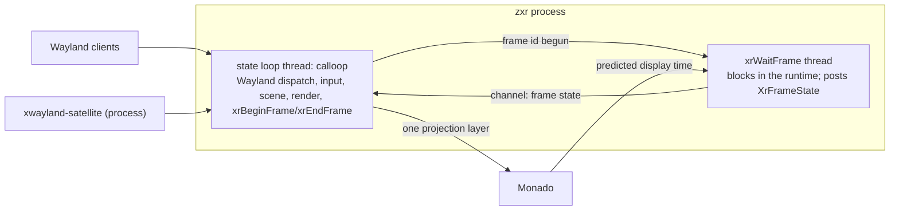

# specs/zxr-core: the compositor as a program — process, loops, modules, and the R0 gates

**Status:** rev 3 (2026-09-26; rev 2.1 + ADR 0006 amendment 2 — the composition ruling: §4 two transports, §6.2 the panel pass, §7 the two tick shapes and the overflow rule, §12 the panels-path gate, §14 the M2 occlusion and cutout-reach items). The program-level specification ADR 0006 and composition §7 left
unwritten, derived from [research/59](../docs/research/59-xr-compositor-architecture-from-comparables.md)
(the mechanisms, the motorcar/wxrc lineage first) and [research/60](../docs/research/60-de-abstractions-mapped-to-xr.md)
(the desktop environment's abstractions), under the 2026-09-26 rulings (ADR 0006 and ADR 0012
amendments). Normative for `pkgs/zxr`. Its conformance checklist (§12) *is* the R0 bring-up
spike; **rev 2 records what R0 taught** ([research/61](../docs/research/61-r0-bring-up-results.md)
§6): the runtime-event timer (§7), the signal mask and teardown order (§9), both acquire paths
exercised (§6.3), the fast client's per-commit cost (§6.4), the RSS fence's host caveat (§12),
and the measured values beside each gate (§12). The scene data model of §5a stays **draft**.
**Design sources:** ADR 0006 (the model, the base), ADR 0007 (greeter/lock mode), ADR 0012 (the
seams), composition §7 (the MVP, constraints 1–9, milestones), [places-model.md](../docs/architecture/places-model.md),
[session-bootstrap.md](session-bootstrap.md) rev 3 (the unit contract), [session-auth.md](session-auth.md)
(the greeter scene), [settings-schema.md](settings-schema.md) (the preference channel).
**Grounding:** "XDG" in this document means the Base Directory spec; Wayland protocols are used
with their upstream meanings (ADR 0012 §4 rule); the OpenXR frame-loop contract is the spec's
(`references/openxr-docs/…/rendering.adoc`), Monado's pacing its documented behaviour.
**Budget impact** (overview invariant 9): one process per session, two threads on the frame path
(the state loop, the `xrWaitFrame` thread), plus the one thread xwayland-satellite is (a separate
process). Fence, from research/59 §13's measurements: binary in the niri class (≤ 40 MB
stripped before size work; LTO/`opt-level = "s"` expected to halve it), RSS ≤ 60 MB nested with
one client (2× niri), ≤ 4 threads; zero CPU copies on the client-buffer path; every frame's GPU
time recorded. R0 measures against this fence and rev 2 tightens it.

## 1. What zxr is

One OpenXR client of Monado — the session that is always present, an overlay session so that
native OpenXR applications may be Monado's *main* session beside it
([native-openxr-apps.md](../docs/architecture/native-openxr-apps.md), draft) — and one Wayland
compositor. It serves `xdg-shell` to 2D clients and,
from M2, `zxr-shell-v2` to 3D clients; it composites every client itself — planes for the 2D
tier, colour+depth for the 3D tier — into one scene with one depth buffer, and submits **one
stereo projection layer** per frame. It never receives client geometry and never re-renders
client content (the lineage's model; research/59 §0, §3). In `--greeter` mode it is the same
binary with a restricted scene and no client socket (ADR 0007). It is `mura-compositor.service`'s
`ExecStart` (session-bootstrap rev 3) once M1 replaces sway.

## 2. Process and threads (ruled 2026-09-26, ADR 0006 amendment)



- **The state loop** is `calloop`, owned by smithay's frontend as designed: every source is an fd
  (Wayland clients, libinput or the runtime's input, syncobj eventfds, the frame-state channel).
  It never blocks on a display or runtime call. All Wayland state, the scene, the renderer and
  `xrBeginFrame`/`xrEndFrame` run here — the OpenXR objects are externally synchronised by
  construction.
- **The wait thread** runs `xrWaitFrame` in a loop and sends the `XrFrameState` (predicted display
  time and period, `shouldRender`) into calloop. It waits for the loop to have *begun* the
  previous frame before calling again (the spec: "block until the previous frame has been begun
  with xrBeginFrame", `rendering.adoc:792-794`); the loop signals that back. One frame in flight
  between the two threads; nothing else crosses the boundary.
- **Why** (research/59 §1, §15 Q1): the spec intends the runtime to own the throttle and expects
  pipelined applications to call `xrWaitFrame` off their main thread; Qt Quick 3D XR, gamescope,
  KWin and mutter all move the blocking wait off the state loop; smithay's own explicit-sync
  design turns waits into fds. The lineage's single loop (wxrc, wayvr) is the simpler prototype
  shape and gives no reason for itself.
- Other threads: none on the frame path. A tracing thread when instrumentation is on
  (research/59 §12); no async runtime; xwayland-satellite is a separate process.

## 3. Modules

| module | owns | never |
|---|---|---|
| `frontend` | smithay `wayland_frontend`: globals, `xdg-shell`, layer-shell, seat, dmabuf feedback, syncobj, the M1 protocol set (§10) | renders; decides placement |
| `xr` | openxrs: instance, system, session on the runtime-created Vulkan device, reference spaces, swapchains, the wait thread, `xrLocateViews` | touches Wayland state |
| `render` | ash: the device from `xrCreateVulkanDeviceKHR`, dmabuf → `VkImage` import with modifiers, shm upload, the scene pass (planes, then 3D clients' colour+depth at M2) into the runtime's swapchain images, timestamps | owns buffers' lifetime (the scene does) |
| `scene` | the layer model (§4), the frame graph and places boundary (§5), window/plane state, stacking, the depth sort, buffer references and release-point signalling | protocol objects |
| `input` | the ray from head/hand pose or the dev pointer → plane hit → `wl_pointer`/`wl_keyboard`/touch through the seat; the input floor (head-aim + `hmdButtons.<selectRole>`, dwell); 6DoF events for 3D clients at M2 | policy about focus (scene's) |
| `policy` | window-management policy in-process (ADR 0012 §2, amended), specified in [window-workspace-management.md](../docs/architecture/window-workspace-management.md) (draft): placement and sizing over the scene's mutation API (§5a) — head-relative spawn below the eye line, siblings offset, apps never place themselves; the one in-process layer-3 engine (`free`, angular-slot spawn and tidy — ruled minimal; `arc`/`dock`/`band` are shipped default external managers over the seam) with one-shot `arrange`; lifecycle states (hidden / maximized / fullscreen; minimize is policy, never a compositor state); layer-2 attachment defaults (rigid; opt-in lazy-follow with threshold/hysteresis/rate; billboard while moving); emphasis; reads its keys from `org.mura.Settings1`. Its external face is `protocols/zxr-window-management-v1.xml` (draft): the same verbs on the wire, river's manage/render sequences, proposals clamped to `limits` | authority (focus rules, boundary, frames, comfort limits, perception layers — the compositor's, reported to the manager, never delegated) |
| `modes` | `--greeter`/lock restricted scene (ADR 0007, session-auth §2–§5): no listening socket, the auth scene, `mura-authd` over a seqpacket pair; normal mode | PAM |
| `unit` | `sd_notify(READY=1)` after the socket is bound and variables published; `WAYLAND_DISPLAY`/`DISPLAY` publication; the crash/restart contract (session-bootstrap rev 3) | — |
| `trace` | spans + the frame journal (§11) | — |

Crate shape: one binary, modules as Rust modules; `libc` where it counts; dependencies: smithay
(git rev, `default-features = false`, features `wayland_frontend backend_drm backend_vulkan
desktop`; `xwayland` off — satellite), `openxr` (openxrs), `ash`, `calloop`, `serde`/`serde_json`
(the artifact, `recovery.json`-style config), `zbus` only if the settings client needs it (the
CLI's `--direct` reader is the alternative for a first read; signals need the bus). No tokio.

## 4. The layer model (research/60 §1)

Composition order, back to front, each band an anchoring frame (`zxr-layer-anchoring-v1`):

1. **environment** — passthrough, wallpaper or a virtual scene; content from a perception
   producer over the intake protocol (`specs/perception-intake.md`) or a wallpaper client on
   layer-shell `background`; drawn first, world frame.
2. **bottom shell layer** — layer-shell `bottom` clients (docks behind windows), body/docked frames.
3. **the window tiers** — 2D planes (M1) and 3D clients' colour+depth (M2), depth-sorted into one
   depth buffer; the places' frames.
4. **top shell layer** — layer-shell `top` (panels), body/head/docked frames, exclusive angular bands.
5. **overlay** — layer-shell `overlay` (OSD, notifications), the lock/greeter scene; head frame.
6. **foreground cutout** — the wearer's hands/limbs composited over everything from a perception
   mask (the contract's `handCutout`; name open, §14); compositor-internal, no client.

Layer-shell's four layers keep their upstream meanings (the wlr protocol text's ordering); the
environment and foreground layers are Mura's, owned by the compositor's composition and fed by
separate services. A plane's stacking within a tier is depth, not z-order.

**Rev 3 — how the bands reach the display (ADR 0006 amendment 2, ruled 2026-09-26).** Two
transports, chosen per band by whether the content has depth:

- **Runtime layers**: every 2D plane in bands 2–5 (windows, shell layer-shell surfaces, the
  overlay scene) is one `XrCompositionLayerQuad` per plane (cylinder later), whose swapchain zxr
  renders **only when the plane's surface tree commits**; the runtime samples it every display
  frame at the display pose. Order among quads is submission order = this list's band order,
  then depth within a band (painter's algorithm, `rendering.adoc:1143-1147`).
- **zxr's projection layer**: band 1 (environment), 3D clients' colour+depth in band 3, and band
  6 (the cutout) — everything that has depth of its own — composited by zxr into one stereo
  projection layer, submitted *before* the quads. **It exists only while such content exists**
  (or while panel overflow puts planes into it, §7); a session of 2D planes alone submits no
  projection layer and runs no render pass.

Consequences the rule accepts: quads always composite over the projection layer (a plane a 3D
volume should hide cannot be — §14, M2); one copy per commit into the panel swapchain (§6.2).
**The foreground cutout (band 6) is a runtime layer submitted after every quad: hands composite
above all windows** (ruled 2026-09-26). Its shape — view-aligned cutout projection layer,
per-hand billboard quads, or depth-correct ordering — is open ([perception-passthrough-hands.md
§1a](../docs/architecture/perception-passthrough-hands.md)); whichever is chosen, it is the last
layer in `xrEndFrame` and its alpha is the matte.

## 5. Places and frames (research/60 §2; places-model.md)

The scene holds the frame graph — world (OpenXR LOCAL / LOCAL_FLOOR; STAGE where the runtime
has one), head (VIEW), hands, docked, shared — and places as `ext-workspace-v1` workspaces whose
group is a frame, with the spatial fields on `zxr-workspace-v1`. M1 ships one world frame and one
head frame and a fixed layout; the pager and place transitions are shell clients after M1. The
runtime owns recentering (LOCAL's origin); the compositor owns currency and which frame a plane
attaches to.

### 5a. The scene data model (DRAFT, 2026-09-26 — from research/62; enters rev 2 as normative)

**Status: work in progress.** Derived in [research/62](../docs/research/62-scene-data-model-from-comparables.md)
from fourteen comparables (§6 verdicts) and the embedded/runtime-proximity analysis of §7; the
owner has seen the shape and asked for it to be recorded as draft. Stand-ins are marked.

**The hierarchy is fixed-depth, not a general tree.** The places model fixes it: layer → frame →
place → window (→ transient children). Places do not nest; a window has one place (ADR 0016
answer 1); 3D clients render their own interiors. The frames are not a tree among themselves
either: every frame the model names (LOCAL/STAGE, VIEW, hands, map anchors, docked output, peer)
is a space the runtime locates *directly against the session's base space*. So `scene` is
**three typed arenas with generational handles**, not a node graph:

```
frames:  Vec<Frame>  { space: Xr(xr::Space) | Service(anchor)  // Service = M1 anchors before the EXT family (spatial-mapping §11)
                       kind, pose: Posef /* in LOCAL */, valid: bool }
places:  Vec<Place>  { frame: FrameId, local: Posef, layer: u8, layout, entry, pin: Option<AnchorUuid + name> }
members: Vec<Member<M>> { place: PlaceId, local: Posef, shape: Plane{size} | Volume{half_size, clip}, flags, m: M }
draw:    [Vec<DrawItem>; LAYERS]   // per-tick scratch, reused; DrawItem { world: Mat4, half_size, tex, z_view }
```

- **Poses, not matrices**, as the stored form: the runtime speaks `XrPosef` (28 B); rigid
  composition is a quaternion multiply and a rotate; matrices are built once per draw item per
  view.
- **Frames are located in one call**: `xrLocateSpaces` (Monado: one IPC exchange for all spaces,
  `ipc_client_space_overseer.c:161-195`, vs one per `xrLocateSpace`, `:135-157`). Until the
  `XR_EXT_spatial_entity` family exists in Monado (spatial-mapping §11 M4), M1 anchors arrive from
  the mapping service as poses in LOCAL — the `Service` arm; one extra query per tick.
- **Layers are the ordered buckets** (§4), not a sort key on nodes; within a bucket draw items
  are sorted back-to-front by view-space z (planes alpha-blend — CSD shadows — so painter's order
  within a layer is required). The environment and foreground buckets hold the perception
  service's per-eye images/mattes and are never traversed (research/62 §3.5).
- **Transient children are not stored**: smithay's surface tree and `PopupManager` already hold
  popups/subsurfaces with offsets; the flatten walks them and applies the z-gap (stand-in:
  0.5 mm; motorcar used 0.05 m; no comparable derives the value — fixed by the M1 depth budget).
- **Reparent verbs are index writes**: `pin` = `place.frame = anchor`; `summon` = a presentation
  pose on the place; `grab-all` = `place.frame = head`; `assign-to-frame` likewise. "One place per
  window" and "one frame per place" are type-level facts (a single field), not checked
  invariants. Overlay-class members (places-model §4.3) are members of a place parented to VIEW.
- **The policy boundary is the mutation API**: `add / remove / reparent / set_local / set_flags /
  focus` over the arenas — in-process `policy` calls it now; the bounded `zxr_window_management`
  protocol (ADR 0012 amendment) exposes the same verbs later. Flags carry xrdesktop's vocabulary
  (`draggable | managed | hoverable | pinned`).
- **Generic over the member and tested without a runtime**: `Member<M>` where `M` is the smithay
  `Window` in production and a test struct in tests; a property sweep of the verbs checks the
  places-model invariants (C1–C7) after each operation (niri's `Op` + `verify_invariants`
  shape). Rendering is *not* in the member trait.
- **One mutation phase per tick**: protocol handlers and policy mutate before `xrLocateViews`;
  nothing mutates between the flatten and `xrEndFrame` (motorcar's `handleFrameBegin` rule).
- **Hit test**: the member pass with a ray — nearest plane wins, then smithay's 2D hit within
  the plane; events bubble to the parent when the child declines (zen's contract).

**Ownership of pinning** (spatial-mapping §3–§4, ADR 0009, ADR 0016): the runtime and the
mapping service own *where an anchor is* (`T_local_map`, keyframe-relative anchors, the
correction policy, the encrypted anchor store, reloc); zxr owns *what is attached to it* (a place
whose `frame` is the anchor; the stability contract when the anchor is `PAUSED`/`STOPPED` —
`frames[i].valid = false` — is `policy`'s); the session state layer owns *which named place is on
which anchor UUID with which members and layout* (places-model §7 restore). Two stores, joined
by the anchor UUID. zxr never computes a correction; it draws where the located pose says.

**Budget** (invariant 9): ≈10 KB of scene state at session scale (10 frames, 20 places, 50
members); per tick one batched locate, ~70 pose compositions, ≤ 50-element sorts, no allocation;
below measurement noise against the GPU pass (§12). The 2D desktops' second structure (KWin
`Item`, mutter `MetaWindowActor`) is not adopted because it serves damage-driven partial repaint,
which an XR projection layer re-rendered every frame does not do.

## 6. The buffer and sync path (research/59 §4–§5)

1. **Advertise**: the dmabuf feedback table is computed from the runtime-created device's
   DRM-format-modifier properties (wayvr's shape); shm formats are the standard two.
2. **Import**: dmabuf → `VkImage` with the buffer's modifier, `VK_KHR_external_memory_fd`,
   dedicated allocation; imported once per `wl_buffer`, cached on the buffer. shm → one upload
   into a device image per commit. **A CPU copy on the dmabuf path is a bug**; `trace` counts
   copies and R0 asserts zero. **Rev 3 — the one designed GPU copy:** a plane that is a runtime
   quad layer (§4) has its surface tree rendered into a runtime-owned panel swapchain image once
   per commit (OpenXR swapchain images are allocated by the runtime — `comp_swapchain.c:693-704`
   — so a client buffer can never be one). Import stays zero-copy; the panel pass is a GPU→GPU
   render, never a CPU copy, and `trace` counts it (`panel_passes`, analytic `panel_bytes`).
3. **Acquire**: `wp_linux_drm_syncobj_v1` acquire points gate the surface transaction through
   smithay's `DrmSyncPointBlocker` (an eventfd source; the loop never blocks); a dmabuf without
   an acquire point gates on its implicit fence through the readable-fd blocker (cosmic-comp's
   shape). **Rev 2:** both paths are exercised — Vulkan clients on RADV take the syncobj path
   (245 752 acquires, gate 2), Xwayland's glamor buffers the implicit one (gate 4). The GPU-side
   wait (`export_sync_file` → `vkImportSemaphoreFdKHR`) was not needed: the CPU-side blocker
   cost 0 missed deadlines under the fast client. What it does cost is **per commit** — ≈ 21 µs
   on the dev host for a client committing 14.7 k/s (source insert + remove per acquire) — an M1
   budget item on the granularity of the source, not on the mechanism.
4. **Compose**: the scene pass samples imported images into the swapchain image for the frame.
   Every dmabuf drawn gets a foreign-queue acquire barrier before the pass and a release barrier
   after (`GENERAL` ↔ `SHADER_READ_ONLY_OPTIMAL`, wlroots' shape, `render/vulkan/pass.c:337-359`).
5. **Release**: a release point is signalled when the **GPU** is done reading the buffer — never
   on CPU-side drop of the *frame*. **Rev 2 states the mechanism as built:** the scene holds one
   smithay `Buffer` clone per surface per frame that sampled it and drops the clones only after
   that frame slot's fence has completed; smithay's `InnerBuffer::drop` then sends
   `wl_buffer.release` and signals the release point (`backend/renderer/utils/wayland.rs:68-79`).
   This is GPU-done semantics with the fence wait on the loop's next use of the slot (one frame
   later), which is why retention is exactly 2 frames; the exported-sync-file import into the
   release timeline (gamescope's and mutter's shape) remains the alternative if a client needs
   the release point signalled *before* the compositor's next slot reuse. Buffers replaced before
   any frame sampled them are released by smithay at replacement. This is what bounds a fast
   client: it gets its buffer back exactly when the compositor is done, and no sooner (gate 2:
   retention max 2, mean 2.0, under a 245× overrun).
6. **Frame callbacks**: sent right after `xrEndFrame`, at most one per refresh per surface
   (niri's throttle), with the *next* frame's predicted display time as the target (motorcar's
   policy, Monado's expectation; research/59 §2). The compositor never waits for a client.
   **Rev 2.1 (research/65 §4.2, converging on niri `niri.rs:5178-5208`, KWin
   `item.cpp:739-751`, mutter `meta-wayland.c:182-219`): visibility-gated** — a plane with any
   corner inside either view's frustum is notified every tick; a plane out of view is notified
   on a fallback cadence (one per ~60 ticks; niri's is 995 ms) so a client blocked on its
   callback never stalls but stops rendering at display rate while unseen.
7. **The runtime's round trips are the loop's wake-ups** (research/65 §1): a tick costs 13
   Monado RPCs (11 on the state loop — `xrLocateViews` is two, each Vulkan acquire is two plus a
   queue submit, `xrWaitSwapchainImage` is none), and the loop wakes ~20 times per frame in step
   with them. Everything the API batches is batched: spaces through `xrLocateSpaces` (one RPC
   for all frames; Monado `ipc_client_space_overseer.c:161-213`; openxrs 0.22 has no wrapper —
   the raw call at M1), hands one RPC each. The in-process runtime topology was examined and
   not taken (research/65 §1.4).

## 7. The frame (research/59 §2–§3)

```
wait thread:  xrWaitFrame ──► FrameState ──► (channel)
loop:         on FrameState: xrLocateViews(predictedDisplayTime) → snapshot the scene →
              acquire/wait swapchain images → record + submit the scene pass →
              xrBeginFrame …  xrEndFrame(one projection layer, optional depth) →
              signal "begun" to the wait thread → send frame callbacks → signal releases as
              GPU completes (fd source)
```

`shouldRender == false` skips the pass and still submits an empty frame. Missed frames are
counted (§11), never compensated by waiting. Depth to Monado is for reprojection only (the
runtime does not depth-test across layers; research/59 §3) — and not submitted while the runtime
does not read it (research/65 §4.4).

**Rev 3 — the tick has two shapes, selected by a condition, not a mode (ADR 0006 amendment 2):**

```
every tick:   xrBeginFrame → xrLocateViews → gaze/hand input → wait slot fence, release held buffers
              → for each plane whose surface tree committed since its last panel image:
                  acquire its panel swapchain image → record the panel pass (tree → image) → release
              → depth content present?  (a mapped 3D volume | environment source | cutout source
                                          | panel overflow past maxLayerCount − 1)
                  no:  submit the panel passes on the slot fence (if any) → xrEndFrame(quads)
                  yes: acquire the projection images → record the scene pass (volumes, environment,
                       cutout, overflow planes) with the panel passes → submit on the slot fence →
                       release → xrEndFrame(projection, quads)
              → frame callbacks (§6.6) → journal
```

In the `no` shape zxr acquires no projection images and records no scene pass; with no commit
in the tick it submits nothing to the GPU at all — the runtime re-samples the panels at the
display pose. Quads are ordered by band (§4) then by distance, nearest last within a band. The
projection layer, when present, is submitted first. **Overflow:** the runtime's
`maxLayerCount` (Monado 128 Linux / 32 Android) minus one bounds the quads; the nearest planes
get quads, the farthest are drawn in the projection layer that frame — which then exists.
`--debug-panels projection` forces every plane into the projection layer (the R0 path) for
measurement; it is not a mode the session has.

**Runtime events have their own source (rev 2, research/61 §6.1).** `xrPollEvent` runs on a
calloop timer — 5 ms until the session is running, 250 ms after — and on every tick. Session
`READY` (→ `xrBeginSession`) precedes any frame, and `xrWaitFrame` is legal only on a running
session, so an event poll bound to ticks alone never starts: R0 found this as a black mirror.
The wait thread additionally gates on "session running" in its handshake and retries on
`XR_ERROR_SESSION_NOT_RUNNING`. The loop-shape ruling (§2) is unchanged by this.

## 8. Input (research/59 §6; research/63; ADR 0013 amendment 2026-09-26)

The design is [spatial-input.md](../docs/architecture/spatial-input.md) (draft rev 0); this
section is the module's contract.

- **Sources** (§2 there): gaze (`XR_EXT_eye_gaze_interaction`), hands (`XR_EXT_hand_interaction`
  aim/pinch/poke/grip + values + `ready`; §10 for the Monado bridge), controllers (the device's
  profile, `khr/simple_controller` guaranteed), the head ray + `hmdButtons` (the floor,
  research/42), libinput peripherals on the seat (smithay's backend, fd source, no thread).
- **The tier rule**: exactly one targeting source, by precision — gaze (nominal) → controller
  aim ray (when held, no gaze) → hand aim ray → head ray; any device may commit; direct touch
  overrides a ray inside the 0.18/0.22 m band (stand-in, WiVRn); tier changes are events and
  never happen mid-gesture.
- **Two transports**: hands and gaze are **touch-class** (`wl_touch` — a position only at
  `down`, each hand a contact; the compositor renders plane-level emphasis; no cursor); mice,
  trackpads and controllers-when-targeting are **pointer-class** (`wl_pointer` with hover,
  cursor and axis; one logical pointer per seat handed to the device that last committed).
- **Stabilize, then arbitrate** (composition constraint 7): orientation low-pass, target lock for
  the commit's duration, relaxation before retargeting, event-time compensation; the hit test is
  the scene's member pass (§5a) — nearest plane, then smithay's surface tree, bubbling to the
  parent; class-aware (affordance / shell / content).
- **Focus follows the commit, never hover.** `xdg-activation` tokens carry the commit's serial;
  without a valid serial they are urgency-only; refusal is urgency presented by the shell, the
  compositor never raises for it. New windows take focus unless a commit intervened. Focus
  restore = most recently committed mapped member. Nothing about focus is a client's or a
  manager's decision — managers send hints (window-workspace-management.md §11).
- **Gaze never reaches a client.** One exception, named: scrolling the gazed element from a
  stick or wheel enters the pointer at the gaze point, sends `axis`, leaves.
- **Cursors** by class: none for gaze; a compositor reticle at the hit for rays and poke (sized in
  visual angle); for pointer-class, the reticle plus the client's cursor meaning —
  `cursor-shape-v1` names rendered from the compositor's theme, else the client's `set_cursor`
  image drawn on the plane with its hotspot.
- **The mouse pointer** lives on a plane in plane-local coordinates (libinput flat profile +
  compositor gain); warps to the looked-at plane when the look has moved (gaze, degrading to
  head); leaving a plane without a look change it becomes an angular ray from the head until it
  lands. Unbounded (ADR 0013 constraint 2).
- **Text fields**: `text-input-v3` `enable` → input-method `activate` → the keyboard component
  summoned near the committed member; a physical keyboard's keys suppress it; Look-to-Dictate is
  compositor-side.
- **Protocols served for input** (with §10): `wl_seat` with pointer + keyboard + touch,
  `pointer-constraints`, `relative-pointer`, `pointer-gestures` (libinput's touchpad gestures),
  `cursor-shape`, `xdg-activation`, `keyboard-shortcuts-inhibit`, `text-input-v3` /
  `input-method-v2`; `pointer-warp-v1` is honoured per its own rule (focus + valid enter serial).
- **3D clients (M2)**: `zxr-shell-v2` input takes `XR_EXT_hand_interaction`'s shape (poses,
  values, `ready`) with exclusive capture; gaze not delivered by default (permission model open).
- **Stand-ins** (measured at M1's gate): pinch thresholds, hover ramp 500–1000 ms, near/far band,
  dwell 150–250 + 650–850 ms, eyes→head timeout 500–1500 ms.

## 9. Modes, unit, restart (ADR 0007; session-bootstrap rev 3)

`zxr --greeter`: restricted scene per session-auth §2–§5, no `wl_display` socket added, PAM in
`mura-authd` over a socketpair (KWin's discipline for helpers, research/59 §10), exit when greetd
acknowledges `start_session`. `zxr` (session): binds the socket, publishes `WAYLAND_DISPLAY`
(and `DISPLAY` once satellite is up), `sd_notify(READY=1)`; `Restart=on-failure` +
`RestartMode=direct` in the same logind session (D4); clients die with the compositor (every
comparable; research/59 §11) and the wrapper returns to the greeter.

**Quiet mode (DRAFT, 2026-09-26, forks ruled — [native-openxr-apps.md §4–§6](../docs/architecture/native-openxr-apps.md)):**
while a native OpenXR application is Monado's primary, zxr submits no layers and runs no GPU
pass (the fullscreen-game unredirect analogue) and costs only the frame-loop IPC and the Wayland
loop — measured as a gate. It resumes for layer 5 always (layer-shell `overlay`, the
lock/greeter scene, the system-gesture affordance), for the layer-6 hand cutout by default with
a wearer toggle in the OSD, for planes kept per window, and for what the wearer summons with the
**reserved system input** — the one control per tier no application receives
(`hmdButtons.systemRole` through libinput; the controller's `system/click`; a posture-gated
held palm gesture on every tier). Summoning draws layers 4–6 over the game and demotes it to
VISIBLE (`io_blocks` on the primary until Monado has a focus switch); dismissing restores it.
Launch/primary/quit and the press-length map are the design's.

**Signals and teardown (rev 2, research/61 §6.2–6.3).** The signals the loop handles
(`SIGTERM`, `SIGINT`, `SIGUSR1`) are blocked with `pthread_sigmask` **before any thread exists**
— calloop's `Signals` source blocks them on its own thread only, and a `SIGTERM` delivered to
the wait thread or a driver worker takes the default action and kills the process before the
journal is written. Children spawned by the compositor unblock them again in `pre_exec`. On
exit: `xrRequestExitSession`, then drive the state machine to `STOPPING → xrEndSession →
EXITING` (bounded, 500 ms) so the wait thread is parked on the handshake, not inside the
runtime; write the journal; idle the device; release every held client buffer; destroy the
texture caches; then drop the renderer (its views of the swapchain images) **before** the
session that owns those images. The field order of the state struct encodes the last rule.

## 10. Protocols by milestone (research/60 §17)

- **R0**: `wl_compositor`, `wl_shm`, `wl_seat`, `wl_output` (one logical output), `xdg_wm_base`,
  `zwp_linux_dmabuf_v1` v4 with feedback, `wp_linux_drm_syncobj_v1`, `wp_viewporter`,
  `wp_presentation`, `wp_single_pixel_buffer`; xwayland-satellite as a client.
- **M1 adds**: `wp_fractional_scale_v1` (planes have no native density; the compositor picks a
  scale per plane from angular size), `wl_data_device_manager` (copy/paste is in M1's acceptance),
  `xdg-decoration` (server-side; the plane's frame is the decoration), `xdg-activation`,
  `ext-foreign-toplevel-list`, `ext-workspace-v1` + `zxr-workspace-v1`, `wlr-layer-shell` +
  `zxr-layer-anchoring-v1`, `text-input-v3` / `input-method-v2` / `virtual-keyboard-v1` (the
  keyboard client), `ext-idle-notify`, `idle-inhibit`, `keyboard-shortcuts-inhibit`,
  `pointer-constraints`, `relative-pointer`, `cursor-shape`, `pointer-gestures`.
- **After M1**: `security-context-v1` (sandboxed and proxied clients), `ext-image-capture-source`
  + `ext-image-copy-capture` (spatial-sharing.md), `zxr-shell-v2` (M2), `zspatial-toplevel-export-v1`
  consumer (ADR 0014 M-A), the bounded `zxr_window_management` (ADR 0012 amendment).
- **Not on the headset**: `tablet-v2`, `tearing-control`, `wlr-output-management`; `fifo-v1` /
  `commit-timing-v1` / `color-management-v1` revisited at M4.

## 11. Instrumentation (research/59 §12)

`trace` spans on every loop turn and frame stage (tracy-compatible, off by default), and a
**frame journal** with, per frame: predicted display time, `xrWaitFrame` return time, begin,
submit, `xrEndFrame`, GPU time (two timestamps around the scene pass), missed-deadline flag
(`xrEndFrame` after the predicted display time), buffers imported/released this frame, CPU
copies (must be 0), retention per released buffer (commit → release-point signal). Printed as
`key=value` on `SIGUSR1` and on exit (the perception harness's convention), read by the R0
harness.

## 12. Conformance — the R0 gates (research/39 §5, measured)

Run in `pkgs/dev-session` (Monado simulated HMD in a desktop window, this workstation; no VM, no
headset). Each gate is a written result with numbers in
[research/61](../docs/research/61-r0-bring-up-results.md).

1. **Real presentation.** A native Wayland client (foot) appears as a movable textured plane
   inside a real OpenXR session: device from `xrCreateVulkanDeviceKHR` via openxrs, a projection
   layer (not a quad layer), head motion from `SIMULATED_ROTATE` moves the view. Numbers: frames
   submitted, missed deadlines (< 1 % over 600 frames at the simulated 60 Hz), GPU time per frame.
2. **Real GPU integration.** dmabuf client buffers (weston-simple-dmabuf-egl or a Vulkan client)
   reach the renderer with **0 CPU copies** (the counter); the feedback table is computed from the
   device; `wp_linux_drm_syncobj_v1` acquire wait and release-point signal after composition
   completes, end to end; a client submitting faster than composition is bounded (buffer
   retention ≤ 2 frames, no unbounded queue). **Rev 3 restatement:** the 0-CPU-copy assertion is
   unchanged (import); the panel pass is the designed GPU render (§6.2) and is gated separately:
   `panel_passes == displayed commits` (one per plane per tick in which its tree committed, never
   per frame), retention and acquire counters as before.
   **Panels path** (rev 3): with 2D planes only, `projection_layer_frames == 0`, GPU pass count
   0 in ticks with no commit, runtime calls per tick ≤ 6 with static clients (wait on the wait
   thread + begin, locateViews, poll, end) plus one panel acquire and release per committed
   panel. **Measured (host, research/65 §2.3 as ruled):** 5.07 calls/tick static, 8.05 with a
   client committing every frame; 0 projection frames; panel passes = displayed commits;
   popups grow and shrink the panel bounds with `stale_texture_draws = 0`.
3. **Window behaviour under churn.** Resize, positioner-constrained popups, focus handoff, client
   `kill -9` mid-frame, surface destruction with in-flight GPU work — no unresolved GPU waits
   (every submitted fence signals), no stale textures (a destroyed surface is not sampled), the
   compositor never stalls more than one frame.
4. **Xwayland early.** One X11 app (xterm) participates through xwayland-satellite as an ordinary
   Wayland client; the fallback (`X11Wm`) is exercised only if satellite's constraints bite, and
   the result says which.

Plus the fence (budget impact above) and the unit contract items already verified for sway by
D4 (readiness, restart in the same session), re-run with zxr in the slot behind a flag.

**Measured (rev 2, research/61 §1):** gate 1 — 0/600 missed, GPU 79 µs mean / 122 µs max,
movable and resizable over the seat and control socket; gate 2 — 4 dmabuf imports for a 4-image
Vulkan swapchain, 0 CPU copies, 16-entry device feedback table, 245 752 `linux-drm-syncobj-v1`
acquires and 0 implicit from a MAILBOX client committing 14.7 k/s, retention max 2 frames, 0
missed; gate 3 — resize honoured, GTK menus as positioner popups (nested to 3), `kill -9` of the
fast dmabuf client mid-commit, of the shm client, and of a GTK client with a menu open, all with
`stale_texture_draws = 0`, `fences_outstanding ≤ 2`, 0 missed; gate 4 — xterm via satellite as
an 884×556 plane, keystrokes from zxr's seat arriving in the X11 client, Xwayland's dmabufs on
the implicit path (8 acquires); fallback not triggered. **The fence, restated:** the process
number on this host is 7.5 MB anon + 2.7 MB binary + 4.8 MB RADV; the host total (55–60 MB) is
inflated by the loader mapping llvmpipe and Dozen, which the device image will not carry. Rev 2
states the RSS fence as *anon + binary + the one driver ≤ 60 MB*, with the host total reported
alongside. The per-commit acquire cost (≈ 21 µs on this host at 14.7 k commits/s) is recorded
as an M1 budget item (§6.4), not a fence.

## 13. What R0 does not decide

The base (ADR 0006), the model, the loop ownership, Xwayland's path — all ruled before it. R0
retires integration risk and produces numbers; a **structural** smithay defect (a
protocol-frontend problem unfixable without forking) is the only finding that would trigger the
recorded wlroots fallback (ADR 0006), and R0's result says explicitly whether one was found.

## 14. Open items (deciders named)

The foreground layer's name — "cutout" (the mechanism, the contract's word) or "foreground" (the
layer) — decider: the owner, at the passthrough rung. Cross-plane drag-and-drop (no comparable;
the 2D semantics may hold since a ray crossing planes is pointer motion across surfaces) —
decider: the owner, at M1's acceptance. GPU-side acquire waits (rev 2, from R0's numbers).
The bounded `zxr_window_management` protocol's invariant set (ADR 0012 amendment) — drafted in
`protocols/zxr-window-management-v1.xml` from research/64 §11; the `limits` event carries the
compositor-kept set; focus (interaction-backed, urgency-only on refusal), exclusive grant and
Hyprland-shape disconnect are ruled (ADR 0012 amendment (ii)); the reserved system input that
leaves an exclusive scene is ruled too (research/66; native-openxr-apps.md §6, §10).
**The composition fork — ruled** (ADR 0006 amendment 2, 2026-09-26; §4, §6.2, §7,
[research/65 §2.4](../docs/research/65-embedded-frame-path-efficiency.md)): quads always, the
projection layer only with depth content. **Open from it (M2, decider: the owner, with volumes
present):** a plane that a 3D volume should occlude cannot be under painter's order; candidate
rule — a plane whose quad intersects a volume is drawn in the projection layer that frame.
**Open from it (passthrough rung, decider: the owner):** the cutout layer's *shape* — hands
above windows is ruled (§4); which of the three recorded shapes (perception-passthrough-hands
§1a) delivers it at acceptable edge quality and bandwidth is decided on measurement. Determinations from
research/65 recorded for the next revision that touches them: depth as a transient, lazily-allocated
attachment (§7); the compositor's scheduling request through the unit (minimum RT priority,
`RESET_ON_FORK`; §9); no depth-layer submission while the runtime does not read it (§7);
multiview for the projection pass once it carries 3D content (M2); display refresh rate as a
user setting (settings-schema).
