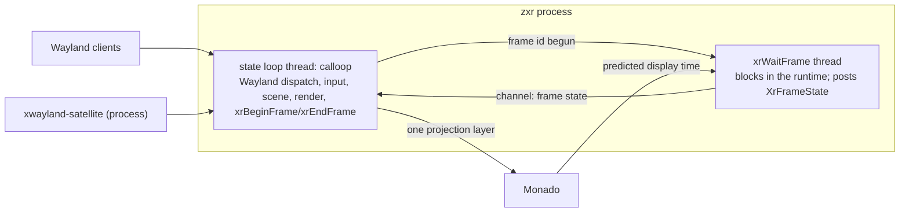

# specs/zxr-core: the compositor as a program — process, loops, modules, and the R0 gates

**Status:** rev 1 (2026-09-26). The program-level specification ADR 0006 and composition §7 left
unwritten, derived from [research/59](../docs/research/59-xr-compositor-architecture-from-comparables.md)
(the mechanisms, the motorcar/wxrc lineage first) and [research/60](../docs/research/60-de-abstractions-mapped-to-xr.md)
(the desktop environment's abstractions), under the 2026-09-26 rulings (ADR 0006 and ADR 0012
amendments). Normative for `pkgs/zxr`. Its conformance checklist (§12) *is* the R0 bring-up
spike; rev 2 is written from what R0 teaches.
**Design sources:** ADR 0006 (the model, the base), ADR 0007 (greeter/lock mode), ADR 0012 (the
seams), composition §7 (the MVP, constraints 1–9, milestones), [places-model.md](../docs/architecture/places-model.md),
[session-bootstrap.md](session-bootstrap.md) rev 3 (the unit contract), [session-auth.md](session-auth.md)
(the greeter scene), [settings-schema.md](settings-schema.md) (the preference channel).
**Grounding:** "XDG" in this document means the Base Directory spec; Wayland protocols are used
with their upstream meanings (ADR 0012 §4 rule); the OpenXR frame-loop contract is the spec's
(`references/openxr-docs/…/rendering.adoc`), Monado's pacing its documented behaviour.
**Budget impact** (overview invariant 9): one process per session, two threads on the frame path
(the state loop, the `xrWaitFrame` thread), plus the one thread xwayland-satellite is (a separate
process). Fence, from research/59 §13's measurements: binary in the niri class (≤ 40 MB
stripped before size work; LTO/`opt-level = "s"` expected to halve it), RSS ≤ 60 MB nested with
one client (2× niri), ≤ 4 threads; zero CPU copies on the client-buffer path; every frame's GPU
time recorded. R0 measures against this fence and rev 2 tightens it.

## 1. What zxr is

One OpenXR client of Monado, one Wayland compositor. It serves `xdg-shell` to 2D clients and,
from M2, `zxr-shell-v2` to 3D clients; it composites every client itself — planes for the 2D
tier, colour+depth for the 3D tier — into one scene with one depth buffer, and submits **one
stereo projection layer** per frame. It never receives client geometry and never re-renders
client content (the lineage's model; research/59 §0, §3). In `--greeter` mode it is the same
binary with a restricted scene and no client socket (ADR 0007). It is `mura-compositor.service`'s
`ExecStart` (session-bootstrap rev 3) once M1 replaces sway.

## 2. Process and threads (ruled 2026-09-26, ADR 0006 amendment)



- **The state loop** is `calloop`, owned by smithay's frontend as designed: every source is an fd
  (Wayland clients, libinput or the runtime's input, syncobj eventfds, the frame-state channel).
  It never blocks on a display or runtime call. All Wayland state, the scene, the renderer and
  `xrBeginFrame`/`xrEndFrame` run here — the OpenXR objects are externally synchronised by
  construction.
- **The wait thread** runs `xrWaitFrame` in a loop and sends the `XrFrameState` (predicted display
  time and period, `shouldRender`) into calloop. It waits for the loop to have *begun* the
  previous frame before calling again (the spec: "block until the previous frame has been begun
  with xrBeginFrame", `rendering.adoc:792-794`); the loop signals that back. One frame in flight
  between the two threads; nothing else crosses the boundary.
- **Why** (research/59 §1, §15 Q1): the spec intends the runtime to own the throttle and expects
  pipelined applications to call `xrWaitFrame` off their main thread; Qt Quick 3D XR, gamescope,
  KWin and mutter all move the blocking wait off the state loop; smithay's own explicit-sync
  design turns waits into fds. The lineage's single loop (wxrc, wayvr) is the simpler prototype
  shape and gives no reason for itself.
- Other threads: none on the frame path. A tracing thread when instrumentation is on
  (research/59 §12); no async runtime; xwayland-satellite is a separate process.

## 3. Modules

| module | owns | never |
|---|---|---|
| `frontend` | smithay `wayland_frontend`: globals, `xdg-shell`, layer-shell, seat, dmabuf feedback, syncobj, the M1 protocol set (§10) | renders; decides placement |
| `xr` | openxrs: instance, system, session on the runtime-created Vulkan device, reference spaces, swapchains, the wait thread, `xrLocateViews` | touches Wayland state |
| `render` | ash: the device from `xrCreateVulkanDeviceKHR`, dmabuf → `VkImage` import with modifiers, shm upload, the scene pass (planes, then 3D clients' colour+depth at M2) into the runtime's swapchain images, timestamps | owns buffers' lifetime (the scene does) |
| `scene` | the layer model (§4), the frame graph and places boundary (§5), window/plane state, stacking, the depth sort, buffer references and release-point signalling | protocol objects |
| `input` | the ray from head/hand pose or the dev pointer → plane hit → `wl_pointer`/`wl_keyboard`/touch through the seat; the input floor (head-aim + `hmdButtons.<selectRole>`, dwell); 6DoF events for 3D clients at M2 | policy about focus (scene's) |
| `policy` | window-management policy in-process (ADR 0012 §2, amended): placement rules, the comfort caps; reads preferences from `org.mura.Settings1`; the bounded `zxr_window_management` seam is this module's later external face | authority (focus, boundary, frames — scene's) |
| `modes` | `--greeter`/lock restricted scene (ADR 0007, session-auth §2–§5): no listening socket, the auth scene, `mura-authd` over a seqpacket pair; normal mode | PAM |
| `unit` | `sd_notify(READY=1)` after the socket is bound and variables published; `WAYLAND_DISPLAY`/`DISPLAY` publication; the crash/restart contract (session-bootstrap rev 3) | — |
| `trace` | spans + the frame journal (§11) | — |

Crate shape: one binary, modules as Rust modules; `libc` where it counts; dependencies: smithay
(git rev, `default-features = false`, features `wayland_frontend backend_drm backend_vulkan
desktop`; `xwayland` off — satellite), `openxr` (openxrs), `ash`, `calloop`, `serde`/`serde_json`
(the artifact, `recovery.json`-style config), `zbus` only if the settings client needs it (the
CLI's `--direct` reader is the alternative for a first read; signals need the bus). No tokio.

## 4. The layer model (research/60 §1)

Composition order, back to front, each band an anchoring frame (`zxr-layer-anchoring-v1`):

1. **environment** — passthrough, wallpaper or a virtual scene; content from a perception
   producer over the intake protocol (`specs/perception-intake.md`) or a wallpaper client on
   layer-shell `background`; drawn first, world frame.
2. **bottom shell layer** — layer-shell `bottom` clients (docks behind windows), body/docked frames.
3. **the window tiers** — 2D planes (M1) and 3D clients' colour+depth (M2), depth-sorted into one
   depth buffer; the places' frames.
4. **top shell layer** — layer-shell `top` (panels), body/head/docked frames, exclusive angular bands.
5. **overlay** — layer-shell `overlay` (OSD, notifications), the lock/greeter scene; head frame.
6. **foreground cutout** — the wearer's hands/limbs composited over everything from a perception
   mask (the contract's `handCutout`; name open, §14); compositor-internal, no client.

Layer-shell's four layers keep their upstream meanings (the wlr protocol text's ordering); the
environment and foreground layers are Mura's, owned by the compositor's composition and fed by
separate services. A plane's stacking within a tier is depth, not z-order.

## 5. Places and frames (research/60 §2; places-model.md)

The scene holds the frame graph — world (OpenXR LOCAL / LOCAL_FLOOR; STAGE where the runtime
has one), head (VIEW), hands, docked, shared — and places as `ext-workspace-v1` workspaces whose
group is a frame, with the spatial fields on `zxr-workspace-v1`. M1 ships one world frame and one
head frame and a fixed layout; the pager and place transitions are shell clients after M1. The
runtime owns recentering (LOCAL's origin); the compositor owns currency and which frame a plane
attaches to.

## 6. The buffer and sync path (research/59 §4–§5)

1. **Advertise**: the dmabuf feedback table is computed from the runtime-created device's
   DRM-format-modifier properties (wayvr's shape); shm formats are the standard two.
2. **Import**: dmabuf → `VkImage` with the buffer's modifier, `VK_KHR_external_memory_fd`,
   dedicated allocation; imported once per `wl_buffer`, cached on the buffer. shm → one upload
   into a device image per commit. **A CPU copy on the dmabuf path is a bug**; `trace` counts
   copies and R0 asserts zero.
3. **Acquire**: `wp_linux_drm_syncobj_v1` acquire points gate the surface transaction through
   smithay's `DrmSyncPointBlocker` (an eventfd source; the loop never blocks). Rev 2 may move the
   wait onto the GPU (`export_sync_file` → `vkImportSemaphoreFdKHR`) if R0's numbers say so.
4. **Compose**: the scene pass samples imported images into the swapchain image for the frame.
5. **Release**: a release point is signalled when the **GPU** is done reading the buffer — a sync
   file exported from the queue submission that sampled it, imported into the release timeline
   (gamescope's and mutter's shape) — never on CPU-side drop. Without syncobj the compositor
   sends `wl_buffer.release` at the same moment. This is what bounds a fast client: it gets its
   buffer back exactly when the compositor is done, and no sooner.
6. **Frame callbacks**: sent right after `xrEndFrame`, at most one per refresh per surface
   (niri's throttle), with the *next* frame's predicted display time as the target (motorcar's
   policy, Monado's expectation; research/59 §2). The compositor never waits for a client.

## 7. The frame (research/59 §2–§3)

```
wait thread:  xrWaitFrame ──► FrameState ──► (channel)
loop:         on FrameState: xrLocateViews(predictedDisplayTime) → snapshot the scene →
              acquire/wait swapchain images → record + submit the scene pass →
              xrBeginFrame …  xrEndFrame(one projection layer, optional depth) →
              signal "begun" to the wait thread → send frame callbacks → signal releases as
              GPU completes (fd source)
```

`shouldRender == false` skips the pass and still submits an empty frame. Missed frames are
counted (§11), never compensated by waiting. Depth to Monado is for reprojection only (the
runtime does not depth-test across layers; research/59 §3).

## 8. Input (research/59 §6)

The input floor first (research/42): head-aim ray + `hmdButtons.<selectRole>`, dwell where the
button is unusable, a physical keyboard when present; controller rays when the runtime has them.
Ray → plane intersection → surface-local coordinates → the seat's `wl_pointer` (enter/motion/
button/axis), keyboard focus following the compositor's focus rule; `pointer-constraints` and
`relative-pointer` served for clients that lock the pointer (games, 3D viewers). 6DoF and ray
objects of `zxr-shell-v2` at M2. Nothing about focus is a client's decision (ADR 0012 §3).

## 9. Modes, unit, restart (ADR 0007; session-bootstrap rev 3)

`zxr --greeter`: restricted scene per session-auth §2–§5, no `wl_display` socket added, PAM in
`mura-authd` over a socketpair (KWin's discipline for helpers, research/59 §10), exit when greetd
acknowledges `start_session`. `zxr` (session): binds the socket, publishes `WAYLAND_DISPLAY`
(and `DISPLAY` once satellite is up), `sd_notify(READY=1)`; `Restart=on-failure` +
`RestartMode=direct` in the same logind session (D4); clients die with the compositor (every
comparable; research/59 §11) and the wrapper returns to the greeter.

## 10. Protocols by milestone (research/60 §17)

- **R0**: `wl_compositor`, `wl_shm`, `wl_seat`, `wl_output` (one logical output), `xdg_wm_base`,
  `zwp_linux_dmabuf_v1` v4 with feedback, `wp_linux_drm_syncobj_v1`, `wp_viewporter`,
  `wp_presentation`, `wp_single_pixel_buffer`; xwayland-satellite as a client.
- **M1 adds**: `wp_fractional_scale_v1` (planes have no native density; the compositor picks a
  scale per plane from angular size), `wl_data_device_manager` (copy/paste is in M1's acceptance),
  `xdg-decoration` (server-side; the plane's frame is the decoration), `xdg-activation`,
  `ext-foreign-toplevel-list`, `ext-workspace-v1` + `zxr-workspace-v1`, `wlr-layer-shell` +
  `zxr-layer-anchoring-v1`, `text-input-v3` / `input-method-v2` / `virtual-keyboard-v1` (the
  keyboard client), `ext-idle-notify`, `idle-inhibit`, `keyboard-shortcuts-inhibit`,
  `pointer-constraints`, `relative-pointer`, `cursor-shape`, `pointer-gestures`.
- **After M1**: `security-context-v1` (sandboxed and proxied clients), `ext-image-capture-source`
  + `ext-image-copy-capture` (spatial-sharing.md), `zxr-shell-v2` (M2), `zspatial-toplevel-export-v1`
  consumer (ADR 0014 M-A), the bounded `zxr_window_management` (ADR 0012 amendment).
- **Not on the headset**: `tablet-v2`, `tearing-control`, `wlr-output-management`; `fifo-v1` /
  `commit-timing-v1` / `color-management-v1` revisited at M4.

## 11. Instrumentation (research/59 §12)

`trace` spans on every loop turn and frame stage (tracy-compatible, off by default), and a
**frame journal** with, per frame: predicted display time, `xrWaitFrame` return time, begin,
submit, `xrEndFrame`, GPU time (two timestamps around the scene pass), missed-deadline flag
(`xrEndFrame` after the predicted display time), buffers imported/released this frame, CPU
copies (must be 0), retention per released buffer (commit → release-point signal). Printed as
`key=value` on `SIGUSR1` and on exit (the perception harness's convention), read by the R0
harness.

## 12. Conformance — the R0 gates (research/39 §5, measured)

Run in `pkgs/dev-session` (Monado simulated HMD in a desktop window, this workstation; no VM, no
headset). Each gate is a written result with numbers in
[research/61](../docs/research/61-r0-bring-up-results.md).

1. **Real presentation.** A native Wayland client (foot) appears as a movable textured plane
   inside a real OpenXR session: device from `xrCreateVulkanDeviceKHR` via openxrs, a projection
   layer (not a quad layer), head motion from `SIMULATED_ROTATE` moves the view. Numbers: frames
   submitted, missed deadlines (< 1 % over 600 frames at the simulated 60 Hz), GPU time per frame.
2. **Real GPU integration.** dmabuf client buffers (weston-simple-dmabuf-egl or a Vulkan client)
   reach the renderer with **0 CPU copies** (the counter); the feedback table is computed from the
   device; `wp_linux_drm_syncobj_v1` acquire wait and release-point signal after composition
   completes, end to end; a client submitting faster than composition is bounded (buffer
   retention ≤ 2 frames, no unbounded queue).
3. **Window behaviour under churn.** Resize, positioner-constrained popups, focus handoff, client
   `kill -9` mid-frame, surface destruction with in-flight GPU work — no unresolved GPU waits
   (every submitted fence signals), no stale textures (a destroyed surface is not sampled), the
   compositor never stalls more than one frame.
4. **Xwayland early.** One X11 app (xterm) participates through xwayland-satellite as an ordinary
   Wayland client; the fallback (`X11Wm`) is exercised only if satellite's constraints bite, and
   the result says which.

Plus the fence (budget impact above) and the unit contract items already verified for sway by
D4 (readiness, restart in the same session), re-run with zxr in the slot behind a flag.

## 13. What R0 does not decide

The base (ADR 0006), the model, the loop ownership, Xwayland's path — all ruled before it. R0
retires integration risk and produces numbers; a **structural** smithay defect (a
protocol-frontend problem unfixable without forking) is the only finding that would trigger the
recorded wlroots fallback (ADR 0006), and R0's result says explicitly whether one was found.

## 14. Open items (deciders named)

The foreground layer's name — "cutout" (the mechanism, the contract's word) or "foreground" (the
layer) — decider: the owner, at the passthrough rung. Cross-plane drag-and-drop (no comparable;
the 2D semantics may hold since a ray crossing planes is pointer motion across surfaces) —
decider: the owner, at M1's acceptance. GPU-side acquire waits (rev 2, from R0's numbers).
The bounded `zxr_window_management` protocol's invariant set (ADR 0012 amendment) — designed
after M1.
