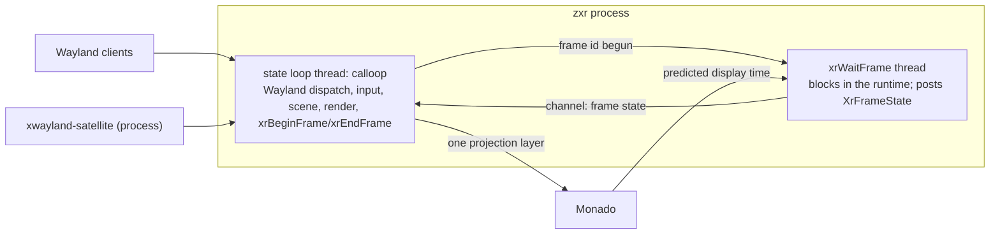

# specs/zxr-core: the compositor as a program — process, loops, modules, and the R0 gates

**Status:** rev 3.14 (2026-09-28; rev 3.13 + the body frame and the typed OSK — §5 `Frame::Body` derived from the head (position + yaw, lazily re-seated with `wm.follow.*`; MRTK/Overte/wayvr/visionOS all derive it so), §4 the placement table's `typed` value and the OSK bound to the surface it types into (research/36 §7; WiVRn's offset under a world window), §11 `body_reseat_ticks`/`osk_follows`, §12 gate 9 rows (h)–(i); rev 3.13 = same day; rev 3.12 + ADR 0007 amendment 2 — §9 the two modes: greeter mode exits with its primary trusted client (cage's rule), the lock is `ext-session-lock-v1` from a resident unit, triggers exec `loginctl lock-session`, relock after `Defunct`; rev 3.12 = 2026-09-27; rev 3.11 + research/77 — the shell-layer half **normative**: §4 exclusive angular bands per frame in frame-pixel space (wlroots' arithmetic, sway's pass order), §8 layer-shell keyboard interactivity in the focus module (the exclusive override, `on_demand` as a stack member, `none` never) and the `wl_fixed` motion dedupe, §9 the trusted connection as the gate's exception and the socketpair as `insert_client`, §10 the filter as `ClientData` bits set at insert and the globals it covers, §4 the wearer's placement table `shell.place:<namespace>` over the client's request over the head fallback (owner ruling 2026-09-27), §11 shell counters, §12 the shell-layer gate rows, §14 what the ruling leaves; rev 3.11 = same day; rev 3.10 + the window-management floor and seam as built — §3 `policy` built (the `free` floor: angular-slot spawn, tidy, lifecycle, follow, recenter; the seam served, XML rev 1, one binder, river sequences, the disconnect contract), §8 `Grabs` as built (`input/grabs.rs`, research/76), §11 the grab / policy / seam counters and the `policy:` and `seam:` list lines, §12 gate 7 measured; rev 3.10 = same day; rev 3.9 + shell-plane.md — §10 the shell-layer half: layer-shell + anchoring as the shell seam, the privileged set filtered per connection, `security-context-v1` moved to the shell-layer work, the still-pointer idle rule; rev 3.9 = same day; rev 3.8 + ADR 0007's amendment — §3 `modes` / §9: the greeter and lock scene is one trusted client over a pre-connected socketpair, zxr draws no UI, an absent client means an opaque scene and never an unlock; rev 3.8 = same day; rev 3.7 + research/73 settings Phase B — §3 `mura-settingsd` as a library and no `zbus` in the compositor, §8 "Settings": the in-process consumer (Engine + one inotify fd on the state loop, `Prefs` by generation, every threshold a preference or a calibration key), §11 settings counters, §12 the settings gate row; rev 3.7 = same day; rev 3.6 + research/70 §9.2 — §8 a ray-owned pointer released when gaze takes the tier, the `input.cursor.ray` / `input.cursor.scale` preferences, §11 `input_pointer_releases`; rev 3.6 = same day; rev 3.5 + research/70 §9 — §8 the cursor as one composition layer in one fixed-size swapchain (ruled: one cursor element, the client's cursor over the ray's reticle, nothing under gaze), §11 cursor counters, §12 the cursor gate row; rev 3.5 = 2026-09-26; rev 3.4 + research/70 — §8 normative: the input module as built (the nine-slot chain, the closed `SourceKind` enum, the action set, per-event dispatch, the two transports, cursors as quads, the test-only injector; stand-ins listed), §11 input counters, §12 the M1 input gate rows measured; rev 3.4 = rev 3.3 + research/69 — §5a: a member zxr is not composing holds no buffers, release at replacement, `xdg_toplevel.suspended` while quiet or hidden, `hidden` payload state; §7: the quiet buffer-hold policy ruled; rev 3.3 = rev 3.2 + §5a normative — the scene arenas reconciled with the composition ruling: layer-list output, band-priority budget, commit-driven dirtiness, grow-only panel swapchains; rev 3.2 = rev 3 + research/67: §7 the quiet shape and the overlay session; rev 3 = rev 2.1 + ADR 0006 amendment 2 — the composition ruling: §4 two transports, §6.2 the panel pass, §7 the two tick shapes and the overflow rule, §12 the panels-path gate, §14 the M2 occlusion and cutout-reach items). The program-level specification ADR 0006 and composition §7 left
unwritten, derived from [research/59](../docs/research/59-xr-compositor-architecture-from-comparables.md)
(the mechanisms, the motorcar/wxrc lineage first) and [research/60](../docs/research/60-de-abstractions-mapped-to-xr.md)
(the desktop environment's abstractions), under the 2026-09-26 rulings (ADR 0006 and ADR 0012
amendments). Normative for `pkgs/zxr`. Its conformance checklist (§12) *is* the R0 bring-up
spike; **rev 2 records what R0 taught** ([research/61](../docs/research/61-r0-bring-up-results.md)
§6): the runtime-event timer (§7), the signal mask and teardown order (§9), both acquire paths
exercised (§6.3), the fast client's per-commit cost (§6.4), the RSS fence's host caveat (§12),
and the measured values beside each gate (§12). The scene data model of §5a is normative from rev 3.3.
**Design sources:** ADR 0006 (the model, the base), ADR 0007 (greeter/lock mode), ADR 0012 (the
seams), composition §7 (the MVP, constraints 1–9, milestones), [places-model.md](../docs/architecture/places-model.md),
[session-bootstrap.md](session-bootstrap.md) rev 3 (the unit contract), [session-auth.md](session-auth.md)
(the greeter scene), [settings-schema.md](settings-schema.md) (the preference channel).
**Grounding:** "XDG" in this document means the Base Directory spec; Wayland protocols are used
with their upstream meanings (ADR 0012 §4 rule); the OpenXR frame-loop contract is the spec's
(`references/openxr-docs/…/rendering.adoc`), Monado's pacing its documented behaviour.
**Budget impact** (overview invariant 9): one process per session, two threads on the frame path
(the state loop, the `xrWaitFrame` thread), plus the one thread xwayland-satellite is (a separate
process). Fence, from research/59 §13's measurements: binary in the niri class (≤ 40 MB
stripped before size work; LTO/`opt-level = "s"` expected to halve it), RSS ≤ 60 MB nested with
one client (2× niri), ≤ 4 threads; zero CPU copies on the client-buffer path; every frame's GPU
time recorded. R0 measures against this fence and rev 2 tightens it.

## 1. What zxr is

One OpenXR client of Monado — the session that is always present, an overlay session so that
native OpenXR applications may be Monado's *main* session beside it
([native-openxr-apps.md](../docs/architecture/native-openxr-apps.md), draft) — and one Wayland
compositor. It serves `xdg-shell` to 2D clients and,
from M2, `zxr-shell-v2` to 3D clients; it composites every client itself — planes for the 2D
tier, colour+depth for the 3D tier — into one scene with one depth buffer, and submits **one
stereo projection layer** per frame. It never receives client geometry and never re-renders
client content (the lineage's model; research/59 §0, §3). In `--greeter` mode it is the same
binary with a restricted scene and no client socket (ADR 0007). It is `mura-compositor.service`'s
`ExecStart` (session-bootstrap rev 3) once M1 replaces sway.

## 2. Process and threads (ruled 2026-09-26, ADR 0006 amendment)



- **The state loop** is `calloop`, owned by smithay's frontend as designed: every source is an fd
  (Wayland clients, libinput or the runtime's input, syncobj eventfds, the frame-state channel).
  It never blocks on a display or runtime call. All Wayland state, the scene, the renderer and
  `xrBeginFrame`/`xrEndFrame` run here — the OpenXR objects are externally synchronised by
  construction.
- **The wait thread** runs `xrWaitFrame` in a loop and sends the `XrFrameState` (predicted display
  time and period, `shouldRender`) into calloop. It waits for the loop to have *begun* the
  previous frame before calling again (the spec: "block until the previous frame has been begun
  with xrBeginFrame", `rendering.adoc:792-794`); the loop signals that back. One frame in flight
  between the two threads; nothing else crosses the boundary.
- **Why** (research/59 §1, §15 Q1): the spec intends the runtime to own the throttle and expects
  pipelined applications to call `xrWaitFrame` off their main thread; Qt Quick 3D XR, gamescope,
  KWin and mutter all move the blocking wait off the state loop; smithay's own explicit-sync
  design turns waits into fds. The lineage's single loop (wxrc, wayvr) is the simpler prototype
  shape and gives no reason for itself.
- Other threads: none on the frame path. A tracing thread when instrumentation is on
  (research/59 §12); no async runtime; xwayland-satellite is a separate process.

## 3. Modules

| module | owns | never |
|---|---|---|
| `frontend` | smithay `wayland_frontend`: globals, `xdg-shell`, layer-shell, seat, dmabuf feedback, syncobj, the M1 protocol set (§10) | renders; decides placement |
| `xr` | openxrs: instance, system, session on the runtime-created Vulkan device, reference spaces, swapchains, the wait thread, `xrLocateViews` | touches Wayland state |
| `render` | ash: the device from `xrCreateVulkanDeviceKHR`, dmabuf → `VkImage` import with modifiers, shm upload, the scene pass (planes, then 3D clients' colour+depth at M2) into the runtime's swapchain images, timestamps | owns buffers' lifetime (the scene does) |
| `scene` | the layer model (§4), the frame graph and places boundary (§5), the three arenas and their mutation API (§5a), stacking, per-member panel handle and dirty state, the per-tick layer list, buffer references and release-point signalling | protocol objects; Vulkan and Wayland types (the member payload is the frontend's) |
| `input` | the ray from head/hand pose or the dev pointer → plane hit → `wl_pointer`/`wl_keyboard`/touch through the seat; the input floor (head-aim + `hmdButtons.<selectRole>`, dwell); 6DoF events for 3D clients at M2 | policy about focus (scene's) |
| `policy` | **built (rev 3.11, `src/policy/`)** — window-management policy in-process (ADR 0012 §2, amended), specified in [window-workspace-management.md](../docs/architecture/window-workspace-management.md) rev 0.2: placement and sizing over the scene's mutation API (§5a) — head-relative spawn below the eye line at first commit (the mapped size, never the 1×1 request), siblings and children beside their parent, the angular-slot allocator (kwin-vr `SpaceAllocator3D`'s search: the eye-line band first within ±60° of forward, then the bands, then the sphere), apps never place themselves; the one in-process layer-3 engine (`free`; `arc`/`dock`/`band` are shipped default external managers over the seam) with one-shot `arrange` (tidy: MRU onto free slots, pinned untouched); lifecycle (`Life`: hidden / minimized / maximized / fullscreen with saved geometry; minimize is policy — `wm.minimize`, dock else close, never a compositor state); attachment (rigid default; opt-in lazy-follow with threshold / delay / rate / stop, paused while grabbed; billboard while moving); recenter (rigid re-seat, pinned exempt); the comfort limits every pose is clamped through; `Prefs` by generation. Its external face is `protocols/zxr-window-management-v1.xml` **rev 1, served** (`policy/seam.rs`, wayland-scanner codegen from the XML): one privileged binder (a second hears `unavailable`), the full picture at bind, river's manage/render sequences with requests applied at `*_finish`, `interaction` serials from every commit and `focus(window, serial)` through the activation rule, proposals clamped to `limits`, `custom` hands a place's spawn to the manager; disconnect (death, `destroy`, 5 s unresponsive, protocol error) keeps placements, frees engines, shows what the manager hid, and the floor continues. Proven by `zxr-test-manager` (`--features test-manager`; not in the closure). | authority (focus rules, boundary, frames, comfort limits, perception layers — the compositor's, reported to the manager, never delegated) |
| `modes` | `--greeter`/lock restricted scene (ADR 0007 as amended 2026-09-27, session-auth rev 5 §2–§5): no listening socket; the auth scene is **one trusted client** (the greeter program) over a pre-connected socketpair, composed as the only member — zxr draws no UI; when it is absent, an opaque scene and never an unlock; `mura-authd` over a seqpacket pair; normal mode | PAM; any UI of its own |
| `unit` | `sd_notify(READY=1)` after the socket is bound and variables published; `WAYLAND_DISPLAY`/`DISPLAY` publication; the crash/restart contract (session-bootstrap rev 3) | — |
| `trace` | spans + the frame journal (§11) | — |

Crate shape: one binary, modules as Rust modules; `libc` where it counts; dependencies: smithay
(git rev, `default-features = false`, features `wayland_frontend backend_drm backend_vulkan
desktop`; `xwayland` off — satellite), `openxr` (openxrs), `ash`, `calloop`, `serde`/`serde_json`
(the artifact), and **`mura-settingsd` as a library** (path dependency, `default-features =
false`: the artifact, store and engine modules without `zbus` or the bins — the daemon's `bus`
cargo feature). **No `zbus` in the compositor** (ruled 2026-09-27, research/73 §5 Q7 / §6 option
b): zxr resolves its keys in-process with the same `Engine` the daemon serves and watches the
per-user store directory with one inotify fd on the state loop (§8 "Settings"). No tokio.

## 4. The layer model (research/60 §1)

Composition order, back to front, each band an anchoring frame (`zxr-layer-anchoring-v1`):

1. **environment** — passthrough, wallpaper or a virtual scene; content from a perception
   producer over the intake protocol (`specs/perception-intake.md`) or a wallpaper client on
   layer-shell `background`; drawn first, world frame.
2. **bottom shell layer** — layer-shell `bottom` clients (docks behind windows), body/docked frames.
3. **the window tiers** — 2D planes (M1) and 3D clients' colour+depth (M2), depth-sorted into one
   depth buffer; the places' frames.
4. **top shell layer** — layer-shell `top` (panels), body/head/docked frames, exclusive angular bands.
5. **overlay** — layer-shell `overlay` (OSD, notifications), the lock/greeter scene; head frame.
6. **foreground cutout** — the wearer's hands/limbs composited over everything from a perception
   mask (the contract's `handCutout`; name open, §14); compositor-internal, no client.

Layer-shell's four layers keep their upstream meanings (the wlr protocol text's ordering); the
environment and foreground layers are Mura's, owned by the compositor's composition and fed by
separate services. A plane's stacking within a tier is depth, not z-order.

**Rev 3.11 — how a layer surface becomes a member (normative; [research/77](../docs/research/77-shell-layer-mechanics-from-comparables.md)
§2.1, §3).** A `zwlr_layer_surface_v1` is a scene member (§5a) whose place is on its anchoring
frame in band 2 (`bottom`), 4 (`top`) or 5 (`overlay`); a `background` surface is accepted and,
until the environment design admits a wallpaper client to band 1, not composed (frame callbacks
on the fallback cadence, §5a's not-composed rule). **Where it sits is the wearer's (owner ruling
2026-09-27; research/77 §3.3a; Hyprland's layer rules by namespace,
`references/hyprland/src/desktop/rule/layerRule/LayerRule.cpp:96-115`):** the **placement table**
`shell.place:<namespace>` (a relocatable settings template — `frame`, `azimuth_deg`,
`elevation_deg`, `distance_m`, `pitch_deg`, `width_deg`) wins when a row exists for the surface's
namespace; otherwise the client's `zxr-layer-anchoring-v1` request applies; otherwise the head
fallback (`shell.head.{extent_h_deg,extent_v_deg,distance_m}`, defaults 90×70° at 0.5 m). A user
grab on a shell plane writes the row (the WM branch's grab mechanics; the plane is placeable,
never tiled or resized). Seed rows for the carried components' namespaces (`osk` → `typed`;
`notifications` → head, upper-right; a bar → body, bottom) are the consumer's defaults for
instances without a stored value. **`typed` (rev 3.14; research/36 §7):** a compositor-only
`frame` value — the frame of the surface holding smithay's *active* text input (an enabled
`zwp_text_input_v3`). Every shipping keyboard is bound to the panel with the focused field
(WiVRn a fixed offset below its GUI, `wivrn/client/constants.h:87-88`; xrdesktop per focused
window; visionOS and Quest near the field), none to the body — wayvr's anchored keyboard was
the outlier the previous seed followed. Under a head- or body-frame scene a `typed` member is
arranged in that frame's rectangle by its own layer-shell anchors (the greeter's OSK is the
bottom band, gate 9); under a **world-frame window** it is arranged against the *window's*
rectangle (so a 1920-px keyboard becomes the window's width) and posed below the window with
WiVRn's offset — a 5 cm gap under the bottom edge, 0.1 m toward the wearer, pitched −0.6 rad
to face them (`typed_pose`) — sized at the window's distance, reserving nothing from the world
frame, and re-posed when the window moves (`typed_tick`: one pose compare per tick;
`osk_follows`). A change of typed surface re-arranges once. A row saying `head`/`body`/… still
wins: the wearer's placement stands. **Arrangement** runs on the surface's commit, map
and unmap — never per tick — in the frame's **pixel rectangle** `W × H = round(extent° · ppd)` at
the frame's canonical distance, with wlroots' arithmetic
(`references/wlroots/types/scene/layer_shell_v1.c:61-114`): bounds = the frame's usable rectangle,
or the full rectangle when the zone is −1; size 0 on an axis stretches between the two anchors
minus margins; an anchored edge pins, an unanchored axis centres; a positive zone shrinks the
usable rectangle by `zone + margin` on the surface's one **exclusive edge** — a single anchored
edge, the odd edge of a three-edge bar, or the client's `set_exclusive_edge`; corners and full
anchors reserve nothing (`wlr_layer_shell_v1.c:657-684`). Two passes in sway's order: every
surface with a positive zone, then the rest, each overlay→top→bottom→background
(`references/sway/sway/desktop/layer_shell.c:56-93`). The usable rectangle is **per frame**: a
body-frame panel never shrinks the head frame. A bogus zone clamps the usable rectangle to zero
(wlroots, smithay), it never destroys the client (river's rule is not taken). `set_exclusive_angle`
is the same zone in the same units, `degrees · ppd`. The arranged box maps back to the member:
azimuth `((x + w/2) − W/2)/ppd`, elevation `(H/2 − (y + h/2))/ppd`, plane extents
`2·d·tan(angle/2)`; the client is configured with the arranged pixel size, so every unaware
client's pixel arithmetic (squeekboard's height from `wl_output` mode + physical size,
research/77 §2.6) holds unmodified. **Initial configure:** on the surface's first commit, after
arranging (smithay's stated rule, `references/smithay/src/desktop/wayland/layer.rs:414-424`;
niri's order); map on the first buffer, as the xdg path does. A layer popup unconstrains to the
frame rectangle in the surface's coordinates (sway's full-output rule). The **window tiers**
consume the head frame's usable rectangle at spawn (window-workspace-management §3's free
slot); an existing window is not moved when a band appears (sway's floating containers).

**Rev 3 — how the bands reach the display (ADR 0006 amendment 2, ruled 2026-09-26).** Two
transports, chosen per band by whether the content has depth:

- **Runtime layers**: every 2D plane in bands 2–5 (windows, shell layer-shell surfaces, the
  overlay scene) is one `XrCompositionLayerQuad` per plane (cylinder later), whose swapchain zxr
  renders **only when the plane's surface tree commits**; the runtime samples it every display
  frame at the display pose. Order among quads is submission order = this list's band order,
  then depth within a band (painter's algorithm, `rendering.adoc:1143-1147`).
- **zxr's projection layer**: band 1 (environment), 3D clients' colour+depth in band 3, and band
  6 (the cutout) — everything that has depth of its own — composited by zxr into one stereo
  projection layer, submitted *before* the quads. **It exists only while such content exists**
  (or while panel overflow puts planes into it, §7); a session of 2D planes alone submits no
  projection layer and runs no render pass.

Consequences the rule accepts: quads always composite over the projection layer (a plane a 3D
volume should hide cannot be — §14, M2); one copy per commit into the panel swapchain (§6.2).
**The foreground cutout (band 6) is a runtime layer submitted after every quad: hands composite
above all windows** (ruled 2026-09-26). Its shape — view-aligned cutout projection layer,
per-hand billboard quads, or depth-correct ordering — is open ([perception-passthrough-hands.md
§1a](../docs/architecture/perception-passthrough-hands.md)); whichever is chosen, it is the last
layer in `xrEndFrame` and its alpha is the matte.

## 5. Places and frames (research/60 §2; places-model.md)

The scene holds the frame graph — world (OpenXR LOCAL / LOCAL_FLOOR; STAGE where the runtime
has one), head (VIEW), **body** (derived), hands, docked, shared — and places as `ext-workspace-v1`
workspaces whose group is a frame, with the spatial fields on `zxr-workspace-v1`. M1 ships one
world frame, one head frame and the body frame and a fixed layout; the pager and place
transitions are shell clients after M1. The runtime owns recentering (LOCAL's origin); the
compositor owns currency and which frame a plane attaches to.

**The body frame (rev 3.14, 2026-09-28; `shell/body.rs`).** No headset tracks a torso; every
comparable derives "body" from the head and differs only in when its yaw re-seats — MRTK3's
`Follow` solver (leash 30°/20°, yaw-only with `IgnoreReferencePitchAndRoll`,
`mrtk3/…/Solvers/Follow.cs:88-206`), Overte's avatar torso (head with roll and pitch cancelled,
re-rotated past 30° on a moving average, `overte/interface/src/avatar/MyAvatar.cpp:4478-4501,
5229-5243`), wayvr's anchor (the HMD snapped upright, captured on show or grab,
`wayvr/wayvr/src/windowing/manager.rs:1130-1135`), visionOS (head-seeded placement, explicit
recenter). zxr's body frame is **the head's position and the head's yaw with pitch and roll
removed; the yaw re-seats lazily** with the window manager's lazy-follow (`policy/follow.rs`'s
`Follower`, the wearer's `wm.follow.*`: after `threshold` off for `delay`, at `rate`, stopping
within `stop`); the first head pose seeds it. Written every tick after the head
(`Space::Service`, `FrameKind::Body`); `frames_available` carries its bit, hand frames fall back
to it. Counters `body_reseat_ticks`, the `shell-counters:` line's `body_yaw_deg=`. Budget: one
`atan2` and one compare per tick, a slerp while re-seating.

### 5a. The scene data model (normative from rev 3.3, 2026-09-26 — research/62 §7, reconciled with §4 rev 3)

**Status: normative.** Derived in [research/62](../docs/research/62-scene-data-model-from-comparables.md)
from fourteen comparables (§6 verdicts) and the embedded/runtime-proximity analysis of §7,
endorsed independently by the frame-path pass (research/65's recommendation), and rewritten here
for the composition ruling (§4 rev 3: 2D planes are runtime quad layers rendered on commit; the
projection layer exists only with depth content). The draft of the same day described the
flatten's output as a per-tick draw list for a projection layer "re-rendered every frame" — that
premise no longer holds for bands 2–5 and the text below replaces it. Stand-ins are marked.

**The hierarchy is fixed-depth, not a general tree.** The places model fixes it: layer → frame →
place → window (→ transient children). Places do not nest; a window has one place (ADR 0016
answer 1); 3D clients render their own interiors. The frames are not a tree among themselves
either: every frame the model names (LOCAL/STAGE, VIEW, hands, map anchors, docked output, peer)
is a space the runtime locates *directly against the session's base space*. So `scene` is
**three typed arenas with generational handles**, not a node graph:

```
frames:  Arena<Frame>     { space: Base | Xr(xr::Space) | Service(anchor) | Views,
                            kind, pose: Posef /* in LOCAL */, valid: bool }
places:  Arena<Place>     { frame: FrameId, local: Posef, band: u8 /* §4 band 1–6 */, layout, entry,
                            pin: Option<AnchorUuid + name> }
members: Arena<Member<M>> { place: PlaceId, local: Posef, shape: Plane{size_m} | Volume{half_size, clip},
                            flags, m: M }
submit:  { quads: Vec<QuadEntry>, projection: Vec<DrawItem> }   // per-tick scratch, reused
```

- **Poses, not matrices**, as the stored form: the runtime speaks `XrPosef` (28 B); rigid
  composition is a quaternion multiply and a rotate (`world = frame.pose ∘ place.local ∘
  member.local`); matrices are built only where a pass needs one.
- **Frames are located in one call, and only when needed.** `Base` (LOCAL) is the identity;
  `Views` (VIEW) is the midpoint of the two `xrLocateViews` poses the tick already has — no
  extra round trip. Every `Xr` frame beyond those (hands, STAGE, anchors — M1) is located by one
  `xrLocateSpacesKHR` for the whole array (Monado: one IPC exchange for all spaces,
  `ipc_client_space_overseer.c:161-195`, vs one per `xrLocateSpace`, `:135-157`; the extension is
  always enabled in Monado, `oxr_extension_support.py:60`). **The call exists only when such a
  frame exists.** Until the `XR_EXT_spatial_entity` family exists in Monado (spatial-mapping §11
  M4), M1 anchors arrive from the mapping service as poses in LOCAL — the `Service` arm; one
  extra query per tick.
- **The per-tick output is a layer list, not a draw list.** Every mapped member of bands 2–5
  becomes one `QuadEntry` (its panel swapchain, world pose, size in metres); members of band 1,
  3D volumes in band 3 and band 6 become `DrawItem`s for the projection pass, which exists only
  when that list is non-empty (§7 predicate). Quads are ordered **band ascending, then
  nearest-last within a band** — submission order is composition order (`rendering.adoc:1143-1147`)
  and planes alpha-blend (CSD shadows), so painter's order within a band is required.
- **The quad budget is allotted by band priority.** `maxLayerCount − 1` quads (one reserved for
  the projection layer) go to band 5 first, then 4, 3, 2, nearest-first within a band; members
  past the budget are drawn in the projection layer that frame, which then exists. This follows
  from §4's ordering — an overflowed overlay-band plane drawn in the projection layer would sit
  *behind* every window quad — and replaces a global nearest-first rule. On Monado the budget is
  moot below the cap (a second layer already puts the runtime in the squasher, research/65 §2.1);
  it bites at Android-class caps (32), where pre-composed popups keep the count down.
- **Dirtiness is commit-driven.** The frontend's commit handler resolves the committing surface
  to its root member (the subsurface parent chain, depth ≤ 3; a popup to its parent toplevel
  through smithay's `PopupManager`) and sets `member.dirty`; the tick walks the surface tree of
  dirty members only and records one panel pass each (§6.2). Nothing is hashed per tick. This is
  the 2D compositors' damage-from-commit (niri, KWin, mutter — research/65 §4.2's set). When root
  resolution fails the fallback is conservative: every mapped member is marked dirty that tick.
- **Only a sampled buffer is held.** A `Buffer` clone is taken by the panel pass that samples it
  and dropped on that pass's slot fence (§6.3); a member whose tree did not commit holds nothing,
  and — rev 3.4, [research/69](../docs/research/69-buffer-hold-policy-for-non-presented-surfaces.md)
  §3 — **a member zxr is not composing (quiet mode, hidden, unmapped) holds nothing either**: its
  committed buffers are released at replacement, the eleven comparables' converging shape and the
  protocol's ("compositors may release buffers without ever reading from them"). Withholding
  releases is not zxr's throttle: a Mesa EGL client waiting for a buffer spams roundtrips
  (`wait_for_free_buffer`), and holding cost 445–554 ms/s against 59 at replacement (research/69
  §2). The throttle is the protocol's — frame callbacks on the fallback cadence and
  `xdg_toplevel.suspended` (below). `--debug-hold tick|callback|fence` keeps the alternatives
  measurable. This is what makes the steady-state tick O(members' poses) rather than
  O(surfaces): a tick that clones a buffer per surface to find out nothing changed costs
  28 ms/s of CPU with 16 static clients (research/67, host).
- **A member that is not composed is `suspended`.** Its toplevel's configure carries
  `xdg_toplevel.suspended` (xdg-shell v6 — "the surface is currently not ordinarily being
  repainted") while zxr is quiet or the member is hidden, cleared on return; set on the state
  change, immediately (KWin `windowitem.cpp:195-203`; mutter's 3 s delay, `window.c:110`, was
  put to the owner and not adopted — research/69 §3). Such a member receives frame callbacks on
  the ≈ 1 Hz fallback cadence — the same rule as out-of-view members (research/65 §4.2), ruled
  for hidden members too (research/69 §3, owner-delegated). `Zxr::set_suspended`,
  `Zxr::set_quiet`; `hidden` is a payload field excluded from the flatten and the dirty walk
  (`Payload::presentable`).
- **Panel state lives in the member payload.** `M` is the frontend's production struct — the
  smithay `Window`, `panel: Option<PanelSwapchain>`, `dirty`, `mapped_at`, `last_frame_callback`, `hidden` (rev 3.4)
  — and a test struct in tests; `scene` names no Wayland or Vulkan type and the ownership table of
  zxr-architecture.md ("`scene` owns the panel handle") is literally true.
- **Panel swapchains grow only and shrink lazily.** A swapchain is recreated when the tree's
  bounds *exceed* its extent; while the bounds shrink (a popup closed) the larger image is kept
  and the quad's `imageRect` and size come from the current bounds; it is dropped on unmap or
  after a debounce (stand-in **60 ticks**, fixed by measurement). The exact-bounds rule cost one
  `xrDestroySwapchain` + `xrCreateSwapchain` + a full panel pass on every popup open *and* close
  (research/67). Recorded alternative, condition-shaped: popups as their own small quad layers
  **when the layer budget allows** (one layer per popup against the cap); pre-composition into
  the parent panel (wayvr `hit_test.rs:59-136`) stays the fallback where caps bite.
- **Quiet mode skips the flatten.** While a native application is primary and nothing is
  summoned (§7 rev 3.2) the tick returns before compose, frustum and sort — the frame-loop round
  trips and nothing else. No member is walked, so no buffer is held: a *committing* member's
  buffers are released at replacement, which is the open buffer-hold policy of §7 rev 3.2
  (research/67 §9) — this rule covers non-dirty members and says nothing about it.
- **Per-dirty-panel round trips are inherent and counted.** Each dirty panel costs an acquire
  (two RPCs on Monado's Vulkan path) and a release in the tick it commits — a 60 fps video window
  is +3 RPCs per tick; no API batches it. The journal reports panel acquires and releases per
  tick (§11) so the cost is visible.
- **Transient children are not stored**: smithay's surface tree and `PopupManager` already hold
  popups/subsurfaces with offsets; the panel pass walks them and pre-composes them into the panel
  at their logical offsets, back to front in tree order.
- **Reparent verbs are index writes**: `pin` = `place.frame = anchor`; `summon` = a presentation
  pose on the place; `grab-all` = `place.frame = head`; `assign-to-frame` likewise. "One place per
  window" and "one frame per place" are type-level facts (a single field), not checked
  invariants. Overlay-class members (places-model §4.3) are members of a place parented to `Views`.
- **The policy boundary is the mutation API**: `add / remove / reparent / set_local / set_flags /
  focus` over the arenas — in-process `policy` calls it now; the bounded `zxr_window_management`
  protocol (ADR 0012 amendment) exposes the same verbs later. Flags carry xrdesktop's vocabulary
  (`draggable | managed | hoverable | pinned`). Until M1's `free` engine, placement is R0's fan
  (motorcar's `WindowManager` shape) written through `add`.
- **Generic over the member and tested without a runtime**: `Member<M>` with a test `M`; a
  seeded property sweep of the verbs checks the **arena invariants** after each operation — every
  live member names a live place, every live place a live frame, no handle survives its
  generation, focus names a live member or nothing (niri's `Op` + `verify_invariants` shape).
  The places-model scenarios C1–C7 are *currency* behaviour and are `policy`'s tests at M1, not
  the arena's. Rendering is *not* in the member trait.
- **One mutation phase per tick**: protocol handlers and policy mutate before `xrLocateViews`;
  nothing mutates between the flatten and `xrEndFrame` (motorcar's `handleFrameBegin` rule).
- **Hit test**: the member pass with a ray in world space, transformed into each plane's frame by
  the inverse pose — nearest plane wins, then smithay's 2D hit within the plane; events bubble
  to the parent when the child declines (zen's contract). Class-aware arbitration is the `input`
  module's (spatial-input §4) over this primitive.

**Ownership of pinning** (spatial-mapping §3–§4, ADR 0009, ADR 0016): the runtime and the
mapping service own *where an anchor is* (`T_local_map`, keyframe-relative anchors, the
correction policy, the encrypted anchor store, reloc); zxr owns *what is attached to it* (a place
whose `frame` is the anchor; the stability contract when the anchor is `PAUSED`/`STOPPED` —
`frames[i].valid = false` — is `policy`'s); the session state layer owns *which named place is on
which anchor UUID with which members and layout* (places-model §7 restore). Two stores, joined
by the anchor UUID. zxr never computes a correction; it draws where the located pose says.

**Budget** (invariant 9): ≈10 KB of scene state at session scale (10 frames, 20 places, 50
members). Per tick in steady state: one pose composition and one frustum test per mapped member,
one sort of ≤ 50 entries, no allocation (the `submit` scratch is reused), no round trip beyond
the frame loop, no GPU work — microseconds at this N, so **no incremental transform-dirty
scheme** (it would be more code than it saves). Per commit: one root resolution and one flag.
Per dirty member: one tree walk, one panel pass, one acquire/release pair. The 2D desktops'
second structure (KWin `Item`, mutter `MetaWindowActor`) is not adopted because it serves
damage-driven partial repaint of one framebuffer; here damage is per panel and the runtime
re-samples the panels, so the member *is* the damage unit.

## 6. The buffer and sync path (research/59 §4–§5)

1. **Advertise**: the dmabuf feedback table is computed from the runtime-created device's
   DRM-format-modifier properties (wayvr's shape); shm formats are the standard two.
2. **Import**: dmabuf → `VkImage` with the buffer's modifier, `VK_KHR_external_memory_fd`,
   dedicated allocation; imported once per `wl_buffer`, cached on the buffer. shm → one upload
   into a device image per commit. **A CPU copy on the dmabuf path is a bug**; `trace` counts
   copies and R0 asserts zero. **Rev 3 — the one designed GPU copy:** a plane that is a runtime
   quad layer (§4) has its surface tree rendered into a runtime-owned panel swapchain image once
   per commit (OpenXR swapchain images are allocated by the runtime — `comp_swapchain.c:693-704`
   — so a client buffer can never be one). Import stays zero-copy; the panel pass is a GPU→GPU
   render, never a CPU copy, and `trace` counts it (`panel_passes`, analytic `panel_bytes`).
3. **Acquire**: `wp_linux_drm_syncobj_v1` acquire points gate the surface transaction through
   smithay's `DrmSyncPointBlocker` (an eventfd source; the loop never blocks); a dmabuf without
   an acquire point gates on its implicit fence through the readable-fd blocker (cosmic-comp's
   shape). **Rev 2:** both paths are exercised — Vulkan clients on RADV take the syncobj path
   (245 752 acquires, gate 2), Xwayland's glamor buffers the implicit one (gate 4). The GPU-side
   wait (`export_sync_file` → `vkImportSemaphoreFdKHR`) was not needed: the CPU-side blocker
   cost 0 missed deadlines under the fast client. What it does cost is **per commit** — ≈ 21 µs
   on the dev host for a client committing 14.7 k/s (source insert + remove per acquire) — an M1
   budget item on the granularity of the source, not on the mechanism.
4. **Compose**: the scene pass samples imported images into the swapchain image for the frame.
   Every dmabuf drawn gets a foreign-queue acquire barrier before the pass and a release barrier
   after (`GENERAL` ↔ `SHADER_READ_ONLY_OPTIMAL`, wlroots' shape, `render/vulkan/pass.c:337-359`).
5. **Release**: a release point is signalled when the **GPU** is done reading the buffer — never
   on CPU-side drop of the *frame*. **Rev 2 states the mechanism as built:** the scene holds one
   smithay `Buffer` clone per surface per frame that sampled it and drops the clones only after
   that frame slot's fence has completed; smithay's `InnerBuffer::drop` then sends
   `wl_buffer.release` and signals the release point (`backend/renderer/utils/wayland.rs:68-79`).
   This is GPU-done semantics with the fence wait on the loop's next use of the slot (one frame
   later), which is why retention is exactly 2 frames; the exported-sync-file import into the
   release timeline (gamescope's and mutter's shape) remains the alternative if a client needs
   the release point signalled *before* the compositor's next slot reuse. Buffers replaced before
   any frame sampled them are released by smithay at replacement. This is what bounds a fast
   client: it gets its buffer back exactly when the compositor is done, and no sooner (gate 2:
   retention max 2, mean 2.0, under a 245× overrun).
6. **Frame callbacks**: sent right after `xrEndFrame`, at most one per refresh per surface
   (niri's throttle), with the *next* frame's predicted display time as the target (motorcar's
   policy, Monado's expectation; research/59 §2). The compositor never waits for a client.
   **Rev 2.1 (research/65 §4.2, converging on niri `niri.rs:5178-5208`, KWin
   `item.cpp:739-751`, mutter `meta-wayland.c:182-219`): visibility-gated** — a plane with any
   corner inside either view's frustum is notified every tick; a plane out of view is notified
   on a fallback cadence (one per ~60 ticks; niri's is 995 ms) so a client blocked on its
   callback never stalls but stops rendering at display rate while unseen.
7. **The runtime's round trips are the loop's wake-ups** (research/65 §1): a tick costs 13
   Monado RPCs (11 on the state loop — `xrLocateViews` is two, each Vulkan acquire is two plus a
   queue submit, `xrWaitSwapchainImage` is none), and the loop wakes ~20 times per frame in step
   with them. Everything the API batches is batched: spaces through `xrLocateSpaces` (one RPC
   for all frames; Monado `ipc_client_space_overseer.c:161-213`; openxrs 0.22 has no wrapper —
   the raw call at M1), hands one RPC each. The in-process runtime topology was examined and
   not taken (research/65 §1.4).

## 7. The frame (research/59 §2–§3)

```
wait thread:  xrWaitFrame ──► FrameState ──► (channel)
loop:         on FrameState: xrLocateViews(predictedDisplayTime) → snapshot the scene →
              acquire/wait swapchain images → record + submit the scene pass →
              xrBeginFrame …  xrEndFrame(one projection layer, optional depth) →
              signal "begun" to the wait thread → send frame callbacks → signal releases as
              GPU completes (fd source)
```

`shouldRender == false` skips the pass and still submits an empty frame. Missed frames are
counted (§11), never compensated by waiting. Depth to Monado is for reprojection only (the
runtime does not depth-test across layers; research/59 §3) — and not submitted while the runtime
does not read it (research/65 §4.4).

**Rev 3 — the tick has two shapes, selected by a condition, not a mode (ADR 0006 amendment 2):**

```
every tick:   xrBeginFrame → xrLocateViews → gaze/hand input → wait slot fence, release held buffers
              → for each plane whose surface tree committed since its last panel image:
                  acquire its panel swapchain image → record the panel pass (tree → image) → release
              → depth content present?  (a mapped 3D volume | environment source | cutout source
                                          | panel overflow past maxLayerCount − 1)
                  no:  submit the panel passes on the slot fence (if any) → xrEndFrame(quads)
                  yes: acquire the projection images → record the scene pass (volumes, environment,
                       cutout, overflow planes) with the panel passes → submit on the slot fence →
                       release → xrEndFrame(projection, quads)
              → frame callbacks (§6.6) → journal
```

In the `no` shape zxr acquires no projection images and records no scene pass; with no commit
in the tick it submits nothing to the GPU at all — the runtime re-samples the panels at the
display pose. Quads are ordered by band (§4) then by distance, nearest last within a band. The
projection layer, when present, is submitted first. **Overflow:** the runtime's
`maxLayerCount` (Monado 128 Linux / 32 Android) minus one bounds the quads; the budget is
allotted by band priority (band 5 first, then 4, 3, 2) and nearest-first within a band (§5a);
the remainder is drawn in the projection layer that frame — which then exists. "Whose surface
tree committed" is the member's commit-set dirty flag (§5a), not a per-tick comparison.
`--debug-panels projection` forces every plane into the projection layer (the R0 path) for
measurement; it is not a mode the session has.

**Rev 3.2 — the quiet shape (native-openxr-apps.md §4; research/67).** While a native OpenXR
app is Monado's primary the tick is the loop's minimum: `xrBeginFrame`, `xrLocateViews`,
`xrPollEvent`, `xrEndFrame` with **no layers** — no tree walk, no texture update, no held
client buffers, no panel or projection pass; planes receive only the fallback frame callback.
Zero layers is a discarded frame on Monado (`oxr_session_frame_end.c:1840-1852`, !2769), the
game keeps its single-layer fast path, and a transparent placeholder layer is forbidden (it
would put the game in the squasher every frame). Measured (host): ≈ 8 ms/s zxr CPU, 5 RPCs and
≈ 10 wake-ups per tick, 0 GPU; a frame-callback-respecting dmabuf client drops zxr from 20 to
6 ms/s (it idles at the ≈ 1 Hz fallback cadence). A client that ignores frame callbacks is bounded
only by protocol dispatch; **rev 3.4 rules the buffer-hold policy while quiet** (§5a;
[research/69](../docs/research/69-buffer-hold-policy-for-non-presented-surfaces.md) §3): its
buffers are released at replacement, its toplevel carries `xdg_toplevel.suspended`, and its cost is
a budget line — the research/67 doubling (290 → 488 ms/s) needs a client whose frame costs less
than a dispatch; a GPU-bound client's rate is its GPU's (+17 %, 49 ms/s at 1.4 k fps), and holding
its buffers to throttle it costs 445–554 ms/s with a Mesa EGL client because the blocked client
spams roundtrips. Quiet on/off goes through `Zxr::set_quiet` (sets the flag and the `suspended`
state of every mapped plane), called by the primary-client observer (M1) and by the control
socket's `quiet on|off` for measurement.

**Rev 3.2 — the overlay session.** zxr's session is created with `XrSessionCreateInfoOverlayEXTX`
chained under the graphics binding (`--overlay PLACEMENT`; openxrs has no builder, the struct is
chained by hand and the handle wrapped with `Session::from_raw`); Monado exposes the extension
by default. Placement is a stand-in until a second Mura overlay exists (WayVR 5, gxr 1, kwin-vr
20 — no comparable states a reason). Overlays receive the same `predictedDisplayTime` as the
main session on Monado (one value broadcast per system frame, `comp_multi_system.c:375-420`).

**Runtime events have their own source (rev 2, research/61 §6.1).** `xrPollEvent` runs on a
calloop timer — 5 ms until the session is running, 250 ms after — and on every tick. Session
`READY` (→ `xrBeginSession`) precedes any frame, and `xrWaitFrame` is legal only on a running
session, so an event poll bound to ticks alone never starts: R0 found this as a black mirror.
The wait thread additionally gates on "session running" in its handshake and retries on
`XR_ERROR_SESSION_NOT_RUNNING`. The loop-shape ruling (§2) is unchanged by this.

## 8. Input (normative from rev 3.5, 2026-09-26 — research/59 §6; research/63; research/68; research/70; ADR 0013 amendment 2026-09-26)

The design is [spatial-input.md](../docs/architecture/spatial-input.md) (§1a ruled, §3/§5/§6/§9/§10
ruled); this section is the module's contract, **normative as built** in `pkgs/zxr/src/input/`
(research/70 §1 is the file table). Where the code carries a stand-in the bullet says so; the
stand-ins' values and sources are research/70 §5, the first-hardware list.

- **Where it lives (research/68, ruled 9.1/9.2):** in the compositor, on the state loop. Every
  non-XR event (libinput, EI, the injector) is dispatched through the chain when it arrives
  (`input::dispatch`); XR sources are sampled once per tick after `xrLocateViews`
  (`xrSyncActions`, then the action spaces in the tick's one batched `xrLocateSpaces`). No input
  thread: the §1a trigger (event→`xrEndFrame` > one display period under the research/62 §8
  storm) was measured and not met (research/70 §3.2); a thread for the libinput source only is
  the recorded response if hardware measurement ever meets it.
- **The shape:** a closed `SourceKind` enum (`Head, Gaze, Hand(L|R), Controller(L|R), Pointer,
  Keyboard`), a by-value `Sample`, and a static nine-slot chain in KWin's order — `Reserved →
  Mode → A11y → Stabilize → Tier → Hit → Grabs → Im → Seat` — each slot one `Stage` whose `run`
  returns `Continue` or `Consumed`; the first `Consumed` ends the sample. `Grabs` is the window
  grab (rev 3.11: `input/grabs.rs` — the bar and body grabs, client `move`/`resize` requests as the same grab, ray-relative pose, depth on the secondary axis, resize in logical px; window-workspace-management §4a, research/76); it consumes the grabbing kind for the grab's duration. Not plugins, not trait objects (§1a).
- **The XR seam is one action set** (`mura`): aim/grip poses, select, menu, `system`, gaze pose,
  pinch/aim-activate/grasp/poke values and `ready` per hand, with suggested bindings for
  `khr/simple_controller`, `ext/hand_interaction_ext`, `ext/eye_gaze_interaction`, Touch and
  Index; `XR_MNDX_system_buttons` by raw path where advertised (it *exposes* a controller's
  home button; the reserved stage does the reserving). The §10 bridge derives pinch/poke/ready
  and the system-gesture flags from joints while Monado lacks `EXT_hand_interaction` values and
  `FB_hand_tracking_aim`. The non-XR seam is smithay's `InputBackend` (libinput via libseat,
  EIS with zxr as server; EI samples carry `EMULATED`).
- **Reserved first, mode second, a11y third.** The `system` role (action, `hmdButtons.systemRole`,
  the gesture flag) is consumed at slot 0 with native-openxr-apps §6's press map (short summon,
  long recenter, double show/hide, chord quit — stand-in windows); greeter/lock consume every
  non-keyboard sample below them (ADR 0007 I1); presence off (`XR_EXT_user_presence`) suspends the
  XR kinds, cancels open contacts and sends `xdg_toplevel.suspended`; dwell-as-commit and pointer
  gain are transforms ahead of targeting.
- **The test-only injector** (`zxr ctl source <kind> pose|button|value|delta|axis|flag|joints|off`,
  `ctl present`, `ctl mode`, `ctl a11y`) synthesises samples of any kind on the control socket; it
  is how the harness drives what the simulated HMD cannot; documented in `--help` as test-only.

- **Sources** (§2 there): gaze (`XR_EXT_eye_gaze_interaction`), hands (`XR_EXT_hand_interaction`
  aim/pinch/poke/grip + values + `ready`; §10 for the Monado bridge), controllers (the device's
  profile, `khr/simple_controller` guaranteed), the head ray + `hmdButtons` (the floor,
  research/42), libinput peripherals on the seat (smithay's backend, fd source, no thread).
- **The tier rule**: exactly one targeting source, by precision — gaze (nominal) → controller
  aim ray (when held, no gaze) → hand aim ray → head ray; any device may commit; direct touch
  overrides a ray inside the 0.18/0.22 m band (stand-in, WiVRn); tier changes are events and
  never happen mid-gesture.
- **Two transports**: hands and gaze are **touch-class** (`wl_touch` — a position only at
  `down`, each hand a contact; the compositor renders plane-level emphasis; no cursor); mice,
  trackpads and controllers-when-targeting are **pointer-class** (`wl_pointer` with hover,
  cursor and axis; one logical pointer per seat handed to the device that last committed).
- **Stabilize, then arbitrate** (composition constraint 7): orientation low-pass, target lock for
  the commit's duration, relaxation before retargeting, event-time compensation; the hit test is
  the scene's member pass (§5a) — nearest plane, then smithay's surface tree, bubbling to the
  parent; class-aware (affordance / shell / content).
- **Focus follows the commit, never hover.** `xdg-activation` tokens carry the commit's serial;
  without a valid serial they are urgency-only; refusal is urgency presented by the shell, the
  compositor never raises for it. New windows take focus unless a commit intervened. Focus
  restore = most recently committed mapped member. Nothing about focus is a client's or a
  manager's decision — managers send hints (window-workspace-management.md §11).
  **Layer-shell keyboard interactivity (rev 3.12, research/77 §2.3, §4.2; every comparable read
  converges):** an `exclusive` surface on `top`/`overlay` is the **override** — the topmost mapped
  one (band 5 before 4, most recently mapped first) holds the keyboard whatever the stack says
  and no toplevel is `Activated` while it exists (cosmic-comp `focus/mod.rs:648-672`; sway
  `layer_shell.c:103-138`; niri `niri.rs:1238-1368`); recomputed on layer map/unmap/commit,
  never per tick. An `on_demand` surface is a **member of the focus stack**: it takes focus on
  map by the new-window rule and on a `down`/`button` commit like any member; focus returns to
  the stack's most recent member on its unmap (sway `:303-314`). A `none` surface is never in the
  stack and never the override (mako, squeekboard, waybar, phosh's panel). An `exclusive`
  surface on `bottom`/`background` is the override only while no window is mapped (niri's rule).
  Popups inherit their root's interactivity (protocol `:275`).
- **A still pointer sends nothing (rev 3.12; research/75 D3, research/77 §2.7; shell-plane
  §2.5).** The pointer transport drops a planned `motion` whose surface-local point is within
  **one logical pixel** (both axes) of the last one sent to the same surface, and the `frame` that
  would follow it — wlroots' seat rule (`references/wlroots/types/seat/wlr_seat_pointer.c:241-258`:
  "Ensure we don't send duplicate motion events"), placed where wlroots places it, because
  smithay's `PointerHandle::motion` has no such rule (`smithay/src/input/pointer/mod.rs:792-825`).
  The resolution is the design's pixel, not wlroots' `wl_fixed`: gate 8 (e) measured a
  head-anchored plane under the head ray jittering ~0.2 px numerically — 1/256 px let 20
  motions/s through, pixel rounding still 11 per 10 s at boundaries, the one-pixel dead band 5
  per 10 s of real head drift. Enter, leave, a new surface and a locked pointer keep their paths.
- **Gaze never reaches a client.** One exception, named: scrolling the gazed element from a
  stick or wheel enters the pointer at the gaze point, sends `axis`, leaves.
- **Cursors** by class: none for gaze; a compositor reticle at the hit for rays and poke (sized in
  visual angle — 1.5° stand-in); for pointer-class, the reticle plus the client's cursor meaning —
  `cursor-shape-v1` names rendered from the compositor's theme, else the client's `set_cursor`
  image, with its hotspot at the pointer. **One cursor layer at a time (rev 3.6, ruled
  2026-09-27; research/70 §9):** the seat has one logical pointer, so it has one cursor element —
  the client's cursor when the pointer is on a plane (a ray that owns the pointer gets the ring
  composited around the image, in the same panel), the reticle at the ray's hit otherwise,
  nothing under gaze; a mouse on a plane shows no ray reticle beside it (the look changes no
  focus, §6, and only places the pointer's warp, §8). Under gaze the *transport* does the work
  (rev 3.7): a ray-owned `wl_pointer` is released — `leave`, no plane, owner kept — when gaze
  takes the tier and re-enters when the ray retakes it; a mouse-owned pointer is not released;
  the cursor has no gaze rule of its own. Its preferences (spatial-input §14): `input.cursor.ray`
  (both | image | ring, what a ray owner shows; default both), `input.cursor.scale` (angle |
  plane; default angle), `input.cursor.{angle_deg,hide_when_typing,hide_after_ms}`, and the
  theme and size — resolved by the settings consumer below; `zxr ctl cursor` is the harness's
  direct path. **As built:** one band-5 quad from one
  fixed 64×64 swapchain (grown only around a larger `set_cursor` image, never shrunk; the DRM
  cursor plane's shape), drawn into only when its content changes — the ring once, a
  `set_cursor` surface on its commits, a name when the name changes — never a pass per pointer
  motion; the hotspot is the panel's centre, the quad is centred on the point and sized so the 64
  px span subtends `input.cursor.angle_deg` (1.5°) at the point's distance, lifted 1 mm. The
  theme is `input.cursor.{theme,size}`, whose default `"default"` is the environment's
  `XCURSOR_THEME`/`XCURSOR_SIZE` on `XCURSOR_PATH` (KWin's first step; the freedesktop fallback).
- **The mouse pointer** lives on a plane in plane-local coordinates (libinput flat profile +
  compositor gain); warps to the looked-at plane when the look has moved (gaze, degrading to
  head); leaving a plane without a look change it becomes an angular ray from the head until it
  lands. Unbounded (ADR 0013 constraint 2).
- **Text fields**: `text-input-v3` `enable` → input-method `activate` → the keyboard component
  summoned near the committed member; a physical keyboard's keys suppress it; Look-to-Dictate is
  compositor-side.
- **Protocols served for input** (with §10): `wl_seat` with pointer + keyboard + touch,
  `pointer-constraints`, `relative-pointer`, `pointer-gestures` (libinput's touchpad gestures),
  `cursor-shape`, `xdg-activation`, `keyboard-shortcuts-inhibit`, `text-input-v3` /
  `input-method-v2`; `pointer-warp-v1` is honoured per its own rule (focus + valid enter serial).
- **3D clients (M2)**: `zxr-shell-v2` input takes `XR_EXT_hand_interaction`'s shape (poses,
  values, `ready`) with exclusive capture; gaze not delivered by default (permission model open).
- **Settings (rev 3.8, 2026-09-27 — research/73; spatial-input §14 is the key table).** Every
  threshold above is a key on the settings artifact, of one of two kinds. The wearer's
  **preferences** (`input.*`, `wm.*`, `system.*`, `games.*`, `ui.reduced_motion`,
  `session.idle.count_emulated_input`; `mutability = mutable`) and the tracker's
  **calibrations** (`hardware.input.*`; immutable, `locked`, build facts). `settings.rs` opens
  the daemon's `Engine` on `/etc/mura/settings-schema.json` (`MURA_SETTINGS_SCHEMA` for the
  nested harness) and the XDG roots, resolves the prefixes zxr owns into one typed `Prefs`
  (defaults = the former constants, so an artifact without a key changes nothing), applies the
  `Zxr`-level ones directly (keyboard keymap/repeat/num-lock, cursor theme, libinput device
  configuration on every known device, the joint bridge's configuration, the scene `Layout` with
  a plane rescale, the activity flag), and bumps `Prefs::generation`; **every stage compares the
  generation at its tick** and takes its share (`*Cfg` structs rebuilt from `Prefs`: `TierCfg`,
  `GazeCfg`, `HeldCfg`, `GestureCfg`, `StabilizeCfg`, `ReservedCfg`, `BridgeCfg`, `DeviceConfig`,
  `Layout`, the cursor's, the dwell's, the hit stage's). The watch is one inotify fd on the store
  directory (`IN_MOVED_TO | IN_CLOSE_WRITE | IN_DELETE`; the daemon writes fsync + rename) as a
  calloop `Generic` source — a change is re-resolved and applied within one tick; **zero
  threads, no bus** (cosmic-comp `ConfigWatchSource`'s shape). A locked key resolves from the
  artifact whatever a store file says (settings-schema.md §7); a stored value the engine rejects
  (type, range, enum) is counted and falls to the default. Without an artifact zxr runs on the
  built-in defaults and says so. `zxr ctl a11y|cursor …` remain the harness's direct pushes and
  win until the next change. Layered keys (`input.hand.pinch.*`, `input.pointer.{click_freeze_ms,
  stick_deadzone}`) default to the calibration in Nix, so `Reset` returns to it.
- **The first-hardware list** is the calibrations: research/70 §5 records each value, its source,
  and its key. None is measured on trackers; the nested gate measured the architecture, not the
  thresholds.

## 9. Modes, unit, restart (ADR 0007; session-bootstrap rev 3)

`zxr --greeter`: restricted scene per session-auth rev 5 §2–§5, no `wl_display` listening socket
added; **the scene is one trusted client** (the greeter program) admitted over a pre-connected
socketpair (`WAYLAND_SOCKET`; kscreenlocker's channel) and composed as the only member — zxr
draws no UI of its own (ADR 0007 amendment 2026-09-27); while that client is absent the frame is
an opaque scene and nothing unlocks (I3), its user unit restarts it; PAM in
`mura-authd` over a socketpair (KWin's discipline for helpers, research/59 §10), exit when greetd
acknowledges `start_session`. The in-session lock composes the same client the same way. `zxr`
(session): binds the socket, publishes `WAYLAND_DISPLAY`
(and `DISPLAY` once satellite is up), `sd_notify(READY=1)`; `Restart=on-failure` +
`RestartMode=direct` in the same logind session (D4); clients die with the compositor (every
comparable; research/59 §11) and the wrapper returns to the greeter.

**The trusted connection (rev 3.12; research/77 §4.3–4.4, §5.3).** A client admitted over the
pre-connected socketpair is inserted with `ClientState { trusted: true }` — `DisplayHandle::insert_client`
on the inherited fd (`--shell-fd N` / `WAYLAND_SOCKET` to the child), the call smithay's own
Xwayland bring-up makes (`references/smithay/src/xwayland/xserver.rs:218`). The bit is the mode
gate's exception: while `Mode != Normal`, a sample whose hit member belongs to a trusted client
passes, everything else below the gate is consumed (I1 read with the amendment: "the lock
scene" = the trusted members). The composed set while gated is `mapped && trusted` — the greeter
program's `overlay`/`exclusive` surface and the OSK's `top` surface — and the band-5 cursor,
which every comparable draws above the lock (sway `root.c:43-56`; niri `niri.rs:4366-4412`);
no window and no untrusted layer surface is sampled. The comparables that need an OSK on the
lock screen invent a per-surface opt-in for it (cosmic-comp `show_on_lock`, Hyprland
`above_lock`, phosh by making the lock itself a layer surface); Mura's bit is the connection,
so the case is a consequence. **A trusted client's exit** is `ClientData::disconnected` (the
one hook a client's death fires).

**Rev 3.13 (ADR 0007 amendment 2; research/78; session-auth rev 6) — the two modes' shapes.**
*Greeter mode* is greetd's kiosk: the **primary** trusted client is the greeter program (the
first `--trusted`/`--shell-fd` in `--greeter` mode; `shell/filter.rs` `TrustedRole::Primary`); when
it exits — after `start_session`, or by crashing — zxr tears down (§9's bounded teardown, within
greetd's 5 s) and **exits with the child's status** (a signal death as 128 + signal), so greetd
starts the scheduled session or restarts the greeter (cage's rule, `cage/cage.c:99-114, 200-215`;
`greetd/src/context.rs:294-297, 344-385`). The OSK is a distinct child, **`--osk CMD`**
(`TrustedRole::Osk`), in every mode; its death does not end the mode: a crash (signal death) is
restarted while fewer than five crashes fell in the last 20 s, then given up with a warning; a
plain exit is the OSK's own word and is not restarted (KWin's `InputMethod` exactly,
`kwin/src/inputmethod.cpp:88-96, 916-928`). While the OSK's `top` surface would sit under the
surface it types into — an `overlay` greeter or the lock surface on the same frame — zxr composes
and hits it above that surface (`shell/mod.rs` `update_osk_band`: the `osk` member takes the typed
surface's band, *raised* within it, while smithay's active text input belongs to a member of a band
≥ the OSK's; phoc's `phoc_layer_shell_update_osk`, `phoc/src/layer-shell.c:446-499`; the hit test's
coplanar tie-break follows the flatten's painter's order, `input/hit.rs`). *Lock mode* is **`ext-session-lock-v1`** on the public
socket from a resident user unit (`mura-greeter --lock`): the manager is served through smithay's
`SessionLockManagerState` behind the privileged filter (§10); `lock` enters `Mode::Locked` (I1) and
is accepted while a previous lock is `Defunct` (cosmic-comp refuses only while the old client is
alive); `locked` is sent after the first frame composed with zero untrusted samples (I2); the
client's death leaves the lock `Defunct`, the mode `Locked` and the scene opaque (I3; sway paints
red and keeps the lock, `lock.c:245-258`), and the unit's restart re-locks. **Triggers** are
zxr's (ADR 0007's ladder from `session.lock.*` / `session.idle.*` prefs): doff past
`doff_grace_s`, idle past `lock_delay_s`, and `zxr ctl lock` for the harness each **exec
`loginctl lock-session`** (swayidle's shape; zxr has no bus; `--lock-command CMD` substitutes it —
the nested harness's hatch) — logind's `Lock` reaches the unit, which locks. One request is
outstanding until the lock arrives or the wearer is present again (`shell/lock.rs` `triggers`,
`due`); nothing fires while locked, in greeter mode, or with `session.lock.enabled` off. The
compositor never unlocks on its own and never vetoes a client's `unlock_and_destroy`; a trigger
during a stale unlock re-locks.

**Quiet mode (DRAFT, 2026-09-26, forks ruled — [native-openxr-apps.md §4–§6](../docs/architecture/native-openxr-apps.md)):**
while a native OpenXR application is Monado's primary, zxr submits no layers and runs no GPU
pass (the fullscreen-game unredirect analogue) and costs only the frame-loop IPC and the Wayland
loop — measured as a gate. It resumes for layer 5 always (layer-shell `overlay`, the
lock/greeter scene, the system-gesture affordance), for the layer-6 hand cutout by default with
a wearer toggle in the OSD, for planes kept per window, and for what the wearer summons with the
**reserved system input** — the one control per tier no application receives
(`hmdButtons.systemRole` through libinput; the controller's `system/click`; a posture-gated
held palm gesture on every tier). Summoning draws layers 4–6 over the game and demotes it to
VISIBLE (`io_blocks` on the primary until Monado has a focus switch); dismissing restores it.
Launch/primary/quit and the press-length map are the design's.

**Signals and teardown (rev 2, research/61 §6.2–6.3).** The signals the loop handles
(`SIGTERM`, `SIGINT`, `SIGUSR1`) are blocked with `pthread_sigmask` **before any thread exists**
— calloop's `Signals` source blocks them on its own thread only, and a `SIGTERM` delivered to
the wait thread or a driver worker takes the default action and kills the process before the
journal is written. Children spawned by the compositor unblock them again in `pre_exec`. On
exit: `xrRequestExitSession`, then drive the state machine to `STOPPING → xrEndSession →
EXITING` (bounded, 500 ms) so the wait thread is parked on the handshake, not inside the
runtime; write the journal; idle the device; release every held client buffer; destroy the
texture caches; then drop the renderer (its views of the swapchain images) **before** the
session that owns those images. The field order of the state struct encodes the last rule.

## 10. Protocols by milestone (research/60 §17)

- **R0**: `wl_compositor`, `wl_shm`, `wl_seat`, `wl_output` (one logical output), `xdg_wm_base`,
  `zwp_linux_dmabuf_v1` v4 with feedback, `wp_linux_drm_syncobj_v1`, `wp_viewporter`,
  `wp_presentation`, `wp_single_pixel_buffer`; xwayland-satellite as a client.
- **M1 adds**: `wp_fractional_scale_v1` (planes have no native density; the compositor picks a
  scale per plane from angular size), `wl_data_device_manager` (copy/paste is in M1's acceptance),
  `xdg-decoration` (server-side; the plane's frame is the decoration), `xdg-activation`,
  `ext-foreign-toplevel-list`, `ext-workspace-v1` + `zxr-workspace-v1`, `wlr-layer-shell` +
  `zxr-layer-anchoring-v1`, `text-input-v3` / `input-method-v2` / `virtual-keyboard-v1` (the
  keyboard client), `ext-idle-notify`, `idle-inhibit`, `keyboard-shortcuts-inhibit`,
  `pointer-constraints`, `relative-pointer`, `cursor-shape`, `pointer-gestures`.
- **After M1**: `security-context-v1` (sandboxed and proxied clients), `ext-image-capture-source`
  + `ext-image-copy-capture` (spatial-sharing.md), `zxr-shell-v2` (M2), `zspatial-toplevel-export-v1`
  consumer (ADR 0014 M-A), the bounded `zxr_window_management` (ADR 0012 amendment).
- **The shell-layer half (rev 3.10, [shell-plane.md §2](../docs/architecture/shell-plane.md)):**
  `wlr-layer-shell` + `zxr-layer-anchoring-v1` are the shell plane's seam — a layer surface is a
  member of band 2/4/5 with its exclusive zone as an exclusive angular band on its frame (`head`
  by default), never a WM target; the **privileged set** (`wlr-layer-shell`, `zxr-layer-anchoring`,
  `ext-session-lock`, `input-method-v2`, `virtual-keyboard-v1`, `ext-foreign-toplevel-list`,
  `ext-workspace` + `zxr-workspace`, `data-control`, `zxr_window_management`, the capture managers,
  the perception intake) is advertised per connection to clients without a `security-context`
  (research/30's rule; niri/Hyprland/cosmic-comp), and `wp_security_context_manager_v1` itself
  only to those; the greeter/lock program and the OSK are admitted over a pre-connected socketpair
  in every mode (§9). **Idle rule** (budgets.md §3, research/75 D3): no `wl_pointer.motion` to a
  client unless the plane-local position changed by a logical pixel, no `frame` without an event —
  a still head-ray pointer must not wake the client under it. `security-context-v1` therefore
  moves from "after M1" to *with* the shell-layer half, since the filter needs it to know a client
  is restricted. **Mechanics (rev 3.12, research/77 §5; built with the shell-layer half):** the
  filter is a predicate over the client's `ClientData`, which wayland-server evaluates when the
  client's registry is created and again on every `bind` (a bind of a hidden global is a protocol
  error) — so the bits are set **at `insert_client`** and never later: `ClientState { restricted,
  trusted }`, `restricted = true` for every stream smithay's `SecurityContextListenerSource`
  yields (`context_created`), `trusted = true` for the socketpair (§9), both false for the public
  socket (niri `ClientState.restricted`, `niri.rs:7077-7085`; cosmic-comp `security_context:
  Some`, `state.rs:154-173`). Every privileged global is created with smithay's filter form
  (`WlrLayerShellState::new_with_filter`, `SessionLockManagerState::new(dh, filter)`,
  `InputMethodManagerState::new`, `VirtualKeyboardManagerState::new`, `SecurityContextState::new`
  with the "no context" predicate) or, for zxr's own `zxr_layer_anchoring_v1`, the same closure in
  `GlobalDispatch::can_view`. KWin's list omits layer-shell (Plasma trusts its shell process
  by other means, `kwin/src/wayland_server.cpp:131-139`); Mura has the socketpair for that and
  keeps layer-shell on the list with niri, cosmic-comp and Hyprland.
- **Not on the headset**: `tablet-v2`, `tearing-control`, `wlr-output-management`; `fifo-v1` /
  `commit-timing-v1` / `color-management-v1` revisited at M4.

## 11. Instrumentation (research/59 §12)

`trace` spans on every loop turn and frame stage (tracy-compatible, off by default), and a
**frame journal** with, per frame: predicted display time, `xrWaitFrame` return time, begin,
submit, `xrEndFrame`, GPU time (two timestamps around the scene pass), missed-deadline flag
(`xrEndFrame` after the predicted display time), buffers imported/released this frame, CPU
copies (must be 0), retention per released buffer (commit → release-point signal). Printed as
`key=value` on `SIGUSR1` and on exit (the perception harness's convention), read by the R0
harness. **Rev 3.3 — the scene counters** (§5a): members composed and members dirty per tick,
quads submitted and overflow per tick, panel acquires/releases (the inherent per-dirty-panel
round trips), and panel swapchains created/destroyed — the last pair is what proves the
grow-only lifecycle (0 per second in a steady session with popups opening and closing).
**Rev 3.4 — the hold counters** (research/69): `held_unsampled` (buffers held at commit for a
surface zxr was not sampling — 0 under the ruled `replacement` policy, non-zero only under
`--debug-hold`), `held_outstanding_max` (most client buffers held at once, the pinned-memory
bound), `suspended_configures` (`xdg_toplevel.suspended` state changes sent).
**Rev 3.5 — the input counters** (research/70 §3): `input_samples` and per-slot
`input_consumed_by_slot` (the chain's census — which stage ends each sample), `input_events`
with `input_event_age_us_mean/max` (event timestamp → chain processing; 0 means nothing queued),
`input_event_to_end_us_mean/max` (the *oldest* event of a tick → that tick's completed
`xrEndFrame`) and `input_event_to_end_per_event_us_mean` (the same interval over every event —
the §8 trigger's number; the oldest-event form equals one display period under a saturating
stream by construction), `call_sync_actions_*`, `call_get_action_state_*`, `call_hand_joints_*`
in the runtime-call census, `input_tier_changes/deferrals`, `input_source_losses`,
`input_touch_downs/cancels`, `input_pointer_handoffs/warps`, `input_gaze_scrolls`,
`input_presence_changes`, `input_cursor_named_ticks` (a `cursor-shape-v1` name the theme could
not render), and the focus/text/intake block `focus_commits`, `activations_*`, `urgency_marks`,
`keys_physical/emulated`, `osk_suppressed`, `libinput_*`, `ei_*`. **Rev 3.6 — the cursor
counters** (research/70 §9): `cursor_layers` and `cursor_layers_per_frame_x100` (cursor quads
submitted — ≤ 1 per frame is the one-element rule), `cursor_passes` (passes into the cursor
panel — content changes only, never motion), `cursor_swapchains_created` (1 per session unless
a client image outgrows the fixed panel); `zxr ctl list` ends with a `cursor:` line naming the
layer's content, position, size, panel and the inputs it was resolved from. **Rev 3.8 — the
settings counters** (research/73): `settings_keys` (keys resolved from the artifact),
`settings_reloads` (store changes re-resolved), `settings_invalid` (stored values the engine
rejected, fallen to the default), `settings_generation` (the `Prefs` generation the stages
compare); `zxr ctl list` adds a `settings:` line — the artifact's generation, the counters and
the resolved value of the keys the harness checks (cursor ray, gain, dwell, density, targeting
pin, dominant hand, xkb, repeat, theme, warp, long press). `zxr ctl primary on|off` drives
`Zxr::primary_changed` (the M1 observer's hook) so `games.keep_planes` is testable nested.
**Rev 3.11 — the grab and policy counters** (research/76; window-workspace-management §4a,
§11): `grab_requests` (client `move`/`resize` requests), `grabs_started`,
`grabs_from_requests`, `grabs_released`, `grab_moves` (pose updates while grabbed),
`grab_pushes` (depth steps), `grab_resizes`, `grab_bar_layers` (bar affordance quads
submitted); `zxr ctl list` adds a `policy:` line (head pose, engine, manager connected, spawns
with sibling and fallback counts, arranges, recenters, follows, maximizes, fullscreens,
minimizes, the limits, the minimize verb) and a `seam:` line (connected, client, phase, binds,
refusals, disconnects, manage and render sequences, requests applied, protocol errors), and
every member line carries `hidden=`. `zxr ctl grab focused|end` and `zxr ctl wm
tidy|recenter|maximize|fullscreen|minimize|follow` drive the verbs nested.
**Rev 3.12 — the shell counters** (research/77 §7): `layer_surfaces` (created), `layer_mapped`
(currently mapped), `layer_arranges` (arrangement runs — commit/map/unmap driven, so a still
session adds none), `layer_configures`, `layer_focus_overrides` (the exclusive override
recomputed to a different surface), `binds_filtered` (registry/bind decisions where a privileged
global was hidden), `clients_restricted`/`clients_trusted` (inserted with the bit), `trusted_lost`
(a trusted client's `disconnected`), `pointer_motion_deduped` (motions dropped by the still rule
— the D3 number made visible); `zxr ctl list` adds a `shell:` line per layer member — namespace,
layer, frame, arranged box, exclusive edge and zone, interactivity — and a `zone:` line per frame
with its usable rectangle. **Rev 3.13 (§9's two modes):** `osk_restarts` (the OSK child respawned
within KWin's bound), `osk_raises` (the `osk` member raised above the surface it types into),
`lock_triggers` (lock commands run: doff grace, idle ladder, `zxr ctl lock`), `lock_relocks`
(a `lock` accepted after the previous locker died); the `shell-counters:` line carries
`lock=`/`relocks=`/`triggers=` and `osk_band=`/`osk_raised=`/`osk_restarts=`; `zxr ctl lock` runs
the lock command (refused, with the reason, while locked or gated). **Rev 3.14:** `body_reseat_ticks`
(ticks the body frame's yaw moved toward the head's, §5), `osk_follows` (re-poses of a `typed`
member under a moving window, §4); the `shell-counters:` line carries `body_yaw_deg=`, `typed=`
(the typed surface's member) and `osk_follows=`.

## 12. Conformance — the R0 gates (research/39 §5, measured)

Run in `pkgs/dev-session` (Monado simulated HMD in a desktop window, this workstation; no VM, no
headset). Each gate is a written result with numbers in
[research/61](../docs/research/61-r0-bring-up-results.md).

1. **Real presentation.** A native Wayland client (foot) appears as a movable textured plane
   inside a real OpenXR session: device from `xrCreateVulkanDeviceKHR` via openxrs, a projection
   layer (not a quad layer), head motion from `SIMULATED_ROTATE` moves the view. Numbers: frames
   submitted, missed deadlines (< 1 % over 600 frames at the simulated 60 Hz), GPU time per frame.
2. **Real GPU integration.** dmabuf client buffers (weston-simple-dmabuf-egl or a Vulkan client)
   reach the renderer with **0 CPU copies** (the counter); the feedback table is computed from the
   device; `wp_linux_drm_syncobj_v1` acquire wait and release-point signal after composition
   completes, end to end; a client submitting faster than composition is bounded (buffer
   retention ≤ 2 frames, no unbounded queue). **Rev 3 restatement:** the 0-CPU-copy assertion is
   unchanged (import); the panel pass is the designed GPU render (§6.2) and is gated separately:
   `panel_passes == displayed commits` (one per plane per tick in which its tree committed, never
   per frame), retention and acquire counters as before.
   **Panels path** (rev 3): with 2D planes only, `projection_layer_frames == 0`, GPU pass count
   0 in ticks with no commit, runtime calls per tick ≤ 6 with static clients (wait on the wait
   thread + begin, locateViews, poll, end) plus one panel acquire and release per committed
   panel. **Measured (host, research/65 §2.3 as ruled):** 5.07 calls/tick static, 8.05 with a
   client committing every frame; 0 projection frames; panel passes = displayed commits;
   popups grow and shrink the panel bounds with `stale_texture_draws = 0`.
   **Input floor (rev 3.5, research/70 §3):** with the action set attached the static census is
   7.07 calls/tick (the two added: `xrSyncActions`, and the action spaces folded into the one
   batched `xrLocateSpaces`), 10.0 under a committing client; `xrSyncActions` 21 µs without
   controllers, 45 µs with two (Monado's per-device round trips are inside the call).
3. **Window behaviour under churn.** Resize, positioner-constrained popups, focus handoff, client
   `kill -9` mid-frame, surface destruction with in-flight GPU work — no unresolved GPU waits
   (every submitted fence signals), no stale textures (a destroyed surface is not sampled), the
   compositor never stalls more than one frame.
4. **Xwayland early.** One X11 app (xterm) participates through xwayland-satellite as an ordinary
   Wayland client; the fallback (`X11Wm`) is exercised only if satellite's constraints bite, and
   the result says which.

5. **The input gate (M1, rev 3.5 — research/70).** The ruled input architecture end to end on
   the nested host: (a) the functional set — head-ray floor parity, action set attached and
   located every tick, synthetic hand pinch → `wl_touch` on a GTK menubar, synthetic controllers
   with pointer handoff, EI keyboard/pointer typing into a terminal, `xdg-activation` without a
   serial → urgency only, `text-input-v3` → `input-method-v2` binding, the reserved `system`
   press consumed at slot 0, the lock gate, presence off/on — every one a pass/fail line; (b) the
   numbers — runtime calls/frame with the action set, event→`xrEndFrame` per-event and oldest
   under a 1 kHz pointer idle and under the research/62 §8 storms (after research/69's policy),
   wake-ups/s, zxr CPU, 0 missed deadlines, RSS delta. **Measured (host):** 10/10 functional;
   7.07 calls/frame; per-event 8.4 ms idle, 8.7 ms under vkcube MAILBOX and glmark2 EGL; oldest
   16.2–16.4 mean / 17.4–17.8 max (= the 16.67 ms period + wake→end); event age 0 under every
   storm; wake-ups 1.7–1.9 k/s idle (1.0 k on the spine), 2.8 k with the stream; CPU 10–13 ms/s
   idle, 27 with the stream; 0 missed in every clean trial; RSS anon 7.6 → 8.2 MB, binary
   4.95 → 6.41 MB, closure +5.7 MB. The §8 trigger not met; no input thread.
   **The cursor (rev 3.6, research/70 §9):** `cursor_layers_per_frame ≤ 1` in every scenario
   and 0 under gaze; `cursor_passes` = content changes (20 for 20 shape crossings; 0 for 10 000
   pointer events at 1 kHz); `cursor_swapchains_created = 1` per session. **Measured (host):**
   1.00 / 1.00 / 1.00 / 1.00 layers per frame (crossing, 1 kHz stream, head only, beside
   xrgears), 0 under gaze; 20 / 0 / 0 / 0 passes; 1 swapchain; 0 missed.
6. **The settings gate (rev 3.8, research/73).** Nested (Monado + zxr + `mura-settingsd` on a
   private session bus, `MURA_SETTINGS_SCHEMA` = the virtual-headset configuration's artifact):
   (a) `mura-settings set input.cursor.ray image` → `zxr ctl list` shows `cursor.ray=image`
   within one tick, `settings_reloads` +1; `set input.pointer.gain 2` → `pointer.gain=2`;
   `reset` returns the default; (b) `set hardware.input.hand.pinch.close 0.1` is refused by the
   daemon (`Locked`), and a tampered locked store file is re-resolved to the artifact's value
   with `settings_invalid` unchanged; an out-of-range value written behind the daemon's back is
   counted invalid and the default used; (c) the keyboard keymap changes live
   (`input.keyboard.xkb.layout de`) and a bad layout is rejected with the previous keymap kept;
   theme and size, targeting pin, dominant hand, warp, long-press boundary, density (planes
   rescaled) and `games.keep_planes` (`ctl primary on` leaves quiet off) all reach zxr within a
   tick; (d) the process keeps ≤ 4 threads and no bus connection. **Measured (host, 2026-09-27):**
   every line a pass; 17 reloads for 17 writes, 1 invalid for the one out-of-range write; 4
   threads; keymap `de///` applied live, `no-such-layout-xyz` rejected (`BadKeymap`); 103–107
   keys resolved from the artifact. **Budget:** the release binary 6.46 → 6.82 MB (+0.36 MB:
   serde/serde_json and the settings library; the plan estimated +0.25), closure +0.4 MB, RSS
   not re-measured (one fd, no thread, no bus); the §12 fence (≤ 40 MB binary) holds.
7. **The window-management gate (rev 3.11, research/76; window-workspace-management rev 0.2).**
   Nested (Monado simulated HMD without simulated controllers, the injector for rays and
   buttons): (a) **the grab** — a controller ray on a plane's bar with `select` held moves the
   plane with the ray and the pose is kept on release; the secondary axis pushes and pulls in
   depth, clamped to the comfort limits; a body grab (`grasp`, or `Super`+button) is the same
   grab; a client `xdg_toplevel.move`/`resize` request with a valid serial becomes the same
   grab, resize in logical px along the requested edges; the target lock never freezes a grab;
   `grab_bar_layers` ≤ 1 per frame; (b) **the floor** — the first plane spawns ahead at the
   spawn distance facing the head; the second beside it at the same height without overlap;
   an app's second window and a child beside their parent; tidy re-seats onto free slots; maximize
   and restore, fullscreen with siblings hidden and restored; minimize with no dock client
   closes; recenter re-seats everything unpinned; (c) **the seam** — the scripted manager binds
   and receives the picture; assigns a window to no place (hidden, `state` with no place) and
   back; `set_pose` lands and is reported; `focus` with a stale serial is urgency, with a
   fresh `interaction` serial is focus; a second binder hears `unavailable`; `kill -9` of the
   manager leaves every window and the next spawn is the floor's; a restarted manager takes
   over with the full picture; `custom` on a place makes its spawn the manager's and
   disconnect returns it to `free`; a manager silent for 5 s is dropped with `unresponsive`; a
   non-rigid pose is `invalid_pose`; (d) the numbers — missed deadlines, threads, RSS.
   **Measured (host, 2026-09-27):** every line a pass (grabs: 7 nested scenarios; floor: 8;
   seam: 11 — six clean exits, one `unavailable`, two protocol errors as expected); 0 missed
   deadlines in the clean trials (one run of the debug seam harness showed 1 over its thirteen
   connects); threads 5 (zxr, xrwait, two RADV cache threads, smithay's shm-drop thread — none
   new); RSS anon 8.6 MB with three planes and a connected manager, unchanged over 40
   tidy/recenter rounds (41 manage sequences for 40 changes); the release binary 6.83 → 7.11 MB
   (+0.28 MB: grabs, the floor, the seam and its generated bindings); closure +0 (wayland-scanner
   is build-time; the test manager is not built). The §12 fence holds.
8. **The shell-layer gate (rev 3.12, research/77; the nested acceptance of the shell-layer
   half).** Nested, unmodified clients: (a) **squeekboard** admitted over the socketpair maps as
   a `top` layer member on the head frame, anchored bottom|left|right with its own height (mode height / 3: 497 px on the 1920×1493 head rectangle)
   (its arithmetic on `XR-1`, research/77 §2.6) as the exclusive zone, so the head frame's
   usable rectangle loses that band; `zwp_input_method_v2` and `zwp_virtual_keyboard_v1` bind
   (privileged, trusted) and a key typed on it reaches an xdg toplevel's `text-input-v3`;
   (b) **mako** maps in `top` (its default) at top|right on `notify-send`, above every window
   quad, and never takes the keyboard (`none`); (c) a **gtk-layer-shell** client (waybar or the
   library's example) on `top` with an exclusive zone gets the arranged size in its configure and
   the band appears in `zxr ctl list`'s `zone:` line; (d) a client that created a
   `wp_security_context_v1` cannot see `zwlr_layer_shell_v1` in its registry and its `bind` is a
   protocol error, while a plain client can; in `--greeter` mode the socketpair client binds it
   and no listening socket exists; (e) **idle:** a still head-ray pointer over a mapped layer
   surface sends **0** `wl_pointer.motion`/`frame` over 10 s (`WAYLAND_DEBUG` on the client;
   `pointer_motion_deduped` counts the drops); (f) **budget:** the state-loop tick with three
   layer members mapped vs none, `layer_arranges` = the number of commits/maps (never per tick);
   (g) a trusted client killed while gated: `trusted_lost` = 1, the composed set is empty, the
   mode stays.
   **Measured (host, 2026-09-27; 48 checks, 0 failures — research/77 §7):** (a) squeekboard over
   the socketpair: `top`, namespace `osk`, box 1920×497+0+996 (its own arithmetic on the
   1920×1493 head rectangle: 1493/3), exclusive edge bottom, zone 497, `none`, trusted; the head
   usable rectangle 1920×966+0+30 with waybar's 30 px top bar also mapped; `zwp_input_method_v2`
   and `zwp_virtual_keyboard_v1` bound; a controller-ray click on a key reached the focused foot
   as `zwp_text_input_v3.commit_string` (squeekboard types through `zwp_input_method_v2.commit_string`,
   research/75 §3.2), and the `none` surface did not take the focus; (b) mako on `notify-send`:
   `top`, top|right, 320×58 at +1600+30 (inside the bar's band — the Neutral rule), `none`, band
   4, never focused; (c) waybar (gtk-layer-shell, minimal config): `top`, top|left|right, auto
   exclusive zone 30; (d) the security-context probe: the sandboxed connection sees `xdg_wm_base`
   and `wl_seat` and none of `zwlr_layer_shell_v1`, `zxr_layer_anchoring_v1`,
   `wp_security_context_manager_v1`, `ext_session_lock_manager_v1`, `zwp_input_method_manager_v2`,
   `zwp_virtual_keyboard_manager_v1`, `zxr_window_manager_v1`; its bind of the layer shell by name is
   "Invalid binding of zwlr_layer_shell_v1 version 1 for global 18" (protocol error 0);
   `clients_restricted` 1; (e) under the head ray — the simulated HMD drifts, so the ray is not
   still — 200 head samples in 10 s (the nested 20 Hz), 195 suppressed, 5 sent (> 1 px of real
   drift each), `frame` only after a `motion`; the same client received one per tick before
   (research/75 D3); (f) `layer_arranges` 13 for 3 surfaces over 665 frames (creation, initial
   commits, maps, a row change, unmap); `wake_to_end_us_mean` 402 µs with three layer members vs
   437 µs baseline (noise-level); RSS 66.2 MB vs 62.0 MB (three more panels), threads 5 (none
   new); binary 7.11 → 7.55 MB (+0.43 MB: the shell module, the anchoring bindings, session-lock and
   security-context); (g) `zxr ctl mode locked`: 1.00 members composed per frame (squeekboard
   only, of 4 mapped); squeekboard killed: `trusted_lost` 1, 0.02 composed per frame, mode
   `Locked`, the layer member gone; `--greeter`: no listening socket, the socketpair client bound
   the layer shell and mapped, 1.00 composed per frame, mode `Greeter`. **Also measured:** a
   `mura-settings set shell.place:osk.elevation_deg 0` moved the mapped OSK live (the store watch →
   `take_prefs` → arrange), from (0.0, −0.34, −0.41) to eye level at 1.0 m. The harness's
   controller/head geometry is `docs/research/77` §7's note. The §12 fence holds.
9. **The greeter gate (rev 3.13, research/78 §7a–§7b; G1).** greetd's `fakegreet`, unmodified,
   runs `zxr --greeter --trusted mura-greeter --osk squeekboard` on the simulated HMD: (a) the
   program maps `overlay`/`mura-greeter`, zone 0, `Exclusive`, as the primary trusted client and
   the OSK as zxr's child; no listening socket; (b) the conversation `create_session` →
   `Password:` → `7 + 2:` → `success` → `start_session` → `success` driven by the injector's
   keys, by the controller ray on the scene's buttons (positions from the AT-SPI tree), and with
   dwell on (the head ray's commits every second); the program exits 0 and **zxr exits with its
   status** within the tick; a wrong answer → `cancel_session` + generic text + the same user's
   `create_session`; (c) the program killed mid-scene → zxr exits with 128 + the signal, nothing
   unlocked; (d) lock mode on the public socket: `lock` → `locked` → the `mura-authd` conversation
   (the protocol's stand-in for the host) → wrong password → `failure{auth, delay}` honoured →
   the locker killed ⇒ the mode stays, a second locker **relocks** (`lock_relocks` 1) → right
   password → `unlock_and_destroy` → `Normal`; `zxr ctl lock` runs the lock command once and is
   refused while locked or gated; (e) the OSK killed → restarted while fewer than five crashes
   fell in 20 s, the fifth not (`osk_restarts` 4), and raised above the scene it types into
   (`osk_raised`); (f) the AT-SPI tree is the scene (entries, buttons with `click`, panels) and
   `DoAction` on `Log in` sends the response.
   **Measured (host, 2026-09-28; research/78 §7b):** all of (a)–(f); the program 11.3 MB, RSS
   25.8 MB / PSS 13.7 MB / 5 threads in greeter mode (27.6 / 14.5 / 6 in lock mode), 7 ms to its
   first frame, 3.7 ms from `start_session` to zxr's exit, 2 partial redraws/s while a field is
   focused (the caret) and none otherwise; zxr's own numbers unchanged from gate 8. The §12 fence
   holds. Two harness findings flagged in research/78 §9 (F1 zone 0, F2 head-ray dwell on a
   head-locked plane).
   **(h)–(i), rev 3.14 (measured 2026-09-28):** (h) the `typed` OSK — under the greeter (head
   frame) squeekboard arranges in the head rectangle's bottom band as before (`1920×497+0+996`,
   `typed=Some(0)` the greeter), by the rule rather than a body seed; under a foot window in the
   world it is arranged against the window's rectangle (`696×497`, `frame=world`) and posed below
   it at the window's distance (window (0, 0, −1.50), OSK (0, −0.60, −1.23)); `zxr ctl move 0.3 0.1
   0` on the window moves the OSK with it (`osk_follows` 1); a controller click on it reaches foot
   as `commit_string`; no world-frame usable rectangle is shrunk. (i) the body frame: available
   from the first tick (`body_yaw_deg` tracks the simulated head's yaw, `body_reseat_ticks` 0
   under its ±20° wobble — inside the 40° threshold, as designed); the re-seat timer and the
   yaw-only extraction are unit-tested (`shell/body.rs`: a pitched head gives a level body, 60°
   off re-seats after the delay and settles within `stop`). A `shell.place:osk.frame body` row
   overriding `typed` is the existing row precedence (unit-tested parse; not re-run nested —
   the host carries no settings artifact).

Plus the fence (budget impact above) and the unit contract items already verified for sway by
D4 (readiness, restart in the same session), re-run with zxr in the slot behind a flag.

**Measured (rev 2, research/61 §1):** gate 1 — 0/600 missed, GPU 79 µs mean / 122 µs max,
movable and resizable over the seat and control socket; gate 2 — 4 dmabuf imports for a 4-image
Vulkan swapchain, 0 CPU copies, 16-entry device feedback table, 245 752 `linux-drm-syncobj-v1`
acquires and 0 implicit from a MAILBOX client committing 14.7 k/s, retention max 2 frames, 0
missed; gate 3 — resize honoured, GTK menus as positioner popups (nested to 3), `kill -9` of the
fast dmabuf client mid-commit, of the shm client, and of a GTK client with a menu open, all with
`stale_texture_draws = 0`, `fences_outstanding ≤ 2`, 0 missed; gate 4 — xterm via satellite as
an 884×556 plane, keystrokes from zxr's seat arriving in the X11 client, Xwayland's dmabufs on
the implicit path (8 acquires); fallback not triggered. **The fence, restated:** the process
number on this host is 7.5 MB anon + 2.7 MB binary + 4.8 MB RADV; the host total (55–60 MB) is
inflated by the loader mapping llvmpipe and Dozen, which the device image will not carry. Rev 2
states the RSS fence as *anon + binary + the one driver ≤ 60 MB*, with the host total reported
alongside. The per-commit acquire cost (≈ 21 µs on this host at 14.7 k commits/s) is recorded
as an M1 budget item (§6.4), not a fence.

## 13. What R0 does not decide

The base (ADR 0006), the model, the loop ownership, Xwayland's path — all ruled before it. R0
retires integration risk and produces numbers; a **structural** smithay defect (a
protocol-frontend problem unfixable without forking) is the only finding that would trigger the
recorded wlroots fallback (ADR 0006), and R0's result says explicitly whether one was found.

## 14. Open items (deciders named)

**Shell placement — ruled** (owner, 2026-09-27; research/77 §9): the wearer's placement table
(§4). Left from it: the seed rows live in `shell/place.rs` (moving them to a Nix option is a
settings-design question — decider: the settings owner); the world frame honours no exclusive
angles and reports the head rectangle's extent at the spawn distance; `background` surfaces are
composed only when the environment design admits a wallpaper client (decider: the
passthrough/environment design). Whether a window already inside a newly reserved band is nudged
— decider: the WM workstream (window-workspace-management).
The foreground layer's name — "cutout" (the mechanism, the contract's word) or "foreground" (the
layer) — decider: the owner, at the passthrough rung. Cross-plane drag-and-drop (no comparable;
the 2D semantics may hold since a ray crossing planes is pointer motion across surfaces) —
decider: the owner, at M1's acceptance. GPU-side acquire waits (rev 2, from R0's numbers).
The bounded `zxr_window_management` protocol's invariant set (ADR 0012 amendment) — drafted in
`protocols/zxr-window-management-v1.xml` from research/64 §11; the `limits` event carries the
compositor-kept set; focus (interaction-backed, urgency-only on refusal), exclusive grant and
Hyprland-shape disconnect are ruled (ADR 0012 amendment (ii)); the reserved system input that
leaves an exclusive scene is ruled too (research/66; native-openxr-apps.md §6, §10).
**The composition fork — ruled** (ADR 0006 amendment 2, 2026-09-26; §4, §6.2, §7,
[research/65 §2.4](../docs/research/65-embedded-frame-path-efficiency.md)): quads always, the
projection layer only with depth content. **Open from it (M2, decider: the owner, with volumes
present):** a plane that a 3D volume should occlude cannot be under painter's order; candidate
rule — a plane whose quad intersects a volume is drawn in the projection layer that frame.
**Open from it (passthrough rung, decider: the owner):** the cutout layer's *shape* — hands
above windows is ruled (§4); which of the three recorded shapes (perception-passthrough-hands
§1a) delivers it at acceptable edge quality and bandwidth is decided on measurement. Determinations from
research/65 recorded for the next revision that touches them: depth as a transient, lazily-allocated
attachment (§7); the compositor's scheduling request through the unit (minimum RT priority,
`RESET_ON_FORK`; §9); no depth-layer submission while the runtime does not read it (§7);
multiview for the projection pass once it carries 3D content (M2); display refresh rate as a
user setting (settings-schema).
**Open from the input floor (rev 3.5, research/70 §5–§6; decider: the owner):** ~~the cursor
theme and size key~~ (`input.cursor.{theme,size}`, rev 3.8);
whether a held controller outranks a hand ray when both target (spatial-input §3 says so and the
code follows it; research/63 §1's "Transfer" line said the reverse); the `Head` kind's class
label (pointer in the code, touch-class "whatever commits" in §3); every stand-in in research/70
§5 at first hardware; and, for Monado upstream, `xrSyncActions` batching, `FB_hand_tracking_aim`,
`XR_EXT_user_presence` and `MNDX_system_buttons` on the simulated devices. **Open from the
one-layer cursor (rev 3.6, research/70 §9; decider: the owner):** the second controller's drawn
ray while the first owns the pointer (spatial-input §5) — a second cursor element by design, not
built; the cursor stand-ins (64 px panel, 1 mm lift, the image at theme pixels inside the 1.5°
span) at first hardware.
